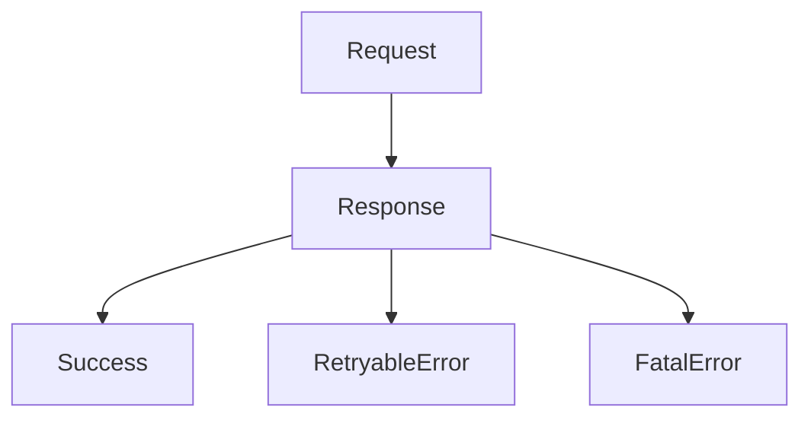
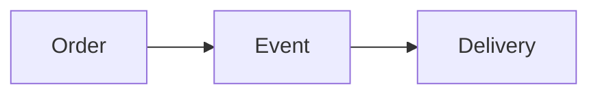

Perfect 👍 — here is your **Module 10 – Concept.md**
👉 Fully aligned with **Module 5 format (WHAT / WHY / WHEN + Use Case + Q&A)**
👉 Mermaid visuals included
👉 VS Code ready

---

# 📁 FILE: `Concept.md` (Module 10)

````md
%%{init: {
  "theme": "base",
  "themeVariables": {
    "primaryColor": "#FFF3E0",
    "primaryBorderColor": "#FB8C00",
    "lineColor": "#FB8C00"
  }
}}%%

# 📘 Module 10 – Consistency and Data Integrity

---

# 🎯 Why This Module Is Covered in Depth

Module 10 focuses on keeping data correct and systems predictable as they evolve.

In real systems, most failures are caused by:
- broken contracts  
- incompatible changes  
- unclear error handling  

Data integrity ensures:
- correctness  
- consistency  
- trust in system behavior  

---

# 1️⃣ Defining Clear System Contracts

---

## ✅ WHAT

A system contract defines:
- inputs  
- outputs  
- behavior  
- guarantees  

---

## 🎯 WHY

- prevents misuse  
- reduces ambiguity  
- ensures correctness  

---

## ⏰ WHEN

- during API design  
- before multiple systems depend on it  

---

## 🍔 Use Case (Food Delivery)

Order API:
- defines request format  
- ensures idempotency  
- validates state transitions  

---

## 🖼️ Visual

```mermaid
flowchart LR
    Client --> API[API Contract]
    API --> Response
````

---

## 🧠 Rule

> Contracts define how systems communicate safely

---

# 2️⃣ Versioning and Backward Compatibility

---

## ✅ WHAT

Versioning allows APIs to evolve safely.

Backward compatibility ensures:

* old clients continue to work

---

## 🎯 WHY

* prevents breaking changes
* avoids production outages

---

## ⏰ WHEN

* when APIs evolve
* when schema changes

---

## 🍔 Use Case

Adding optional fields:

* old apps ignore
* new apps use

---

## 🖼️ Visual

```mermaid
flowchart LR
    V1[API v1] --> Client1
    V2[API v2] --> Client2
```

---

## 🧠 Rule

> Never break existing consumers

---

# 3️⃣ Error Handling at System Boundaries

---

## ✅ WHAT

Defines how errors are:

* represented
* communicated
* handled

---

## 🎯 WHY

* prevents incorrect retries
* avoids data corruption

---

## ⏰ WHEN

* at every system boundary

---

## 🍔 Use Case

Payment API errors:

* validation error → do not retry
* timeout → retry
* failure → fallback

---

## 🖼️ Visual



---

## 🧠 Rule

> Errors must be clear and actionable

---

# 4️⃣ Integration Design Principles

---

## ✅ WHAT

Guidelines for connecting systems safely.

---

## 🎯 WHY

* reduces coupling
* improves scalability
* enables independent evolution

---

## ⏰ WHEN

* during cross-service design

---

## 🍔 Use Case

Order → Delivery:

❌ Shared DB
✅ Event-based communication

---

## 🖼️ Visual



---

## 🧠 Rule

> Systems should communicate via contracts, not shared state

---

# 📘 Module 10 – Interview Question Bank with Answers

---

### Q: What is data integrity?

**A:** Ensuring data remains accurate and consistent over time.

---

### Q: What is a system contract?

**A:** A definition of expected inputs, outputs, and behavior.

---

### Q: Why are contracts important?

**A:** They prevent misuse and ensure correct interactions.

---

### Q: What is backward compatibility?

**A:** New versions working with old clients.

---

### Q: Why is backward compatibility critical?

**A:** Because all consumers don’t upgrade simultaneously.

---

### Q: What is a breaking change?

**A:** A change that causes existing clients to fail.

---

### Q: How to avoid breaking changes?

**A:** Add optional fields and preserve behavior.

---

### Q: What is error handling?

**A:** Managing and communicating failures clearly.

---

### Q: Why categorize errors?

**A:** To handle retries correctly.

---

### Q: What is integration design?

**A:** How systems communicate and exchange data.

---

### Q: Why avoid shared databases?

**A:** They create tight coupling and risk data integrity.

---

### Q: What is schema evolution?

**A:** Safely changing data formats over time.

---

### Q: Common mistake?

**A:** Changing contracts without coordination.

---

### Q: One-line summary?

**A:** Contracts and safe evolution protect data integrity.

---

# 🧠 One-Line Summary

> Clear contracts and controlled evolution ensure data correctness and system stability.


