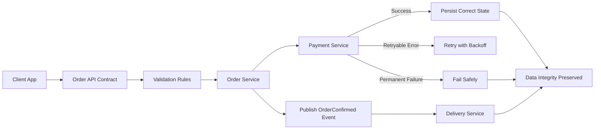
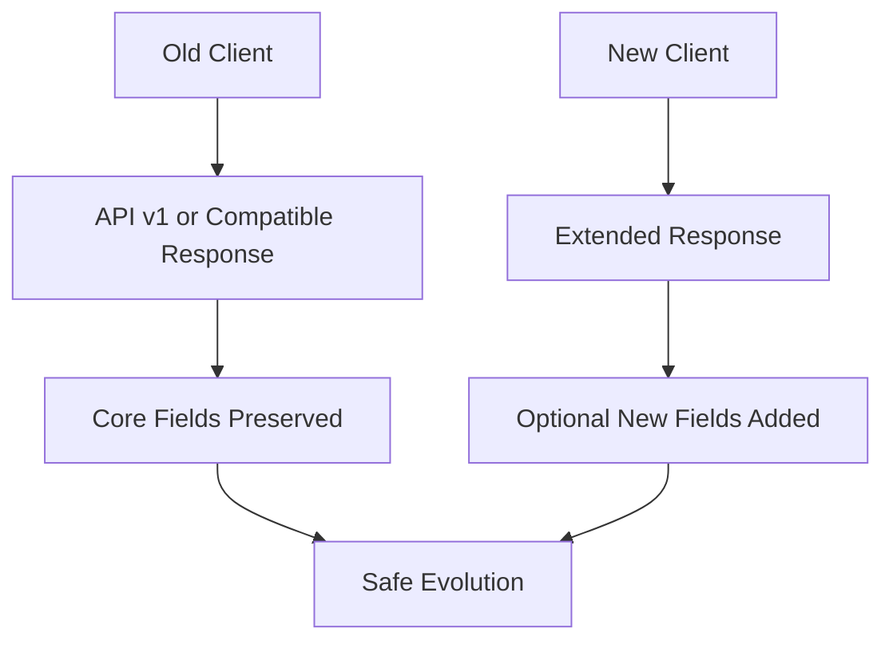

````md
# Module 10 – Consistency and Data Integrity

## Why This Module Is Covered in Depth

Module 10 focuses on keeping data correct and systems predictable as they evolve. Many production issues arise not from lack of features, but from broken contracts, incompatible changes, and unclear error handling between systems.

This module builds the discipline to define clear contracts, evolve systems safely, and protect data integrity across service boundaries.

---

## 1) Defining Clear System Contracts

### WHAT
A system contract defines the expected inputs, outputs, behaviors, and guarantees of an interface.

### WHY
Clear contracts prevent misuse, reduce ambiguity, and protect data correctness.

### WHEN
At API and integration design time, before multiple consumers rely on the interface.

### Use Case (Food Delivery)
The Order API contract guarantees idempotent order creation and clearly defines valid state transitions.

### Plain-English Understanding
A contract is like a written agreement between two teams. One side promises what it will send and return, and the other side knows exactly how to use it. If this agreement is unclear, both sides make wrong assumptions.

### Engineering View
In distributed systems, contracts define:
- Request format
- Response format
- Validation rules
- State transition rules
- Error semantics
- Retry expectations
- Idempotency guarantees

Without explicit contracts, systems appear to work in early development but fail as teams scale and services evolve independently.

### Example
If an Order Service exposes `/create-order`, the contract should define:
- Required fields such as `userId`, `items`, and `paymentMethod`
- Whether duplicate requests create duplicate orders
- What happens when stock is unavailable
- Which states are valid: `CREATED`, `CONFIRMED`, `CANCELLED`, `DELIVERED`

---

## 2) Versioning and Backward Compatibility

### WHAT
Versioning allows interfaces to evolve without breaking existing consumers.

### WHY
Breaking changes cause outages and data inconsistency across dependent systems.

### WHEN
Whenever APIs or message schemas need to change.

### Use Case
Adding new optional fields to order responses without breaking older mobile clients.

### Plain-English Understanding
Not all clients upgrade at the same time. Some users may still be on older app versions while backend services continue changing. If the backend changes carelessly, old clients stop working.

### Engineering View
Versioning is a strategy for controlled evolution. Common approaches include:
- URI versioning: `/v1/orders`, `/v2/orders`
- Header versioning
- Schema evolution in events and messages

Backward compatibility means older consumers can still function even after the interface changes.

### Safe Changes
- Adding optional fields
- Adding new endpoints
- Extending enums carefully
- Preserving old response fields and meanings

### Breaking Changes
- Removing fields consumers depend on
- Changing field types
- Renaming fields without transition support
- Changing business meaning of existing fields

### Example
An older mobile client expects:
```json
{
  "orderId": "123",
  "status": "CONFIRMED"
}
````

A safe evolution is:

```json
{
  "orderId": "123",
  "status": "CONFIRMED",
  "estimatedDeliveryTime": "20 mins"
}
```

Because the new field is optional, old clients continue to work.

---

## 3) Error Handling at System Boundaries

### WHAT

Error handling defines how failures are represented, communicated, and recovered from.

### WHY

Poor error handling leads to retries, data corruption, and cascading failures.

### WHEN

At every boundary where systems interact.

### Use Case

Clearly distinguishing between validation errors, retryable errors, and permanent failures in payment processing.

### Plain-English Understanding

When one system fails, the other system must know what kind of failure happened. Otherwise, it may retry the wrong thing, stop too early, or create duplicate updates.

### Engineering View

Good boundary error handling should define:

* Error category
* Error code
* Human-readable message
* Retry guidance
* Correlation or trace ID
* Compensation or rollback behavior when needed

### Common Error Categories

* **Validation Error**: Client sent invalid data
* **Authentication/Authorization Error**: Access is not allowed
* **Retryable System Error**: Temporary outage, timeout, overload
* **Permanent Business Failure**: Payment declined, invalid order state
* **Dependency Failure**: External service unavailable

### Example

For Payment Service:

* `400 VALIDATION_ERROR` → Do not retry
* `402 PAYMENT_DECLINED` → Do not retry automatically
* `429 RATE_LIMITED` → Retry with backoff
* `503 SERVICE_UNAVAILABLE` → Retry safely
* `409 DUPLICATE_REQUEST` → Return prior result or treat idempotently

### Why Categorization Matters

If clients cannot distinguish temporary errors from permanent ones, they may:

* Retry invalid requests
* Duplicate writes
* Flood dependent systems
* Cause inconsistent business state

---

## 4) Integration Design Principles

### WHAT

Integration design principles guide how systems connect while preserving independence.

### WHY

Tight integrations increase fragility and slow down evolution.

### WHEN

When designing cross-service communication and external integrations.

### Use Case

Using event-based integration instead of shared databases between Order and Delivery services.

### Plain-English Understanding

If two systems are too tightly connected, one small change in one system breaks the other. Good integration allows systems to work together without becoming dependent on each other’s internal design.

### Engineering View

Good integration design favors:

* Clear ownership of data
* Explicit contracts
* Loose coupling
* Stable interfaces
* Async communication where appropriate
* Isolation of failures
* Independent deployment

### Bad Integration Example

Order Service and Delivery Service both directly update the same database tables.

Problems:

* Hidden dependencies
* Hard-to-track changes
* Data integrity risks
* No clear ownership
* Difficult scaling

### Better Integration Example

Order Service publishes an `OrderConfirmed` event. Delivery Service consumes the event and creates delivery tasks independently.

Benefits:

* Loose coupling
* Independent scaling
* Clear responsibility
* Easier evolution

---

## 5) Schema Evolution

### WHAT

Schema evolution means safely changing data formats over time.

### WHY

Systems and business needs change, but integrations must remain reliable.

### WHEN

Whenever events, APIs, or stored records need to evolve.

### Plain-English Understanding

As products grow, data structures also change. New fields are added, some old fields become less useful, and business rules change. Schema evolution ensures these changes do not break running systems.

### Engineering View

Schema evolution practices include:

* Additive changes first
* Optional fields instead of required fields
* Consumer-tolerant parsing
* Deprecation periods
* Contract validation and testing
* Version-aware consumers where necessary

### Example

An event originally contains:

```json
{
  "orderId": "O101",
  "status": "CONFIRMED"
}
```

Later it becomes:

```json
{
  "orderId": "O101",
  "status": "CONFIRMED",
  "restaurantId": "R22"
}
```

This is generally safe if consumers ignore unknown optional fields.

---

## 6) Data Integrity in Distributed Systems

### WHAT

Data integrity means ensuring data remains accurate, consistent, and trustworthy over time.

### WHY

Corrupted or mismatched data destroys trust, breaks workflows, and causes operational issues.

### WHEN

Always, especially when multiple services update related business state.

### Plain-English Understanding

A system is not reliable if it returns the wrong data. Even if services stay online, incorrect order status, duplicate payments, or missing delivery records create user-facing failures.

### Engineering View

Data integrity is threatened by:

* Concurrent updates
* Duplicate requests
* Partial failures
* Contract drift
* Uncoordinated schema changes
* Retry misuse
* Shared mutable data across services

### Protection Mechanisms

* Idempotency keys
* Strong validation
* Explicit state machines
* Transaction boundaries
* Event ordering strategies
* Deduplication logic
* Contract tests
* Immutable event logs where suitable

### Food Delivery Example

A payment succeeds, but Order Service times out before marking the order as confirmed. If systems are poorly designed, the user may be charged but see the order as failed.

Protecting integrity requires:

* Idempotent payment requests
* Reliable event or callback processing
* Clear reconciliation path
* Explicit error categories
* Traceable correlation IDs

---

## 7) Visual – Contract, Evolution, and Integrity Flow


```mermaid
flowchart LR
    C[Client App] --> API[Order API Contract]
    API --> V[Validation Rules]
    V --> O[Order Service]
    O --> E[Publish OrderConfirmed Event]
    E --> D[Delivery Service]
    O --> P[Payment Service]

    P -->|Retryable Error| R[Retry with Backoff]
    P -->|Permanent Failure| F[Fail Safely]
    P -->|Success| S[Persist Correct State]

    S --> I[Data Integrity Preserved]
    F --> I
    D --> I
```

---

## 8) Visual – Backward Compatibility Thinking


```mermaid
flowchart TD
    A[Old Client] --> B[API v1 or Compatible Response]
    C[New Client] --> D[Extended Response]
    B --> E[Core Fields Preserved]
    D --> F[Optional New Fields Added]
    E --> G[No Breakage]
    F --> G[Safe Evolution]
```

---

## 9) Common Mistakes

### Changing Contracts Without Coordination

Teams modify request or response formats without informing consumers, causing failures across services.

### Making New Fields Mandatory Immediately

Older consumers fail because they do not send or understand the new field.

### Ambiguous Error Responses

Clients cannot distinguish whether to retry, fix input, or abort.

### Shared Database Integration

Multiple services edit the same tables, causing ownership confusion and integrity issues.

### No Idempotency for Critical Operations

Retries create duplicate orders, duplicate payments, or repeated notifications.

### Silent Business Rule Changes

A field name remains the same, but its meaning changes, creating hidden breakage.

---

## 10) Interview Question Bank with Answers

### Q: What is data integrity?

**A:** Ensuring data remains accurate, consistent, and trustworthy over time.

### Q: Why are system contracts important?

**A:** They define guarantees and prevent incorrect usage of interfaces.

### Q: What is an API contract?

**A:** A formal definition of request, response, and behavior expectations.

### Q: Why do contracts matter in distributed systems?

**A:** Because components evolve independently and rely on shared expectations.

### Q: What is backward compatibility?

**A:** The ability of newer versions to work with older clients.

### Q: Why is backward compatibility critical?

**A:** Because not all consumers upgrade at the same time.

### Q: What are common versioning strategies?

**A:** URI versioning, header versioning, and schema evolution.

### Q: What is a breaking change?

**A:** A change that causes existing consumers to fail.

### Q: How do you avoid breaking changes?

**A:** By adding optional fields and preserving existing behavior.

### Q: What is error handling at system boundaries?

**A:** Defining how errors are surfaced and acted upon between systems.

### Q: Why must errors be categorized?

**A:** To distinguish retryable from non-retryable failures.

### Q: What happens if errors are ambiguous?

**A:** Clients retry incorrectly, causing data issues.

### Q: What is integration design?

**A:** How systems connect and exchange data.

### Q: Why avoid shared databases?

**A:** They create tight coupling and integrity risks.

### Q: How do events help integration?

**A:** They decouple producers and consumers.

### Q: What is schema evolution?

**A:** Safely changing data formats over time.

### Q: How does data integrity relate to reliability?

**A:** Corrupted data undermines system trust.

### Q: What is a common integrity mistake?

**A:** Changing contracts without coordination.

### Q: How do contracts help scaling teams?

**A:** They enable independent development.

### Q: Summarize Module 10 in one sentence.

**A:** Clear contracts and safe evolution protect data integrity in distributed systems.

---

## 11) One-Line Summary

Consistency and data integrity in distributed systems come from clear contracts, safe evolution, explicit error handling, and loose but reliable integration patterns.

```


