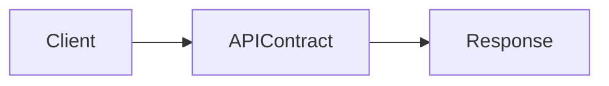
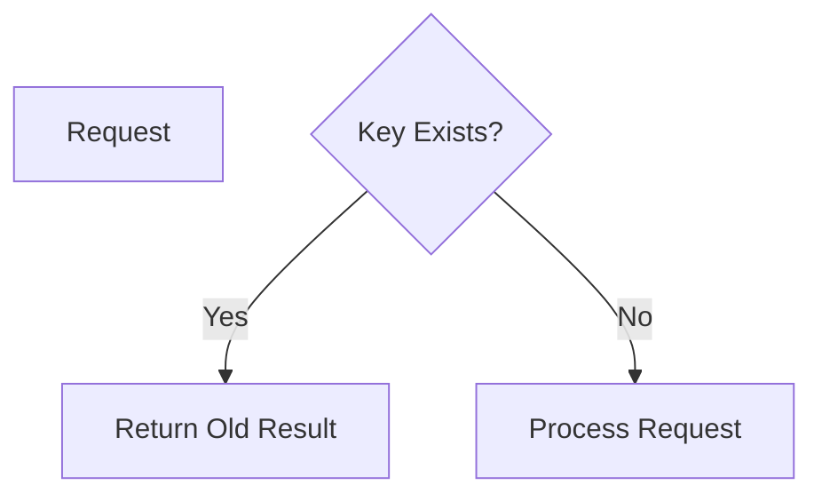
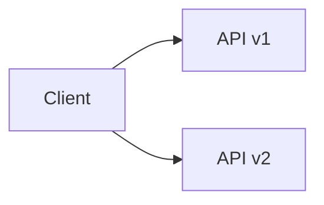
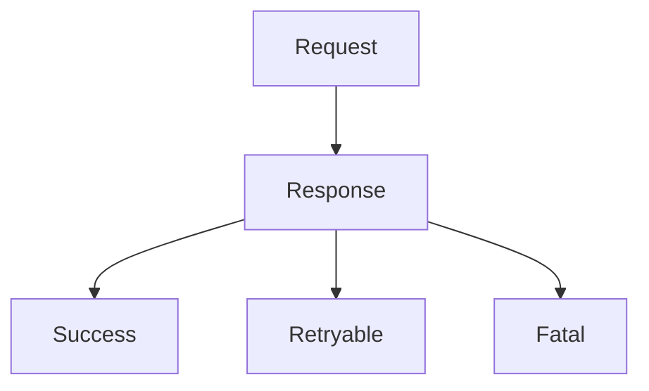
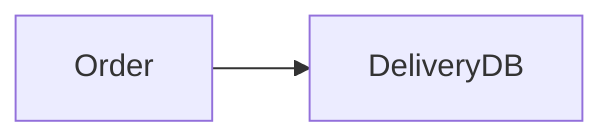
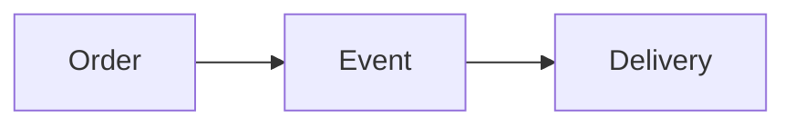
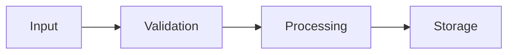
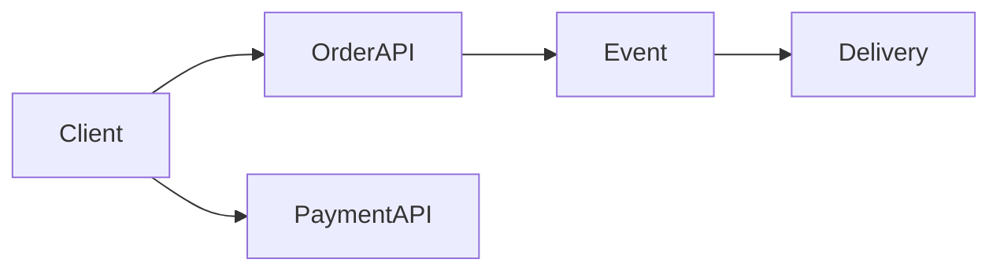

Perfect 👍 — here is your **Module 10 – HOW.md**
👉 This is the **real engineering implementation guide**
👉 Same structure as previous HOW files
👉 Mermaid ready + VS Code compatible

---

# 📁 FILE: `How.md` (Module 10 – FINAL)

````md
%%{init: {
  "theme": "base",
  "themeVariables": {
    "primaryColor": "#FFF3E0",
    "primaryBorderColor": "#FB8C00",
    "lineColor": "#FB8C00"
  }
}}%%

# 📘 Module 10 – HOW to Maintain Consistency & Data Integrity

---

# 🎯 Goal of This README

> Learn how to design APIs and systems that maintain data correctness, avoid breaking changes, and evolve safely.

---

# 1️⃣ HOW to Define Clear System Contracts

---

## ✅ Step 1: Define API Clearly

Every API must define:

- endpoint  
- method  
- request format  
- response format  
- guarantees  

---

## Example

```http
POST /orders

Request:
{
  "userId": "123",
  "items": [...]
}

Response:
{
  "orderId": "abc",
  "status": "CREATED"
}
````

---

## 🖼️ Visual



---

## 🧠 Rule

> APIs are contracts — once published, they must not break.

---

# 2️⃣ HOW to Ensure Idempotency in Contracts

---

## ✅ Step 2: Add Idempotency Key

```http
POST /orders
Idempotency-Key: order-123
```

---

## Logic

* if request already processed → return old response
* else → process once

---

## 🖼️ Visual



---

## 🧠 Rule

> All write APIs must be idempotent.

---

# 3️⃣ HOW to Handle Versioning Safely

---

## ✅ Step 3: Version APIs

### Option 1: URI Versioning

```http
/v1/orders
/v2/orders
```

---

### Option 2: Header Versioning

```http
Accept: application/v2
```

---

## 🖼️ Visual



---

## 🧠 Rule

> Never remove fields — only add optional ones.

---

# 4️⃣ HOW to Maintain Backward Compatibility

---

## ✅ Step 4: Safe Changes

Allowed:

* add optional fields
* add new endpoints

Avoid:

* removing fields
* changing meaning
* changing response structure

---

## 🍔 Example

```json
// Old response
{
  "orderId": "123"
}

// New response (safe)
{
  "orderId": "123",
  "deliveryTime": "30min"
}
```

---

## 🧠 Rule

> Old clients must continue working without changes.

---

# 5️⃣ HOW to Handle Errors at Boundaries

---

## ✅ Step 5: Standard Error Format

```json
{
  "errorCode": "PAYMENT_TIMEOUT",
  "message": "Payment service not responding",
  "retryable": true
}
```

---

## 🖼️ Visual



---

## 🧠 Rule

> Errors must tell client what to do next.

---

# 6️⃣ HOW to Categorize Errors

---

## ✅ Types

| Type             | Action           |
| ---------------- | ---------------- |
| Validation error | Do not retry     |
| Timeout          | Retry            |
| System failure   | Retry / fallback |
| Business failure | Stop             |

---

## 🧠 Rule

> Not all errors should be retried.

---

# 7️⃣ HOW to Design Integration Safely

---

## ✅ Step 7: Use Events Instead of Tight Coupling

---

## ❌ Wrong



---

## ✅ Correct



---

## 🧠 Rule

> Avoid shared databases — use APIs/events.

---

# 8️⃣ HOW to Handle Schema Evolution

---

## ✅ Step 8: Evolve Schema Safely

* add fields (optional)
* never remove fields immediately
* support old + new versions

---

## 🧠 Example

```json
{
  "orderId": "123",
  "status": "CREATED",
  "newField": "optional"
}
```

---

## 🧠 Rule

> Schema should evolve without breaking consumers.

---

# 9️⃣ HOW to Prevent Data Corruption

---

## ✅ Step 9: Add Validation

* validate input
* enforce constraints
* use transactions where needed

---

## 🖼️ Visual



---

## 🧠 Rule

> Bad data in = bad system out

---

# 🔟 Real System Example

---

## 🍔 Food Delivery System



---

## Breakdown

* APIs define contracts
* events decouple systems
* versioning prevents breaking changes
* errors guide retry logic

---

# 1️⃣1️⃣ Common Mistakes

---

❌ Breaking API contracts
❌ No versioning
❌ No idempotency
❌ Ambiguous errors
❌ Shared databases

---

# 1️⃣2️⃣ Final Mental Model

---

> Contract → Version → Validate → Handle Errors → Evolve Safely

---

# 🚀 One-Line Summary

> Data integrity is maintained by stable contracts, safe evolution, and clear error handling.


