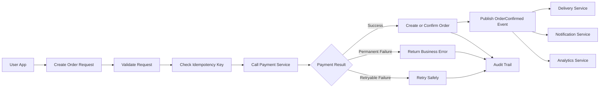
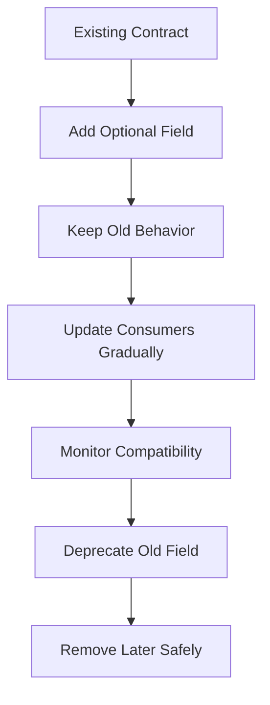

````md id="icg6wq"
# Module 10 – How to Engineer Consistency and Data Integrity in Real Systems

## Why This Part Matters

Knowing the concept of consistency and data integrity is not enough. In real systems, the real challenge is implementing contracts, evolving schemas safely, handling failures correctly, and keeping multiple services aligned without corrupting data.

This module explains **how to engineer consistency and data integrity step by step** so that systems remain predictable even when traffic grows, services fail, and multiple teams evolve the platform independently.

---

# 1) How to Define Clear System Contracts

## Step 1: Identify the Boundary
First identify where one system hands over responsibility to another.

Examples:
- Client App ↔ API Gateway
- Order Service ↔ Payment Service
- Order Service ↔ Delivery Service
- Internal Service ↔ External Partner API

If the boundary is unclear, the contract will also be unclear.

## Step 2: Define Required Inputs
Specify exactly what the receiving system needs.

Example for Create Order API:
- `userId`
- `items`
- `deliveryAddress`
- `paymentMethod`
- `idempotencyKey`

Do not leave required behavior to guesswork.

## Step 3: Define Output Guarantees
Document what the caller will get back:
- Success response shape
- Failure response shape
- Status codes
- Whether duplicate requests return same result
- Whether the operation is synchronous or asynchronous

## Step 4: Define Behavioral Rules
A strong contract is not just fields. It must define rules such as:
- Valid state transitions
- Retry expectations
- Timeout behavior
- Idempotency guarantees
- Ordering assumptions

## Step 5: Publish and Test the Contract
Contracts must be visible and testable:
- API spec
- JSON schema
- Async event schema
- Consumer-driven contract tests
- Validation tests in CI/CD

### Example
Order API contract may define:
- Duplicate request with same `idempotencyKey` returns same order result
- Invalid item list returns validation error
- Order cannot move from `DELIVERED` back to `CONFIRMED`

---

# 2) How to Evolve Interfaces Safely

## Step 1: Assume Existing Consumers Exist
Always assume:
- Old mobile app versions are active
- Partner integrations are slower to update
- Internal consumers may lag behind backend changes

Never change an interface as if you own all consumers.

## Step 2: Prefer Additive Changes
Safe change examples:
- Add new optional field
- Add new endpoint
- Add new event version
- Add metadata without changing old meaning

Unsafe change examples:
- Remove a field
- Rename an existing field
- Change field type
- Change business meaning of a field silently

## Step 3: Mark Old Fields as Deprecated
Do not remove immediately. First:
- Keep old field
- Introduce new field
- Inform consumers
- Monitor adoption
- Remove only after a defined migration window

## Step 4: Support Compatibility Period
Run old and new forms together where needed.

Example:
- `estimatedTime` continues to exist
- new field `estimatedDeliveryTimeMinutes` is introduced
- consumers gradually move
- old field removed later

## Step 5: Validate with Real Consumers
Schema evolution must be tested against actual consumer assumptions, not only backend logic.

Use:
- Contract tests
- Replay of production-like payloads
- Consumer compatibility checks

---

# 3) How to Handle Errors at System Boundaries

## Step 1: Categorize the Error
Every error should belong to a class:
- Validation error
- Business rule failure
- Authentication/authorization failure
- Temporary dependency failure
- Permanent dependency failure
- Duplicate request
- Timeout/overload

Without categories, consumers cannot react correctly.

## Step 2: Return Machine-Usable Error Codes
Do not rely only on human-readable text.

Bad:
```json id="6ll2ye"
{
  "message": "Something went wrong"
}
````

Better:

```json id="zv01ne"
{
  "errorCode": "PAYMENT_DECLINED",
  "message": "Card was declined",
  "retryable": false,
  "traceId": "abc-123"
}
```

## Step 3: Tell the Caller Whether Retry Is Safe

A caller must know:

* Should I retry?
* Should I stop?
* Should I ask user to correct input?
* Should I reconcile later?

### Safe Retry Examples

* `503 SERVICE_UNAVAILABLE`
* `429 RATE_LIMITED`
* transient timeout with idempotency protection

### Do Not Retry Examples

* `400 VALIDATION_ERROR`
* `401 UNAUTHORIZED`
* `402 PAYMENT_DECLINED`
* `409 INVALID_STATE_TRANSITION`

## Step 4: Attach Traceability

Include:

* Correlation ID
* Request ID
* Trace ID
* Event ID if async

This helps debugging and reconciliation.

## Step 5: Design Failure Recovery Path

For each error type, define:

* Retry strategy
* Alerting rule
* Dead-letter handling if async
* Compensation path
* Manual reconciliation fallback

---

# 4) How to Protect Data Integrity

## Step 1: Use Idempotency for Critical Writes

When a client retries the same request, the result should not create duplicates.

Common critical operations:

* Payment creation
* Order creation
* Refund request
* Inventory reservation

### Example

If network drops after payment request is sent, client retries with same `idempotencyKey`. System should return same payment result instead of charging twice.

## Step 2: Use Explicit State Transitions

Do not allow random updates to state.

Bad:

* Any service can set any status anytime

Good:

* Only specific transitions are allowed

Example:

* `CREATED → CONFIRMED`
* `CONFIRMED → PREPARING`
* `PREPARING → OUT_FOR_DELIVERY`
* `OUT_FOR_DELIVERY → DELIVERED`
* `CONFIRMED → CANCELLED`

Disallowed:

* `DELIVERED → PREPARING`

## Step 3: Validate Before Write

Validation should happen at the boundary and at the domain level.

Boundary validation checks:

* required fields
* type correctness
* schema shape

Domain validation checks:

* valid order state
* item availability
* payment eligibility
* duplicate business request detection

## Step 4: Prevent Partial Success Confusion

When one step succeeds and another fails, the system must remain explainable.

Example:

* payment succeeded
* order confirmation failed
* user must not be left with silent mismatch

Use:

* transactions where possible
* saga/compensation patterns across services
* reconciliation jobs
* clear audit trail

## Step 5: Keep Immutable Audit Signals

Record:

* who changed state
* when it changed
* from which state to which state
* request ID / event ID
* reason code if needed

This helps recovery and investigation.

---

# 5) How to Design Better Service Integrations

## Step 1: Define Data Ownership

Each service should own its own data and business rules.

Example:

* Order Service owns order lifecycle
* Payment Service owns payment state
* Delivery Service owns delivery execution

Never let all services directly update the same tables.

## Step 2: Avoid Shared Databases Across Services

Shared databases create:

* hidden coupling
* unsafe updates
* schema conflicts
* unclear ownership
* data integrity issues

Prefer APIs or events instead.

## Step 3: Use Sync vs Async Carefully

### Use Synchronous Calls When

* Immediate answer is required
* Caller cannot continue without result
* operation is short and predictable

Example:

* Payment authorization before order confirmation

### Use Asynchronous Events When

* Consumer does not need immediate reply
* decoupling is important
* eventual processing is acceptable

Example:

* Order confirmed event for analytics, notifications, delivery planning

## Step 4: Make Events Stable

Event contracts should be:

* explicit
* version-aware if needed
* tolerant to additive changes
* independently consumable

## Step 5: Plan for Consumer Failure

What if consumer is down?

* queue persists event
* retry happens safely
* dead-letter queue captures poison messages
* replay is possible if needed

---

# 6) How to Implement Schema Evolution

## Step 1: Start with Tolerant Consumers

Consumers should ignore unknown optional fields whenever possible.

This reduces breakage when publishers extend payloads.

## Step 2: Add Before Removing

Migration order should usually be:

1. Add new field
2. Keep old field
3. Update consumers
4. Monitor usage
5. Remove old field later

## Step 3: Keep Optional Fields Optional

Do not suddenly require new fields from all producers/clients unless coordinated rollout is guaranteed.

## Step 4: Version Only When Needed

Do not create a new version for every small change.

Use versioning when:

* field meaning changes
* required structure changes
* consumer behavior fundamentally changes
* additive evolution is no longer enough

## Step 5: Test Older Payloads

Replay old messages and requests to ensure current services still behave correctly.

---

# 7) Step-by-Step Real-Life Flow (Food Delivery)

## Scenario

A user places an order in a food delivery app.

### Step 1: Client Sends Create Order Request

Request contains:

* user ID
* items
* address
* payment method
* idempotency key

### Step 2: Order Service Validates Input

Checks:

* required fields
* menu item structure
* duplicate request
* current business rules

### Step 3: Payment Service Is Called

Order Service sends payment request with trace ID and idempotency protection.

### Step 4: Payment Service Returns One of Three Outcomes

* success
* permanent failure
* temporary failure

### Step 5: Order Service Acts Based on Outcome

* success → create or confirm order
* permanent failure → return clear business error
* temporary failure → retry safely or return retryable status

### Step 6: Order Confirmed Event Is Published

Other systems consume it:

* Delivery Service
* Notification Service
* Analytics Service

### Step 7: Consumers Process Independently

Each consumer handles the event using its own owned data and retry logic.

### Step 8: Audit Trail Is Stored

System records:

* request ID
* payment ID
* order ID
* state transitions
* timestamps

### Step 9: Reconciliation Handles Rare Mismatches

If payment success and order state diverge, reconciliation job detects and repairs the mismatch.

---

# 8) Visual – Safe Data Integrity Flow


```mermaid id="l994w8"
flowchart LR
    U[User App] --> R[Create Order Request]
    R --> V[Validate Request]
    V --> I[Check Idempotency Key]
    I --> P[Call Payment Service]
    P --> S{Payment Result}

    S -->|Success| O[Create or Confirm Order]
    S -->|Retryable Failure| T[Retry Safely]
    S -->|Permanent Failure| F[Return Business Error]

    O --> E[Publish OrderConfirmed Event]
    E --> D[Delivery Service]
    E --> N[Notification Service]
    E --> A[Analytics Service]

    O --> X[Audit Trail]
    F --> X
    T --> X
```

---

# 9) Visual – Safe Schema Evolution


```mermaid id="tcajf2"
flowchart TD
    A[Existing Contract] --> B[Add Optional Field]
    B --> C[Keep Old Behavior]
    C --> D[Update Consumers Gradually]
    D --> E[Monitor Compatibility]
    E --> F[Deprecate Old Field]
    F --> G[Remove Later Safely]
```

---

# 10) Common Engineering Mistakes

## Mistake 1: Treating Docs as the Contract

The real contract is behavior plus schema plus error semantics, not only documentation.

## Mistake 2: Changing Response Structure Silently

Even small field changes can break consumers.

## Mistake 3: Retrying Everything

Blind retries cause duplicate orders, duplicate charges, and traffic storms.

## Mistake 4: No Idempotency on Write Paths

Network failures become data corruption issues.

## Mistake 5: Shared Database Between Services

This creates tight coupling and integrity drift.

## Mistake 6: No Reconciliation Strategy

Distributed systems eventually produce edge mismatches; without reconciliation, integrity decays over time.

## Mistake 7: Mixing Validation and Retryable Failures

Clients must know the exact next action.

---

# 11) Interview-Ready Answers

## How do you maintain data integrity in distributed systems?

By combining clear contracts, strong validation, idempotent write paths, explicit state transitions, proper error categorization, and reconciliation for partial failures.

## How do you evolve APIs safely?

Prefer additive changes, preserve old behavior, deprecate gradually, and validate compatibility with existing consumers before removal.

## Why is idempotency important?

Because retries are normal in distributed systems, and idempotency prevents duplicate side effects such as duplicate charges or duplicate orders.

## Why are shared databases risky?

Because they create tight coupling, unclear ownership, and uncontrolled cross-service updates that weaken data integrity.

## How do you distinguish retryable vs non-retryable errors?

By returning structured error categories and explicit retry guidance so clients know whether to retry, fix input, or stop.

---

# 12) One-Line Implementation Summary

To engineer consistency and data integrity, define strict contracts, evolve interfaces safely, classify failures clearly, protect critical writes with idempotency, and keep each service independent but reliably connected.


