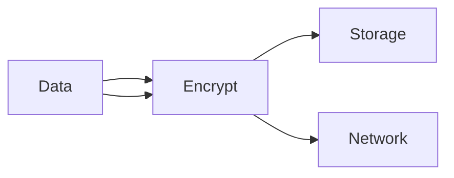
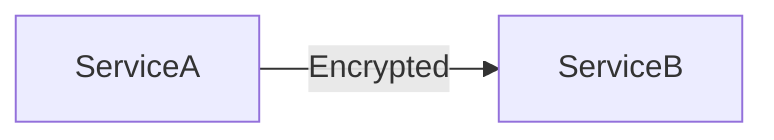

Perfect 👍 — here is your **Module 11 – Concept.md**
👉 Same **Module 5 format** (WHAT / WHY / WHEN + Use Case + Q&A)
👉 Mermaid visuals included
👉 VS Code ready

---

# 📁 FILE: `Concept.md` (Module 11)

````md
%%{init: {
  "theme": "base",
  "themeVariables": {
    "primaryColor": "#FFF3E0",
    "primaryBorderColor": "#FB8C00",
    "lineColor": "#FB8C00"
  }
}}%%

# 📘 Module 11 – Security and Access Control (System-Level)

---

# 🎯 Why This Module Is Covered in Depth

Module 11 focuses on protecting systems, data, and users at a system-design level.

Security issues typically arise due to:
- unclear trust boundaries  
- incorrect access control  
- insecure communication  

Security must be:
- built into architecture  
- not added later as a patch  

---

# 1️⃣ Trust Boundaries in Systems

---

## ✅ WHAT

A trust boundary is where:
- trust level changes  
- validation is required  

---

## 🎯 WHY

Crossing trust boundaries without checks leads to:
- unauthorized access  
- attacks  
- misuse  

---

## ⏰ WHEN

- during system design  
- while integrating external systems  

---

## 🍔 Use Case (Food Delivery)

Mobile app → backend  
👉 must validate request before processing  

---

## 🖼️ Visual

```mermaid
flowchart LR
    Client[Mobile App] -->|Trust Boundary| API
    API --> Backend
````

---

## 🧠 Rule

> Never trust external input without validation

---

# 2️⃣ Authentication vs Authorization

---

## ✅ WHAT

* **Authentication** → who you are
* **Authorization** → what you can do

---

## 🎯 WHY

Mixing them causes:

* privilege escalation
* data leaks

---

## ⏰ WHEN

* at every system entry point
* before sensitive actions

---

## 🍔 Use Case

Delivery partner:

* authenticated → valid user
* authorized → only assigned orders

---

## 🖼️ Visual

```mermaid
flowchart LR
    User --> Auth[Authentication]
    Auth --> Access[Authorization]
    Access --> Resource
```

---

## 🧠 Rule

> Verify identity first, then check permissions

---

# 3️⃣ Data Protection Considerations

---

## ✅ WHAT

Protect data:

* at rest
* in transit
* during processing

---

## 🎯 WHY

Prevents:

* data breaches
* legal issues
* trust loss

---

## ⏰ WHEN

* during data design
* during storage selection

---

## 🍔 Use Case

* user data encrypted
* payment info secured

---

## 🖼️ Visual



---

## 🧠 Rule

> Sensitive data must always be protected

---

# 4️⃣ Secure System Communication Basics

---

## ✅ WHAT

Secure communication ensures:

* confidentiality
* integrity

---

## 🎯 WHY

Prevents:

* interception
* tampering
* spoofing

---

## ⏰ WHEN

* client → server
* service → service

---

## 🍔 Use Case

Backend services:

* use HTTPS
* validate identity

---

## 🖼️ Visual



---

## 🧠 Rule

> All communication must be encrypted and verified

---

# 📘 Module 11 – Interview Question Bank with Answers

---

### Q: What is system-level security?

**A:** Protecting data and functionality across all components.

---

### Q: What is a trust boundary?

**A:** A point where validation is required.

---

### Q: Why are trust boundaries important?

**A:** They define where security controls must be applied.

---

### Q: What is authentication?

**A:** Verifying identity.

---

### Q: What is authorization?

**A:** Checking permissions.

---

### Q: Why separate authentication and authorization?

**A:** To prevent unauthorized access.

---

### Q: What is least privilege?

**A:** Minimum required access.

---

### Q: Why is least privilege important?

**A:** Limits damage from compromised accounts.

---

### Q: What is encryption at rest?

**A:** Protecting stored data.

---

### Q: What is encryption in transit?

**A:** Protecting moving data.

---

### Q: Why is HTTPS required?

**A:** Prevents interception and tampering.

---

### Q: What is secure communication?

**A:** Confidential and safe data exchange.

---

### Q: Why secure internal traffic?

**A:** Internal networks are not fully trusted.

---

### Q: Common mistake?

**A:** Trusting internal systems blindly.

---

### Q: One-line summary?

**A:** Security is about enforcing trust boundaries and controlling access.

---

# 🧠 One-Line Summary

> System security is about defining trust and enforcing access consistently.


