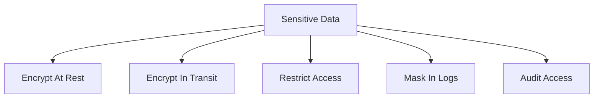

````md id="kynv34"
# Module 11 – Security and Access Control (System-Level)

## Why This Module Is Covered in Depth

Module 11 focuses on protecting systems, data, and users at a system-design level.
Security issues rarely arise from a single bug; they emerge from unclear trust boundaries,
incorrect access control, and insecure communication between components.

This module builds system-level security thinking so that protection is designed into the architecture,
not added as a patch after incidents occur.

---

## 1) Trust Boundaries in Systems

### WHAT
A trust boundary is a point where the level of trust changes between system components, users, or networks.

### WHY
Crossing trust boundaries without validation exposes systems to misuse and attacks.

### WHEN
During architecture design, especially when integrating external users, services, or third-party systems.

### Use Case (Food Delivery)
Requests from mobile apps cross a trust boundary before entering backend services and must be authenticated and validated.

### Plain-English Understanding
A trust boundary is like a security checkpoint. On one side, the system cannot fully trust what is coming in. On the other side, the system must decide whether to allow, reject, or inspect that request before it moves further.

### Engineering View
Trust boundaries exist at points such as:
- Internet to API Gateway
- Mobile App to Backend
- External Partner API to Internal Service
- User Browser to Web Application
- One Microservice to Another Microservice
- Admin Interface to Sensitive Business Operations

Every time data or commands cross one of these boundaries, the system must apply verification and protection.

### Example
A mobile app sends a request to update order status. The backend must not trust:
- User identity automatically
- Request payload automatically
- Device automatically
- Claimed role automatically

The system must validate token, permissions, request structure, and allowed action before applying changes.

---

## 2) Authentication vs Authorization

### WHAT
Authentication verifies who an entity is, while authorization determines what that entity is allowed to do.

### WHY
Confusing authentication with authorization leads to privilege escalation and data leaks.

### WHEN
At every entry point to the system and before sensitive operations.

### Use Case
A delivery partner is authenticated as a valid user but authorized only to update assigned orders.

### Plain-English Understanding
Authentication answers: **Who are you?**  
Authorization answers: **What are you allowed to do?**

A person may successfully log in, but that does not mean they should access every screen, API, or piece of data.

### Engineering View
Authentication mechanisms may include:
- Username and password
- Session-based login
- JWT or access tokens
- OAuth-based sign-in
- API keys
- Mutual TLS for services

Authorization mechanisms may include:
- Role-based access control
- Attribute-based access control
- Permission matrices
- Resource ownership checks
- Policy enforcement

### Example
A delivery agent may be:
- Authenticated as a valid platform user
- Authorized to view only assigned deliveries
- Not authorized to access customer payment details
- Not authorized to cancel restaurant-side orders

This separation is essential for safe system behavior.

---

## 3) Least Privilege

### WHAT
Least privilege means granting only the minimum permissions required to perform a task.

### WHY
If an account, service, or token is compromised, limited permissions reduce the blast radius.

### WHEN
Whenever defining roles, permissions, service accounts, or access policies.

### Plain-English Understanding
A user or service should get only what it truly needs, nothing more. If too much access is given “just in case,” a mistake or breach becomes much more dangerous.

### Engineering View
Least privilege should apply to:
- Human users
- Admin users
- Internal services
- Background jobs
- Databases
- Cloud resources
- CI/CD pipelines

### Example
A Notification Service should be allowed to:
- Read message templates
- Send notifications
- Read minimal order event data

It should not be allowed to:
- Update payment status
- Modify user profile data
- Query full customer financial records

---

## 4) Data Protection Considerations

### WHAT
Data protection involves safeguarding sensitive data at rest, in transit, and during processing.

### WHY
Data breaches cause loss of trust, legal consequences, and business damage.

### WHEN
During data modeling, storage selection, and integration design.

### Use Case
User personal details and payment data are encrypted and access is restricted to authorized services.

### Plain-English Understanding
Sensitive data should not be openly readable by every system or person. Data must be protected wherever it lives, wherever it moves, and whenever it is used.

### Engineering View
Data protection includes:
- Encryption at rest
- Encryption in transit
- Restricted access controls
- Data minimization
- Secret management
- Tokenization where appropriate
- Masking sensitive data in logs
- Secure backups
- Key rotation

### Sensitive Data Examples
- Personal information
- Addresses
- Phone numbers
- Payment data
- Identity documents
- Access tokens
- Internal business secrets

### Example
In a food delivery system:
- Customer addresses are encrypted at rest
- Payment details are tokenized or handled by a payment provider
- Logs do not expose full card or personal identity information
- Only authorized services can read profile data

---

## 5) Encryption at Rest and In Transit

### WHAT
Encryption at rest protects stored data, while encryption in transit protects data moving between systems.

### WHY
Without encryption, attackers or unauthorized insiders may read sensitive data directly.

### WHEN
For databases, storage systems, backups, APIs, internal service calls, and external integrations.

### Plain-English Understanding
If data is stored without protection, anyone with storage access may read it. If data moves across networks without protection, attackers may intercept or modify it.

### Engineering View
#### Encryption at Rest
Applied to:
- Databases
- File storage
- Object storage
- Backups
- Persistent disks

#### Encryption in Transit
Applied to:
- HTTPS for client-server traffic
- TLS for service-to-service calls
- Encrypted messaging channels
- Secure partner integrations

### Example
A restaurant payout file stored in object storage should be encrypted at rest.  
A request carrying order and customer details from mobile app to backend must be encrypted in transit.

---

## 6) Secure System Communication Basics

### WHAT
Secure communication ensures data exchanged between components is confidential and tamper-proof.

### WHY
Insecure communication allows data interception, spoofing, and replay attacks.

### WHEN
For all service-to-service and client-to-service communication.

### Use Case
Backend services communicate over encrypted channels and validate service identities.

### Plain-English Understanding
Systems should not just “send data.” They must prove who they are, protect the message while it travels, and ensure the message has not been altered.

### Engineering View
Secure communication requires:
- TLS/HTTPS
- Certificate validation
- Service identity verification
- Request signing where needed
- Replay protection where relevant
- Secure session management
- Timeout and retry policies that do not weaken security

### Example
Order Service sends a request to Payment Service:
- connection uses TLS
- Payment Service identity is verified
- request contains authorized service credentials
- response is accepted only from trusted service identity

---

## 7) Service-to-Service Authentication

### WHAT
Service-to-service authentication verifies the identity of internal services before allowing access.

### WHY
Internal networks are not inherently safe, and compromised services must not gain unrestricted access.

### WHEN
Whenever one internal service calls another.

### Plain-English Understanding
Just because a request comes from inside the company network does not mean it is safe. Every service should prove its identity before receiving access to internal functionality.

### Engineering View
Common approaches include:
- Mutual TLS
- Short-lived service tokens
- Service identities from workload platforms
- API gateways with policy enforcement
- Signed internal requests

### Example
Delivery Service calling Order Service should present a trusted service identity. Order Service should verify:
- which service is calling
- whether that service is allowed to request this operation
- whether the request scope is limited correctly

---

## 8) Designing Secure APIs

### WHAT
A secure API enforces identity verification, permission checks, validation, and safe communication.

### WHY
APIs are direct entry points into system behavior and data.

### WHEN
Whenever exposing functionality to clients, partners, or other services.

### Plain-English Understanding
An API should never assume a valid-looking request is safe. Every request must be checked for identity, permission, structure, and allowed intent.

### Engineering View
Secure APIs should include:
- Authentication
- Authorization
- Input validation
- Rate limiting
- Request size limits
- Audit logging
- Error handling without leaking sensitive internals
- Secure defaults
- Idempotency for critical operations
- Data filtering based on caller permissions

### Example
An order update API should verify:
- the user is authenticated
- the user owns the order or is assigned to it
- the requested state transition is valid
- the input payload is structurally correct
- the caller is not exceeding rate limits

---

## 9) Security and System Reliability

### WHAT
Security directly affects system reliability because attacks, abuse, or insecure design can interrupt normal system behavior.

### WHY
Security incidents can cause outages, performance degradation, and data loss.

### WHEN
During architecture design, scaling decisions, and operational planning.

### Plain-English Understanding
A system is not truly reliable if attackers or misuse can easily take it down, overload it, or corrupt its data.

### Engineering View
Security supports reliability through:
- controlled access
- reduced attack surface
- rate limiting
- blast radius reduction
- auditability
- secure failure handling
- isolation between components

### Example
If an API lacks rate limiting and validation, attackers may flood it with requests, making it unavailable even for legitimate users.

---

## 10) Security and Scalability

### WHAT
Security must scale with system growth without becoming either a bottleneck or a weak point.

### WHY
Poorly designed controls fail under traffic growth or are bypassed under operational pressure.

### WHEN
When scaling users, services, APIs, teams, or integrations.

### Plain-English Understanding
As systems grow, security cannot remain manual, inconsistent, or dependent on human memory. It must become part of the architecture.

### Engineering View
Scalable security requires:
- centralized identity systems
- consistent policy enforcement
- automated secret rotation
- service identity management
- secure defaults in platform tooling
- reusable authorization patterns
- observability for access and anomalies

### Example
A platform with many services should not hardcode separate ad hoc secrets everywhere. It should use a standard identity and secret-management system.

---

## 11) Visual – Trust Boundary and Access Flow

```mermaid id="g9bcih"
flowchart LR
    U[Mobile App User] --> G[API Gateway]
    G --> A[Authenticate Identity]
    A --> V[Validate Request]
    V --> Z[Authorize Action]
    Z --> O[Order Service]
    O --> P[Payment Service]
    O --> D[Delivery Service]

    P --> E1[Encrypted Service Call]
    D --> E2[Encrypted Service Call]

    O --> DB[(Protected Data Store)]
````

---

## 12) Visual – Authentication and Authorization Separation

```mermaid id="b3jlf8"
flowchart TD
    R[Incoming Request] --> AU[Authentication Check]
    AU -->|Valid Identity| AZ[Authorization Check]
    AU -->|Invalid Identity| X1[Reject Request]
    AZ -->|Allowed Action| S[Process Request]
    AZ -->|Not Allowed| X2[Deny Access]
```

---

## 13) Visual – Data Protection Layers


```mermaid id="h72wjv"
flowchart TD
    D[Sensitive Data] --> R1[Encrypt At Rest]
    D --> R2[Encrypt In Transit]
    D --> R3[Restrict Access]
    D --> R4[Mask In Logs]
    D --> R5[Audit Access]
```

---

## 14) Common Mistakes

### Trusting Internal Traffic Automatically

Internal services or networks are often assumed safe, which creates hidden risk.

### Mixing Authentication and Authorization

A valid login is treated as full permission, leading to overexposure.

### Giving Broad Permissions

Users or services receive access far beyond what they need.

### Sending Sensitive Data Without Encryption

Data may be intercepted or tampered with during transfer.

### Exposing Too Much in API Responses

Systems leak fields that the caller should not see.

### Logging Secrets or Sensitive Data

Logs become a secondary breach source.

### No Service Identity Validation

Internal service calls are accepted without proving caller identity.

### Weak Boundary Validation

Systems trust client-supplied roles, IDs, or object ownership without checking.

---

## 15) Interview Question Bank with Answers

### Q: What is system-level security?

**A:** Designing systems to protect data and functionality across all components and interactions.

### Q: What is a trust boundary?

**A:** A point where trust assumptions change and validation is required.

### Q: Why are trust boundaries important?

**A:** They define where security controls must be enforced.

### Q: What is authentication?

**A:** Verifying the identity of a user or service.

### Q: What is authorization?

**A:** Determining what actions an authenticated entity is allowed to perform.

### Q: Why must authentication and authorization be separated?

**A:** To prevent unauthorized access even by valid users.

### Q: What is least privilege?

**A:** Granting only the minimum permissions required.

### Q: Why is least privilege important?

**A:** It limits the impact of compromised accounts.

### Q: What is data encryption at rest?

**A:** Protecting stored data using encryption.

### Q: What is encryption in transit?

**A:** Protecting data as it moves between systems.

### Q: Why is data protection critical?

**A:** To maintain user trust and meet compliance requirements.

### Q: What is secure communication?

**A:** Ensuring confidentiality and integrity of data exchanges.

### Q: Why is HTTPS required?

**A:** To prevent interception and tampering.

### Q: What is service-to-service authentication?

**A:** Verifying the identity of internal services.

### Q: Why should internal traffic also be secured?

**A:** Because internal networks are not inherently safe.

### Q: What is a common security design mistake?

**A:** Trusting internal systems without validation.

### Q: How does security affect system reliability?

**A:** Security incidents can cause outages and data loss.

### Q: How does security impact scalability?

**A:** Poor security controls can become bottlenecks or attack vectors.

### Q: How do you design secure APIs?

**A:** By enforcing authentication, authorization, and input validation.

### Q: Summarize Module 11 in one sentence.

**A:** System-level security is about defining trust and enforcing access consistently.

---

## 16) One-Line Summary

System-level security in distributed systems comes from defining trust boundaries clearly, verifying identity properly, enforcing least-privilege access, protecting data everywhere, and securing every communication path.

```
```
