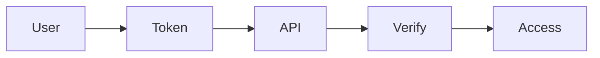
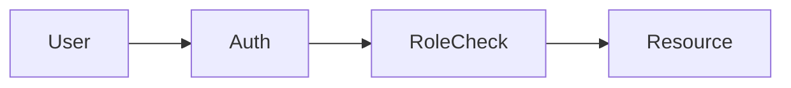
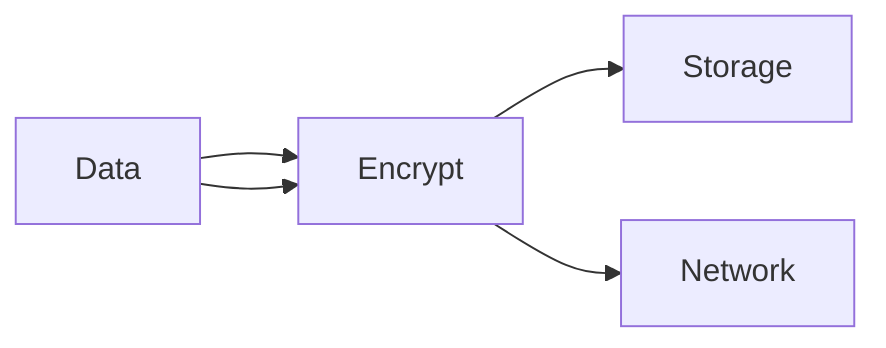
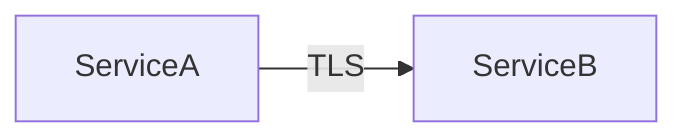
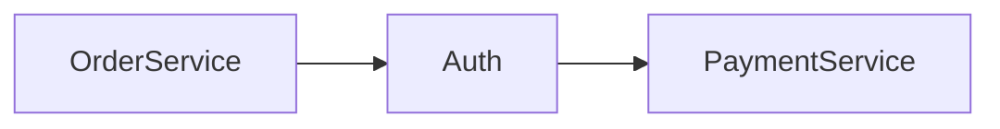
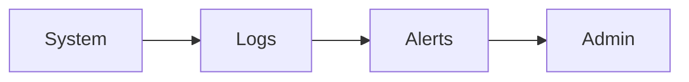
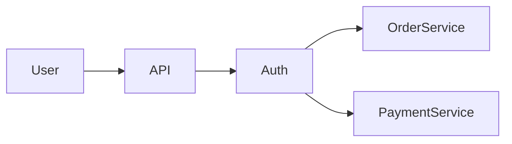

# 📁 FILE: `How.md` (Module 11 – FINAL)

````md
%%{init: {
  "theme": "base",
  "themeVariables": {
    "primaryColor": "#FFF3E0",
    "primaryBorderColor": "#FB8C00",
    "lineColor": "#FB8C00"
  }
}}%%

# 📘 Module 11 – HOW to Design Secure Systems & Access Control

---

# 🎯 Goal of This README

> Learn how to design systems that enforce trust boundaries, protect data, and control access securely.

---

# 1️⃣ HOW to Identify Trust Boundaries

---

## ✅ Step 1: Identify Entry Points

Check where system interacts with:
- users  
- external systems  
- third-party services  

---

## 🖼️ Visual

```mermaid
flowchart LR
    Client[Mobile App] -->|Trust Boundary| API
    API --> InternalService
````

---

## 🧠 Rule

> Every external entry point must validate input.

---

# 2️⃣ HOW to Enforce Authentication

---

## ✅ Step 2: Verify Identity

Use:

* JWT tokens
* OAuth
* API keys

---

## Example

```http
GET /orders
Authorization: Bearer <token>
```

---

## 🖼️ Visual



---

## 🧠 Rule

> Never process requests without authentication.

---

# 3️⃣ HOW to Implement Authorization

---

## ✅ Step 3: Check Permissions

Use:

* Role-based access (RBAC)
* Attribute-based access (ABAC)

---

## 🍔 Example

* Admin → full access
* Delivery partner → limited access

---

## 🖼️ Visual



---

## 🧠 Rule

> Authentication ≠ Authorization

---

# 4️⃣ HOW to Apply Least Privilege

---

## ✅ Step 4: Limit Access

Give only required permissions:

* read-only vs write
* scoped access

---

## 🧠 Example

* Delivery agent → only assigned orders
* Not all orders

---

## 🧠 Rule

> Minimum access = maximum safety

---

# 5️⃣ HOW to Protect Data

---

## ✅ Step 5: Encrypt Data

### Data at Rest

* encrypted storage

### Data in Transit

* HTTPS / TLS

---

## 🖼️ Visual



---

## 🧠 Rule

> Sensitive data must always be encrypted

---

# 6️⃣ HOW to Secure Communication

---

## ✅ Step 6: Use Secure Channels

* HTTPS for APIs
* TLS for service communication
* validate certificates

---

## 🖼️ Visual



---

## 🧠 Rule

> Never trust network — always encrypt

---

# 7️⃣ HOW to Secure Internal Services

---

## ✅ Step 7: Service-to-Service Authentication

Use:

* service tokens
* mutual TLS

---

## 🧠 Example

Order service calling payment service:

* must authenticate

---

## 🖼️ Visual



---

## 🧠 Rule

> Internal traffic is not automatically safe

---

# 8️⃣ HOW to Validate Inputs

---

## ✅ Step 8: Validate All Inputs

Check:

* data type
* format
* range

---

## 🧠 Example

```json
{
  "amount": -100 ❌
}
```

---

## 🧠 Rule

> Never trust input — always validate

---

# 9️⃣ HOW to Prevent Common Attacks

---

## ✅ Step 9: Protect Against

* SQL injection
* XSS
* CSRF

---

## 🧠 Practices

* parameterized queries
* input sanitization
* CSRF tokens

---

## 🧠 Rule

> Security vulnerabilities come from unchecked inputs

---

# 🔟 HOW to Monitor Security

---

## ✅ Step 10: Track Security Events

Monitor:

* failed logins
* unusual activity
* access patterns

---

## 🖼️ Visual



---

## 🧠 Rule

> Detect attacks early

---

# 1️⃣1️⃣ Real System Example

---

## 🍔 Food Delivery System



---

## Breakdown

* API validates user
* Auth verifies identity
* Services enforce permissions
* communication secured

---

# 1️⃣2️⃣ Common Security Mistakes

---

❌ No authentication
❌ Weak authorization
❌ Trusting internal systems
❌ No encryption
❌ No input validation

---

# 1️⃣3️⃣ Final Mental Model

---

> Trust boundary → Authenticate → Authorize → Validate → Encrypt

---

# 🚀 One-Line Summary

> Secure systems validate trust, control access, and protect data at every layer.


