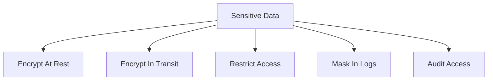

# Module 11 – How to Engineer Security and Access Control in Real Systems

## Why This Part Matters

Understanding security concepts is only the beginning. In real systems, the difficult part is deciding **where trust changes, how identity is verified, how permissions are enforced, how data is protected, and how services communicate securely without slowing the system down**.

This module explains **how to engineer system-level security step by step** so that security becomes part of the architecture itself, not a late patch after incidents happen.

---

# 1) How to Identify Trust Boundaries

## Step 1: Find Every Entry Point
Start by identifying all places where requests, data, or commands enter a system.

Common entry points:
- Mobile apps
- Web browsers
- Admin portals
- Internal services
- Partner APIs
- Third-party webhooks
- Batch jobs
- Support tools

Every entry point is a possible trust boundary.

## Step 2: Ask What the System Can and Cannot Trust
For each entry point, define what is untrusted.

Examples:
- Client input is untrusted
- Headers from outside are untrusted
- Device identity is untrusted unless verified
- Claimed user role is untrusted unless enforced server-side
- Internal service traffic is untrusted unless authenticated

## Step 3: Mark Boundary Crossings in Architecture
A trust boundary exists whenever trust level changes, such as:
- Public internet → API gateway
- User browser → backend
- Internal service → another service
- Third-party callback → platform
- Admin dashboard → production operations

## Step 4: Define Security Controls at Each Boundary
At each boundary, specify:
- authentication
- authorization
- input validation
- rate limiting
- encryption
- auditing
- replay protection if needed

## Step 5: Never Assume “Internal” Means “Safe”
Internal traffic must still be validated. Many security incidents happen because systems trust internal calls blindly.

### Food Delivery Example
A mobile app calling Order API crosses a trust boundary. The system must:
- verify the user token
- validate the payload
- check ownership of the order
- restrict access to only allowed operations

---

# 2) How to Implement Authentication Correctly

## Step 1: Decide Who Needs Identity Verification
Authentication is needed for:
- customers
- delivery partners
- restaurant operators
- admin users
- internal services
- partner systems

Each type of identity may require a different mechanism.

## Step 2: Choose the Right Authentication Method
Examples:
- customer login → session or token-based auth
- service-to-service calls → short-lived service token or mTLS
- third-party API access → signed keys or OAuth
- admin access → strong authentication, often MFA

## Step 3: Validate Identity at the Boundary
Identity should be verified before a request is trusted further into the system.

Checks may include:
- token signature
- token expiry
- issuer verification
- audience verification
- session validity
- certificate identity for services

## Step 4: Use Short-Lived Credentials Where Possible
Short-lived tokens reduce risk if credentials are leaked.

## Step 5: Do Not Store or Transmit Secrets Insecurely
Keep credentials:
- encrypted
- rotated
- stored in secret management systems
- never exposed in logs or client-side code

### Example
A delivery app sends an access token. Backend verifies:
- token is real
- token is not expired
- token belongs to the delivery user
- token was issued by trusted identity provider

Only then should the request proceed.

---

# 3) How to Implement Authorization Correctly

## Step 1: Separate Identity from Permission
Authentication proves who the caller is. Authorization checks what that caller is allowed to do.

Never treat successful login as automatic permission.

## Step 2: Define Roles and Actions Clearly
Examples:
- customer can view own orders
- delivery partner can update assigned deliveries
- restaurant can update food preparation status
- admin can manage support actions
- analytics job can read aggregated data only

## Step 3: Enforce Authorization Near the Protected Resource
Authorization should be checked where the actual action happens, not only at the UI layer.

## Step 4: Check Ownership and Scope
A user may have the right role but still not have access to every resource.

Examples:
- a customer can see **their** order, not all orders
- a delivery partner can update **assigned** order, not every delivery
- a support user may view masked data, not full sensitive data

## Step 5: Prefer Least Privilege
Grant only the minimum permissions required for the task.

### Example
A delivery partner is authenticated successfully, but authorization must still check:
- is this order assigned to this partner?
- is the requested status transition allowed?
- is this action allowed at this stage?

---

# 4) How to Apply Least Privilege in System Design

## Step 1: List Every Actor
Actors include:
- end users
- support users
- admins
- services
- schedulers
- background jobs
- external integrations

## Step 2: Define Minimum Required Access
For each actor, list only what is needed.

Example for Notification Service:
- read template data
- consume order events
- send notifications

Not needed:
- update order state
- read full payment details
- change user profile data

## Step 3: Restrict Data Visibility
Do not expose all fields just because a service or user is authenticated.

## Step 4: Use Separate Identities for Separate Functions
Do not reuse one powerful credential for many services or environments.

## Step 5: Review Privileges Regularly
Permissions often grow over time. Security design must include periodic review and cleanup.

---

# 5) How to Protect Data at Rest

## Step 1: Identify Sensitive Data
Examples:
- personal details
- phone numbers
- addresses
- payment references
- identity documents
- access tokens
- internal operational secrets

## Step 2: Store Sensitive Data with Encryption
Protect data in:
- databases
- file storage
- object storage
- backups
- logs where necessary

## Step 3: Limit Who Can Read It
Encryption alone is not enough. Access control must restrict who can read decrypted data.

## Step 4: Avoid Storing What You Do Not Need
The less sensitive data you keep, the less you must protect.

## Step 5: Protect Backups Too
A secure production database with insecure backups is still an insecure system.

### Example
In a food delivery platform:
- customer addresses are encrypted in storage
- full payment card data is not stored directly if payment provider tokenization is used
- support tools show masked personal details unless elevated permission is granted

---

# 6) How to Protect Data in Transit

## Step 1: Encrypt All External Communication
Use HTTPS/TLS for:
- mobile app to backend
- browser to backend
- partner system integration
- admin portal access

## Step 2: Encrypt Internal Communication Too
Internal service-to-service traffic must also be protected.

## Step 3: Verify Endpoint Identity
Encryption alone is not enough. Systems must also verify they are talking to the correct service.

## Step 4: Prevent Downgrade to Insecure Channels
Do not allow fallback to insecure protocols.

## Step 5: Handle Certificates Properly
Certificate lifecycle must include:
- trusted issuance
- renewal
- rotation
- expiry monitoring

### Example
Order Service calling Payment Service should:
- use TLS
- verify payment service certificate or trusted identity
- reject insecure or untrusted connections

---

# 7) How to Secure Service-to-Service Communication

## Step 1: Give Each Service an Identity
Each service should have its own verifiable identity.

## Step 2: Authenticate Every Internal Call
Do not accept internal requests just because they came from a known network.

## Step 3: Authorize Service Actions Too
One service may be authenticated but still should not access every internal API.

## Step 4: Limit Scope of Service Permissions
Example:
- Delivery Service may read delivery-relevant order fields
- Notification Service may consume event data only
- Analytics pipeline may read aggregated or approved datasets

## Step 5: Log Internal Access
Internal calls should be traceable for debugging and incident investigation.

### Example
Delivery Service calling Order Service should prove:
- it is truly Delivery Service
- it is allowed to read assigned order status
- it is not allowed to update payment information

---

# 8) How to Design Secure APIs

## Step 1: Authenticate the Caller
Every protected API should first verify identity.

## Step 2: Authorize the Operation
Check whether the caller can perform this action on this resource.

## Step 3: Validate All Inputs
Validation should cover:
- missing required fields
- type mismatches
- illegal values
- invalid state transitions
- oversized payloads
- malformed identifiers

## Step 4: Limit Abuse
Use protections such as:
- rate limiting
- throttling
- payload size limits
- safe retries
- timeout control

## Step 5: Return Safe Errors
Error responses should help legitimate clients without exposing internal secrets.

Bad:
- database table names
- stack traces
- internal hostnames
- secret values

Good:
- structured error code
- safe human-readable message
- trace or request ID

## Step 6: Audit Important Operations
Log high-risk actions such as:
- login attempts
- permission changes
- admin operations
- payment-related actions
- data export requests

### Example
A secure order-cancel API checks:
- who is calling
- whether caller owns the order or has support privilege
- whether order can still be cancelled
- whether request is valid
- whether rate limit is respected

---

# 9) How to Protect Sensitive Data During Processing

## Step 1: Expose Only Necessary Data to Each Service
Do not send full user data everywhere.

## Step 2: Mask Sensitive Fields in Logs and Monitoring
Never log:
- passwords
- raw tokens
- payment secrets
- full personal identifiers

## Step 3: Use Tokenization or Indirection Where Needed
Instead of passing raw sensitive values, use references or tokens where possible.

## Step 4: Restrict Admin and Support Views
Operational tools should show only the minimum needed data.

## Step 5: Audit Access to Sensitive Information
Sensitive data access should be visible and reviewable.

---

# 10) How to Build Security into Architecture from Day One

## Step 1: Add Security to Architecture Diagrams
Show:
- trust boundaries
- identity checks
- authorization points
- encryption paths
- secret storage
- audit logging locations

## Step 2: Make Security a Design Decision, Not a Patch
For every new component, ask:
- who can call it?
- what data does it handle?
- what trust boundary does it cross?
- what happens if it is abused?
- how is access limited?

## Step 3: Standardize Security Controls
Use common patterns for:
- identity verification
- permission checks
- secret management
- service authentication
- audit logging

## Step 4: Design for Compromise Containment
Assume one account, one token, or one service may be compromised. Limit blast radius.

## Step 5: Keep Security Observable
Track:
- failed login attempts
- suspicious access patterns
- token misuse
- unusual admin behavior
- repeated authorization failures

---

# 11) Step-by-Step Real-Life Flow (Food Delivery)

## Scenario
A delivery partner updates the status of an assigned order.

### Step 1: Delivery App Sends Request
Request includes:
- access token
- order ID
- new status
- request metadata

### Step 2: API Gateway Verifies Identity
Checks:
- token validity
- expiry
- issuer
- service policy if applicable

### Step 3: Backend Validates Payload
Checks:
- order ID format
- allowed status values
- request completeness

### Step 4: Authorization Check Happens
System verifies:
- caller is a delivery partner
- order is assigned to this partner
- requested transition is allowed

### Step 5: Secure Service Communication Continues
If Order Service needs Delivery Service confirmation, that internal call is authenticated and encrypted.

### Step 6: Update Is Written Safely
State change is recorded with:
- actor identity
- timestamp
- previous state
- new state
- trace ID

### Step 7: Audit Trail Is Stored
System logs the change for later investigation and compliance needs.

### Step 8: Response Returns Safely
Client gets a clean response without sensitive internal details.

---

# 12) Visual – Trust Boundary to Protected Action

```mermaid id="u9m9ww"
flowchart LR
    U[Mobile App / User] --> G[API Gateway]
    G --> A[Authenticate Identity]
    A --> V[Validate Request]
    V --> Z[Authorize Action]
    Z --> S[Service Logic]
    S --> D[(Protected Data)]
    S --> L[Audit Log]
````

---

# 13) Visual – Secure Service-to-Service Flow

```mermaid id="ddpdpa"
flowchart LR
    O[Order Service] --> T[TLS / Secure Channel]
    T --> I[Verify Service Identity]
    I --> P[Permission Check]
    P --> Q[Payment Service]
    Q --> R[Safe Response]
```

---

# 14) Visual – Data Protection Layers


```mermaid id="w6tqgx"
flowchart TD
    D[Sensitive Data] --> A[Encrypt At Rest]
    D --> B[Encrypt In Transit]
    D --> C[Restrict Access]
    D --> E[Mask In Logs]
    D --> F[Audit Access]
```

---

# 15) Common Engineering Mistakes

## Mistake 1: Trusting the Client Too Much

Client-provided roles, IDs, or permissions are accepted without server-side enforcement.

## Mistake 2: Mixing Authentication and Authorization

Valid identity is treated as full permission.

## Mistake 3: Giving Overpowered Service Accounts

A service gets broad access far beyond its real need.

## Mistake 4: Ignoring Internal Security

Internal service traffic is assumed safe and left unauthenticated.

## Mistake 5: Logging Sensitive Data

Tokens, personal details, or secrets appear in logs and monitoring tools.

## Mistake 6: Encrypting Storage but Not Access

Data is encrypted, but too many systems can still read it.

## Mistake 7: No Audit Trail

Sensitive actions happen without traceability.

## Mistake 8: Exposing Too Much Data in API Responses

Authenticated users see more fields than needed.

---

# 16) Interview-Ready Answers

## How do you identify trust boundaries in a system?

By locating every point where users, services, networks, or third parties cross from a lower-trust zone into a higher-trust zone, then enforcing validation and access controls there.

## Why must authentication and authorization be separate?

Because proving identity does not automatically mean the caller should be allowed to perform every action or access every resource.

## Why should internal service communication also be secured?

Because internal networks are not inherently safe, and compromised services or credentials can be used laterally if internal trust is assumed blindly.

## How do you design secure APIs?

By enforcing authentication, authorization, input validation, safe communication, rate limiting, least privilege, and audit logging.

## What is least privilege in system design?

It means granting only the minimum access needed to users and services so that failures or breaches have limited impact.

---

# 17) One-Line Implementation Summary

To engineer secure systems, define trust boundaries clearly, verify every identity, enforce least-privilege access, protect sensitive data everywhere, and secure all communication paths consistently.

```
```
