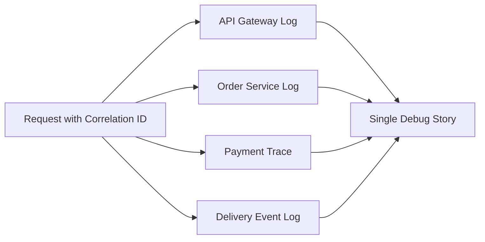

# Module 12 – Observability and Monitoring

## Why This Module Is Covered in Depth

Module 12 focuses on understanding what is happening inside a running system. In real-world production environments, systems rarely fail completely; they degrade silently. Without observability, engineers are blind to problems and rely on guesswork.

This module builds the ability to detect issues early, understand system behavior under load, and debug failures efficiently in distributed systems.

---

## 1) Logs, Metrics, and Traces

### WHAT
Logs capture discrete events, metrics measure system behavior over time, and traces track request flow across services.

### WHY
Each signal answers different questions—what happened, how often, and where time was spent.

### WHEN
Designed from the beginning and used continuously in production.

### Use Case (Food Delivery)
Logs capture order state changes, metrics track order throughput and latency, and traces follow a user request from app to payment to delivery assignment.

### Plain-English Understanding
Observability is like having three ways to understand a system:
- Logs tell the story of individual events
- Metrics show patterns over time
- Traces show how a single request moved through the system

If only one of these is available, engineers see only part of the picture.

### Engineering View
#### Logs
Logs record detailed events such as:
- Request received
- Validation failed
- Payment succeeded
- Order state changed
- External service timeout

#### Metrics
Metrics measure trends such as:
- Requests per second
- Error rate
- CPU usage
- Memory usage
- Average latency
- p95 and p99 latency

#### Traces
Traces connect request flow across services and show:
- Which services were called
- How long each step took
- Where delays happened
- Which dependency failed

### Example
A customer places an order:
- Logs show `orderId=O101 state=CONFIRMED`
- Metrics show payment failure rate increased from 1% to 8%
- Trace shows most delay happened in Payment Service call

---

## 2) Detecting Failures Early

### WHAT
Early failure detection identifies abnormal behavior before users are heavily impacted.

### WHY
Early detection reduces blast radius, recovery time, and business impact.

### WHEN
Continuously during system operation using alerts and thresholds.

### Use Case
An increase in payment failures or p99 latency triggers alerts before large-scale outages.

### Plain-English Understanding
Most failures do not begin as total outages. They often start with small signals:
- latency rises
- a few requests fail
- queues begin growing
- one dependency slows down

If engineers detect these signals early, they can act before customers are badly affected.

### Engineering View
Early detection depends on:
- Meaningful metrics
- Alert thresholds
- Baselines for normal behavior
- Error-rate monitoring
- Latency distribution monitoring
- Dependency health tracking

### Example
An API may still be “up,” but:
- p99 latency jumps from 300 ms to 3 seconds
- payment failure rate rises sharply
- retry count increases
- queue depth starts growing

These are early warning signs even before complete failure.

---

## 3) Monitoring System Health

### WHAT
System health monitoring measures availability, latency, error rates, and resource usage.

### WHY
Healthy-looking systems can still hide failures without proper indicators.

### WHEN
In production dashboards reviewed regularly by engineering teams.

### Use Case
Dashboards display order success rate, API error percentage, and service uptime.

### Plain-English Understanding
A running service is not necessarily a healthy service. A system may respond to requests but still be too slow, too error-prone, or too overloaded to give a good user experience.

### Engineering View
Important health indicators include:
- Availability
- Throughput
- Error rate
- Average latency
- Tail latency such as p95 or p99
- CPU usage
- Memory usage
- Disk usage
- Queue depth
- Dependency success rate

### Example
A food delivery dashboard may show:
- order placement success rate
- average order creation latency
- p99 payment latency
- API 5xx error rate
- delivery assignment delay
- service uptime percentage

These indicators help teams assess real production health.

---

## 4) Designing for Debuggability

### WHAT
Debuggability is the ease with which engineers can diagnose and fix issues.

### WHY
Poor debuggability increases downtime and engineer fatigue.

### WHEN
During system and API design, not after incidents occur.

### Use Case
Correlation IDs allow tracing a single order across logs, metrics, and traces.

### Plain-English Understanding
When something breaks, engineers need to answer:
- Which request failed?
- Where did it fail?
- Why did it fail?
- Is the issue local or downstream?
- Is it affecting one user or many?

If systems are hard to inspect, recovery takes much longer.

### Engineering View
Debuggable systems usually include:
- Correlation IDs
- Structured logging
- Trace propagation
- Clear error classification
- Consistent naming
- Useful dashboards
- Service dependency visibility
- Reproducible failure signals

### Example
A single correlation ID can connect:
- API Gateway log
- Order Service log
- Payment Service trace
- Notification retry record

This makes root-cause analysis much faster.

---

## 5) Logs in Real Systems

### WHAT
Logs are detailed records of discrete events in a system.

### WHY
They help engineers inspect exact events, decisions, and failures.

### WHEN
For application behavior, state changes, failures, audits, and debugging.

### Plain-English Understanding
Logs are the detailed notes a system leaves behind while it runs. They help answer: “What exactly happened here?”

### Engineering View
Good logs should be:
- Structured
- Searchable
- Consistent
- Context-rich
- Safe from sensitive data exposure

Useful log fields often include:
- Timestamp
- Service name
- Request ID
- Correlation ID
- User ID or order ID where appropriate
- Error code
- State transition
- Dependency name

### Bad Logging Example
`Something failed`

### Better Logging Example
`timestamp=... service=payment-service correlationId=abc123 orderId=O101 errorCode=TIMEOUT dependency=bank-gateway retryable=true`

### Important Warning
Logs alone are not enough. They are detailed but noisy and expensive to depend on for every question.

---

## 6) Metrics in Real Systems

### WHAT
Metrics are numerical measurements that track system behavior over time.

### WHY
They help engineers see patterns, trends, and abnormal shifts quickly.

### WHEN
For dashboards, alerting, capacity planning, and performance monitoring.

### Plain-English Understanding
Metrics are the system’s pulse. They show whether behavior is stable, improving, or getting worse.

### Engineering View
Common metric categories:
- Traffic metrics
- Latency metrics
- Error metrics
- Saturation metrics
- Business metrics

Examples:
- Requests per second
- Successful orders per minute
- 4xx and 5xx rates
- CPU and memory usage
- Queue length
- Cache hit rate

### Example
If order throughput is stable but error rate rises and p99 latency spikes, the system is likely degrading under a dependency issue or overload condition.

---

## 7) Traces in Distributed Systems

### WHAT
Traces are end-to-end records of how a request flows through multiple services.

### WHY
They show where time was spent and where failures occurred across service boundaries.

### WHEN
In distributed systems where one user request touches many components.

### Plain-English Understanding
Traces are like following one customer request step by step as it moves through the architecture.

### Engineering View
A trace is composed of spans. Each span represents a unit of work, such as:
- API request handling
- Database query
- Payment service call
- Cache lookup
- Delivery service event processing

### Example
A trace for “Place Order” may include:
- API Gateway: 20 ms
- Order Service validation: 15 ms
- Payment Service call: 900 ms
- Inventory update: 40 ms
- Event publish: 10 ms

This quickly shows that Payment Service is the main latency contributor.

---

## 8) Alerts and Noise Management

### WHAT
An alert is a notification triggered when defined conditions indicate abnormal system behavior.

### WHY
Alerts help engineers respond quickly, but too many poor-quality alerts create noise and fatigue.

### WHEN
For high-impact, actionable conditions in production.

### Plain-English Understanding
An alert should tell engineers about a problem that needs attention now. If everything creates alerts, teams stop trusting alerts.

### Engineering View
Good alerts are:
- Actionable
- Specific
- Based on meaningful thresholds
- Tied to user or business impact
- Designed to reduce false positives

Bad alerts are:
- too frequent
- too vague
- not actionable
- triggered by harmless fluctuations

### Example
Good:
- Payment failure rate > 5% for 10 minutes
- p99 latency > 2 seconds for order placement
- delivery event queue depth continuously rising

Bad:
- every single timeout event
- temporary CPU spike with no impact
- every retry log line

---

## 9) Tail Latency and User Experience

### WHAT
Tail latency refers to the slowest portion of requests, often measured as p95 or p99 latency.

### WHY
Averages can look fine while a smaller portion of users experiences severe slowness.

### WHEN
When measuring real user experience in production systems.

### Plain-English Understanding
Even if average response time looks good, the slowest requests may still frustrate real users. That is why engineers watch p95 and p99 latency, not only averages.

### Engineering View
Tail latency becomes important in:
- distributed systems
- dependency-heavy flows
- overloaded services
- shared infrastructure
- burst traffic patterns

### Example
Average order API latency may be 250 ms, but p99 latency may be 4 seconds. This means most users are fine, but the worst 1% have a very bad experience.

---

## 10) Observability and Reliability

### WHAT
Observability supports reliability by making failures visible and diagnosable.

### WHY
Reliable recovery is impossible if teams cannot detect or understand failures quickly.

### WHEN
At all stages of production operation and incident response.

### Plain-English Understanding
A system cannot be reliably operated if its problems remain hidden. Observability turns invisible failures into visible, understandable signals.

### Engineering View
Observability improves reliability by:
- reducing mean time to detect
- reducing mean time to resolve
- exposing dependency issues
- supporting incident diagnosis
- revealing partial failures
- helping validate fixes

### Example
A payment dependency slowdown is detected early through trace latency and error metrics, allowing engineers to reroute or degrade gracefully before a full outage spreads.

---

## 11) Observability and Scalability

### WHAT
Observability helps systems scale by revealing bottlenecks and abnormal behavior under increasing load.

### WHY
Without visibility, scaling decisions become guesswork.

### WHEN
During load testing, production growth, and system tuning.

### Plain-English Understanding
As traffic grows, observability shows which part of the system is struggling first.

### Engineering View
Observability reveals:
- CPU saturation
- memory pressure
- slow database queries
- queue buildup
- network bottlenecks
- dependency latency increase
- uneven traffic distribution

### Example
During a traffic spike, metrics show one service hitting CPU saturation while traces show downstream database latency increasing. This guides targeted scaling instead of random infrastructure expansion.

---

## 12) Visual – Logs, Metrics, and Traces Together

```mermaid id="93eqm9"
flowchart LR
    U[User Request] --> G[API Gateway]
    G --> O[Order Service]
    O --> P[Payment Service]
    O --> D[Delivery Service]

    O --> L[Logs]
    O --> M[Metrics]
    O --> T[Trace Spans]

    P --> T
    D --> T
````

---

## 13) Visual – Early Failure Detection Flow

```mermaid id="6imz10"
flowchart TD
    A[System Running] --> B[Metrics Collected]
    B --> C[Threshold or Anomaly Detected]
    C --> D[Alert Triggered]
    D --> E[Engineer Investigates]
    E --> F[Issue Fixed Before Large Outage]
```

---

## 14) Visual – Correlation ID for Debugging



---

## 15) Common Mistakes

### Relying Only on Logs

Logs are detailed but do not provide fast trend visibility like metrics or flow visibility like traces.

### No Correlation IDs

Teams cannot connect related events across services.

### Monitoring Only Infrastructure

CPU and memory alone do not show business-impacting failures.

### Ignoring Tail Latency

Average latency hides bad user experience for slower requests.

### Too Many Noisy Alerts

Important signals get buried under alert fatigue.

### Poorly Structured Logs

Search and diagnosis become slow and frustrating.

### Adding Observability Too Late

Critical context is missing during incidents.

### No Business Metrics

System may look healthy technically while core business workflow is failing.

---

## 16) Interview Question Bank with Answers

### Q: What is observability?

**A:** The ability to understand a system’s internal state through its outputs.

### Q: What are logs?

**A:** Detailed records of discrete events in a system.

### Q: What are metrics?

**A:** Numerical measurements that track system behavior over time.

### Q: What are traces?

**A:** End-to-end tracking of requests across distributed services.

### Q: Why are logs, metrics, and traces all needed?

**A:** Each provides a different perspective on system behavior.

### Q: Why is early failure detection important?

**A:** It minimizes user impact and speeds up recovery.

### Q: What is an alert?

**A:** A notification triggered when metrics exceed defined thresholds.

### Q: What metrics indicate system health?

**A:** Latency, error rates, throughput, and availability.

### Q: Why are dashboards useful?

**A:** They provide a real-time view of system health.

### Q: What is p99 latency?

**A:** The latency experienced by the slowest 1% of requests.

### Q: Why focus on tail latency?

**A:** Because it affects user experience disproportionately.

### Q: What is debuggability?

**A:** How easily issues can be diagnosed and fixed.

### Q: How do correlation IDs help debugging?

**A:** They link related logs and traces across services.

### Q: Why should observability be designed early?

**A:** Because adding it later is costly and incomplete.

### Q: What is a common observability mistake?

**A:** Relying only on logs without metrics or traces.

### Q: How does observability support reliability?

**A:** It enables faster detection and resolution of failures.

### Q: How does observability affect scalability?

**A:** It reveals bottlenecks as load increases.

### Q: What is noise in monitoring?

**A:** Excessive alerts that hide real problems.

### Q: How do you reduce alert fatigue?

**A:** By tuning thresholds and focusing on actionable alerts.

### Q: Summarize Module 12 in one sentence.

**A:** Observability makes system behavior visible so problems can be fixed quickly.

---

## 17) One-Line Summary

Observability and monitoring make distributed systems understandable by combining logs, metrics, and traces so engineers can detect failures early, debug faster, and scale with confidence.

```
```
