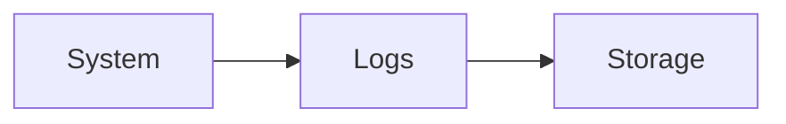
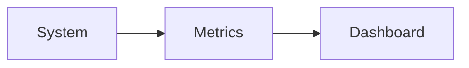
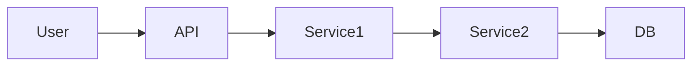
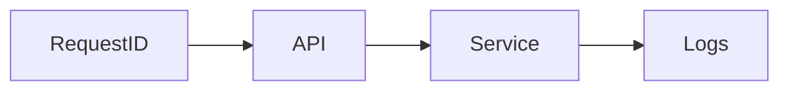
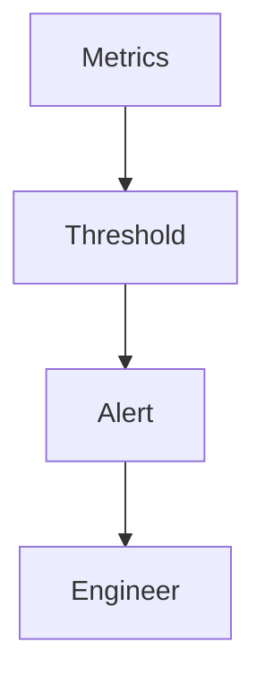
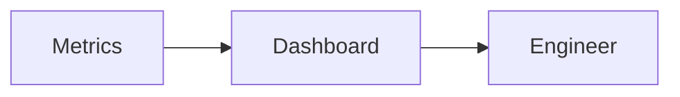
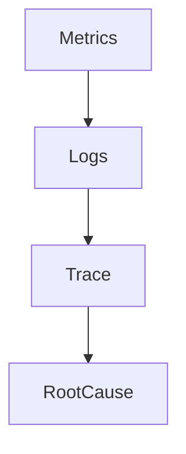
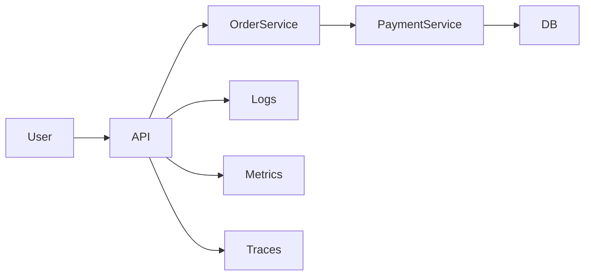

Perfect 👍 — here is your **Module 12 – HOW.md**
👉 Same structure as previous HOW files
👉 Mermaid-ready (VS Code compatible)
👉 Focused on **real observability + monitoring implementation**

---

# 📁 FILE: `How.md` (Module 12 – FINAL)

````md
%%{init: {
  "theme": "base",
  "themeVariables": {
    "primaryColor": "#FFF3E0",
    "primaryBorderColor": "#FB8C00",
    "lineColor": "#FB8C00"
  }
}}%%

# 📘 Module 12 – HOW to Implement Observability & Monitoring

---

# 🎯 Goal of This README

> Learn how to make systems observable, detect failures early, and debug issues efficiently in production.

---

# 1️⃣ HOW to Add Logs

---

## ✅ Step 1: Log Important Events

Log:
- request start/end  
- errors  
- state changes  

---

## Example

```json
{
  "event": "ORDER_CREATED",
  "orderId": "123",
  "timestamp": "..."
}
````

---

## 🖼️ Visual



---

## 🧠 Rule

> Log meaningful events, not everything

---

# 2️⃣ HOW to Add Metrics

---

## ✅ Step 2: Track Key Numbers

Track:

* request count (RPS)
* latency (P50, P95, P99)
* error rate

---

## 🖼️ Visual



---

## 🧠 Rule

> Metrics show trends, not details

---

# 3️⃣ HOW to Implement Tracing

---

## ✅ Step 3: Track Request Flow

Add trace ID to every request.

---

## 🖼️ Visual



---

## 🧠 Rule

> Traces show where time is spent

---

# 4️⃣ HOW to Use Correlation IDs

---

## ✅ Step 4: Link Everything

Each request gets unique ID:

```http
X-Correlation-ID: abc-123
```

---

## 🖼️ Visual



---

## 🧠 Rule

> One request = one traceable ID

---

# 5️⃣ HOW to Detect Failures Early

---

## ✅ Step 5: Define Alerts

Trigger alerts when:

* error rate ↑
* latency ↑
* system down

---

## 🖼️ Visual



---

## 🧠 Rule

> Alerts must be actionable

---

# 6️⃣ HOW to Design Dashboards

---

## ✅ Step 6: Monitor System Health

Dashboard must show:

* latency
* errors
* throughput
* uptime

---

## 🖼️ Visual



---

## 🧠 Rule

> Dashboards = system health view

---

# 7️⃣ HOW to Track Tail Latency

---

## ✅ Step 7: Focus on P95 / P99

* average is misleading
* tail latency shows real experience

---

## 🧠 Example

* avg = 100ms
* p99 = 2s ❌

---

## 🧠 Rule

> Optimize worst-case latency

---

# 8️⃣ HOW to Reduce Alert Noise

---

## ❌ Problem

Too many alerts → ignored

---

## ✅ Solution

* set proper thresholds
* group alerts
* remove duplicates

---

## 🧠 Rule

> Fewer, meaningful alerts are better

---

# 9️⃣ HOW to Debug Issues Faster

---

## ✅ Step 9: Use Combined Signals

1. Check metrics
2. find spike
3. check logs
4. follow trace

---

## 🖼️ Visual



---

## 🧠 Rule

> Debug = metrics + logs + traces together

---

# 🔟 Real System Example

---

## 🍔 Food Delivery System



---

## Breakdown

* logs capture events
* metrics show trends
* traces show flow

---

# 1️⃣1️⃣ Common Mistakes

---

❌ Only logs, no metrics
❌ No tracing
❌ No alerts
❌ Too many alerts
❌ No correlation IDs

---

# 1️⃣2️⃣ Final Mental Model

---

> Logs → Events
> Metrics → Trends
> Traces → Flow

---

# 🚀 One-Line Summary

> Observability = Logs + Metrics + Traces + Alerts

```
