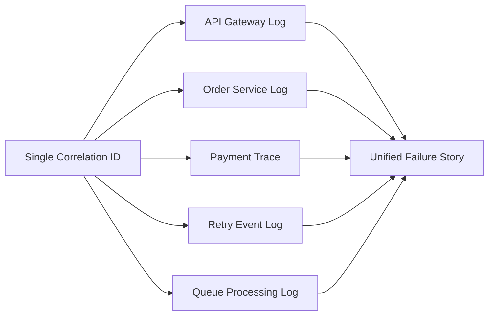

# Module 12 – How to Engineer Observability and Monitoring in Real Systems

## Why This Part Matters

Knowing that logs, metrics, and traces exist is not enough. In real systems, the important question is **how to design observability so engineers can detect issues early, understand failures quickly, and operate the system confidently under real production load**.

This module explains **how to engineer observability and monitoring step by step** so that system behavior becomes visible, measurable, and debuggable from day one.

---

# 1) How to Start Observability Design

## Step 1: Identify Critical User Flows
Start with the most important system journeys.

Examples:
- User login
- Place order
- Make payment
- Assign delivery partner
- Send notification
- Generate invoice

Observability should begin with business-critical flows, not random technical signals.

## Step 2: Ask What Can Go Wrong
For each flow, think about:
- where latency can increase
- where failures can happen
- where retries may occur
- where dependencies can slow down
- where data may get stuck
- where silent degradation may happen

## Step 3: Decide What You Need to See
For each flow, define:
- events you want logged
- measurements you want tracked
- requests you want traced
- thresholds that should alert engineers

## Step 4: Design Observability Before Production
Do not wait for incidents. Add observability during:
- API design
- service design
- async workflow design
- deployment planning

## Step 5: Connect Technical Signals to Business Impact
Do not monitor only CPU and memory. Also track:
- order success rate
- payment failure rate
- delivery assignment delay
- notification success rate

### Food Delivery Example
For “Place Order,” observability should capture:
- request received
- validation success/failure
- payment call latency
- order creation result
- event publication
- downstream delivery assignment delay

---

# 2) How to Design Good Logs

## Step 1: Log Important Events, Not Everything Blindly
Good logs record meaningful events such as:
- request started
- request failed
- state changed
- dependency timeout
- retry attempted
- message sent to queue
- payment declined

Avoid useless noisy logs for every minor internal line of execution.

## Step 2: Use Structured Logging
Logs should be machine-readable and consistent.

Useful fields:
- timestamp
- service name
- environment
- log level
- request ID
- correlation ID
- user ID or order ID where appropriate
- error code
- dependency name
- state transition

## Step 3: Add Context for Debugging
A log without context is hard to use.

Bad:
`Payment failed`

Better:
`service=payment-service orderId=O101 correlationId=abc123 errorCode=TIMEOUT dependency=bank-gateway retryable=true`

## Step 4: Avoid Logging Sensitive Data
Do not log:
- passwords
- raw tokens
- payment secrets
- personal identity details unless properly masked
- internal secrets

## Step 5: Keep Log Format Consistent Across Services
Consistent naming makes cross-service debugging much easier.

### Example
Order Service, Payment Service, and Delivery Service should all use the same field names for:
- `correlationId`
- `requestId`
- `orderId`
- `errorCode`

---

# 3) How to Design Good Metrics

## Step 1: Choose Core Metric Categories
At minimum, monitor:
- traffic
- latency
- errors
- saturation

This gives a strong baseline for service health.

## Step 2: Add Business Metrics Too
Technical health is not enough.

Examples:
- orders placed per minute
- payment success rate
- delivery assignment success rate
- cancelled order percentage

## Step 3: Measure Latency Distribution, Not Just Average
Track:
- average latency
- p50 latency
- p95 latency
- p99 latency

Average alone hides bad user experiences.

## Step 4: Measure Error Rates Clearly
Useful error views:
- 4xx rate
- 5xx rate
- dependency failure rate
- timeout rate
- retry rate

## Step 5: Track Resource Saturation
Examples:
- CPU usage
- memory usage
- queue depth
- thread pool saturation
- DB connection usage
- cache pressure

### Example
For Order API, useful metrics include:
- requests per second
- success rate
- p95/p99 latency
- payment timeout count
- DB query latency
- order creation success percentage

---

# 4) How to Design Traces in Distributed Systems

## Step 1: Trace Critical Requests End-to-End
Any request that travels through multiple services should be traceable.

Examples:
- place order
- login flow
- checkout
- refund
- partner webhook handling

## Step 2: Propagate Trace Context Across Services
Every downstream service should continue the same trace context so the full request story stays connected.

## Step 3: Create Meaningful Spans
Each important step should become a span, such as:
- API gateway processing
- request validation
- database query
- payment service call
- inventory update
- event publishing

## Step 4: Capture Timing and Outcome
Each span should show:
- start time
- end time
- duration
- dependency name
- outcome or error status

## Step 5: Use Traces to Find Bottlenecks
Traces are especially useful for:
- slow dependencies
- long database calls
- retry storms
- queue delays
- fan-out bottlenecks

### Example
A “Place Order” trace might show:
- API Gateway: 15 ms
- Order validation: 20 ms
- Payment Service: 1200 ms
- DB write: 35 ms
- Event publish: 10 ms

This makes it obvious that the main latency came from Payment Service.

---

# 5) How to Detect Failures Early

## Step 1: Define What “Normal” Looks Like
You must know normal baselines for:
- request rate
- latency
- error rate
- queue depth
- dependency behavior

Without baselines, alerts become guesswork.

## Step 2: Watch for Leading Indicators
Important early warning signs:
- rising p99 latency
- growing queue depth
- retry increase
- dependency timeout increase
- sudden drop in success rate
- CPU or memory saturation trend

## Step 3: Alert on Actionable Conditions
Alerts should point to real problems that need action.

Good alert examples:
- payment failure rate > 5% for 10 minutes
- order placement p99 latency > 2 seconds
- delivery event queue depth rising continuously
- 5xx error rate above safe threshold

## Step 4: Avoid Overreacting to Tiny Spikes
Temporary fluctuations are normal. Use:
- time windows
- sustained thresholds
- multi-signal confirmation where appropriate

## Step 5: Detect Silent Failures Too
Not all failures show as crashes.

Examples of silent degradation:
- slower database queries
- backlog in async queue
- event consumer falling behind
- intermittent third-party slowness

---

# 6) How to Build Useful Dashboards

## Step 1: Organize Dashboards Around User Journeys
Instead of random graphs, group by business flow:
- Order journey dashboard
- Payment health dashboard
- Delivery assignment dashboard
- Notification pipeline dashboard

## Step 2: Show the Most Important Signals First
A strong dashboard usually includes:
- success rate
- throughput
- latency
- error rate
- saturation
- dependency health

## Step 3: Combine Technical and Business Views
Example order dashboard:
- orders per minute
- order success rate
- p95/p99 latency
- payment timeout rate
- DB latency
- queue backlog

## Step 4: Make Dashboards Fast to Scan
During incidents, engineers need quick understanding. Prioritize:
- clarity
- grouping
- trend visibility
- minimal noise

## Step 5: Add Drill-Down Paths
From dashboard to:
- traces
- logs
- affected dependency metrics
- recent deploy markers

### Example
If payment success rate drops, dashboard should help engineer quickly jump into:
- payment latency metrics
- payment error logs
- traces for slow transactions

---

# 7) How to Design for Debuggability

## Step 1: Use Correlation IDs Everywhere
Every request or workflow should carry a correlation ID across services.

## Step 2: Make Errors Searchable
Errors should use:
- stable error codes
- consistent messages
- clear service ownership
- dependency naming

## Step 3: Make Logs, Metrics, and Traces Connectable
An engineer should be able to move from:
- alert → metric spike
- metric spike → trace sample
- trace sample → related logs

## Step 4: Record Important State Transitions
For workflows like order processing, log clear state movement:
- CREATED
- CONFIRMED
- PAYMENT_FAILED
- ASSIGNED
- DELIVERED

## Step 5: Design Async Flows to Be Inspectable
For queues and event-driven systems, expose:
- queue depth
- consumer lag
- retry count
- dead-letter events
- processing latency

### Example
A correlation ID lets engineers connect:
- API request log
- payment timeout trace
- retry attempt log
- dead-letter event record

That creates one complete debug story.

---

# 8) How to Reduce Alert Fatigue

## Step 1: Alert Only on Actionable Problems
If an alert does not require action, it should usually not page anyone.

## Step 2: Prefer Symptoms Over Raw Noise
Bad:
- alert on every timeout log

Better:
- alert when timeout rate crosses business-impact threshold

## Step 3: Tune Thresholds Based on Real Behavior
Thresholds must reflect:
- normal traffic patterns
- peak traffic patterns
- acceptable error budgets
- expected latency ranges

## Step 4: Group Related Alerts
Avoid separate noisy alerts for the same root issue.

## Step 5: Review Alert Quality After Incidents
After incidents, ask:
- was the alert useful?
- did it arrive too late?
- was it noisy?
- did it point to the right service?

### Example
Instead of paging on every payment timeout, page when:
- payment timeout rate is sustained
- order success rate is dropping
- p99 latency is increasing

That creates meaningful signal instead of noise.

---

# 9) How to Monitor Async and Event-Driven Systems

## Step 1: Monitor Queue Health
Track:
- queue depth
- oldest message age
- consumer lag
- processing rate

## Step 2: Monitor Retry Behavior
Retries are useful, but too many indicate unhealthy downstream behavior.

## Step 3: Monitor Dead-Letter Queues
Dead-letter growth is a clear sign that messages are failing permanently.

## Step 4: Track End-to-End Async Latency
Measure how long it takes from:
- event produced
to
- event successfully processed

## Step 5: Make Event Failures Visible
Do not let async systems fail silently. They need dashboards and alerts too.

### Example
Order confirmed event may publish successfully, but Delivery Service may lag 10 minutes behind. Without async observability, engineers might miss the issue until users complain.

---

# 10) How to Build Observability Into Architecture Early

## Step 1: Include Observability in Design Reviews
Ask:
- what should we log?
- what must we measure?
- what should be traced?
- how will engineers debug failure here?

## Step 2: Standardize Across Services
Use common standards for:
- log fields
- metric naming
- trace propagation
- alert conventions
- dashboard layout

## Step 3: Make New Services Observable by Default
Every new service should start with:
- request logging
- latency/error metrics
- trace support
- health endpoints
- dashboard hooks

## Step 4: Instrument Dependencies Explicitly
Important dependencies include:
- databases
- caches
- queues
- external APIs
- internal services

## Step 5: Treat Observability as Part of Reliability
A service without observability is harder to operate reliably, debug safely, and scale confidently.

---

# 11) Step-by-Step Real-Life Flow (Food Delivery)

## Scenario
A user places an order and payment starts timing out intermittently.

### Step 1: Request Enters API Gateway
Gateway records:
- request count metric
- latency metric
- request log
- trace root span

### Step 2: Order Service Validates Request
Service logs validation result and updates trace span.

### Step 3: Payment Service Call Happens
Trace captures dependency timing.
Metrics record payment latency and timeout rate.
Logs capture retry attempts if they occur.

### Step 4: System Starts Degrading
Signals appear:
- payment timeout rate rises
- p99 latency increases
- order success rate drops
- retries increase

### Step 5: Alert Fires
An alert triggers because timeout rate and p99 latency cross threshold for sustained duration.

### Step 6: Engineer Opens Dashboard
Dashboard shows:
- order placement degradation
- payment dependency slowness
- error rate rise

### Step 7: Engineer Opens Trace Samples
Trace shows most request time is spent in Payment Service call.

### Step 8: Engineer Opens Related Logs
Logs confirm timeout and retry pattern with correlation IDs.

### Step 9: Team Acts Quickly
They may:
- switch to degraded mode
- reduce retries
- reroute dependency if possible
- notify affected teams

### Step 10: Recovery Is Verified
Metrics improve, alerts resolve, and traces show request path returning to normal latency.

---

# 12) Visual – Observability Flow in a Request Path

```mermaid id="b4scg0"
flowchart LR
    U[User Request] --> G[API Gateway]
    G --> O[Order Service]
    O --> P[Payment Service]
    O --> D[Delivery Service]

    G --> LG[Logs]
    G --> MG[Metrics]
    G --> TG[Trace Root]

    O --> LO[Logs]
    O --> MO[Metrics]
    O --> TO[Trace Span]

    P --> LP[Logs]
    P --> MP[Metrics]
    P --> TP[Trace Span]

    D --> LD[Logs]
    D --> MD[Metrics]
    D --> TD[Trace Span]
````

---

# 13) Visual – Early Failure Detection

```mermaid id="r3cqq8"
flowchart TD
    A[Normal System Behavior] --> B[Metrics and Traces Collected]
    B --> C[Latency or Error Pattern Changes]
    C --> D[Threshold Crossed]
    D --> E[Alert Triggered]
    E --> F[Engineer Investigates]
    F --> G[Issue Resolved Before Wide Impact]
```

---

# 14) Visual – Correlation ID Debug Path


```mermaid id="bqpa2p"
flowchart LR
    R[Single Correlation ID] --> A[API Gateway Log]
    R --> B[Order Service Log]
    R --> C[Payment Trace]
    R --> D[Retry Event Log]
    R --> E[Queue Processing Log]
    A --> X[Unified Failure Story]
    B --> X
    C --> X
    D --> X
    E --> X
```

---

# 15) Common Engineering Mistakes

## Mistake 1: Adding Only Logs

Logs alone do not provide quick trend visibility or request-flow understanding.

## Mistake 2: Monitoring Only Infrastructure

CPU and memory are useful, but they do not fully show user-impacting workflow failure.

## Mistake 3: Ignoring Tail Latency

Average latency hides the slowest and most painful requests.

## Mistake 4: No Correlation IDs

Cross-service debugging becomes slow and confusing.

## Mistake 5: Too Many Alerts

Noise hides truly urgent failures.

## Mistake 6: Poorly Structured Logs

Search and filtering become painful during incidents.

## Mistake 7: No Async Observability

Queues and event consumers fail silently.

## Mistake 8: No Business Metrics

System may look technically healthy while order flow is failing.

---

# 16) Interview-Ready Answers

## How do you design observability in a distributed system?

By instrumenting business-critical flows with structured logs, meaningful metrics, distributed traces, correlation IDs, dashboards, and actionable alerts from the beginning.

## Why are logs, metrics, and traces all needed?

Because logs explain events, metrics reveal trends, and traces show the end-to-end path and latency of individual requests across services.

## Why is p99 latency important?

Because average latency can look healthy while the slowest requests still create serious user pain and signal deeper bottlenecks.

## How do correlation IDs improve debugging?

They connect related logs, traces, and events across services so engineers can reconstruct one request’s full journey quickly.

## How do you reduce alert fatigue?

By alerting only on actionable, meaningful conditions, tuning thresholds to real behavior, and avoiding noisy signals that do not require response.

---

# 17) One-Line Implementation Summary

To engineer observability well, instrument critical flows with logs, metrics, traces, and correlation IDs so failures become visible early and debugging becomes fast and reliable.

```
```
