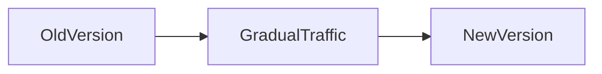
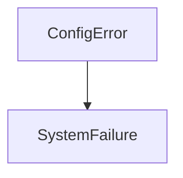

Perfect 👍 — here is your **Module 13 – Concept.md**
👉 Same **Module 5 format (WHAT / WHY / WHEN + Use Case + Q&A)**
👉 Mermaid visuals included
👉 VS Code ready

---

# 📁 FILE: `Concept.md` (Module 13)

````md
%%{init: {
  "theme": "base",
  "themeVariables": {
    "primaryColor": "#FFF3E0",
    "primaryBorderColor": "#FB8C00",
    "lineColor": "#FB8C00"
  }
}}%%

# 📘 Module 13 – Deployment and Operational Considerations

---

# 🎯 Why This Module Is Covered in Depth

Module 13 focuses on how systems are released, operated, and recovered in real production environments.

In real-world systems, failures often occur due to:
- poor deployments  
- misconfiguration  
- unsafe rollouts  

This module builds the ability to:
- deploy safely  
- manage configurations  
- reduce operational risk  

---

# 1️⃣ Environment Separation Concepts

---

## ✅ WHAT

Separate environments:
- development  
- testing  
- staging  
- production  

---

## 🎯 WHY

- prevents untested changes reaching users  
- isolates risk  

---

## ⏰ WHEN

- from early development stage  

---

## 🍔 Use Case (Food Delivery)

Feature tested in staging before production release  

---

## 🖼️ Visual

```mermaid
flowchart LR
    Dev --> Test --> Staging --> Production
````

---

## 🧠 Rule

> Never deploy directly from dev to production

---

# 2️⃣ Configuration Management

---

## ✅ WHAT

Manage environment-specific settings outside code.

---

## 🎯 WHY

* avoids deployment errors
* improves security
* enables flexibility

---

## ⏰ WHEN

* multi-environment systems
* multi-region deployments

---

## 🍔 Use Case

* DB URL
* API keys
* feature flags

---

## 🖼️ Visual

```mermaid
flowchart LR
    App --> Config --> Environment
```

---

## 🧠 Rule

> Configuration must not be hardcoded

---

# 3️⃣ Rollout and Rollback Strategies

---

## ✅ WHAT

* **Rollout** → how new version is released
* **Rollback** → how to revert changes

---

## 🎯 WHY

* reduces impact of failures
* ensures fast recovery

---

## ⏰ WHEN

* every production deployment

---

## 🍔 Use Case

Gradual rollout of new order flow

---

## 🖼️ Visual



---

## 🧠 Rule

> Always have rollback before rollout

---

# 4️⃣ Operational Risks

---

## ✅ WHAT

Failures caused by:

* deployment errors
* configuration issues
* operational mistakes

---

## 🎯 WHY

Operational issues are a major cause of outages.

---

## ⏰ WHEN

* during deployments
* during system changes

---

## 🍔 Use Case

Wrong timeout config → system slowdown

---

## 🖼️ Visual



---

## 🧠 Rule

> Small mistakes can cause big outages

---

# 📘 Module 13 – Interview Question Bank with Answers

---

### Q: Why is environment separation important?

**A:** It prevents untested changes from impacting production.

---

### Q: What environments are used?

**A:** Dev, test, staging, production.

---

### Q: What is configuration management?

**A:** Managing environment-specific settings outside code.

---

### Q: Why avoid hardcoding config?

**A:** It causes errors and security risks.

---

### Q: What is rollout strategy?

**A:** Controlled release of new changes.

---

### Q: Why gradual rollout?

**A:** Reduces blast radius.

---

### Q: What is rollback strategy?

**A:** Reverting changes quickly.

---

### Q: What is blue-green deployment?

**A:** Two environments, switch traffic.

---

### Q: What is canary deployment?

**A:** Release to small users first.

---

### Q: What are operational risks?

**A:** Failures from deployment/config issues.

---

### Q: What is configuration drift?

**A:** Differences between environments.

---

### Q: Why monitoring during rollout?

**A:** Detect issues early.

---

### Q: Common mistake?

**A:** No rollback plan.

---

### Q: One-line summary?

**A:** Safe deployment ensures system stability.

---

# 🧠 One-Line Summary

> Safe deployments and strong operations protect system stability.

```

