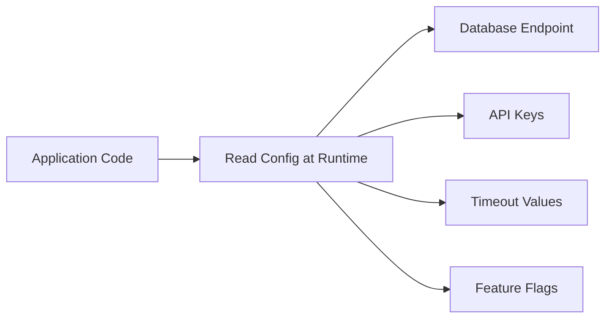

# Module 13 – Deployment and Operational Considerations

## Why This Module Is Covered in Depth

Module 13 focuses on how systems are released, operated, and recovered in real production environments. Many well-designed systems fail not because of architecture, but due to poor deployment practices, misconfiguration, or unsafe rollouts.

This module builds operational maturity by teaching engineers to deploy changes safely, manage configurations reliably, and reduce risk during system evolution.

---

## 1) Environment Separation Concepts

### WHAT
Environment separation involves maintaining distinct environments such as development, testing, staging, and production.

### WHY
Separation prevents untested changes from impacting live users.

### WHEN
From the earliest stages of system development.

### Use Case (Food Delivery)
New features are validated in staging with production-like data before being released to live users.

### Plain-English Understanding
A system should not go directly from a developer’s machine to real users. Different environments act like safety layers. Each one helps teams build, test, validate, and release changes with less risk.

### Engineering View
Typical environments include:
- **Development** for local building and debugging
- **Testing** for automated checks and integration validation
- **Staging** for production-like verification
- **Production** for real users and live traffic

Each environment should have:
- clear purpose
- isolated resources
- controlled access
- environment-specific configuration
- repeatable setup

### Example
A new order-status flow is first built in development, validated in testing, checked end-to-end in staging, and only then released to production.

---

## 2) Configuration Management

### WHAT
Configuration management controls how environment-specific values are stored and applied.

### WHY
Hardcoded configurations lead to deployment errors and security risks.

### WHEN
Whenever systems run in multiple environments or regions.

### Use Case
Database endpoints, API keys, and feature flags are configured externally, not embedded in code.

### Plain-English Understanding
The same application code may run in many places, but each place needs different settings. For example, staging should connect to staging databases, while production should connect to production services. These values must not be manually edited into code every time.

### Engineering View
Configuration often includes:
- database URLs
- service endpoints
- API keys
- secrets
- timeout values
- retry policies
- feature flags
- region-specific values

Good configuration management means:
- externalized configuration
- secret separation from normal config
- environment-specific overrides
- version control for non-secret config where appropriate
- validation before startup or deployment

### Example
Order Service should read:
- payment endpoint from config
- timeout values from config
- feature toggles from config
- secrets from secure secret storage

It should not contain these values directly inside source code.

---

## 3) Rollout and Rollback Strategies

### WHAT
Rollout strategies define how new versions are released; rollback strategies define how to recover.

### WHY
Safe rollouts minimize user impact and allow quick recovery from issues.

### WHEN
For every production deployment.

### Use Case
Gradual rollout of a new order workflow with the ability to instantly rollback on errors.

### Plain-English Understanding
A release should not always go to all users at once. Safer releases happen in controlled steps. If something goes wrong, the team should be able to stop or reverse the change quickly.

### Engineering View
Common rollout strategies include:
- full rollout
- phased rollout
- canary deployment
- blue-green deployment
- feature-flag-based release

Rollback strategies may include:
- reverting application version
- shifting traffic back to previous version
- disabling new functionality with feature flags
- restoring safe configuration
- compensating for bad data if needed

### Example
A new payment retry flow is released first to 5% of traffic. Observability shows increased timeout errors, so traffic is immediately shifted back to the previous version.

---

## 4) Operational Risks

### WHAT
Operational risks are failures caused by deployment, configuration, or operational mistakes.

### WHY
Operational errors are a leading cause of outages.

### WHEN
Continuously assessed during system operation and change management.

### Use Case
Misconfigured timeout values causing cascading failures during peak traffic.

### Plain-English Understanding
Even if system design is good, operations can still break it. A wrong configuration, unsafe release, expired certificate, or missing rollback plan can create major production incidents.

### Engineering View
Common operational risks include:
- incorrect config values
- secret leakage
- incomplete environment setup
- manual deployment mistakes
- dependency version mismatch
- schema change without compatibility planning
- wrong scaling limits
- bad timeout or retry settings
- traffic routed incorrectly
- failed rollback process

### Example
A timeout change from 2 seconds to 30 seconds may cause threads to remain blocked longer, leading to queue buildup, latency spikes, and cascading service slowdown.

---

## 5) Development, Testing, Staging, and Production

### WHAT
These environments separate the lifecycle of software change from development to live release.

### WHY
They reduce the chance that incomplete or unvalidated changes affect real users.

### WHEN
As soon as a system is more than a simple local prototype.

### Plain-English Understanding
Each environment exists for a different reason:
- Development is for building
- Testing is for checking correctness
- Staging is for final validation
- Production is for real usage

### Engineering View
#### Development
- fast feedback
- experimental changes
- local debugging

#### Testing
- automated tests
- integration checks
- validation of service behavior

#### Staging
- production-like environment
- pre-release verification
- realistic end-to-end testing

#### Production
- live users
- strong controls
- monitoring and rollback readiness

### Example
A delivery-assignment feature may pass local tests, but staging reveals that real-like event volume creates queue delays. This is fixed before production release.

---

## 6) Feature Flags and Controlled Release

### WHAT
Feature flags allow system behavior to be enabled or disabled without redeploying code.

### WHY
They reduce release risk by separating deployment from feature exposure.

### WHEN
When features need phased release, fast disablement, or controlled testing.

### Plain-English Understanding
A feature flag is like a switch. Code can already be deployed, but the feature remains off until the team is ready. If problems appear, the feature can be turned off quickly.

### Engineering View
Feature flags are useful for:
- gradual exposure
- A/B experiments
- operational kill switches
- internal-only releases
- regional rollout control

### Example
A new recommendation engine is deployed but enabled only for internal testers first. Later it is expanded to 10% of users, then to all users.

---

## 7) Blue-Green and Canary Deployment

### WHAT
Blue-green deployment uses two production environments, while canary deployment releases to a small subset of traffic first.

### WHY
These strategies reduce risk and improve recovery speed.

### WHEN
For high-impact or high-risk production changes.

### Plain-English Understanding
Blue-green means keeping two production-ready versions and switching traffic between them. Canary means sending only a small amount of user traffic to the new version first.

### Engineering View
#### Blue-Green Deployment
- Blue = current production
- Green = new version
- switch traffic after validation
- easy rollback by returning traffic to old version

#### Canary Deployment
- new version receives small traffic share first
- metrics and errors are watched closely
- rollout expands only if healthy

### Example
A new order-pricing service version is released to 2% of traffic. If error rate stays normal, rollout moves to 10%, then 50%, then 100%.

---

## 8) Configuration Drift

### WHAT
Configuration drift means environments become unintentionally different over time.

### WHY
Drift causes “works in staging but fails in production” problems.

### WHEN
Whenever environments are changed manually or inconsistently.

### Plain-English Understanding
If environments are supposed to be similar but slowly diverge, teams stop trusting pre-production testing. A release that looked safe in staging may behave differently in production.

### Engineering View
Configuration drift often comes from:
- manual edits
- undocumented fixes
- inconsistent secrets
- different service versions
- different scaling rules
- different timeout values
- missing infra automation

### Example
Staging uses one retry policy while production uses another. A feature works in staging but causes overload in production because retry behavior is different.

---

## 9) Operational Readiness

### WHAT
Operational readiness is the condition where a system is prepared to be safely run in production.

### WHY
Deployment is only one part of production safety; teams also need observability, recovery plans, and control mechanisms.

### WHEN
Before every important release and throughout service ownership.

### Plain-English Understanding
A service is not ready for production just because it works in testing. It must also be operable. Teams should know how to deploy it, monitor it, troubleshoot it, and recover it.

### Engineering View
Operational readiness usually includes:
- health checks
- dashboards
- alerts
- documented rollback steps
- runbooks
- safe defaults
- access control
- capacity expectations
- dependency awareness
- backup and recovery planning

### Example
Before releasing a new payment connector, the team confirms:
- metrics exist
- alerts are configured
- rollback path is tested
- secrets are present
- dependency limits are understood

---

## 10) Deployment Safety and Observability

### WHAT
Deployment safety means watching production behavior carefully during and after release.

### WHY
Many rollout issues appear only under live traffic and production-scale patterns.

### WHEN
During every production deployment window and post-release monitoring period.

### Plain-English Understanding
Releasing code is not the end of the process. The system must be observed during rollout to make sure latency, errors, and business flows remain healthy.

### Engineering View
Important rollout-time signals include:
- error rate
- latency
- throughput
- resource usage
- queue depth
- dependency health
- business success rates
- rollback trigger conditions

### Example
A new order-processing version is rolled out. Error metrics remain stable, but order confirmation success drops. This indicates a business workflow issue that must be caught quickly.

---

## 11) Visual – Environment Separation Flow

```mermaid id="ho74r8"
flowchart LR
    D[Development] --> T[Testing]
    T --> S[Staging]
    S --> P[Production]
````

---

## 12) Visual – Safe Rollout and Rollback

```mermaid id="jlwm9r"
flowchart TD
    A[New Version Ready] --> B[Deploy to Small Traffic Slice]
    B --> C[Monitor Errors and Latency]
    C -->|Healthy| D[Increase Traffic Gradually]
    C -->|Issues Found| E[Rollback Quickly]
    D --> F[Full Production Rollout]
```

---

## 13) Visual – Externalized Configuration


```mermaid id="4t3wi6"
flowchart LR
    C[Application Code] --> R[Read Config at Runtime]
    R --> E1[Database Endpoint]
    R --> E2[API Keys]
    R --> E3[Timeout Values]
    R --> E4[Feature Flags]
```

---

## 14) Common Mistakes

### Deploying Directly to Production Without Validation

Untested changes reach live users too early.

### Hardcoding Environment Values

Secrets, endpoints, and flags become difficult and dangerous to manage.

### No Rollback Plan

Teams know how to deploy but not how to recover.

### Ignoring Staging Differences

Production behaves differently because pre-production is not realistic enough.

### Manual Configuration Changes

Untracked edits create drift and hard-to-debug incidents.

### Releasing to 100% Traffic Immediately

Blast radius becomes too large if the version is faulty.

### Poor Monitoring During Rollout

Teams miss early warning signs and react too late.

### Treating Operations as Separate from Design

Operational issues are architectural concerns too.

---

## 15) Interview Question Bank with Answers

### Q: Why is environment separation important?

**A:** It isolates risk and prevents untested changes from affecting production.

### Q: What environments are typically used?

**A:** Development, testing, staging, and production.

### Q: What is configuration management?

**A:** Managing environment-specific settings outside of code.

### Q: Why should configuration not be hardcoded?

**A:** Because it causes errors and security risks.

### Q: What is a rollout strategy?

**A:** A controlled way to release changes to users.

### Q: Why are gradual rollouts useful?

**A:** They reduce blast radius of failures.

### Q: What is a rollback strategy?

**A:** A plan to quickly revert changes when issues occur.

### Q: Why must rollback be fast?

**A:** To minimize user and business impact.

### Q: What is blue-green deployment?

**A:** Maintaining two production environments and switching traffic.

### Q: What is canary deployment?

**A:** Releasing changes to a small subset of users first.

### Q: What are operational risks?

**A:** Failures caused by deployment or configuration errors.

### Q: Why are operational risks common?

**A:** Because humans and systems make mistakes.

### Q: How do feature flags reduce risk?

**A:** They allow disabling features without redeployment.

### Q: What is configuration drift?

**A:** Unintended differences between environments.

### Q: Why is monitoring important during rollout?

**A:** To detect issues early.

### Q: What is a common deployment mistake?

**A:** Deploying without rollback plans.

### Q: How does operations affect reliability?

**A:** Poor operations increase downtime.

### Q: How does operations affect security?

**A:** Misconfigurations can expose sensitive data.

### Q: How do you reduce operational risk?

**A:** Through automation, testing, and controlled rollouts.

### Q: Summarize Module 13 in one sentence.

**A:** Safe deployments and strong operations protect system stability.

---

## 16) One-Line Summary

Deployment and operational maturity come from separating environments, externalizing configuration, releasing changes gradually, and preparing fast recovery paths for when production behavior goes wrong.

```
```
