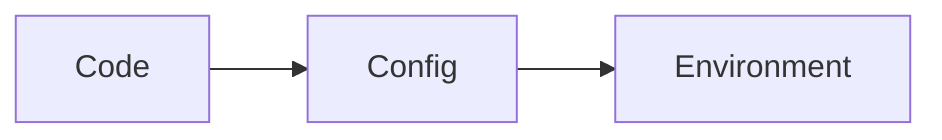
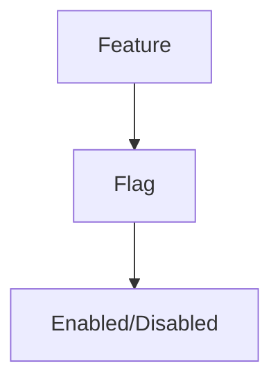
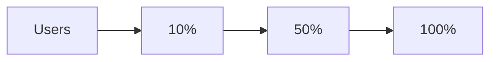
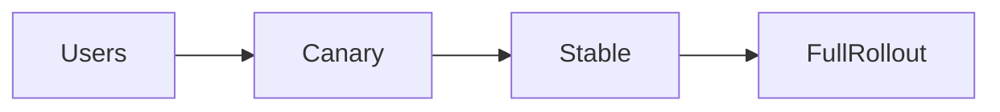
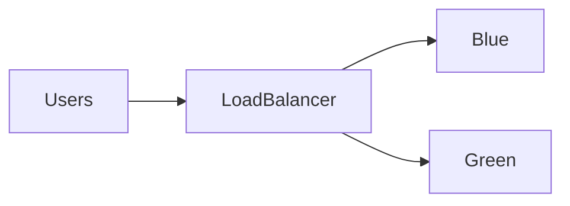
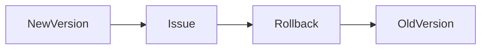
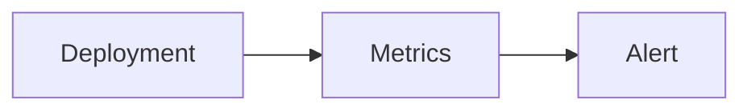
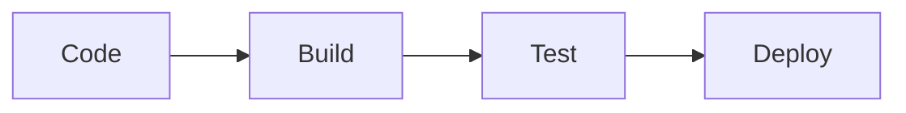
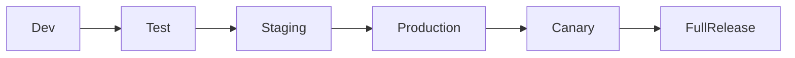

Perfect 👍 — here is your **Module 13 – HOW.md**
👉 Real-world deployment + operations mindset
👉 Same structure as previous HOW files
👉 Mermaid-ready (VS Code compatible)

---

# 📁 FILE: `How.md` (Module 13 – FINAL)

````md
%%{init: {
  "theme": "base",
  "themeVariables": {
    "primaryColor": "#FFF3E0",
    "primaryBorderColor": "#FB8C00",
    "lineColor": "#FB8C00"
  }
}}%%

# 📘 Module 13 – HOW to Deploy and Operate Systems Safely

---

# 🎯 Goal of This README

> Learn how to deploy systems safely, manage configurations correctly, and reduce operational risks in production.

---

# 1️⃣ HOW to Set Up Environments

---

## ✅ Step 1: Create Separate Environments

- Development → coding  
- Testing → QA validation  
- Staging → production-like testing  
- Production → real users  

---

## 🖼️ Visual

```mermaid
flowchart LR
    Dev --> Test --> Staging --> Production
````

---

## 🧠 Rule

> Never deploy directly to production without staging validation

---

# 2️⃣ HOW to Manage Configuration

---

## ✅ Step 2: Externalize Config

Do NOT hardcode:

* DB URLs
* API keys
* secrets

---

## Example

```env
DB_URL=prod-db-url
API_KEY=secure-key
```

---

## 🖼️ Visual



---

## 🧠 Rule

> Code is static, config is dynamic

---

# 3️⃣ HOW to Use Feature Flags

---

## ✅ Step 3: Control Features Dynamically

Enable/disable features without deployment.

---

## 🍔 Example

* new checkout flow
* enable for 10% users

---

## 🖼️ Visual



---

## 🧠 Rule

> Feature flags reduce deployment risk

---

# 4️⃣ HOW to Perform Safe Rollouts

---

## ✅ Step 4: Gradual Deployment

Release to:

* small users → observe
* then increase

---

## 🖼️ Visual



---

## 🧠 Rule

> Never release to all users at once

---

# 5️⃣ HOW to Implement Canary Deployment

---

## ✅ Step 5: Test with Small Group

* release to 5% users
* monitor system
* expand if stable

---

## 🖼️ Visual



---

## 🧠 Rule

> Canary reduces blast radius

---

# 6️⃣ HOW to Implement Blue-Green Deployment

---

## ✅ Step 6: Maintain Two Environments

* Blue → current
* Green → new version

Switch traffic when ready

---

## 🖼️ Visual



---

## 🧠 Rule

> Blue-green enables instant rollback

---

# 7️⃣ HOW to Plan Rollback

---

## ✅ Step 7: Always Prepare Recovery

Rollback options:

* switch traffic back
* redeploy old version
* disable feature flag

---

## 🖼️ Visual



---

## 🧠 Rule

> If you can’t rollback, don’t deploy

---

# 8️⃣ HOW to Monitor During Deployment

---

## ✅ Step 8: Watch Key Metrics

Monitor:

* error rate
* latency
* success rate

---

## 🖼️ Visual



---

## 🧠 Rule

> Deployment without monitoring is blind

---

# 9️⃣ HOW to Prevent Configuration Errors

---

## ✅ Step 9: Validate Config

* use environment validation
* check configs before deploy

---

## 🧠 Example

* wrong DB URL → outage

---

## 🧠 Rule

> Config errors are silent but dangerous

---

# 🔟 HOW to Reduce Operational Risk

---

## ✅ Step 10: Automate Everything

* CI/CD pipelines
* automated testing
* automated deployment

---

## 🖼️ Visual



---

## 🧠 Rule

> Automation reduces human error

---

# 1️⃣1️⃣ Real System Example

---

## 🍔 Food Delivery System



---

## Breakdown

* staging validates changes
* canary tests real users
* monitoring detects issues
* rollback ensures recovery

---

# 1️⃣2️⃣ Common Mistakes

---

❌ Direct production deploy
❌ No rollback plan
❌ Hardcoded config
❌ No monitoring
❌ Full rollout without testing

---

# 1️⃣3️⃣ Final Mental Model

---

> Deploy → Monitor → Validate → Expand → Rollback if needed

---

# 🚀 One-Line Summary

> Safe deployment is about controlled rollout, monitoring, and quick recovery.


