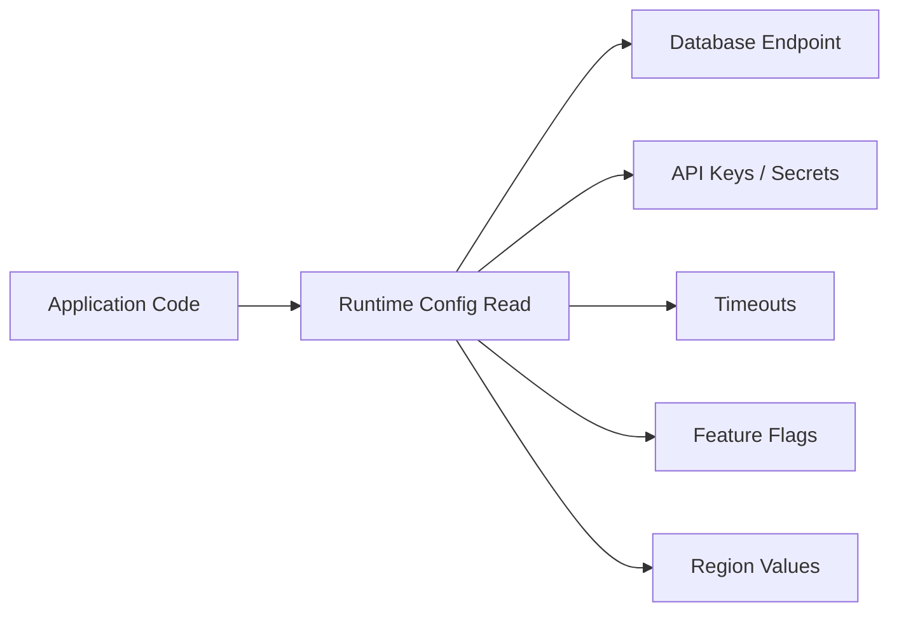

# Module 13 – How to Engineer Deployment and Operational Safety in Real Systems

## Why This Part Matters

Knowing deployment terms is not enough. In real systems, the difficult part is **how to release changes safely, manage configuration reliably, reduce rollout risk, recover quickly from mistakes, and operate production systems without causing avoidable outages**.

This module explains **how to engineer deployment and operational safety step by step** so that system changes can move into production with confidence instead of fear.

---

# 1) How to Design Environment Separation Properly

## Step 1: Define Clear Environments Early
From the beginning, separate the system into environments such as:
- development
- testing
- staging
- production

Each environment must have a clear purpose.

## Step 2: Give Each Environment a Specific Responsibility
Typical purpose:
- **Development** for coding and local debugging
- **Testing** for automated validation and integration checks
- **Staging** for production-like end-to-end verification
- **Production** for live users and real traffic

If environments have no clear purpose, teams start using them inconsistently.

## Step 3: Isolate Environment Resources
Each environment should use separate:
- databases
- queues
- caches
- storage
- service endpoints
- credentials

This prevents accidental cross-environment interference.

## Step 4: Keep Staging Close to Production
Staging should behave as close to production as practical in:
- topology
- config style
- traffic assumptions
- dependency behavior
- scaling model

If staging is too different, production issues will still surprise the team.

## Step 5: Control Promotion Between Environments
Changes should move forward intentionally:
- development → testing
- testing → staging
- staging → production

Promotion should be based on validation, not guesswork.

### Food Delivery Example
A new order workflow is:
- built in development
- validated by automated tests
- checked end-to-end in staging
- released to production only after operational readiness is confirmed

---

# 2) How to Engineer Good Configuration Management

## Step 1: Separate Code from Configuration
Application code should stay the same across environments. Only configuration should change.

Examples of config:
- database URLs
- API endpoints
- feature flags
- timeout values
- retry policies
- region values
- secrets references

## Step 2: Externalize Configuration
Configuration should come from:
- environment variables
- config files
- config services
- secret managers
- deployment manifests

Do not hardcode environment-specific values inside source code.

## Step 3: Separate Secrets from General Configuration
Not all config is equally sensitive.

General config examples:
- log level
- feature toggle
- timeout duration

Secret examples:
- API keys
- DB passwords
- certificates
- signing secrets

Secrets need stronger handling and tighter access control.

## Step 4: Validate Configuration at Startup or Deployment
Bad config should fail early.

Useful validation checks:
- required values exist
- formats are correct
- endpoints are valid
- numeric values are in safe ranges
- incompatible config combinations are rejected

## Step 5: Make Configuration Changes Traceable
Teams should know:
- what changed
- who changed it
- when it changed
- which environment was affected

This helps auditing and incident debugging.

### Example
Order Service should read:
- payment endpoint from environment config
- retry count from config
- feature flag state from external flag system
- DB password from secret manager

It should not contain these values directly in the application code.

---

# 3) How to Prevent Configuration Drift

## Step 1: Standardize Environment Setup
Use repeatable infrastructure and deployment definitions so environments are created consistently.

## Step 2: Avoid Manual Production-Only Fixes
Temporary manual edits often become permanent hidden drift.

## Step 3: Version Control Non-Secret Configuration
Where appropriate, store safe config definitions in version-controlled infrastructure or deployment files.

## Step 4: Compare Environments Regularly
Check for differences in:
- timeout values
- retries
- feature flags
- scaling rules
- service versions
- enabled integrations

## Step 5: Treat Drift as a Production Risk
If staging and production differ unexpectedly, testing loses value.

### Example
Staging may use retry count 2 while production uses retry count 8. A dependency slowdown might look acceptable in staging but create retry storm behavior in production.

---

# 4) How to Plan Safe Rollouts

## Step 1: Treat Every Deployment as Risky
Even small changes can fail because of:
- hidden dependency behavior
- real traffic patterns
- bad config
- data differences
- scaling side effects

## Step 2: Choose the Right Rollout Strategy
Possible strategies:
- full rollout
- phased rollout
- canary deployment
- blue-green deployment
- feature-flag-based exposure

Choose based on change risk and system criticality.

## Step 3: Start Small
Prefer releasing to:
- internal users
- one region
- one service instance set
- a small traffic percentage

This keeps blast radius limited.

## Step 4: Watch Rollout Health Closely
Monitor during rollout:
- error rate
- latency
- success rate
- dependency failures
- resource pressure
- queue growth
- business KPIs

## Step 5: Expand Only When Healthy
Do not move from 5% to 100% blindly. Expand gradually only if the previous stage is healthy.

### Example
A new payment retry workflow is released to 5% of order traffic first. If timeout rate and checkout success remain healthy, traffic is expanded step by step.

---

# 5) How to Engineer Rollback Readiness

## Step 1: Assume Rollback May Be Needed
A deployment is incomplete unless recovery is planned.

## Step 2: Define What Can Be Reverted
Possible rollback targets:
- application version
- config value
- traffic routing
- feature flag
- dependency version
- infrastructure change

## Step 3: Make Rollback Fast
Rollback must not depend on slow manual improvisation.

Good rollback methods:
- previous version remains deployable
- traffic can switch back quickly
- config can be restored safely
- feature flag can disable new behavior immediately

## Step 4: Know When to Roll Back
Define rollback triggers such as:
- 5xx error spike
- business conversion drop
- sustained p99 latency increase
- dependency failure surge
- queue buildup
- corrupted workflow behavior

## Step 5: Consider Data Impact
Sometimes code rollback alone is not enough if:
- data schema changed incompatibly
- bad writes already occurred
- events already propagated

In such cases, rollback needs recovery plus reconciliation.

### Example
A new order assignment flow causes order confirmation failures. Team disables the feature flag immediately, shifts traffic back to prior version, and checks whether partial state needs reconciliation.

---

# 6) How to Use Feature Flags Safely

## Step 1: Separate Deployment from Release
Deploy code first, expose feature later.

## Step 2: Use Flags for High-Risk Changes
Feature flags are useful for:
- gradual rollout
- operational kill switches
- internal testing
- regional control
- fallback behavior

## Step 3: Keep Flag Ownership Clear
Each flag should have:
- purpose
- owner
- default state
- cleanup plan

## Step 4: Avoid Flag Chaos
Too many unmanaged flags make behavior hard to reason about.

## Step 5: Use Flags for Fast Recovery
If the issue is feature behavior rather than platform version, a flag can reduce recovery time dramatically.

### Example
A new recommendation engine is already deployed in production but enabled only for internal staff. Later it is turned on for 10% of users. When latency rises, the team disables the flag immediately without redeploying.

---

# 7) How to Use Blue-Green and Canary Deployments

## Step 1: Use Blue-Green When Fast Traffic Switching Matters
Blue-green works well when:
- you need clean cutover
- you want easy rollback
- infrastructure can support two environments

Flow:
- Blue = current production
- Green = new version
- validate green
- shift traffic
- switch back if needed

## Step 2: Use Canary When Live Validation Is Needed
Canary works well when:
- real traffic behavior matters
- you want gradual exposure
- you need low blast radius

Flow:
- send small % traffic to new version
- compare metrics
- expand gradually
- stop if unhealthy

## Step 3: Compare User and System Health During Rollout
Watch:
- request success
- error rate
- tail latency
- resource use
- business completion rate

## Step 4: Avoid “Ship and Hope”
No rollout strategy should rely on blind confidence.

## Step 5: Match Strategy to Risk
Small internal change may allow faster rollout. Core payment or checkout change needs stricter rollout control.

### Example
A new order-pricing service version is released to 2% of traffic first. Metrics stay healthy, so rollout moves to 10%, 25%, 50%, and then 100%.

---

# 8) How to Reduce Operational Risk

## Step 1: Automate Repetitive Operations
Automation reduces human error in:
- deployment
- config application
- secret loading
- environment setup
- rollback steps

## Step 2: Reduce Manual Production Changes
Manual production handling should be limited and traceable.

## Step 3: Use Checklists for Critical Changes
Before production rollout, confirm:
- tests passed
- configs validated
- observability ready
- rollback path ready
- dependencies healthy
- owners available if needed

## Step 4: Think About Operational Failure Modes
Ask:
- what if timeout is misconfigured?
- what if secret is missing?
- what if rollout hits only some services?
- what if old and new versions conflict?
- what if staging assumptions differ from production?

## Step 5: Make Risk Visible
Operational risk should appear in:
- design reviews
- deployment planning
- runbooks
- post-incident reviews

### Example
A timeout increase from 2 seconds to 30 seconds may not look dangerous in isolation, but under peak traffic it can cause blocked threads, higher queue depth, and cascading failure.

---

# 9) How to Prepare Operational Readiness

## Step 1: Confirm the System Is Observable
Before release, ensure:
- dashboards exist
- alerts exist
- logs are usable
- traces work where needed

## Step 2: Prepare Recovery Documentation
Teams should know:
- how to rollback
- how to disable risky features
- how to diagnose errors
- how to escalate dependency issues

## Step 3: Ensure Access and Ownership Are Clear
Production changes must have:
- responsible owners
- correct permissions
- secure change process

## Step 4: Validate Capacity and Limits
Check:
- scaling thresholds
- queue capacity
- dependency limits
- connection pools
- storage expectations

## Step 5: Think Beyond Deployment Success
A deployment is only truly successful if the system remains healthy after live traffic reaches it.

### Example
Before releasing a new payment connector, team confirms:
- feature flag exists
- metrics and alerts are ready
- secrets are loaded correctly
- rollback plan is documented
- support team knows failure symptoms

---

# 10) How to Monitor a Rollout Properly

## Step 1: Watch Technical Signals
During deployment, monitor:
- CPU
- memory
- request rate
- 4xx and 5xx rates
- p95 and p99 latency
- queue depth
- dependency latency

## Step 2: Watch Business Signals Too
Technical health may look normal while user outcome degrades.

Examples:
- order success rate
- payment completion rate
- delivery assignment success
- cart-to-checkout conversion

## Step 3: Compare Old vs New Behavior
Where possible, compare:
- previous version metrics
- previous region behavior
- control group vs canary group

## Step 4: Look for Silent Failures
Not all rollout issues appear as crashes.

Examples:
- retries increasing
- async lag increasing
- event consumer slowing down
- partial workflow failures

## Step 5: Keep Observation Window Long Enough
Some failures appear only after:
- traffic builds
- caches warm differently
- scheduled jobs start
- downstream dependency load grows

### Example
A rollout may look healthy for the first five minutes, but after 20 minutes queue depth and retry counts start rising. Teams need to keep monitoring long enough to catch delayed failure patterns.

---

# 11) How to Handle Deployment with Schema or Data Changes

## Step 1: Avoid Breaking Compatibility
Old and new versions may coexist during rollout, so schema changes must be backward compatible whenever possible.

## Step 2: Use Expand-Then-Contract Thinking
Safer sequence:
1. Add new field or structure
2. Support both old and new behavior
3. Migrate traffic and consumers
4. Remove old structure later

## Step 3: Do Not Tie Risky Data Changes to Instant Full Rollout
Large schema or migration changes need extra care.

## Step 4: Plan Recovery for Partial Data Changes
Ask:
- what if deployment rolls back after some data was already written?
- can old version still read new data?
- is reconciliation needed?

## Step 5: Coordinate App, Service, and Data Change Timing
Deployment safety includes compatibility across:
- code
- database schema
- events
- consumers
- configs

### Example
If new order service writes a new field that old consumers cannot parse, rollback becomes harder. Safer design keeps old consumers working during transition.

---

# 12) Step-by-Step Real-Life Flow (Food Delivery)

## Scenario
A new order workflow is being released in production.

### Step 1: Change Is Built and Tested
Team completes:
- local development
- automated tests
- integration validation

### Step 2: Staging Validation Happens
In staging, team verifies:
- full order workflow
- payment interaction
- observability signals
- config correctness

### Step 3: Production Configuration Is Checked
Team confirms:
- correct DB endpoint
- correct secret references
- right timeout values
- feature flag default state
- rollback instructions ready

### Step 4: Deployment Starts with Controlled Exposure
New version is deployed to a small canary slice.

### Step 5: Monitoring Begins Immediately
Team watches:
- order success rate
- payment failures
- p99 latency
- retry growth
- service resource usage

### Step 6: Business and Technical Health Are Compared
If canary behaves like baseline, rollout expands gradually.

### Step 7: Problem Appears
Suppose payment timeout rate rises and order confirmations begin dropping.

### Step 8: Recovery Action Happens Fast
Team:
- disables feature flag or
- shifts traffic back to old version

### Step 9: Data Impact Is Reviewed
Team checks whether partial writes or inconsistent order states need reconciliation.

### Step 10: Post-Incident Learning Improves Process
Thresholds, config validation, and rollout checks are improved before the next release.

---

# 13) Visual – Promotion Across Environments

```mermaid id="jh1hcf"
flowchart LR
    D[Development] --> T[Testing]
    T --> S[Staging]
    S --> P[Production]
````

---

# 14) Visual – Safe Canary Rollout

```mermaid id="yqj37s"
flowchart TD
    A[New Version Ready] --> B[Deploy to Small Traffic Slice]
    B --> C[Monitor Health Signals]
    C -->|Healthy| D[Increase Traffic Gradually]
    C -->|Unhealthy| E[Rollback or Disable Feature]
    D --> F[Full Rollout]
```

---

# 15) Visual – Externalized Configuration Flow


```mermaid id="a1mh40"
flowchart LR
    C[Application Code] --> R[Runtime Config Read]
    R --> D1[Database Endpoint]
    R --> D2[API Keys / Secrets]
    R --> D3[Timeouts]
    R --> D4[Feature Flags]
    R --> D5[Region Values]
```

---

# 16) Common Engineering Mistakes

## Mistake 1: Deploying Without Rollback Readiness

Teams know how to push changes but not how to recover fast.

## Mistake 2: Hardcoding Environment Values

This creates security risk and deployment mistakes across environments.

## Mistake 3: Releasing to 100% Traffic Too Early

Blast radius becomes unnecessarily large.

## Mistake 4: Keeping Staging Too Different from Production

Pre-release validation becomes misleading.

## Mistake 5: Making Manual Production Config Changes

This introduces hidden drift and hard-to-debug behavior.

## Mistake 6: Monitoring Only Technical Health

Business workflow damage can be missed.

## Mistake 7: Ignoring Delayed Failure Signals

Some rollout issues appear only after sustained traffic.

## Mistake 8: Treating Operations as an Afterthought

Operational safety is part of architecture, not a separate concern.

---

# 17) Interview-Ready Answers

## How do you reduce deployment risk in production?

By separating environments, externalizing configuration, validating changes in staging, using controlled rollout strategies, monitoring closely, and preparing fast rollback paths.

## Why is configuration management important?

Because the same application code runs across multiple environments, and environment-specific values must be applied safely without hardcoding or secret leakage.

## Why are gradual rollouts useful?

Because they reduce blast radius, allow real-traffic validation, and make it easier to stop a bad release before it affects all users.

## What is configuration drift and why is it dangerous?

Configuration drift is unintended difference between environments, and it is dangerous because it makes testing less trustworthy and production behavior harder to predict.

## Why must rollback be planned before deployment?

Because when a rollout fails, speed matters, and teams cannot depend on improvisation during an incident.

---

# 18) One-Line Implementation Summary

To engineer deployment safety well, separate environments clearly, externalize and validate configuration, release changes gradually, monitor rollout health carefully, and keep rollback fast and reliable.

```
```
