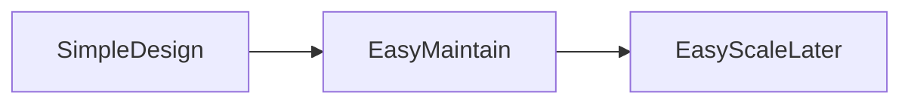

Perfect 👍 — here is your **Module 14 – Concept.md**
👉 Same **Module 5 format (WHAT / WHY / WHEN + Use Case + Q&A)**
👉 Mermaid visuals included
👉 VS Code ready

---

# 📁 FILE: `Concept.md` (Module 14)

````md id="p4b2tc"
%%{init: {
  "theme": "base",
  "themeVariables": {
    "primaryColor": "#FFF3E0",
    "primaryBorderColor": "#FB8C00",
    "lineColor": "#FB8C00"
  }
}}%%

# 📘 Module 14 – Evaluating Trade-offs and Making Decisions

---

# 🎯 Why This Module Is Covered in Depth

Module 14 focuses on engineering judgment — the ability to make conscious trade-offs.

In system design:
- there is no perfect solution  
- every decision has pros and cons  
- constraints drive decisions  

This module helps engineers:
- think clearly  
- justify decisions  
- balance trade-offs  

---

# 1️⃣ No Perfect Architecture

---

## ✅ WHAT

No system can optimize:
- scalability  
- consistency  
- cost  
- simplicity  
- performance  

all at once.

---

## 🎯 WHY

Optimizing one dimension impacts others.

---

## ⏰ WHEN

- at every design decision  

---

## 🍔 Use Case (Food Delivery)

- monolith → simple but less scalable  
- microservices → scalable but complex  

---

## 🖼️ Visual

```mermaid
flowchart TD
    System --> Scalability
    System --> Consistency
    System --> Cost
    System --> Complexity
````

---

## 🧠 Rule

> Every design decision is a trade-off

---

# 2️⃣ Cost vs Performance vs Complexity

---

## ✅ WHAT

Balancing:

* cost (infra, ops)
* performance (speed, latency)
* complexity (architecture effort)

---

## 🎯 WHY

* high performance → higher cost + complexity
* low cost → lower performance

---

## ⏰ WHEN

* infrastructure selection
* caching decisions
* scaling design

---

## 🍔 Use Case

Aggressive caching:

* improves performance
* increases complexity

---

## 🖼️ Visual

```mermaid
flowchart TD
    A[System]
    A --> Cost
    A --> Performance
    A --> Complexity
```

---

## 🧠 Rule

> Optimize what matters most for business

---

# 3️⃣ When to Simplify

---

## ✅ WHAT

Choose simplest design that meets current needs.

---

## 🎯 WHY

* easier to maintain
* easier to debug
* faster to build

---

## ⏰ WHEN

* uncertain future requirements
* early-stage systems

---

## 🍔 Use Case

Avoid sharding early → use single DB

---

## 🖼️ Visual



---

## 🧠 Rule

> Start simple, evolve when needed

---

# 📘 Module 14 – Interview Question Bank with Answers

---

### Q: Why is there no perfect architecture?

**A:** Because improving one dimension affects others.

---

### Q: What are trade-offs?

**A:** Decisions balancing competing factors.

---

### Q: Why are trade-offs important?

**A:** They guide realistic system design.

---

### Q: Cost vs performance?

**A:** Higher performance increases cost.

---

### Q: Why avoid complexity?

**A:** It increases risk and maintenance.

---

### Q: What is over-engineering?

**A:** Adding unnecessary complexity.

---

### Q: When choose simple design?

**A:** When requirements are limited.

---

### Q: What is technical debt?

**A:** Shortcuts taken for speed.

---

### Q: When is technical debt acceptable?

**A:** When managed consciously.

---

### Q: What is premature optimization?

**A:** Optimizing before real need.

---

### Q: How justify design decisions?

**A:** Explain trade-offs clearly.

---

### Q: Why do interviewers ask trade-offs?

**A:** To evaluate judgment.

---

### Q: How does simplicity improve reliability?

**A:** Fewer components → fewer failures.

---

### Q: Common mistake?

**A:** Designing for future without evidence.

---

### Q: One-line summary?

**A:** System design is about informed trade-offs.

---

# 🧠 One-Line Summary

> Good system design is about making informed trade-offs, not perfect choices.

```

