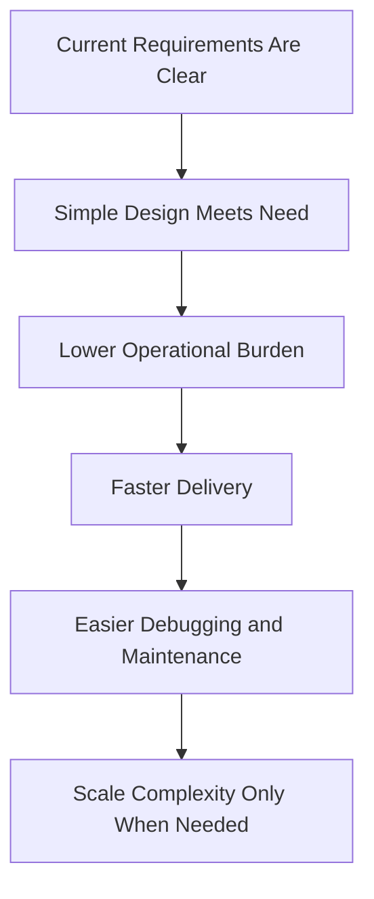

# Module 14 – Evaluating Trade-offs and Making Decisions

## Why This Module Is Covered in Depth

Module 14 focuses on engineering judgment — the ability to make conscious trade-offs when designing systems. There is no perfect architecture; every decision optimizes some dimensions while compromising others. This module trains engineers to reason clearly about those choices.

Interviewers heavily value this module because it reveals maturity, experience, and decision-making ability, not just technical knowledge.

---

## 1) No Perfect Architecture

### WHAT
No system can optimize for all qualities simultaneously, such as scalability, consistency, cost, simplicity, and speed.

### WHY
Constraints force trade-offs, and ignoring them leads to fragile or over-engineered systems.

### WHEN
At every major architectural decision point.

### Use Case (Food Delivery)
A monolithic architecture may be sufficient initially, even though microservices offer more scalability later.

### Plain-English Understanding
System design is not about finding a magical best solution. It is about choosing the most suitable solution for the current situation. If you make one area stronger, another area usually becomes weaker, more expensive, or more complex.

### Engineering View
Architectural qualities often compete with each other:
- Higher scalability may increase complexity
- Stronger consistency may reduce availability or performance
- Lower cost may reduce redundancy or speed
- Simpler design may limit flexibility later
- Faster delivery may increase technical debt

Good engineering decisions come from understanding these tensions instead of pretending they do not exist.

### Example
A startup food delivery platform may start with a monolith because:
- team is small
- speed of development matters
- operational simplicity matters
- scale is still moderate

Moving immediately to microservices may add deployment overhead, debugging complexity, and operational burden without solving a real current problem.

---

## 2) Cost vs Performance vs Complexity

### WHAT
This trade-off balances financial cost, system performance, and architectural complexity.

### WHY
Over-optimizing performance increases cost and complexity, while over-simplifying can limit growth.

### WHEN
During infrastructure selection, caching strategies, and scaling decisions.

### Use Case
Aggressive caching improves performance but increases cache invalidation complexity and cost.

### Plain-English Understanding
Fast systems often cost more money and require more sophisticated design. Cheap systems may be slower. Very advanced performance improvements may also make systems harder to build, test, and maintain.

### Engineering View
Typical trade-off patterns:
- More replicas improve performance and availability but increase cost
- Caching reduces latency but adds invalidation complexity
- Sharding improves scale but increases operational overhead
- Specialized databases improve specific use cases but reduce simplicity
- Multi-region systems improve resilience but increase coordination complexity and cost

### Example
A product catalog may become faster with caching, but then engineers must handle:
- stale cache entries
- invalidation rules
- extra memory cost
- cache warm-up issues
- monitoring cache hit rate

The improvement may be worth it only if latency is actually hurting the business.

---

## 3) When to Simplify

### WHAT
Simplification means choosing the simplest design that satisfies current requirements.

### WHY
Simple systems are easier to maintain, debug, and evolve.

### WHEN
When future requirements are speculative or uncertain.

### Use Case
Avoiding premature sharding until data volume justifies the complexity.

### Plain-English Understanding
Engineers often feel pressure to build for every possible future problem. But many of those problems may never happen. A simpler design is usually better until real evidence shows that more complexity is needed.

### Engineering View
Simplification does not mean being careless. It means:
- meeting current needs
- leaving room for future evolution
- avoiding unnecessary moving parts
- reducing operational burden
- preserving clarity of ownership

### Example
Instead of building:
- distributed queues
- multiple microservices
- sharded databases
- advanced event choreography

a team may start with:
- one deployable service
- one primary database
- async jobs only where clearly needed
- externalized configuration
- clean module boundaries for future extraction

That often gives strong early velocity without blocking future growth.

---

## 4) Trade-offs in Real System Design

### WHAT
Trade-offs are conscious compromises made between competing system qualities.

### WHY
Every real system has constraints in time, money, team size, reliability needs, and business goals.

### WHEN
Whenever choosing architecture, storage, scaling model, consistency strategy, or operational approach.

### Plain-English Understanding
System design is a series of choices under limits. Engineers must decide what matters most now and what can be accepted as a compromise.

### Engineering View
Common trade-off dimensions include:
- Simplicity vs flexibility
- Cost vs performance
- Consistency vs availability
- Speed of delivery vs long-term maintainability
- Centralization vs autonomy
- Operational ease vs scaling potential
- Feature richness vs system clarity

### Example
In a food delivery system:
- Payment flow may require strong consistency
- Delivery location updates may tolerate eventual consistency
- Restaurant search may prioritize latency and caching
- Internal admin reporting may prioritize cost efficiency over real-time precision

Each flow deserves a different decision based on impact.

---

## 5) Over-Engineering and Premature Optimization

### WHAT
Over-engineering means adding complexity before it is justified by real needs. Premature optimization means optimizing before real bottlenecks are known.

### WHY
Unnecessary complexity increases build time, maintenance burden, and failure risk.

### WHEN
Whenever teams design for hypothetical future problems instead of current evidence.

### Plain-English Understanding
Sometimes teams build “advanced” systems not because they need them, but because they sound impressive. This often creates more problems than it solves.

### Engineering View
Signs of over-engineering:
- distributed architecture without scale need
- too many services for a small team
- complex event systems for simple workflows
- sharding before database growth requires it
- heavy caching without real latency problem
- multi-region setup before business justification

### Example
A small internal tool with low traffic probably does not need:
- microservices
- CQRS
- event sourcing
- multi-region failover
- advanced traffic shaping

A simpler service with good modularity is usually better.

---

## 6) Technical Debt and Conscious Compromise

### WHAT
Technical debt is the future cost created by choosing shortcuts or faster delivery over ideal long-term design.

### WHY
Not all shortcuts are bad, but unmanaged debt becomes a major burden.

### WHEN
When business urgency justifies speed, but the trade-off is explicitly understood.

### Plain-English Understanding
Sometimes teams choose a faster but less ideal solution to meet deadlines. That can be acceptable if everyone understands the cost and plans to improve it later.

### Engineering View
Healthy technical debt is:
- conscious
- documented
- limited in scope
- monitored
- scheduled for future cleanup

Dangerous technical debt is:
- hidden
- accidental
- growing silently
- repeatedly ignored
- spread across critical paths

### Example
A team may initially use one shared database for two tightly related modules to launch quickly. That may be acceptable if:
- ownership is still clear
- scale is still low
- migration path is understood
- future separation is planned when needed

---

## 7) Business Constraints and Engineering Decisions

### WHAT
Business constraints shape what kind of system is practical to build.

### WHY
Architecture must serve business reality, not only technical ideals.

### WHEN
At the start of design and during every major trade-off discussion.

### Plain-English Understanding
The best technical idea is not always the right business decision. Budget, team skills, timeline, and market urgency all matter.

### Engineering View
Important business constraints include:
- budget
- time-to-market
- team size
- operational maturity
- expected user growth
- compliance needs
- failure tolerance
- customer expectations

### Example
If a startup needs to launch in six weeks, a clean monolith with strong modular boundaries may be better than a sophisticated distributed system that takes months to stabilize.

---

## 8) How Senior Engineers Think About Decisions

### WHAT
Senior-level system design means explaining not just what to build, but why that choice is right under the given constraints.

### WHY
Mature design thinking comes from reasoning, not from memorizing patterns.

### WHEN
In interviews, architecture reviews, and production decision-making.

### Plain-English Understanding
A senior engineer does not simply say, “Use microservices” or “Use Kafka.” They explain:
- what problem exists
- what options were considered
- why one option is better now
- what is being sacrificed
- how future evolution may happen

### Engineering View
Strong decision-making usually includes:
- clear requirements
- identified constraints
- alternative options
- explicit trade-offs
- chosen direction
- future migration path if needed

### Example
A strong interview answer sounds like:
“We could use microservices, but given the current team size, operational maturity, and expected load, I would start with a modular monolith. This keeps deployment simple and development fast. If the order, payment, and delivery domains later need independent scaling, we can extract them gradually.”

---

## 9) Visual – Trade-off Thinking in Architecture

```mermaid id="q0gq9n"
flowchart TD
    A[Requirements and Constraints] --> B[Possible Design Options]
    B --> C[Evaluate Trade-offs]
    C --> D[Choose Best Current Fit]
    D --> E[Accept Compromises Clearly]
    E --> F[Plan Future Evolution If Needed]
````

---

## 10) Visual – Cost vs Performance vs Complexity

```mermaid id="kz9o0f"
flowchart LR
    C[Lower Cost] --> T[Trade-off Zone]
    P[Higher Performance] --> T
    X[Lower Complexity] --> T
    T --> D[Balanced Engineering Decision]
```

---

## 11) Visual – When Simplicity Wins


```mermaid id="ol9tup"
flowchart TD
    A[Current Requirements Are Clear] --> B[Simple Design Meets Need]
    B --> C[Lower Operational Burden]
    C --> D[Faster Delivery]
    D --> E[Easier Debugging and Maintenance]
    E --> F[Scale Complexity Only When Needed]
```

---

## 12) Common Mistakes

### Designing for Imaginary Future Scale

Teams assume huge future growth without evidence and add unnecessary complexity.

### Confusing Advanced with Better

Complex architecture is treated as automatically superior.

### Ignoring Cost Impact

Performance improvements are chosen without considering financial and operational cost.

### Underestimating Complexity

Teams add caching, sharding, or microservices without accounting for maintenance burden.

### Avoiding Explicit Trade-off Discussion

Decisions are made emotionally or by trend instead of by reasoning.

### Taking Technical Debt Unconsciously

Shortcuts are made without documenting risk or cleanup plan.

### Optimizing Too Early

Engineering time is spent solving bottlenecks that do not yet exist.

### Failing to Connect Design to Business Reality

Architecture decisions ignore team size, deadlines, or real product priorities.

---

## 13) Interview Question Bank with Answers

### Q: Why is there no perfect architecture?

**A:** Because optimizing one dimension inevitably degrades another.

### Q: What role do trade-offs play in system design?

**A:** They guide conscious decision-making under constraints.

### Q: How do you evaluate cost vs performance?

**A:** By aligning performance needs with business value and budget.

### Q: Why can complexity be dangerous?

**A:** It increases maintenance cost and failure risk.

### Q: When is a simple design preferable?

**A:** When requirements are limited and growth is uncertain.

### Q: What is over-engineering?

**A:** Adding complexity without current necessity.

### Q: How do trade-offs affect scalability decisions?

**A:** They determine when to invest in complex scaling solutions.

### Q: What is technical debt?

**A:** Deferred complexity or shortcuts taken for speed.

### Q: When is technical debt acceptable?

**A:** When managed consciously and paid back intentionally.

### Q: How do you justify architectural decisions in interviews?

**A:** By explaining constraints, trade-offs, and alternatives.

### Q: What is a common mistake in trade-off analysis?

**A:** Assuming future scale without evidence.

### Q: How do business constraints affect architecture?

**A:** They limit cost, timeline, and acceptable complexity.

### Q: Why do interviewers ask trade-off questions?

**A:** To assess judgment rather than tool knowledge.

### Q: How does simplicity improve reliability?

**A:** Fewer components mean fewer failure points.

### Q: When should performance optimization be delayed?

**A:** Until real bottlenecks are observed.

### Q: What is premature optimization?

**A:** Optimizing before understanding actual usage.

### Q: How do you communicate trade-offs to stakeholders?

**A:** By explaining impact, risks, and benefits clearly.

### Q: How does this module connect to earlier modules?

**A:** It ties requirements, scalability, performance, and reliability together.

### Q: What indicates senior-level system design thinking?

**A:** Clear articulation of trade-offs and decisions.

### Q: Summarize Module 14 in one sentence.

**A:** Good system design is about making informed trade-offs, not perfect choices.

---

## 14) One-Line Summary

Good system design comes from understanding constraints, comparing trade-offs honestly, and choosing the simplest decision that delivers the right business and engineering outcome for the current stage.

```
```
