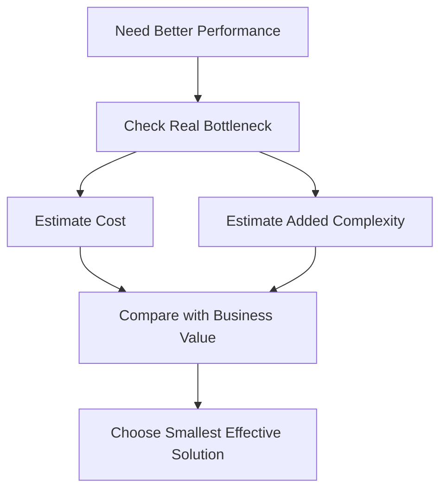

# Module 14 – How to Evaluate Trade-offs and Make Engineering Decisions in Real Systems

## Why This Part Matters

Knowing system design concepts is not enough. In real engineering work, the harder task is deciding **which option to choose, what to optimize now, what to postpone, what complexity is worth accepting, and how to justify the decision clearly**.

This module explains **how to evaluate trade-offs step by step** so that design choices are made consciously, not emotionally, not by trend, and not by copying architecture patterns blindly.

---

# 1) How to Start Any Design Decision

## Step 1: Clarify the Real Problem
Before comparing solutions, define the actual problem.

Ask:
- What are we building?
- Who will use it?
- What matters most right now?
- What failure is unacceptable?
- What scale is real, not imaginary?

Without a clear problem, trade-off analysis becomes vague.

## Step 2: Identify Constraints
Every design decision lives inside constraints.

Common constraints:
- budget
- timeline
- team size
- operational maturity
- compliance needs
- traffic expectations
- latency requirements
- reliability expectations

A technically attractive design may still be wrong if it does not fit these constraints.

## Step 3: Define Success Criteria
Decide what “good enough” means.

Examples:
- response under 300 ms
- 99.9% availability
- launch in 6 weeks
- low operational overhead
- support 100k daily orders
- keep cloud cost under target budget

## Step 4: List Plausible Options
Do not compare only one favorite option to nothing.

Examples:
- monolith vs modular monolith vs microservices
- database scaling vertically vs read replicas vs sharding
- sync workflow vs async workflow
- cache now vs optimize DB first

## Step 5: Accept That No Option Is Perfect
Every option improves some qualities and weakens others. The goal is not perfection. The goal is the best fit for current needs.

---

# 2) How to Compare Options Properly

## Step 1: Compare Against Important Dimensions
Good trade-off analysis compares options across dimensions such as:
- simplicity
- scalability
- reliability
- performance
- consistency
- operational complexity
- cost
- speed of delivery
- team fit
- security impact

## Step 2: Ask What Each Option Optimizes
Every architecture pattern is good at something and expensive in something else.

Example:
- microservices optimize independent scaling and team autonomy
- monolith optimizes simplicity and delivery speed
- caching optimizes latency
- replication optimizes read scale
- sharding optimizes data growth handling

## Step 3: Ask What Each Option Makes Harder
This is where mature thinking appears.

Examples:
- caching makes invalidation harder
- microservices make debugging harder
- strong consistency may reduce availability
- multi-region improves resilience but increases coordination complexity
- event-driven design improves decoupling but complicates tracing and failure recovery

## Step 4: Compare Current Need vs Future Possibility
A design should solve current problems well without creating unnecessary burden for hypothetical future problems.

## Step 5: Choose the Option with Best Overall Fit
The winner is not the most advanced design. It is the design that best fits requirements, constraints, and evolution path.

---

# 3) How to Decide When Simplicity Is Better

## Step 1: Check Whether Current Requirements Are Modest
If scale, team size, and complexity are still limited, simplicity is often the better choice.

## Step 2: Ask Whether the Future Need Is Proven
Do not build for future scale based only on imagination.

Examples of unproven assumptions:
- “We may have millions of users soon”
- “We may need multi-region in future”
- “We may split into 20 teams later”

## Step 3: Prefer Simplicity When It Meets Real Needs
Simple design is often better because it gives:
- faster delivery
- lower operational burden
- easier debugging
- clearer ownership
- lower cost

## Step 4: Keep Evolution Paths Open
Simple does not mean careless. A simple design should still allow future growth.

Good example:
- start with modular monolith
- keep clean domain boundaries
- externalize config
- use contracts clearly
- add async boundaries only where needed

## Step 5: Add Complexity Only When Pain Is Real
Complexity should be introduced when the current system creates real bottlenecks, not when engineers feel nervous about the future.

### Example
A food delivery startup may begin with:
- one deployable backend
- one main database
- background jobs for notifications
- cache only for hot reads

That is often better than starting immediately with:
- multiple microservices
- distributed queues everywhere
- complex event choreography
- sharded databases

---

# 4) How to Evaluate Cost vs Performance vs Complexity

## Step 1: Ask Whether Performance Problem Is Real
Do not optimize performance just because optimization is possible.

Check:
- current latency
- user complaints
- business impact
- bottleneck location
- expected traffic

## Step 2: Measure the Cost of Improvement
Performance improvements usually cost something:
- more infrastructure
- more engineering time
- more operational complexity
- harder debugging
- higher cloud cost

## Step 3: Measure the Complexity Added
A performance solution may work technically but create ongoing burden.

Examples:
- caching adds invalidation complexity
- precomputation adds data freshness trade-offs
- sharding adds routing complexity
- specialized storage adds operational overhead

## Step 4: Ask Whether Business Value Justifies It
If the gain is tiny but the complexity is large, the trade-off may be poor.

## Step 5: Prefer the Smallest Effective Improvement
Before choosing a major architectural shift, consider whether a smaller fix works:
- add index before redesigning DB
- optimize query before adding cache layer
- tune connection pool before adding more infrastructure
- batch work before introducing full streaming system

### Example
If order search latency is high, the sequence might be:
1. inspect slow queries
2. add indexes
3. optimize query patterns
4. add caching if still needed
5. redesign storage only if proven necessary

That is better than jumping straight to a highly complex architecture.

---

# 5) How to Avoid Over-Engineering

## Step 1: Watch for “Architecture Excitement”
Teams often choose advanced patterns because they sound modern or impressive.

## Step 2: Ask What Problem the Complexity Solves
Every added component should answer:
- what exact problem does this solve?
- why now?
- what evidence supports this need?

## Step 3: Count the Operational Burden
Each new component may add:
- deployment overhead
- monitoring overhead
- debugging burden
- security surface area
- team coordination cost

## Step 4: Check Team Capability
A design must match the team’s ability to build and operate it.

## Step 5: Prefer Reversible Decisions Early
In uncertain systems, start with choices that are easier to change later.

### Example
Using a modular monolith early is often more reversible than starting with many tightly coupled microservices and then trying to simplify later.

---

# 6) How to Think About Technical Debt Correctly

## Step 1: Separate Conscious Debt from Accidental Debt
Conscious debt is a deliberate shortcut taken for speed with known consequences.
Accidental debt is poor design created without awareness.

## Step 2: Take Debt Only for a Reason
Good reasons may include:
- urgent launch deadline
- temporary market opportunity
- experimental product validation
- internal prototype phase

## Step 3: Record the Trade-off Clearly
Document:
- what shortcut was taken
- why it was taken
- what risk it creates
- when it should be revisited

## Step 4: Limit Debt on Critical Paths
Debt in core payment, security, or data integrity paths is more dangerous than debt in low-risk internal tools.

## Step 5: Plan the Payback Path
Debt is manageable only if cleanup is intentional.

### Example
A team may choose synchronous notification sending temporarily to ship faster. That may be acceptable if they know:
- it may increase user-facing latency
- it may need async decoupling later
- the change is isolated and reversible

---

# 7) How to Make Scalability Decisions Wisely

## Step 1: Measure Current Load and Growth
Do not design scale solutions without evidence.

Check:
- request rate
- data growth
- peak traffic
- write patterns
- read patterns
- failure symptoms

## Step 2: Find the Real Bottleneck
Scaling decisions should match the bottleneck:
- compute bottleneck
- database bottleneck
- network bottleneck
- storage bottleneck
- dependency bottleneck

## Step 3: Choose the Simplest Scaling Step First
Examples:
- vertical scaling before sharding
- read replica before full partitioning
- async processing before introducing a complex distributed workflow
- caching hot reads before redesigning entire storage model

## Step 4: Increase Complexity Gradually
Scaling should evolve with need.

## Step 5: Reassess After Each Change
Do not stack multiple complexity-heavy solutions without first measuring the result of the last change.

### Example
If restaurant menu reads are increasing:
- first add caching
- then add read replicas if needed
- then reconsider storage approach if scale truly demands it

That is more mature than immediately introducing sharding.

---

# 8) How to Communicate Trade-offs in Interviews

## Step 1: Start with Constraints
A strong answer begins with the situation:
- expected scale
- latency goal
- consistency need
- budget
- team size
- delivery timeline

## Step 2: Mention Alternatives Briefly
Show that you considered more than one option.

## Step 3: Explain Why You Chose One
Use reasoning such as:
- simpler for current scale
- safer operationally
- better cost fit
- faster to deliver
- easier to evolve later

## Step 4: State What You Are Sacrificing
This is where senior thinking becomes visible.

Examples:
- “I gain simplicity but give up some future scaling flexibility.”
- “I choose caching for latency, but this adds invalidation complexity.”
- “I prefer strong consistency here, even though it may reduce availability.”

## Step 5: Mention Future Evolution Path
Show how the design can change when the system grows.

### Example Answer Style
“For current expected traffic and team size, I would start with a modular monolith instead of microservices. This keeps deployment and debugging simpler and reduces operational cost. The trade-off is lower independent scalability per domain, but at this stage that is acceptable. If payment and delivery domains later need independent scaling, we can extract them gradually.”

---

# 9) How to Communicate Trade-offs to Stakeholders

## Step 1: Avoid Purely Technical Language
Stakeholders care about:
- cost
- speed
- risk
- user experience
- delivery timeline

## Step 2: Frame the Decision in Impact Terms
Explain:
- what improves
- what becomes harder
- what the business gets
- what risk is accepted

## Step 3: Show Options Clearly
Example:
- Option A is cheaper and faster but less scalable
- Option B is more scalable but more expensive and slower to deliver

## Step 4: Recommend, Do Not Just List
Stakeholders need a recommendation, not only raw comparison.

## Step 5: Be Honest About Uncertainty
Some choices are based on current evidence, not certainty about the future.

### Example
“We can add multi-region architecture now, but it will increase cost and complexity significantly. Given the current user base and availability goals, I recommend staying single-region with strong backups and recovery first.”

---

# 10) How to Build a Good Decision Habit

## Step 1: Think in Trade-offs, Not Absolutes
Avoid statements like:
- “Microservices are always better”
- “Caching is always needed”
- “Event-driven is the best architecture”

## Step 2: Ask What the System Needs Now
Current need matters more than architectural fashion.

## Step 3: Ask What Pain Will Increase Over Time
Good decisions reduce the biggest likely pain, not every theoretical pain.

## Step 4: Prefer Explicit Reasoning
A clear imperfect decision is better than vague complexity.

## Step 5: Revisit Decisions as Context Changes
A good design today may become a bad design later if scale, team size, or business goals change.

---

# 11) Step-by-Step Real-Life Flow (Food Delivery)

## Scenario
A team must decide whether to keep one backend service or split Order, Payment, and Delivery into microservices.

### Step 1: Define Current Situation
Team size is small, traffic is moderate, and product is still evolving.

### Step 2: Identify Real Requirements
Need:
- fast delivery of features
- clear ownership
- reasonable reliability
- manageable operations

No immediate need:
- extreme scale
- many independent platform teams
- highly specialized domain scaling

### Step 3: Compare Options
#### Option A: Modular Monolith
Benefits:
- simpler deployment
- easier debugging
- lower ops cost
- faster development

Trade-offs:
- less independent scaling
- less service autonomy later

#### Option B: Microservices
Benefits:
- better future independent scaling
- domain isolation
- better autonomy at large team scale

Trade-offs:
- more deployment complexity
- harder tracing/debugging
- more infra overhead
- more operational maturity required

### Step 4: Match Options to Constraints
Given current team size and operational maturity, modular monolith fits better.

### Step 5: Preserve Future Evolution
Keep:
- clean module boundaries
- explicit contracts between domains
- independent data ownership thinking
- event integration only where needed later

### Step 6: Make the Decision
Choose modular monolith now.

### Step 7: State Accepted Trade-off
Accept that future domain extraction may be needed later, but avoid present over-engineering.

---

# 12) Visual – Trade-off Evaluation Flow

```mermaid id="qvr7tf"
flowchart TD
    A[Understand Problem] --> B[Identify Constraints]
    B --> C[List Possible Options]
    C --> D[Compare Trade-offs]
    D --> E[Choose Best Current Fit]
    E --> F[Accept Compromises Clearly]
    F --> G[Plan Future Evolution]
````

---

# 13) Visual – Simplicity vs Complexity Decision

```mermaid id="s5b3cc"
flowchart LR
    A[Current Need Is Small or Moderate] --> B[Simple Design]
    B --> C[Fast Delivery]
    B --> D[Lower Operational Burden]
    B --> E[Easier Maintenance]

    F[Real Bottleneck Appears Later] --> G[Add Complexity Gradually]
```

---

# 14) Visual – Cost, Performance, and Complexity



---

# 15) Common Engineering Mistakes

## Mistake 1: Designing for Imaginary Future Scale

Complexity is added for problems that may never happen.

## Mistake 2: Confusing Modern with Correct

Trending architecture is treated as automatically better.

## Mistake 3: Ignoring Operational Cost

A technically strong option may be too hard or expensive to run.

## Mistake 4: Optimizing Too Early

Time is spent on performance work before real bottlenecks are known.

## Mistake 5: Hiding the Trade-off

Teams present a decision as “best” without acknowledging what it sacrifices.

## Mistake 6: Taking Unmanaged Technical Debt

Shortcuts are made without ownership or cleanup plan.

## Mistake 7: Choosing Complexity That Team Cannot Operate

Architecture exceeds the practical ability of the team.

## Mistake 8: Failing to Revisit Old Decisions

Systems evolve, but teams continue following outdated choices.

---

# 16) Interview-Ready Answers

## How do you evaluate trade-offs in system design?

By first clarifying requirements and constraints, then comparing realistic options across dimensions like simplicity, scalability, performance, cost, reliability, and operational complexity.

## Why is there no perfect architecture?

Because improving one quality usually weakens another, so design is always about choosing the best fit under current constraints.

## When should you prefer a simpler design?

When current requirements are limited, future scale is uncertain, and the simpler design can meet present needs with lower cost and lower operational burden.

## How do you avoid over-engineering?

By asking what exact current problem the added complexity solves, what evidence supports it, and whether a smaller simpler solution would work first.

## How do you justify design decisions in interviews?

By explaining the problem, constraints, alternative options, chosen direction, accepted trade-offs, and how the design can evolve later if needed.

---

# 17) One-Line Implementation Summary

To make strong system design decisions, compare realistic options against real constraints, choose the simplest design that solves the current problem well, and state the trade-offs openly and clearly.

```
```
