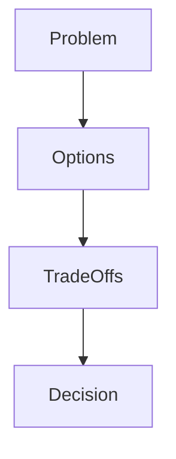
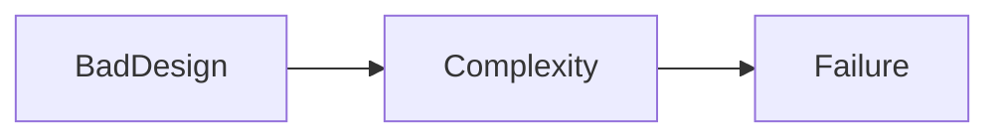

Perfect 👍 — here is your **Module 15 – Concept.md**
👉 Fully aligned with your **Module 5 format (WHAT / WHY / WHEN + Use Case + Q&A)**
👉 Mermaid-ready + VS Code compatible
👉 Based on your uploaded content 

---

# 📁 FILE: `Concept.md` (Module 15)

````md
%%{init: {
  "theme": "base",
  "themeVariables": {
    "primaryColor": "#FFF3E0",
    "primaryBorderColor": "#FB8C00",
    "lineColor": "#FB8C00"
  }
}}%%

# 📘 Module 15 – End-to-End System Design Walkthrough

---

# 🎯 Why This Module Is Covered in Depth

Module 15 ties all previous modules into a complete system design flow.

In real interviews and systems:
- success depends on structured thinking  
- decisions must be explained clearly  
- trade-offs must be justified  

This module builds the ability to:
- design systems end-to-end  
- think step-by-step  
- communicate decisions confidently  

---

# 1️⃣ Applying All Concepts Together

---

## ✅ WHAT

Combining all modules into one system:

- requirements  
- decomposition  
- data modeling  
- scalability  
- performance  
- reliability  
- security  
- observability  
- operations  

---

## 🎯 WHY

Real systems require balancing all dimensions together.

---

## ⏰ WHEN

- system design interviews  
- architecture discussions  
- real-world system planning  

---

## 🍔 Use Case (Food Delivery)

Design full flow:

- order placement  
- payment  
- delivery assignment  
- tracking  
- notifications  

---

## 🖼️ Visual

```mermaid
flowchart LR
    User --> API --> Order --> Payment --> Delivery --> Notification
````

---

## 🧠 Rule

> System design is integration of all concepts, not isolated decisions

---

# 2️⃣ Step-by-Step System Design Reasoning

---

## ✅ WHAT

A structured process for solving system design problems.

---

## 🎯 WHY

* prevents missing requirements
* improves clarity
* ensures completeness

---

## ⏰ WHEN

* at the start of every design discussion

---

## 🧠 Steps

1. Clarify requirements
2. Define MVP
3. Identify flows
4. Decompose system
5. Design data model
6. Define APIs
7. Handle scale
8. Handle failures
9. Add security
10. Add observability

---

## 🖼️ Visual

```mermaid
flowchart TD
    Requirements --> MVP --> Flow --> Services --> Data --> APIs --> Scale --> Reliability --> Security --> Observability
```

---

## 🧠 Rule

> Always follow a structured design flow

---

# 3️⃣ Explaining Decisions Clearly

---

## ✅ WHAT

Explaining architecture using:

* constraints
* options
* trade-offs
* final decision

---

## 🎯 WHY

Interviewers evaluate reasoning, not just answers.

---

## ⏰ WHEN

* throughout the design discussion

---

## 🍔 Use Case

Payment system:

* Option 1: eventual consistency
* Option 2: strong consistency

👉 Choose strong consistency for correctness

---

## 🖼️ Visual



---

## 🧠 Rule

> Always explain WHY, not just WHAT

---

# 4️⃣ Common Design Pitfalls and How to Avoid Them

---

## ✅ WHAT

Common mistakes in system design.

---

## 🎯 WHY

Avoiding pitfalls improves system quality and interview performance.

---

## ⏰ WHEN

* during entire design process

---

## 🍔 Use Case

Avoid:

* early sharding
* unnecessary microservices

---

## 🖼️ Visual



---

## 🧠 Common Pitfalls

* premature optimization
* over-engineering
* ignoring failures
* skipping requirements

---

## 🧠 Rule

> Start simple, evolve with need

---

# 📘 Module 15 – Interview Question Bank with Answers

---

### Q: How do you start a system design interview?

**A:** Clarify requirements and define scope.

---

### Q: What is your design process?

**A:** Requirements → MVP → components → data → APIs → scale → reliability → security.

---

### Q: Why design MVP first?

**A:** To avoid over-engineering.

---

### Q: How explain decisions clearly?

**A:** Constraints → options → trade-offs → decision.

---

### Q: What is a common mistake?

**A:** Jumping to technology before requirements.

---

### Q: How handle scaling questions?

**A:** Identify bottleneck and scale that component.

---

### Q: What do interviewers value most?

**A:** Clear reasoning and trade-offs.

---

### Q: How ensure reliability?

**A:** Design for failure and isolation.

---

### Q: How ensure performance?

**A:** Optimize bottlenecks and use caching.

---

### Q: How handle consistency?

**A:** Strong vs eventual based on use case.

---

### Q: How include security?

**A:** Trust boundaries + authentication + authorization.

---

### Q: How include observability?

**A:** Logs, metrics, traces.

---

### Q: What is over-engineering?

**A:** Unnecessary complexity.

---

### Q: What is premature optimization?

**A:** Optimizing before need.

---

### Q: How handle changing requirements?

**A:** Adjust design and explain impact.

---

### Q: One-line summary?

**A:** Structured reasoning + clear communication.

---

# 🧠 One-Line Summary

> End-to-end system design is structured thinking plus clear communication under constraints.

```

