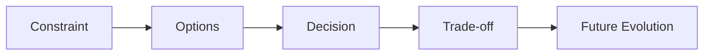

# Module 15 – How to Engineer an End-to-End System Design Walkthrough

## Why This Part Matters

Understanding individual system design concepts is not enough. In interviews and real architecture discussions, the important skill is **how to connect all modules into one clear, structured, end-to-end design conversation**. Module 15 focuses on that full walkthrough skill: requirements, scope, components, data, scaling, failures, security, observability, and trade-offs explained in the right order. 

This module explains **how to run a full system design discussion step by step** so that your thinking looks organized, mature, and interview-ready.

---

# 1) How to Start a System Design Discussion

## Step 1: Clarify the Problem First
Do not jump into architecture immediately.

Start by asking:
- What exactly are we building?
- Who are the users?
- What is the main user journey?
- What scale should we assume?
- What matters most: latency, consistency, availability, cost, or delivery speed?

## Step 2: Define Scope
Most systems are too large to design fully in one discussion. Narrow the scope early.

Examples:
- only MVP flow first
- core user flow first
- exclude internal analytics initially
- focus on backend and APIs first

## Step 3: State Assumptions Clearly
If some information is missing, do not freeze. State reasonable assumptions.

Example:
- “I will assume moderate initial traffic.”
- “I will start with one region unless global scale is required.”
- “I will design the core ordering flow first, then extend.”

## Step 4: Identify Success Criteria
Clarify what good means.

Examples:
- low-latency search
- correct payment handling
- reliable order lifecycle
- high availability
- safe recovery from failure

## Step 5: Start with MVP Thinking
Build the smallest correct design that delivers value first, then scale it.

### Example
For food delivery, initial MVP may include:
- browse menu
- place order
- make payment
- assign delivery partner
- send notifications

Not everything needs to be solved in full advanced form at the beginning.

---

# 2) How to Structure Your End-to-End Thinking

## Step 1: Start from User Flow
Always anchor the design in a real user flow.

Example:
1. user places order
2. payment is processed
3. restaurant confirms order
4. delivery partner is assigned
5. user gets tracking updates
6. order is completed

## Step 2: Break the Flow into System Responsibilities
Ask which responsibilities exist:
- user-facing API
- order lifecycle
- payment handling
- restaurant coordination
- delivery assignment
- notifications
- tracking
- observability
- operations

## Step 3: Group Responsibilities into Components
Convert responsibilities into architectural building blocks.

Possible components:
- API Gateway
- User Service
- Order Service
- Payment Service
- Delivery Service
- Notification Service
- Database
- Cache
- Message Queue / Event Bus

## Step 4: Keep Boundaries Clear
Each component should have a clear purpose and ownership.

## Step 5: Avoid Over-Decomposition Early
Do not split into too many services unless required. A clean modular approach is often enough in first-pass design.

---

# 3) How to Walk Through Requirements Properly

## Step 1: Capture Functional Requirements
These are what the system must do.

Examples:
- place order
- process payment
- update order status
- assign delivery
- show tracking
- send notifications

## Step 2: Capture Non-Functional Requirements
These are how the system should behave.

Examples:
- latency goals
- availability
- consistency
- reliability
- security
- observability
- scalability
- cost sensitivity

## Step 3: Identify Critical Flows
Not every flow is equally important.

Examples:
- payment correctness is critical
- menu browsing may tolerate eventual freshness
- tracking updates may tolerate eventual consistency

## Step 4: Separate Must-Have vs Nice-to-Have
This helps prevent over-engineering.

## Step 5: Reconfirm the Scope
Before continuing, summarize:
- what is included
- what is excluded
- what assumptions are active

### Example
For food delivery, core scope may be:
- order placement
- payment
- delivery assignment
- tracking
- notifications

Excluded initially:
- advanced analytics
- recommendation engine
- cross-region failover

---

# 4) How to Decompose the System

## Step 1: Identify Major Domains
For the food delivery example:
- user domain
- order domain
- payment domain
- delivery domain
- notification domain

## Step 2: Assign Clear Responsibility
Each domain should own specific behavior.

Example:
- Order Service owns order state transitions
- Payment Service owns payment authorization and result
- Delivery Service owns assignment and delivery status
- Notification Service owns messages and delivery of notifications

## Step 3: Decide Service Shape
At interview level, you can start with:
- modular monolith
or
- a few logical services

Choose based on scale and maturity assumptions.

## Step 4: Show Interaction Paths
Explain who calls whom:
- synchronous calls where immediate answer is needed
- asynchronous events where decoupling is acceptable

## Step 5: Mention Ownership Boundaries
Clear ownership improves reliability, maintainability, and scaling.

---

# 5) How to Model Data in the Walkthrough

## Step 1: Identify Core Entities
Examples:
- User
- Restaurant
- MenuItem
- Order
- Payment
- DeliveryTask
- Notification

## Step 2: Identify Critical State
For Order:
- CREATED
- PAYMENT_PENDING
- CONFIRMED
- PREPARING
- OUT_FOR_DELIVERY
- DELIVERED
- CANCELLED

## Step 3: Decide What Needs Strong Correctness
Examples:
- payment status
- order final confirmation
- valid state transitions

## Step 4: Separate Transactional Data from Derived Data
Examples:
- order record is transactional
- user dashboard summary can be derived
- analytics counters can be asynchronous

## Step 5: Explain Storage at High Level
You do not need extreme detail immediately. Start simple:
- primary transactional database
- cache for hot reads if needed
- queue/event system for async workflows

### Example
Order table may include:
- orderId
- userId
- restaurantId
- items
- totalAmount
- status
- createdAt
- updatedAt

Payment record may include:
- paymentId
- orderId
- status
- amount
- providerReference

---

# 6) How to Explain APIs and Flow

## Step 1: Start from Main API
Example:
- `POST /orders`
- `GET /orders/{id}`
- `POST /payments`
- `PATCH /delivery/{id}/status`

## Step 2: Explain Request Flow
For “Place Order”:
1. request reaches API Gateway
2. request is authenticated
3. Order Service validates request
4. Payment Service is called
5. order state is updated
6. event is published
7. delivery and notification flows continue

## Step 3: Distinguish Sync vs Async Clearly
Use sync when:
- caller needs immediate result
- correctness is critical

Use async when:
- decoupling helps
- eventual completion is acceptable

## Step 4: Mention Idempotency Where Needed
Critical writes should be safe under retry.

## Step 5: Explain Failure Behavior
Good interview answers include:
- what happens if payment times out
- what happens if event consumer is down
- what happens if notification fails

---

# 7) How to Handle Scalability Questions

## Step 1: Start with Bottlenecks, Not Random Scaling
Identify what can become hot first:
- read-heavy menu access
- payment dependency latency
- order DB write load
- delivery event queue lag

## Step 2: Scale the Right Component
Examples:
- cache menu/catalog reads
- replicate read-heavy services
- isolate payment service if needed
- scale consumers for async processing

## Step 3: Mention Progressive Scaling
A mature answer evolves:
- start simple
- observe real bottlenecks
- add replicas
- add caching
- split services only when justified

## Step 4: Avoid Premature Sharding
Only introduce partitioning when data volume and access pattern justify it.

## Step 5: Connect Scaling to Trade-offs
Every scale step adds cost or complexity, so say what is gained and what is sacrificed.

---

# 8) How to Handle Reliability and Failure Modes

## Step 1: Name the Failures Explicitly
Examples:
- payment timeout
- duplicate requests
- DB slowdown
- queue backlog
- delivery assignment failure
- notification failure

## Step 2: Protect Critical Paths
Examples:
- idempotency for payments and orders
- retries with backoff
- circuit breakers or fallback where appropriate
- durable event handling
- reconciliation for partial failures

## Step 3: Separate Critical vs Non-Critical Recovery
Examples:
- payment correctness is critical
- notification retry can be asynchronous

## Step 4: Explain Data Integrity
Show:
- valid state transitions
- error categorization
- consistent contracts
- safe retries

## Step 5: Mention Recovery Thinking
A senior answer usually includes:
- rollback strategy
- replay/reconciliation path
- observability during incident response

---

# 9) How to Include Security Properly

## Step 1: Mark Trust Boundaries
Examples:
- client to API
- service to service
- admin tools to production systems

## Step 2: Explain Authentication
Users and services must prove identity.

## Step 3: Explain Authorization
A valid identity must still be checked for allowed actions.

## Step 4: Protect Sensitive Data
Examples:
- encrypt data in transit
- encrypt sensitive storage
- restrict access
- avoid leaking secrets in logs

## Step 5: Secure Internal Communication Too
Internal traffic should not be trusted blindly.

---

# 10) How to Include Observability Properly

## Step 1: Add Logs
Log state changes, failures, retries, and important system events.

## Step 2: Add Metrics
Track:
- throughput
- latency
- error rate
- queue depth
- dependency health

## Step 3: Add Traces
Trace the request across services.

## Step 4: Use Correlation IDs
This links logs and traces across components.

## Step 5: Mention Alerts and Dashboards
Operational readiness is stronger when issues are visible early.

---

# 11) How to Explain Decisions Clearly in Interviews

## Step 1: State the Constraint
Example:
- “Payment requires correctness.”
- “Tracking updates can tolerate slight delay.”
- “Team size is small.”
- “Current scale is moderate.”

## Step 2: Mention Alternatives
Example:
- sync vs async
- monolith vs microservices
- strong vs eventual consistency

## Step 3: Choose and Justify
Example:
“I would use strong consistency for payment confirmation because correctness matters more than availability there.”

## Step 4: State the Trade-off
Example:
“This improves correctness but may slightly reduce flexibility and throughput.”

## Step 5: Mention Future Evolution
Example:
“We can extract delivery into a separate service later if scaling patterns justify it.”

---

# 12) How to Avoid Common End-to-End Design Pitfalls

## Step 1: Do Not Jump into Technology Too Early
First clarify requirements and scope.

## Step 2: Do Not Over-Engineer the First Version
Start with MVP and grow complexity only when justified.

## Step 3: Do Not Ignore Failure Modes
Every serious design needs failure thinking.

## Step 4: Do Not Forget Operations
A good architecture must also be deployable, observable, and recoverable.

## Step 5: Do Not Hide Trade-offs
Interviewers value honest reasoning more than perfect-sounding answers.

---

# 13) Step-by-Step Real-Life Walkthrough (Food Delivery)

## Scenario
Design an end-to-end food delivery ordering system.

### Step 1: Clarify Scope
Assume we are designing:
- browse menu
- place order
- process payment
- assign delivery partner
- track order
- send notifications

### Step 2: Identify Main Flow
1. user selects restaurant and items
2. order request is sent
3. payment is processed
4. restaurant confirms
5. delivery partner is assigned
6. status updates are shown
7. order is delivered

### Step 3: Define Main Components
- API Gateway
- User/Auth Service
- Order Service
- Payment Service
- Delivery Service
- Notification Service
- Primary Database
- Event Bus / Queue
- Cache for hot reads if needed

### Step 4: Define Data Ownership
- Order Service owns order lifecycle
- Payment Service owns payment result
- Delivery Service owns assignment and delivery progression

### Step 5: Define Sync and Async Boundaries
- payment authorization may be synchronous
- notifications and analytics can be asynchronous
- delivery assignment can be event-driven

### Step 6: Define Reliability Controls
- idempotency for create order/payment
- retry with backoff for transient failures
- reconciliation for partial failures
- clear state machine for orders

### Step 7: Define Security
- user authentication at entry
- authorization per role
- encrypted communication
- restricted access to sensitive data

### Step 8: Define Observability
- logs for order state changes
- metrics for order success, payment latency, queue lag
- traces across order → payment → delivery

### Step 9: Define Rollout and Operations
- staging before production
- config externalized
- feature flags for risky changes
- canary or phased rollout for major updates

### Step 10: Explain Trade-offs
- start simpler if current scale is moderate
- split domains further only when independent scaling or ownership demands it
- use strong consistency only where correctness truly requires it

---

# 14) Visual – End-to-End Design Reasoning Flow

```mermaid id="ihw5v2"
flowchart TD
    A[Clarify Requirements] --> B[Define Scope and Assumptions]
    B --> C[Identify Core User Flows]
    C --> D[Decompose Components]
    D --> E[Model Data and APIs]
    E --> F[Handle Scale and Performance]
    F --> G[Handle Reliability and Security]
    G --> H[Add Observability and Operations]
    H --> I[Explain Trade-offs Clearly]
````

---

# 15) Visual – Food Delivery End-to-End Flow

```mermaid id="zj7ylk"
flowchart LR
    U[User App] --> G[API Gateway]
    G --> O[Order Service]
    O --> P[Payment Service]
    O --> E[Event Bus]
    E --> D[Delivery Service]
    E --> N[Notification Service]
    O --> DB[(Order Database)]
    D --> DB2[(Delivery Data)]
```

---

# 16) Visual – Interview Explanation Pattern


```mermaid id="3dqt78"
flowchart LR
    C[Constraint] --> O[Options]
    O --> D[Decision]
    D --> T[Trade-off]
    T --> F[Future Evolution]
```

---

# 17) Common Engineering Mistakes

## Mistake 1: Starting with Tools Instead of Requirements

This makes the design shallow.

## Mistake 2: Skipping Scope Definition

The system becomes too broad and unfocused.

## Mistake 3: Over-Engineering MVP

Complexity rises before it is needed.

## Mistake 4: Ignoring Failures

The architecture looks good only in ideal conditions.

## Mistake 5: Forgetting Security and Operations

The design is incomplete for real production use.

## Mistake 6: No Clear Trade-off Explanation

The answer sounds memorized instead of reasoned.

## Mistake 7: Scaling Everything Blindly

Only actual bottlenecks should be scaled first.

## Mistake 8: Weak Communication Structure

Even good ideas sound weak when explained in random order.

---

# 18) Interview-Ready Answers

## How do you start an end-to-end system design interview?

By clarifying requirements, defining scope and assumptions, and identifying the core user flows before choosing components.

## What is a strong step-by-step design process?

Clarify requirements, define MVP, map core flows, decompose components, model data and APIs, then address scale, reliability, security, observability, and operations.

## How do you explain decisions clearly?

By stating the constraint, comparing alternatives, choosing one option, and explicitly naming the trade-off.

## Why should you design MVP first?

Because it prevents over-engineering and helps build the simplest system that delivers current value correctly.

## What do interviewers value most in an end-to-end walkthrough?

Clear structure, good judgment, correct trade-offs, and awareness of failures and operations. 

---

# 19) One-Line Implementation Summary

To run a strong end-to-end system design walkthrough, move in a clear order from requirements to operations, connect all modules through one coherent user flow, and explain every major decision as a conscious trade-off.

```
```
