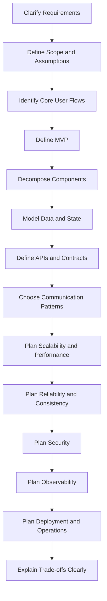
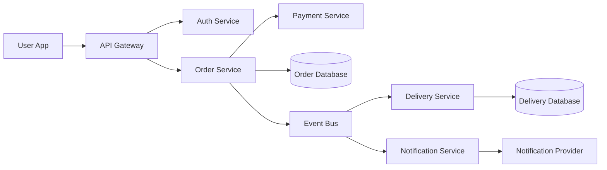
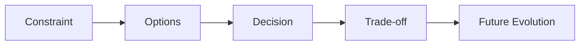

# Module 15 – End-to-End System Design Walkthrough

## Why This Module Is Covered in Depth

Module 15 ties all previous modules into a complete, interview-ready walkthrough. Interviewers evaluate not only your architecture but also how you reason step by step and communicate decisions under constraints. This module builds the ability to run a full system design discussion confidently.

The goal is to demonstrate senior-level thinking: clarify requirements, define scope, choose the right components, handle failures, and explain trade-offs clearly.

---

## 1) Applying All Concepts Together

### WHAT
Applying all concepts together means combining requirements, decomposition, data modeling, scalability, performance, reliability, security, observability, and operations into a single coherent system design.

### WHY
Real systems are not designed in isolation. A good system design must balance multiple dimensions together instead of treating each topic separately.

### WHEN
Use this approach in:
- System design interviews
- Architecture reviews
- Technical planning sessions
- Major system redesign discussions
- Production-readiness evaluations

### Use Case (Food Delivery)
Designing the order lifecycle from placement to delivery, including payment, tracking, notifications, reliability, security, and observability.

### Plain-English Understanding
End-to-end system design is like explaining a complete business journey from start to finish. You do not only say which tools you will use. You explain what the user needs, how the system responds, where data moves, what can fail, how the system scales, and how teams operate it safely.

### Engineering View
A complete system design walkthrough connects:
- Requirements
- Scope
- Core user flows
- System components
- Data model
- API contracts
- Communication patterns
- Scalability strategy
- Performance strategy
- Reliability and fault tolerance
- Consistency and data integrity
- Security and access control
- Observability and monitoring
- Deployment and operations
- Trade-off reasoning

The purpose is not to show every possible detail. The purpose is to show structured thinking and make clear decisions under constraints.

---

## 2) Why End-to-End Walkthrough Matters

### WHAT
An end-to-end walkthrough shows how a system works from user request to final business outcome.

### WHY
Interviewers and architecture reviewers want to see whether you can connect theory to a real system.

### WHEN
Use this whenever a design question asks you to build a full product or platform.

### Plain-English Understanding
A strong answer should sound like a guided tour of the system. The listener should understand:
- What the user does
- Which component handles what
- Where data is stored
- How services communicate
- What happens during failure
- How the system is monitored
- How the system can evolve later

### Example
For a food delivery system, do not start with only “I will use microservices.” Start with the user journey:
1. User opens app
2. User selects restaurant
3. User adds items
4. User places order
5. Payment is processed
6. Restaurant confirms
7. Delivery partner is assigned
8. User tracks order
9. Order is delivered
10. Notifications are sent throughout the journey

Then map this journey to architecture.

---

## 3) Step-by-Step System Design Reasoning

### WHAT
Step-by-step system design reasoning is a structured process that starts with problem framing and ends with operational readiness.

### WHY
Step-by-step reasoning prevents missing critical requirements and makes decisions defensible.

### WHEN
At the start of every system design discussion.

### Use Case Walkthrough Steps
Clarify requirements → Define MVP → Identify flows → Decompose services → Define data model → Choose communication patterns → Plan for scale, failures, security, and observability.

### Plain-English Understanding
Instead of randomly jumping from database to cache to microservices, follow a disciplined order. This makes your answer clear, calm, and professional.

### Engineering View
A strong walkthrough usually follows this order:

1. Clarify requirements
2. Define scope and assumptions
3. Identify core user flows
4. Define MVP
5. Decompose the system
6. Model data and state
7. Define APIs and contracts
8. Choose sync or async communication
9. Address scalability
10. Address performance
11. Address reliability and failures
12. Address consistency and integrity
13. Address security
14. Address observability
15. Address deployment and operations
16. Explain trade-offs clearly

---

## 4) Clarifying Requirements

### WHAT
Requirement clarification means understanding what the system must do and how well it must behave.

### WHY
Without requirements, architecture becomes guesswork.

### WHEN
At the beginning of every system design interview or architecture discussion.

### Functional Requirements
Functional requirements describe what the system should do.

For food delivery:
- Users can browse restaurants and menus
- Users can place orders
- Users can make payments
- Restaurants can accept or reject orders
- Delivery partners can be assigned
- Users can track delivery status
- Notifications are sent for major updates

### Non-Functional Requirements
Non-functional requirements describe quality expectations.

Examples:
- Order placement should be reliable
- Payment should be strongly correct
- Menu browsing should be fast
- Tracking updates should be near real time
- System should handle failures gracefully
- System should be observable
- Sensitive data should be protected

### Common Mistake
Jumping into technology choices before clarifying requirements.

---

## 5) Defining MVP Scope

### WHAT
MVP scope defines the smallest useful version of the system that solves the core problem.

### WHY
Designing everything at once leads to over-engineering and unclear answers.

### WHEN
After requirements clarification and before detailed architecture.

### Food Delivery MVP
A reasonable MVP may include:
- Restaurant/menu browsing
- Order creation
- Payment processing
- Restaurant confirmation
- Delivery assignment
- Order status updates
- Basic notifications

### Out of Initial Scope
The first design may exclude:
- Recommendation engine
- Advanced analytics
- Multi-region active-active architecture
- Complex loyalty programs
- AI-based delivery prediction
- Advanced fraud detection

### Engineering View
MVP does not mean poor design. It means the first version should be simple, correct, and evolvable.

Good MVP design should still include:
- Clear data ownership
- Clean contracts
- Valid state transitions
- Basic security
- Basic observability
- Safe deployment thinking

---

## 6) Identifying Core User Flows

### WHAT
A user flow is the path a user takes to complete a business action.

### WHY
System design should be anchored in real business behavior, not only components.

### WHEN
Before decomposing the architecture.

### Main Food Delivery Flow
```text
User browses menu
↓
User places order
↓
Payment is processed
↓
Restaurant confirms order
↓
Delivery partner is assigned
↓
Order status is updated
↓
User receives notifications
↓
Order is delivered
```

### Engineering View
Each user flow reveals:
- Required APIs
- Required data
- Required services
- Synchronous operations
- Asynchronous operations
- Failure points
- Consistency needs
- Observability needs

---

## 7) Decomposing the System

### WHAT
System decomposition means splitting the system into logical responsibilities or components.

### WHY
Clear decomposition makes the design understandable, maintainable, and scalable.

### WHEN
After identifying user flows and requirements.

### Core Components
For a food delivery system:
- API Gateway
- Auth/User Service
- Restaurant/Menu Service
- Order Service
- Payment Service
- Delivery Service
- Notification Service
- Event Bus or Queue
- Primary Database
- Cache
- Observability Platform

### Engineering View
Each component should have clear ownership.

Example:
- Order Service owns order lifecycle
- Payment Service owns payment state
- Delivery Service owns delivery assignment and updates
- Notification Service owns communication with users
- Restaurant/Menu Service owns restaurant and menu data

### Important Principle
Do not over-decompose too early. In an early-stage system, a modular monolith may be better than many microservices. In a mature high-scale system, separate services may become justified.

---

## 8) Data Modeling and State Thinking

### WHAT
Data modeling defines the important entities, relationships, and state transitions in the system.

### WHY
Poor data modeling causes integrity problems, unclear ownership, and difficult scaling.

### WHEN
After identifying services and flows.

### Core Entities
- User
- Restaurant
- MenuItem
- Order
- OrderItem
- Payment
- DeliveryTask
- Notification

### Order State Example
```text
CREATED
↓
PAYMENT_PENDING
↓
CONFIRMED
↓
PREPARING
↓
OUT_FOR_DELIVERY
↓
DELIVERED
```

Possible alternate states:
- PAYMENT_FAILED
- CANCELLED
- REFUNDED

### Engineering View
Order lifecycle must be controlled by explicit state transitions.

Examples:
- CREATED → PAYMENT_PENDING is valid
- PAYMENT_PENDING → CONFIRMED is valid after payment success
- CONFIRMED → CANCELLED may be valid only before preparation starts
- DELIVERED → PREPARING should not be allowed

### Data Integrity Focus
Critical data paths include:
- Payment result
- Order confirmation
- Delivery assignment
- Refund status
- Order completion

---

## 9) API and Contract Thinking

### WHAT
APIs and contracts define how clients and services interact.

### WHY
Clear contracts prevent confusion, misuse, and integration failures.

### WHEN
When defining system boundaries and service communication.

### Example APIs
```text
POST /orders
GET /orders/{orderId}
POST /orders/{orderId}/payment
PATCH /orders/{orderId}/status
POST /delivery/assignments
PATCH /delivery/{deliveryId}/status
```

### Engineering View
A good API contract defines:
- Request fields
- Response fields
- Error codes
- Idempotency behavior
- Retry behavior
- Authorization requirements
- Validation rules

### Example Contract Decision
`POST /orders` should support an idempotency key so duplicate requests do not create duplicate orders.

---

## 10) Communication Patterns

### WHAT
Communication patterns define whether services call each other synchronously or communicate asynchronously.

### WHY
The wrong communication pattern can make systems slow, tightly coupled, or unreliable.

### WHEN
When designing interactions between components.

### Synchronous Communication
Use when the caller needs an immediate answer.

Example:
- Order Service calls Payment Service for payment authorization

### Asynchronous Communication
Use when work can continue in the background.

Example:
- OrderConfirmed event triggers Notification Service
- OrderConfirmed event triggers Delivery Service
- Analytics consumes order events later

### Engineering View
Use synchronous communication carefully on critical paths. Use events where decoupling and resilience are more important than immediate response.

---

## 11) Scalability Thinking

### WHAT
Scalability thinking identifies how the system will handle growth in traffic, data, and users.

### WHY
Systems must scale the right parts, not blindly scale everything.

### WHEN
After baseline architecture is clear.

### Likely Bottlenecks
In food delivery:
- Restaurant/menu reads
- Order writes during peak time
- Payment gateway latency
- Delivery assignment processing
- Notification bursts
- Tracking updates

### Scaling Options
- Cache popular menu data
- Use read replicas for read-heavy data
- Scale stateless services horizontally
- Increase event consumers for async workloads
- Optimize database indexes before sharding
- Use queue-based buffering for spikes

### Senior-Level Thinking
Do not start with sharding or complex microservices unless scale justifies it. Start simple, observe bottlenecks, and scale progressively.

---

## 12) Performance Thinking

### WHAT
Performance thinking focuses on latency, throughput, and efficient resource usage.

### WHY
Slow systems hurt user experience and business conversion.

### WHEN
During design of user-facing and high-volume flows.

### Performance-Sensitive Areas
- Menu browsing
- Search results
- Order placement
- Payment confirmation
- Tracking updates

### Optimization Approaches
- Caching hot data
- Reducing unnecessary network calls
- Database indexing
- Async processing for non-critical tasks
- Payload size reduction
- Connection pooling

### Trade-off Example
Caching menu data improves speed but introduces cache invalidation complexity.

---

## 13) Reliability and Failure Handling

### WHAT
Reliability means the system continues to work correctly even when some parts fail.

### WHY
Distributed systems fail partially, not always completely.

### WHEN
During design, not after incidents.

### Failure Scenarios
- Payment Service times out
- Order request is retried
- Notification Service is down
- Delivery assignment is delayed
- Database latency increases
- Queue consumer fails

### Protection Mechanisms
- Idempotency keys
- Retry with backoff
- Circuit breaker where needed
- Durable queues
- Dead-letter queues
- Reconciliation jobs
- Graceful degradation
- Clear error categorization

### Example
If payment succeeds but order confirmation fails due to timeout, reconciliation should detect and repair the mismatch.

---

## 14) Consistency and Data Integrity

### WHAT
Consistency and data integrity ensure that data remains correct across services and workflows.

### WHY
Incorrect data can be worse than temporary downtime.

### WHEN
For critical business operations such as orders, payments, refunds, and delivery status.

### Strong Consistency Needed
- Payment confirmation
- Order final status
- Refund processing
- Inventory or availability checks where correctness is critical

### Eventual Consistency Acceptable
- Delivery tracking updates
- Notifications
- Analytics
- User dashboard summaries

### Example Decision
Payment and order confirmation need stronger consistency because duplicate charges or incorrect order states directly harm users. Tracking updates may be eventually consistent because a small delay is acceptable.

---

## 15) Security and Access Control

### WHAT
Security protects users, data, and system behavior from misuse.

### WHY
A system is incomplete if it works functionally but exposes sensitive data or allows unauthorized actions.

### WHEN
Across all entry points and service boundaries.

### Security Considerations
- Authentication
- Authorization
- Trust boundaries
- Least privilege
- Encryption in transit
- Encryption at rest where needed
- Secure service-to-service communication
- Sensitive data masking in logs

### Food Delivery Example
A delivery partner may be authenticated as a valid user but should only be authorized to update assigned deliveries.

### Engineering View
Do not trust client-supplied roles or IDs. Always validate permissions server-side.

---

## 16) Observability and Monitoring

### WHAT
Observability makes the system understandable through logs, metrics, and traces.

### WHY
Without observability, engineers depend on guesswork during failures.

### WHEN
Designed from the beginning.

### Logs
Capture discrete events:
- Order created
- Payment failed
- Status changed
- Retry attempted

### Metrics
Track behavior over time:
- Order success rate
- Payment failure rate
- API latency
- Queue depth
- Error rate

### Traces
Track a request across services:
- API Gateway
- Order Service
- Payment Service
- Delivery Service
- Notification Service

### Correlation IDs
A correlation ID connects logs and traces across components so one order can be debugged end to end.

---

## 17) Deployment and Operational Readiness

### WHAT
Operational readiness means the system can be safely deployed, monitored, and recovered in production.

### WHY
Good architecture can still fail due to poor deployment or misconfiguration.

### WHEN
Before production release and during ongoing operations.

### Operational Considerations
- Environment separation
- Externalized configuration
- Secret management
- Feature flags
- Canary rollout
- Rollback plan
- Dashboards and alerts
- Runbooks
- Reconciliation procedures

### Example
A new order workflow can be released behind a feature flag, enabled for a small percentage of traffic, monitored closely, and disabled quickly if errors increase.

---

## 18) Explaining Decisions Clearly

### WHAT
Explaining decisions clearly means communicating architectural choices as constraints, options, decisions, and trade-offs.

### WHY
Interviewers judge clarity and maturity through decision explanation, not just component selection.

### WHEN
Throughout the interview, especially when comparing alternatives.

### Decision Explanation Pattern
```text
Constraint
↓
Options
↓
Decision
↓
Trade-off
↓
Future evolution
```

### Example
“Payment requires correctness, so I will keep payment authorization synchronous and strongly validated. The trade-off is slightly higher latency, but correctness matters more than speed here. Notifications can be asynchronous because delayed notification is acceptable.”

### Senior-Level Signal
A senior engineer does not only say what they choose. They explain why it fits the current constraints and what compromise they are accepting.

---

## 19) Common Design Pitfalls and How to Avoid Them

### WHAT
Common design pitfalls are mistakes that make systems fragile or interview answers weak.

### WHY
Avoiding these pitfalls shows engineering maturity.

### WHEN
During decomposition, data modeling, scaling, integration, and trade-off discussions.

### Pitfall 1: Jumping into Technology Too Early
Avoid starting with Kafka, Redis, Kubernetes, or microservices before requirements are clear.

### Pitfall 2: Over-Engineering the MVP
Avoid adding complexity before current requirements justify it.

### Pitfall 3: Ignoring Failure Modes
Every real system must explain what happens when dependencies fail.

### Pitfall 4: Scaling Everything Blindly
Scale the bottleneck, not every component.

### Pitfall 5: Ignoring Security
Every design should include trust boundaries, authentication, authorization, and data protection.

### Pitfall 6: Ignoring Observability
A system that cannot be debugged is not production-ready.

### Pitfall 7: Hiding Trade-offs
Every design choice has a cost. Say it clearly.

---

## 20) Complete Food Delivery End-to-End Walkthrough

### Step 1: Clarify Requirements
We need to support:
- Menu browsing
- Order placement
- Payment
- Restaurant confirmation
- Delivery assignment
- Tracking
- Notifications

### Step 2: Define MVP
The MVP includes only the core order lifecycle and excludes advanced recommendations, analytics, and multi-region complexity.

### Step 3: Identify Main Flow
```text
User → API Gateway → Order Service → Payment Service → Order Confirmation → Event Bus → Delivery and Notification Services
```

### Step 4: Define Components
- API Gateway for entry point control
- Auth Service for identity
- Order Service for order lifecycle
- Payment Service for payment processing
- Delivery Service for delivery assignment
- Notification Service for user communication
- Database for transactional records
- Event Bus for async workflows
- Cache for hot read paths

### Step 5: Define Data Model
Core entities:
- User
- Restaurant
- MenuItem
- Order
- Payment
- DeliveryTask
- Notification

### Step 6: Define Communication
- Sync payment authorization
- Async notification
- Async delivery assignment where acceptable
- Event-driven analytics later

### Step 7: Define Scalability
- Cache popular menu reads
- Scale stateless services horizontally
- Add consumers for event processing
- Optimize database before sharding

### Step 8: Define Reliability
- Idempotency for order and payment
- Retry with backoff
- Durable queues
- Reconciliation for partial failures

### Step 9: Define Security
- Authenticate users
- Authorize actions by role and ownership
- Encrypt communication
- Restrict sensitive data access

### Step 10: Define Observability
- Logs for state changes
- Metrics for latency and success rates
- Traces across services
- Correlation IDs for debugging

### Step 11: Define Operations
- Development, testing, staging, production separation
- Externalized configuration
- Feature flags
- Canary rollout
- Rollback plan

### Step 12: Explain Trade-offs
Start with the simplest architecture that satisfies current needs. Add microservices, sharding, multi-region, or advanced event patterns only when scale and operational maturity justify them.

---

## 21) Visual – End-to-End System Design Reasoning Flow


```mermaid
flowchart TD
    A[Clarify Requirements] --> B[Define Scope and Assumptions]
    B --> C[Identify Core User Flows]
    C --> D[Define MVP]
    D --> E[Decompose Components]
    E --> F[Model Data and State]
    F --> G[Define APIs and Contracts]
    G --> H[Choose Communication Patterns]
    H --> I[Plan Scalability and Performance]
    I --> J[Plan Reliability and Consistency]
    J --> K[Plan Security]
    K --> L[Plan Observability]
    L --> M[Plan Deployment and Operations]
    M --> N[Explain Trade-offs Clearly]
```

---

## 22) Visual – Food Delivery Architecture Flow


```mermaid
flowchart LR
    U[User App] --> G[API Gateway]
    G --> A[Auth Service]
    G --> O[Order Service]
    O --> P[Payment Service]
    O --> DB[(Order Database)]
    O --> E[Event Bus]
    E --> D[Delivery Service]
    E --> N[Notification Service]
    D --> DD[(Delivery Database)]
    N --> NS[Notification Provider]
```

---

## 23) Visual – Decision Explanation Pattern


```mermaid
flowchart LR
    C[Constraint] --> O[Options]
    O --> D[Decision]
    D --> T[Trade-off]
    T --> F[Future Evolution]
```

---

## 24) Interview Question Bank with Answers

### Q: How do you start an end-to-end system design interview?
**A:** By clarifying requirements, defining scope and assumptions, and identifying core user flows.

### Q: What is your step-by-step system design process?
**A:** Clarify requirements → define MVP → decompose components → model data → define APIs and flows → address scale, performance, reliability, security, and observability.

### Q: How do you explain architectural decisions clearly?
**A:** By stating constraints, evaluating options, and explaining the chosen trade-off.

### Q: Why should you design MVP first?
**A:** To avoid over-engineering and deliver value quickly.

### Q: What is a common pitfall in system design interviews?
**A:** Jumping into technology choices before clarifying requirements.

### Q: How do you avoid missing critical requirements?
**A:** Use a structured checklist and validate assumptions with the interviewer.

### Q: How do you handle follow-up scaling questions?
**A:** Identify bottlenecks, scale the right component, and explain trade-offs.

### Q: What do interviewers value most in end-to-end walkthroughs?
**A:** Clear reasoning, correct trade-offs, and operational awareness.

### Q: How do you ensure reliability in end-to-end design?
**A:** Design for failures, add redundancy, and isolate failures.

### Q: How do you ensure performance in end-to-end design?
**A:** Measure latency sources, optimize bottlenecks, and use caching appropriately.

### Q: How do you handle data consistency concerns?
**A:** Use strong consistency where correctness is critical, eventual where acceptable.

### Q: How do you incorporate security?
**A:** Define trust boundaries, enforce authentication/authorization, and secure communication.

### Q: How do you incorporate observability?
**A:** Add logs, metrics, traces, and correlation IDs for debuggability.

### Q: What is over-engineering?
**A:** Adding complexity without current requirements.

### Q: What is premature optimization?
**A:** Optimizing before identifying real bottlenecks.

### Q: How do you respond when requirements change mid-interview?
**A:** Update scope and explain what components are affected and why.

### Q: How do you design for operations?
**A:** Use environment separation, configuration management, and safe rollouts.

### Q: How do you avoid common design pitfalls?
**A:** By using structured reasoning and validating assumptions.

### Q: What indicates senior-level system design performance?
**A:** Strong structure, clear decisions, and awareness of failure and operations.

### Q: Summarize Module 15 in one sentence.
**A:** End-to-end system design is structured reasoning plus clear communication under constraints.

---

## 25) One-Line Summary

End-to-end system design is the disciplined process of moving from requirements to architecture, connecting every major design area, and explaining decisions clearly through constraints, options, trade-offs, and future evolution.

---

## 26) Final Outcome

After completing this module, learners should be able to run a complete system design walkthrough confidently by:
- Clarifying requirements before choosing tools
- Defining MVP and scope clearly
- Mapping user flows to architecture
- Designing components, APIs, data, and communication patterns
- Addressing scale, performance, reliability, consistency, security, observability, and operations
- Explaining trade-offs in a senior-level interview style
