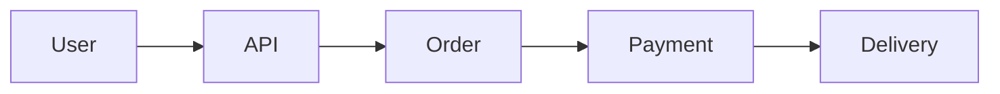
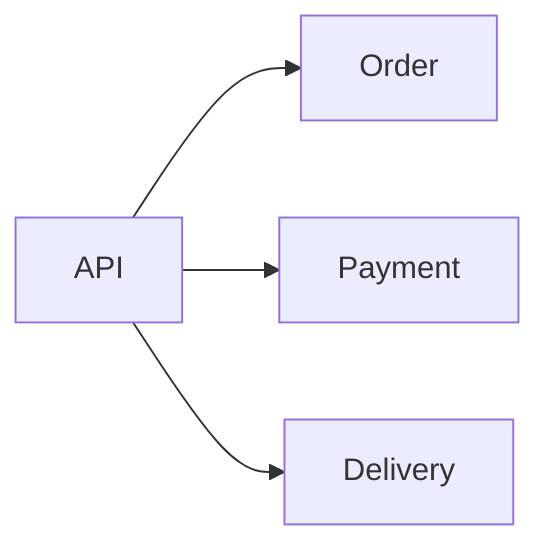
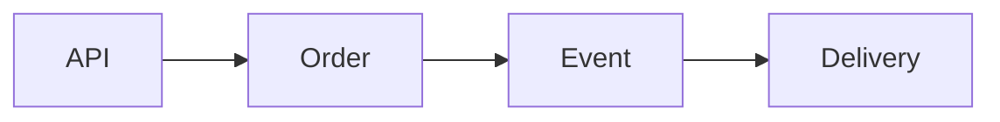
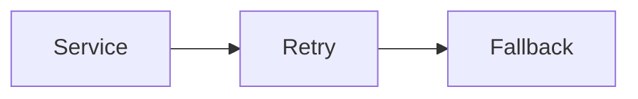
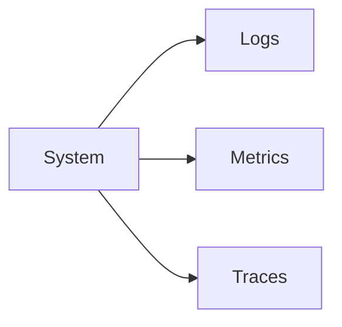
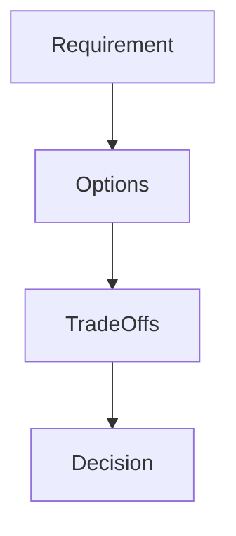
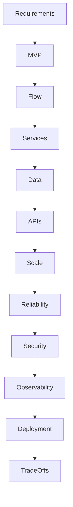

Got it 👍 — the issue is happening because of the code block formatting.
I’ll give you a **clean, copy-friendly version (no IDs, no breaking tags)** so you can paste directly into VS Code.

---

# 📁 FILE: `How.md` (Module 15 – CLEAN COPY VERSION)

👉 **Just copy everything below ⬇️**

````md
%%{init: {
  "theme": "base",
  "themeVariables": {
    "primaryColor": "#FFF3E0",
    "primaryBorderColor": "#FB8C00",
    "lineColor": "#FB8C00"
  }
}}%%

# 📘 Module 15 – HOW to Do End-to-End System Design (Interview Playbook)

---

# 🎯 Goal of This README

Learn how to handle a full system design interview step-by-step with clarity and confidence.

---

# 1️⃣ HOW to Start the Interview

## Step 1: Clarify Requirements

Ask:
- What problem are we solving?
- Who are the users?
- What scale?
- What constraints?

```mermaid
flowchart TD
    Problem --> Questions --> Requirements
````

👉 Rule: Never start designing before understanding the problem

---

# 2️⃣ HOW to Define MVP

## Step 2: Define Core Features

Focus on:

* essential functionality
* minimal working system

Example (Food Delivery):

* place order
* payment
* delivery

```mermaid
flowchart LR
    User --> Order --> Payment --> Delivery
```

👉 Rule: Start small, expand later

---

# 3️⃣ HOW to Identify Core Flows

## Step 3: Define User Journey



👉 Rule: System design = flow design

---

# 4️⃣ HOW to Decompose System

## Step 4: Break into Services

* Order Service
* Payment Service
* Delivery Service
* Notification Service



👉 Rule: Divide by responsibility

---

# 5️⃣ HOW to Design Data Model

## Step 5: Define Data Ownership

* Order Service → order data
* Payment Service → payment data

👉 Rule: Each service owns its data

---

# 6️⃣ HOW to Define APIs & Communication

## Step 6: Choose Communication Style

* sync → user actions
* async → background



👉 Rule: Use async for scalability

---

# 7️⃣ HOW to Handle Scalability

## Step 7: Identify Bottlenecks

* DB
* API
* network

Solutions:

* caching
* load balancing

👉 Rule: Scale bottlenecks only

---

# 8️⃣ HOW to Handle Failures

## Step 8: Design for Failure

* retries
* timeouts
* fallback



👉 Rule: Failure is normal

---

# 9️⃣ HOW to Ensure Consistency

## Step 9: Choose Model

* strong → payments
* eventual → tracking

👉 Rule: Not everything needs strong consistency

---

# 🔟 HOW to Add Security

## Step 10: Protect System

* authentication
* authorization
* encryption

👉 Rule: Never trust input

---

# 1️⃣1️⃣ HOW to Add Observability

## Step 11: Monitor

* logs
* metrics
* traces



👉 Rule: If you can’t observe it, you can’t fix it

---

# 1️⃣2️⃣ HOW to Handle Deployment

## Step 12: Safe Deployment

* staging
* canary
* rollback

👉 Rule: Always have rollback

---

# 1️⃣3️⃣ HOW to Explain Trade-offs

## Step 13: Communicate Clearly

Template:

1. requirement
2. options
3. trade-offs
4. decision



👉 Rule: Explain WHY

---

# 1️⃣4️⃣ FULL SYSTEM FLOW



---

# 1️⃣5️⃣ Common Mistakes

❌ Jumping to tech
❌ Over-engineering
❌ Ignoring failures
❌ No trade-offs

---

# 🧠 Final Mental Model

Think → Structure → Design → Justify → Iterate

---

# 🚀 One-Line Summary

Great system design = structured thinking + clear reasoning


