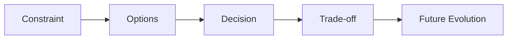

# Module 15 – How to Run an End-to-End System Design Walkthrough in Real Interviews

## Why This Part Matters

Knowing individual system design topics is not enough. In real interviews and architecture discussions, the real skill is **how to connect all concepts into one complete, structured, and confident walkthrough**.

This module explains **how to approach an end-to-end system design discussion step by step** so that you can clarify requirements, design the right scope, choose the right components, explain trade-offs clearly, and show senior-level thinking throughout the conversation. :contentReference[oaicite:0]{index=0}

---

# 1) How to Start the Discussion Correctly

## Step 1: Clarify the Problem
Never jump directly into architecture.

First clarify:
- What exactly are we designing?
- Who are the main users?
- What is the primary user journey?
- What scale should we assume?
- What matters most: correctness, speed, availability, or cost?

## Step 2: Define Scope
A full system can be too large. Narrow the design to the most important part first.

Examples:
- core ordering flow first
- MVP first
- backend first
- exclude analytics initially
- exclude internal tooling initially

## Step 3: State Assumptions Clearly
If details are missing, make reasonable assumptions and say them clearly.

Examples:
- moderate starting traffic
- one primary region
- mobile and web clients
- focus on core order lifecycle first

## Step 4: Identify the Most Important Success Criteria
Examples:
- order placement must be correct
- payment must be reliable
- tracking should feel responsive
- failures should be recoverable

## Step 5: Start with MVP Thinking
Design the minimum useful system first, then extend.

This prevents over-engineering and keeps the conversation structured.

---

# 2) How to Build the Walkthrough Flow

## Step 1: Start from the User Journey
Use one real flow as the backbone of the design.

For food delivery:
1. user browses menu
2. user places order
3. payment is processed
4. restaurant accepts order
5. delivery partner is assigned
6. notifications are sent
7. user tracks delivery
8. order is completed

## Step 2: Break the Journey into Responsibilities
Ask which responsibilities exist:
- authentication
- order creation
- payment handling
- restaurant coordination
- delivery assignment
- notifications
- tracking
- observability
- operations

## Step 3: Convert Responsibilities into Components
Examples:
- API Gateway
- Auth Service
- Order Service
- Payment Service
- Delivery Service
- Notification Service
- Database
- Cache
- Queue or Event Bus

## Step 4: Keep Component Boundaries Clear
Every component should own one clear business responsibility.

## Step 5: Avoid Too Many Components Too Early
Start simple unless scale or team structure clearly demands more decomposition.

---

# 3) How to Cover Requirements Properly

## Step 1: List Functional Requirements
Examples:
- browse menus
- place order
- process payment
- assign delivery partner
- update order status
- send notifications
- track delivery

## Step 2: List Non-Functional Requirements
Examples:
- low latency for browsing
- strong correctness for payment
- high reliability for order lifecycle
- observability for debugging
- secure access control
- safe deployment and operations

## Step 3: Identify Critical Flows
Not every flow needs the same treatment.

Examples:
- payment needs stronger correctness
- delivery tracking can tolerate eventual consistency
- notifications can be asynchronous

## Step 4: Separate Must-Have and Nice-to-Have
This helps you define MVP properly.

## Step 5: Restate Scope Before Moving Forward
This shows structure and prevents missing key assumptions.

---

# 4) How to Design the MVP First

## Step 1: Focus on Core Value Delivery
For food delivery, MVP may include:
- browse restaurant menu
- create order
- process payment
- confirm order
- assign delivery
- update status
- notify user

## Step 2: Exclude Advanced Features Initially
Examples:
- recommendation engine
- detailed analytics
- multi-region disaster recovery
- dynamic pricing intelligence
- advanced fraud platform

## Step 3: Keep the First Version Simple but Correct
A simple design that works reliably is stronger than an advanced design that is hard to explain and operate.

## Step 4: Preserve Evolution Paths
Even MVP should not be messy. Keep:
- clear contracts
- clean boundaries
- simple state models
- externalized configuration

## Step 5: Mention Future Extension
This shows maturity without overbuilding the first version.

---

# 5) How to Decompose Services or Modules

## Step 1: Identify Business Domains
For this use case:
- user domain
- order domain
- payment domain
- delivery domain
- notification domain

## Step 2: Map Domain Ownership
Examples:
- Order Service owns order lifecycle
- Payment Service owns payment state
- Delivery Service owns delivery assignment and updates
- Notification Service owns outbound messages

## Step 3: Decide Deployment Style
Based on scale and team maturity, you may choose:
- modular monolith first
or
- a few logical services

Explain why.

## Step 4: Show Interaction Between Components
Examples:
- Order Service calls Payment Service synchronously
- Order Service publishes event after confirmation
- Delivery and Notification consume events asynchronously

## Step 5: Explain Why This Shape Fits the Current Stage
This is where trade-off thinking appears.

---

# 6) How to Model Data and State

## Step 1: Identify Core Entities
Examples:
- User
- Restaurant
- MenuItem
- Order
- Payment
- DeliveryTask
- Notification

## Step 2: Define Important Order States
Example:
- CREATED
- PAYMENT_PENDING
- CONFIRMED
- PREPARING
- OUT_FOR_DELIVERY
- DELIVERED
- CANCELLED

## Step 3: Separate Transactional and Derived Data
Examples:
- Order state is transactional
- dashboard summaries are derived
- analytics counters are asynchronous

## Step 4: Protect Critical Data Paths
Examples:
- payment results
- order confirmation
- valid state transitions
- duplicate request handling

## Step 5: Keep the Data Model Interview-Friendly
Do not drown in schema detail. Show the important entities, keys, and relationships.

---

# 7) How to Explain the Main Request Flow

## Step 1: Start with the User Action
Example: user places an order.

## Step 2: Walk Through the Request Step by Step
1. request reaches API Gateway
2. authentication happens
3. Order Service validates payload
4. payment is processed
5. order state is updated
6. confirmation event is published
7. delivery assignment begins
8. notification is sent

## Step 3: Distinguish Synchronous and Asynchronous Parts
Use synchronous flow when immediate answer is needed.
Use asynchronous flow when decoupling or background processing is acceptable.

## Step 4: Mention Idempotency for Critical Writes
Important for:
- create order
- create payment
- retries after timeout

## Step 5: Explain Failure Points
Show what happens if:
- payment fails
- delivery assignment is delayed
- notification consumer is down

A structured design process is important because it prevents missing critical requirements and makes decisions defensible. :contentReference[oaicite:1]{index=1}

---

# 8) How to Address Scale During the Walkthrough

## Step 1: Identify Likely Bottlenecks
Examples:
- menu read traffic
- payment latency
- order database writes
- queue backlog
- delivery assignment spikes

## Step 2: Scale the Hot Path, Not Everything
Examples:
- caching for hot menu reads
- read replicas for reporting
- more consumers for delivery events
- isolate payment service if dependency load grows

## Step 3: Scale in Stages
Start with:
- simple database
- simple service boundaries
- limited async flows

Then add:
- caching
- replicas
- queue scaling
- service extraction
only when needed

## Step 4: Avoid Premature Sharding
Only shard when clear data size or throughput bottlenecks justify it.

## Step 5: Explain Trade-offs of Every Scale Step
Scaling usually adds:
- cost
- operational overhead
- debugging complexity

---

# 9) How to Address Reliability and Data Correctness

## Step 1: Identify Failure Modes
Examples:
- payment timeout
- duplicate request
- database slowdown
- message queue lag
- service crash
- third-party dependency failure

## Step 2: Protect the Critical Flow
Examples:
- idempotency keys
- retries with backoff
- state transition rules
- durable event processing
- reconciliation for partial failures

## Step 3: Separate Critical and Non-Critical Behavior
Examples:
- payment correctness is critical
- notification delay is less critical

## Step 4: Explain Consistency Choices
Examples:
- strong consistency for payment/order confirmation
- eventual consistency for user tracking or analytics

## Step 5: Mention Recovery Thinking
Examples:
- rollback path
- replay path
- reconciliation job
- dead-letter queue for failed messages

---

# 10) How to Include Security in the Walkthrough

## Step 1: Mark Trust Boundaries
Examples:
- mobile app to API
- service to service
- admin tool to backend

## Step 2: Explain Authentication
Users and services must prove identity.

## Step 3: Explain Authorization
A delivery partner may be authenticated but should only update assigned deliveries.

## Step 4: Protect Sensitive Data
Examples:
- encrypt in transit
- encrypt at rest where needed
- restrict internal access
- avoid sensitive logging

## Step 5: Mention Secure Service Communication
Internal traffic should also be validated and protected.

---

# 11) How to Include Observability and Operations

## Step 1: Add Logs
Examples:
- order status changes
- payment failures
- retry attempts
- delivery assignment events

## Step 2: Add Metrics
Examples:
- order throughput
- payment success rate
- API error rate
- queue lag
- p95/p99 latency

## Step 3: Add Traces
Trace a request from user entry point through payment and delivery path.

## Step 4: Use Correlation IDs
This makes debugging across services easier.

## Step 5: Mention Rollout and Deployment Safety
Examples:
- staging validation
- externalized config
- feature flags
- canary rollout
- rollback plan

---

# 12) How to Explain Decisions Clearly During the Interview

## Step 1: State the Constraint
Examples:
- correctness matters most in payment
- team size is still small
- traffic is moderate today
- speed of delivery matters

## Step 2: Mention Alternatives
Examples:
- monolith vs microservices
- sync vs async
- strong vs eventual consistency

## Step 3: Choose One Option
Say what you would do now.

## Step 4: State the Trade-off Explicitly
Examples:
- simpler deployment now, less independent scaling later
- stronger correctness here, lower flexibility there
- lower cost now, more future migration later

## Step 5: Mention Evolution Path
Show how the design can grow later if scale or requirements change.

Interviewers judge not only what you choose, but how clearly you explain constraints, options, and trade-offs. :contentReference[oaicite:2]{index=2}

---

# 13) How to Handle Requirement Changes Mid-Interview

## Step 1: Do Not Panic
Changing requirements is normal in system design interviews.

## Step 2: Reframe the Scope
Example:
- “If global scale is now required, I would revisit data replication and region strategy.”
- “If real-time tracking becomes critical, I would strengthen streaming and update pipelines.”

## Step 3: Identify Which Components Are Affected
Show exactly what changes:
- APIs
- storage
- communication patterns
- observability
- deployment strategy

## Step 4: Explain Trade-offs Again
Requirement changes often change design priorities.

## Step 5: Keep the Same Structure
Even after changes, continue using the same reasoning pattern.

---

# 14) How to Avoid Common Interview Pitfalls

## Step 1: Do Not Start with Tool Names
Start with requirements, not Kafka, Redis, or microservices.

## Step 2: Do Not Skip MVP
A first version must be clear before advanced scaling.

## Step 3: Do Not Ignore Failure Modes
A design is incomplete if it works only in happy-path scenarios.

## Step 4: Do Not Forget Operations
A good design must also be deployable, observable, and recoverable.

## Step 5: Do Not Hide Trade-offs
Senior answers always acknowledge what is being sacrificed.

Common pitfalls include premature optimization, over-engineering, and ignoring failure modes, all of which weaken both real systems and interview performance. :contentReference[oaicite:3]{index=3}

---

# 15) Step-by-Step Real-Life Example (Food Delivery)

## Scenario
Design an end-to-end order lifecycle system.

### Step 1: Clarify the Goal
We need:
- menu browsing
- order placement
- payment
- delivery assignment
- order tracking
- notifications

### Step 2: Define Core Flow
1. user selects items
2. request reaches backend
3. order is created
4. payment is processed
5. order is confirmed
6. event is published
7. delivery is assigned
8. user gets updates

### Step 3: Define Main Components
- API Gateway
- Auth Service
- Order Service
- Payment Service
- Delivery Service
- Notification Service
- Primary Database
- Event Bus

### Step 4: Define Data and State
- orderId
- paymentId
- deliveryTaskId
- order states
- payment states
- delivery states

### Step 5: Define Communication Model
- sync for payment decision
- async for notifications and delivery workflows

### Step 6: Define Reliability Measures
- idempotency
- retries with backoff
- state validation
- reconciliation jobs

### Step 7: Define Security and Observability
- auth and authorization
- logs, metrics, traces
- correlation IDs
- alerts and dashboards

### Step 8: Define Rollout Safety
- staging first
- config management
- feature flags
- gradual rollout
- fast rollback

### Step 9: Explain Trade-offs
- start simpler if scale is moderate
- add complexity only where real need exists
- keep strong consistency only where correctness matters most

---

# 16) Visual – End-to-End Design Reasoning

```mermaid id="j3rvsm"
flowchart TD
    A[Clarify Requirements] --> B[Define Scope and Assumptions]
    B --> C[Identify Core Flows]
    C --> D[Decompose Components]
    D --> E[Model Data and APIs]
    E --> F[Handle Scale and Reliability]
    F --> G[Add Security and Observability]
    G --> H[Plan Operations and Rollout]
    H --> I[Explain Trade-offs Clearly]
````

---

# 17) Visual – Food Delivery Walkthrough

```mermaid id="44ifqr"
flowchart LR
    U[User App] --> G[API Gateway]
    G --> O[Order Service]
    O --> P[Payment Service]
    O --> E[Event Bus]
    E --> D[Delivery Service]
    E --> N[Notification Service]
    O --> DB[(Order Database)]
```

---

# 18) Visual – Interview Explanation Pattern


```mermaid id="chjqc1"
flowchart LR
    C[Constraint] --> O[Options]
    O --> D[Decision]
    D --> T[Trade-off]
    T --> F[Future Evolution]
```

---

# 19) Interview-Ready Answers

## How do you start an end-to-end system design interview?

By clarifying requirements, defining scope and assumptions, and identifying the core user flow before choosing architecture.

## What is a strong step-by-step design process?

Clarify requirements, define MVP, identify main flows, decompose components, model data and APIs, then address scale, reliability, security, observability, and operations. 

## How do you explain architectural decisions clearly?

By stating constraints, discussing alternatives, choosing one option, and naming the trade-off explicitly. 

## Why should you design MVP first?

Because it avoids over-engineering and helps deliver the simplest correct solution first. 

## What do interviewers value most in an end-to-end walkthrough?

Clear reasoning, correct trade-offs, and operational awareness. 

---

# 20) One-Line Implementation Summary

To run a strong end-to-end system design walkthrough, move in a disciplined order from requirements to rollout, connect every design choice back to the user flow, and explain each major decision as a conscious trade-off under constraints.

```
```
