````md
# 📘 Module 3 – Data Flow and Communication Patterns

---

# 🎯 Why This Module Matters

Module 3 focuses on how systems communicate and exchange data.

Most large-scale system failures are not caused by bad databases or bad code.  
They usually happen because of:

- wrong communication patterns
- unclear ownership
- poor handling of failures
- misunderstood data movement

This module helps you choose the right communication model based on:

- latency
- reliability
- scalability
- failure tolerance

---

## 🧠 Real-Life Memory Hook

Think of a **food delivery system**:

- Customer places order
- App validates request
- Kitchen prepares food
- Delivery partner gets assignment
- User receives updates

If communication is poor, the whole system becomes confusing and unreliable.

---


# 1️⃣ Synchronous vs Asynchronous Communication

## ✅ WHAT

* **Synchronous communication** means the caller waits until the response comes back.
* **Asynchronous communication** means the caller does not wait and the work continues in the background.

---

## 🎯 WHY

### Synchronous communication

* simple to understand
* easy for direct user interactions
* but increases coupling
* increases latency
* can create cascading failures

### Asynchronous communication

* improves scalability
* improves resilience
* reduces user-facing wait time
* but introduces eventual consistency and operational complexity

---

## ⏰ WHEN

### Use synchronous communication when:

* immediate user feedback is needed
* the action must complete before moving forward
* dependency is reliable and fast

### Use asynchronous communication when:

* work is long-running
* work can happen later
* multiple systems need to react
* background processing is required

---

## 🍔 Real-Life Example

### Food Delivery Example

* **Sync:** check restaurant availability, validate payment, confirm order
* **Async:** send notification, assign delivery partner, update analytics

---

## 🖼️ Visual – Synchronous Flow

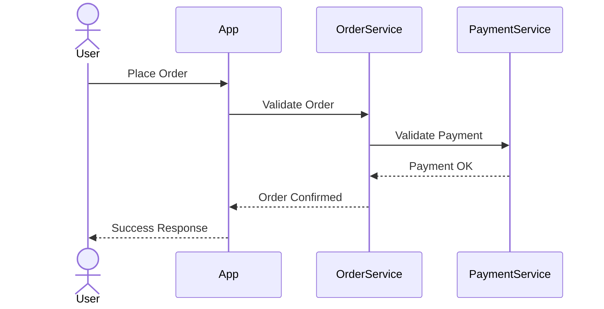

### 🧠 Meaning

The user waits until the system finishes the critical path.

---

## 🖼️ Visual – Asynchronous Flow

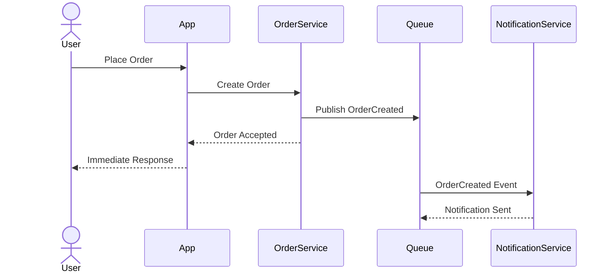

### 🧠 Meaning

The user gets a quick response, and background work continues later.

---

## ⚙️ Engineering Mapping

| Pattern      | Common Technology             |
| ------------ | ----------------------------- |
| Synchronous  | REST, gRPC                    |
| Asynchronous | Kafka, RabbitMQ, SQS, Pub/Sub |

---

# 2️⃣ Request–Response vs Event-Driven Flows

## ✅ WHAT

### Request–Response

One service directly asks another service for something and waits for the result.

### Event-Driven

One service publishes an event, and other services react independently.

---

## 🎯 WHY

### Request–Response

* simple and direct
* good for queries
* but tightly couples services

### Event-Driven

* reduces direct dependencies
* allows independent scaling
* supports multiple downstream reactions
* but requires better observability and idempotency

---

## ⏰ WHEN

### Use Request–Response when:

* one service directly needs data from another
* user is waiting for immediate output
* the operation is query-focused

### Use Event-Driven when:

* multiple services must react to a change
* scalability is important
* decoupling is important
* workflows are distributed

---

## 🍔 Real-Life Example

When an order is placed:

* payment service should react
* delivery service should react
* notification service should react
* analytics service should react

This is a perfect event-driven scenario.

---

## 🖼️ Visual – Request–Response

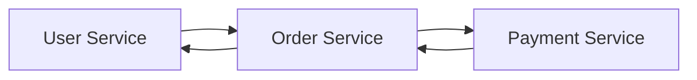

### 🧠 Meaning

Each service directly depends on the next one.

---

## 🖼️ Visual – Event-Driven Flow

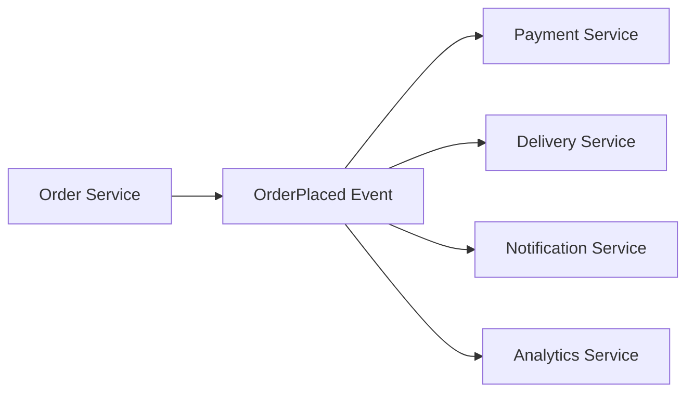

### 🧠 Meaning

The producer does not need to know every consumer.

---

## ⚙️ Engineering Mapping

| Pattern          | Common Technology                |
| ---------------- | -------------------------------- |
| Request–Response | REST API, gRPC                   |
| Event-Driven     | Kafka, Event Bus, Message Broker |

---

# 3️⃣ Data Ownership and Data Movement

## ✅ WHAT

### Data Ownership

Data ownership means one service is the **source of truth** for a specific type of data.

### Data Movement

Data movement means how other services receive or use that data.

---

## 🎯 WHY

If ownership is not clear:

* multiple services update the same data
* inconsistency appears
* debugging becomes difficult
* trust in data reduces

---

## ⏰ WHEN

Data ownership should be defined:

* during system decomposition
* before API design
* before database design
* before deciding communication patterns

---

## 🍔 Real-Life Example

### Food Delivery Example

* **Order Service** owns order state
* **Payment Service** owns payment state
* **Delivery Service** owns delivery assignment
* **Notification Service** should not modify order data directly

---

## 🖼️ Visual – Correct Ownership

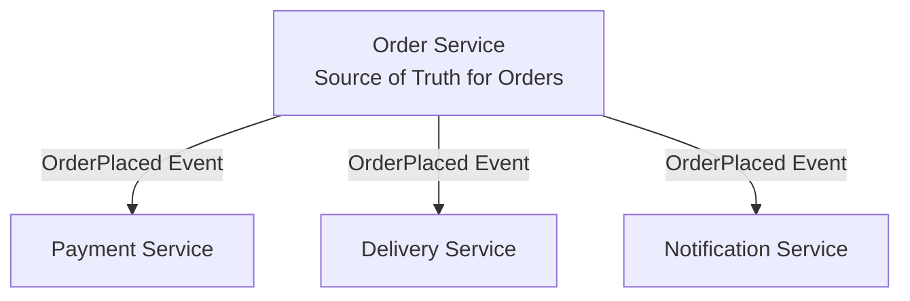

### 🧠 Meaning

Only Order Service owns order state. Others consume updates.

---

## 🖼️ Visual – Wrong Ownership

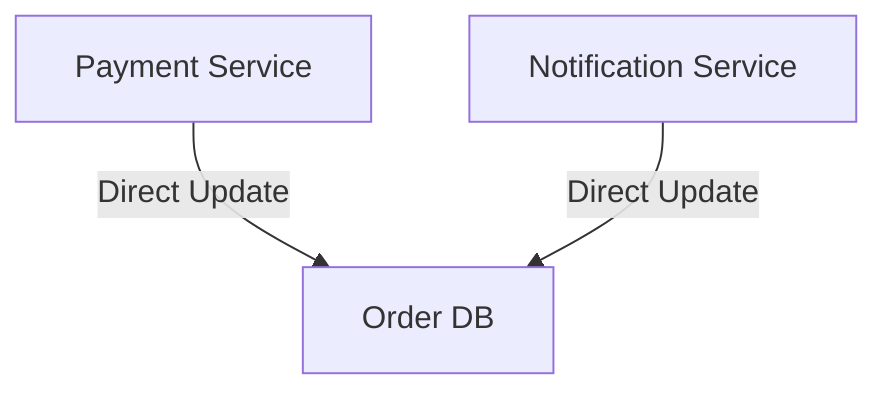

### 🧠 Meaning

Multiple services directly touching another service's data creates chaos.

---

## ⚙️ Important Rule

> A service should not directly update another service’s database.

Use:

* APIs
* events
* replicated read models
* projections

---

# 4️⃣ Handling Partial Failures in Communication

## ✅ WHAT

Partial failure means one part of the distributed system fails while the rest continues to work.

---

## 🎯 WHY

Distributed systems do not fail all at once.

Examples:

* payment works but notification fails
* order saves but analytics fails
* queue is available but one consumer is down

This is normal behavior, not an exception.

---

## ⏰ WHEN

Failure handling must be designed **alongside communication patterns**, not after system development.

---

## 🍔 Real-Life Example

Payment succeeds, but SMS notification fails.

Correct behavior:

* order remains successful
* notification is retried
* failure is monitored
* user is not charged twice

---

## 🖼️ Visual – Partial Failure Flow

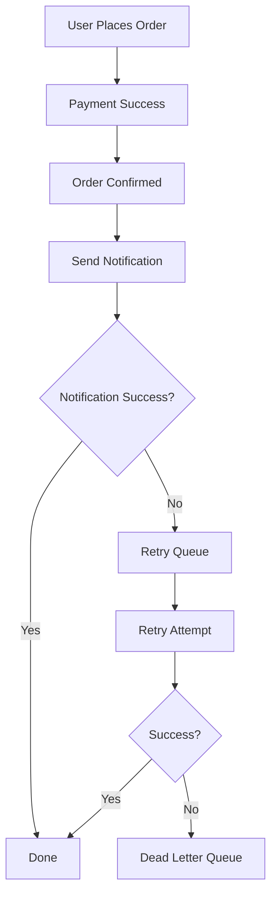

---

## 🧠 Concepts to Remember

### Retry

Repeat the same operation after temporary failure.

### Reprocessing

Replay work safely, usually for recovery.

### Idempotency

Running the same request multiple times should not create duplicate effects.

### Timeout

Stop waiting after a limit to prevent resource exhaustion.

### Dead Letter Queue

Store failed messages for later inspection and recovery.

---

## 🖼️ Visual – Timeout Protection

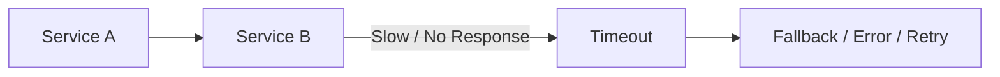

---

## 🖼️ Visual – Idempotency

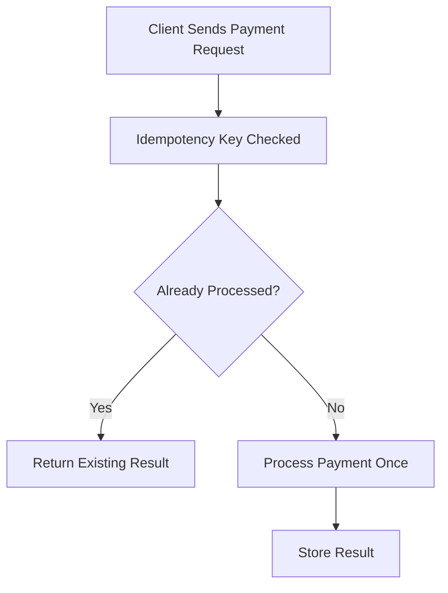

---

# 5️⃣ Comparison Summary Table

| Topic          | Synchronous         | Asynchronous         |
| -------------- | ------------------- | -------------------- |
| Response Style | Immediate           | Deferred             |
| Coupling       | Tight               | Loose                |
| Latency        | Higher for caller   | Lower for caller     |
| Scalability    | Lower               | Higher               |
| Failure Impact | More cascading risk | More isolated        |
| Example        | Login validation    | Notification sending |

---

| Topic       | Request–Response | Event-Driven        |
| ----------- | ---------------- | ------------------- |
| Interaction | Direct call      | Event publish       |
| Coupling    | Higher           | Lower               |
| Best For    | Queries          | Reactions/workflows |
| Scaling     | Harder           | Easier              |
| Flexibility | Lower            | Higher              |

---

# 6️⃣ End-to-End Food Delivery Example

## Step-by-step Architecture Thinking

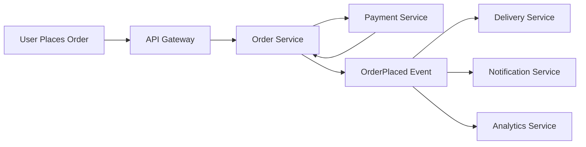

### Breakdown

* user-facing validation can be synchronous
* multi-service reactions can be asynchronous
* order service owns order data
* downstream services react independently
* failures in one side path should not break everything

---

# 7️⃣ Interview Question Bank with Answers

## Q1. When do you prefer synchronous communication?

**Answer:** When immediate user feedback is required and the dependency is reliable.

## Q2. When is asynchronous communication better?

**Answer:** For long-running tasks, background work, and workflows that can tolerate delayed completion.

## Q3. Why are event-driven systems more scalable?

**Answer:** Because producers and consumers are loosely coupled and can scale independently.

## Q4. What risks come with synchronous chains?

**Answer:** Higher latency, tighter coupling, and cascading failures.

## Q5. What is data ownership?

**Answer:** Clear responsibility for the source of truth of a specific data domain.

## Q6. Why should services not update each other’s data directly?

**Answer:** It creates tight coupling, inconsistency, and ownership confusion.

## Q7. How do events help with data movement?

**Answer:** They allow state changes to be distributed without shared databases.

## Q8. What is a partial failure?

**Answer:** Failure of one component while the rest of the system remains operational.

## Q9. Why must systems tolerate partial failures?

**Answer:** Because distributed systems do not fail atomically.

## Q10. How do retries differ from reprocessing?

**Answer:** Retries repeat the same action after a temporary failure, while reprocessing safely replays work later.

## Q11. What is idempotency and why is it important?

**Answer:** It ensures repeated requests do not create duplicate side effects.

## Q12. How do timeouts improve stability?

**Answer:** They prevent threads, connections, and resources from being blocked indefinitely.

## Q13. Why are queues used in async systems?

**Answer:** To buffer load and decouple producers from consumers.

## Q14. How does async communication affect latency?

**Answer:** It reduces user-facing latency by moving work to the background.

## Q15. What is eventual consistency?

**Answer:** A model where data becomes consistent over time rather than instantly.

## Q16. When is eventual consistency acceptable?

**Answer:** In workflows such as notifications, analytics, and non-critical projections.

## Q17. What happens if an event is lost?

**Answer:** The system needs retry support, durable brokers, monitoring, or compensating actions.

## Q18. How do you detect communication failures?

**Answer:** Through metrics, logs, timeouts, tracing, retries, and alerting.

## Q19. What is a common mistake in Module 3?

**Answer:** Using synchronous calls for everything.

## Q20. Summarize Module 3 in one sentence.

**Answer:** Choose communication patterns based on latency, coupling, and failure tolerance.

---

# 8️⃣ Quick Revision Sheet

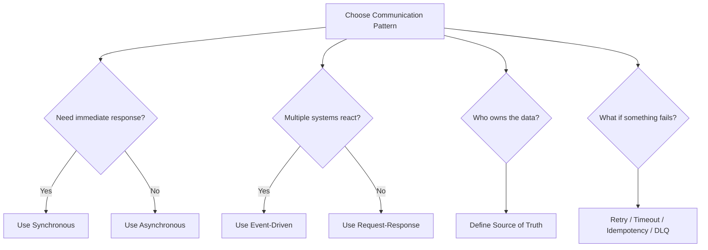

---

# 9️⃣ Final Mental Model

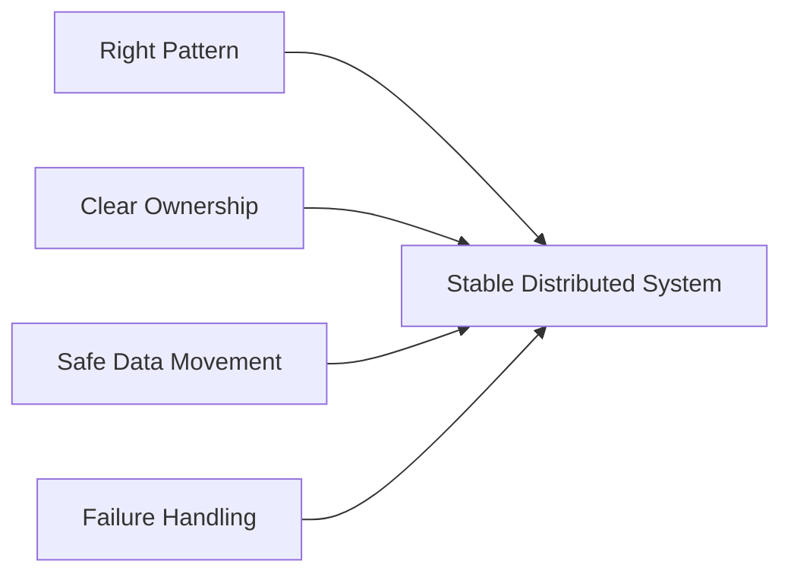

---

# 🔟 One-Line Summary

> Choose communication patterns based on latency, coupling, scalability, and failure tolerance.

---
````md


