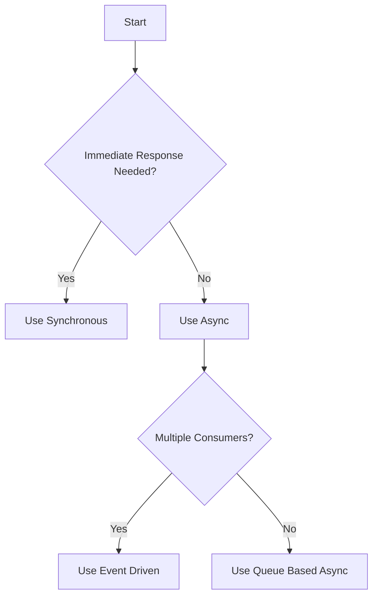
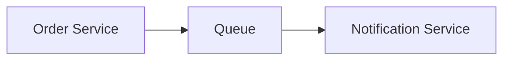
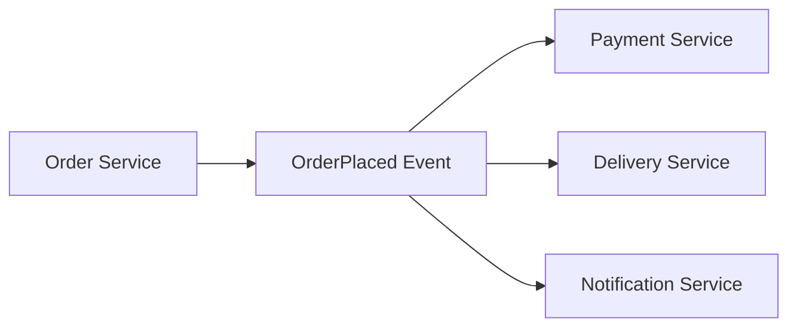
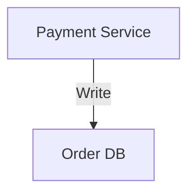
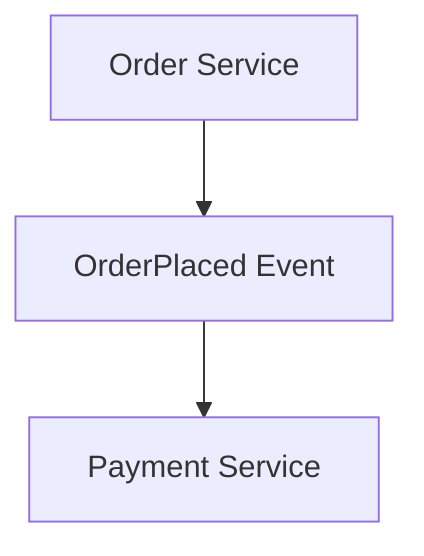
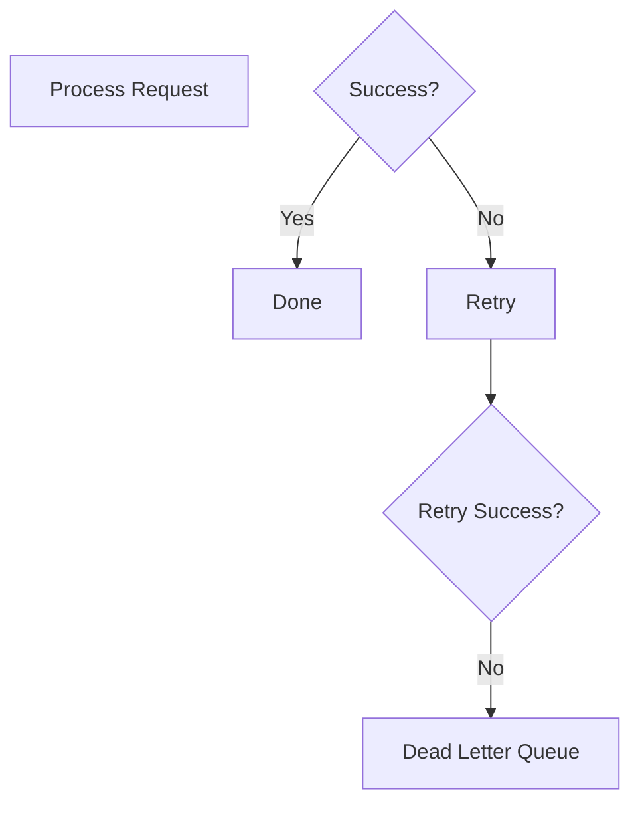
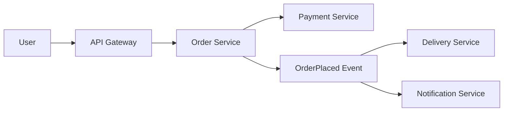
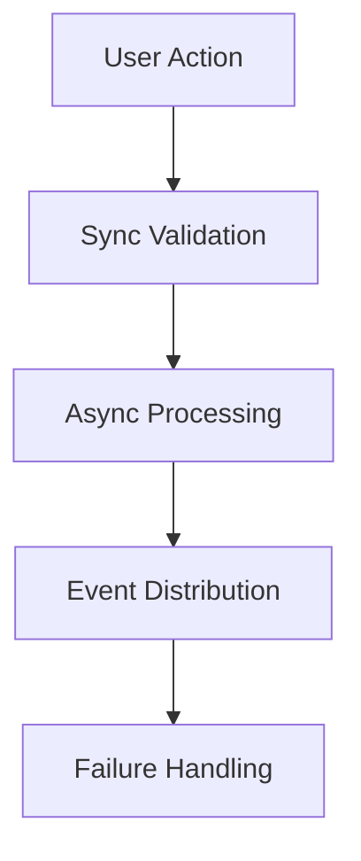

# 📘 Module 3 – HOW to Implement Data Flow & Communication Patterns

---

# 🎯 Goal of This README

This guide answers:

> ❓ **HOW do we actually implement communication patterns in real systems?**

We will cover:

* How to design flows
* How to choose sync vs async
* How to implement event-driven systems
* How to handle failures in real code
* Tools used in industry

---

# 🧠 Step 1: Identify Communication Type

---

## ✅ HOW to Decide (Real Thinking)

Ask these 3 questions:

### 1. Does user need immediate response?

👉 YES → Use **Synchronous**

### 2. Can this run in background?

👉 YES → Use **Asynchronous**

### 3. Will multiple services react?

👉 YES → Use **Event-Driven**

---

## 🖼️ Decision Flow



---

# ⚙️ Step 2: Implement Synchronous Communication

---

## ✅ HOW (Backend API Example)

### 🔹 Use REST API

```js
// Order Service calling Payment Service

const response = await fetch("http://payment-service/pay", {
  method: "POST",
  body: JSON.stringify({ amount: 100 })
});

const data = await response.json();
```

---

## 🧠 Rules

* Keep response time < 200ms
* Add timeout
* Add retry (limited)
* Avoid deep chaining

---

## ⚠️ Common Mistake

❌ Order → Payment → Delivery → Notification (chain)

👉 Leads to cascading failure

---

# ⚙️ Step 3: Implement Asynchronous Communication

---

## ✅ HOW (Queue-Based)

### 🔹 Producer (Order Service)

```js
queue.publish("order_created", {
  orderId: 123,
  userId: 456
});
```

---

### 🔹 Consumer (Notification Service)

```js
queue.subscribe("order_created", (event) => {
  sendNotification(event.userId);
});
```

---

## 🧠 Tools Used

* Apache Kafka
* RabbitMQ
* Amazon SQS

---

## 🖼️ Flow



---

# ⚙️ Step 4: Implement Event-Driven Architecture

---

## ✅ HOW (Real Design)

### 🔹 Event Publish

```js
eventBus.publish("OrderPlaced", {
  orderId: 123
});
```

---

### 🔹 Multiple Consumers

```js
eventBus.subscribe("OrderPlaced", paymentHandler);
eventBus.subscribe("OrderPlaced", deliveryHandler);
eventBus.subscribe("OrderPlaced", notificationHandler);
```

---

## 🖼️ Flow



---

## 🧠 Rules

* Events must be immutable
* Consumers must be idempotent
* Use schema versioning

---

# ⚙️ Step 5: Define Data Ownership

---

## ✅ HOW

### Rule:

👉 One service = one database

---

## ❌ Wrong



---

## ✅ Correct



---

## 🧠 Implementation Tip

* Use **read replicas**
* Use **event-based sync**
* Never share DB

---

# ⚙️ Step 6: Handle Failures (MOST IMPORTANT)

---

## ✅ HOW to Implement Retry

```js
async function retry(fn, retries = 3) {
  try {
    return await fn();
  } catch (err) {
    if (retries === 0) throw err;
    return retry(fn, retries - 1);
  }
}
```

---

## ✅ HOW to Implement Timeout

```js
const controller = new AbortController();

setTimeout(() => controller.abort(), 2000);

fetch(url, { signal: controller.signal });
```

---

## ✅ HOW to Implement Idempotency

```js
if (db.has(idempotencyKey)) {
  return db.get(idempotencyKey);
}
```

---

## 🖼️ Failure Flow



---

# ⚙️ Step 7: Real System Example (End-to-End)

---

## 🍔 Food Delivery System



---

## 🧠 Breakdown

| Step                | Type  |
| ------------------- | ----- |
| Order validation    | Sync  |
| Payment             | Sync  |
| Delivery assignment | Async |
| Notification        | Async |

---

# 🧰 Tools You Should Know

---

## Communication

* Apache Kafka
* RabbitMQ
* gRPC

---

## Monitoring

* Prometheus
* Grafana

---

## Cloud

* AWS
* Azure

---

# 🚨 Common Mistakes (Real Industry)

* Using sync everywhere ❌
* No retry logic ❌
* No timeout ❌
* Shared database ❌
* No monitoring ❌

---

# 🧠 Final Mental Model



---

# 🔟 One-Line Summary

> Build fast systems with sync, scale them with async, and make them reliable with failure handling.

---

