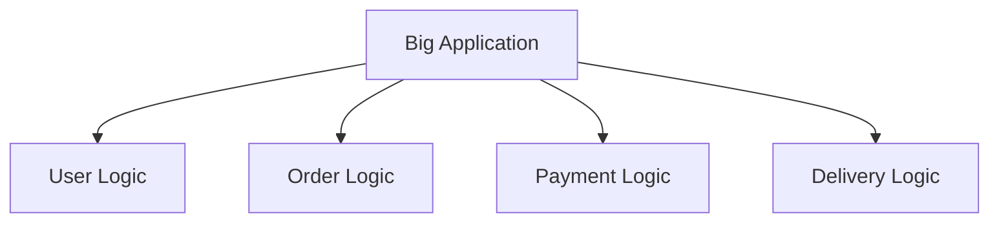
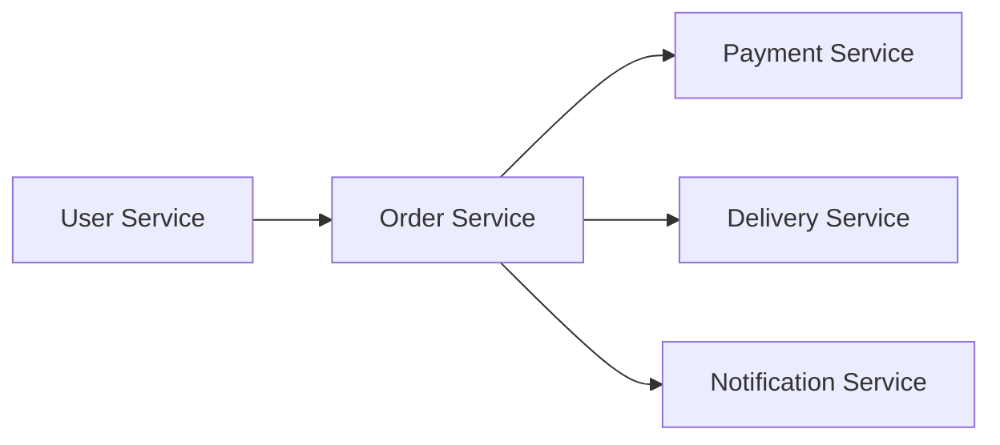
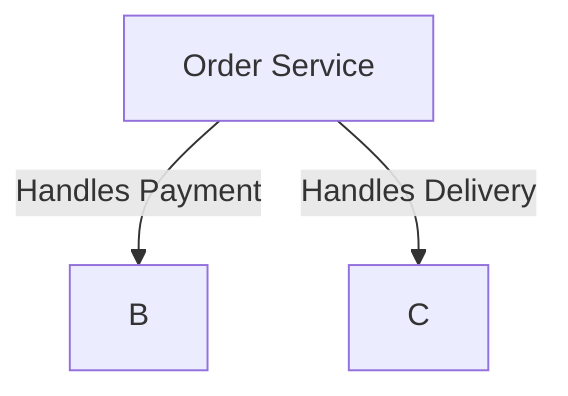
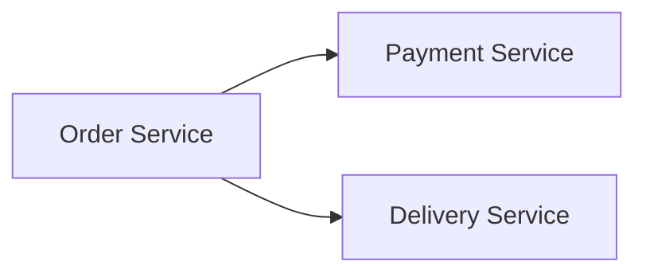
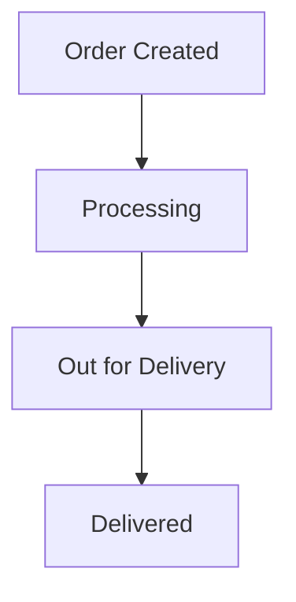
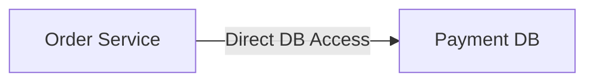
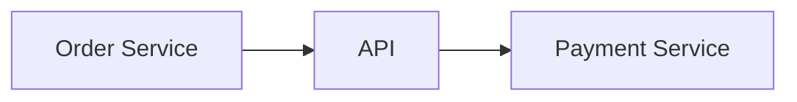
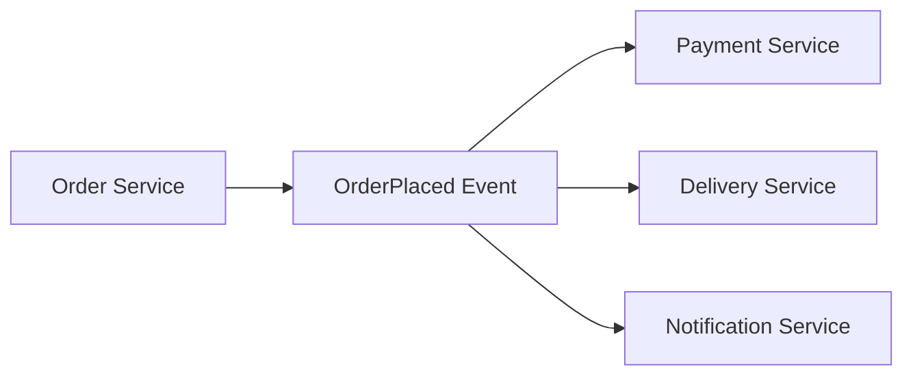
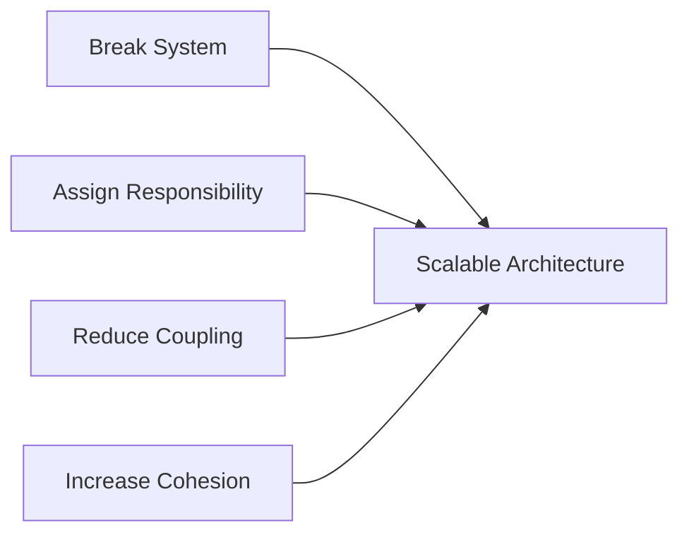

This is a **very strong Module 4 foundation** 👌
Now I’ll upgrade it into a **production-ready README with REAL system mapping + visuals (Mermaid) + HOW thinking**, just like we did for Module 3.

---

# 📘 Module 4 – Decomposing Systems into Components (FINAL README)

---

# 🎯 Why This Module Matters

Most systems fail not because of scale, but because of:

* ❌ Poor decomposition
* ❌ Unclear ownership
* ❌ Tight coupling

👉 Real-world problem:

> One change breaks 5 services → slow development → production bugs

---

# 🧠 Real-Life Mapping (Food Delivery → Engineering)

| Real System    | Component            |
| -------------- | -------------------- |
| User App       | Frontend             |
| Place Order    | API Gateway          |
| Order Handling | Order Service        |
| Payment        | Payment Service      |
| Delivery       | Delivery Service     |
| Notification   | Notification Service |

---

# 1️⃣ Breaking Systems into Services & Modules

---

## ✅ WHAT

Split system into **small, independent components**

---

## 🎯 WHY (Real Engineering Impact)

| Without Decomposition | With Decomposition  |
| --------------------- | ------------------- |
| Huge codebase         | Small services      |
| Hard to scale         | Independent scaling |
| Team conflicts        | Clear ownership     |

---

## 🍔 REAL SYSTEM DESIGN

---

## ❌ Monolithic System (Bad)

### 🧠 Problem

* Everything connected
* One failure → full system down

---

## ✅ Microservices (Good)

### 🧠 Meaning

👉 Independent services
👉 Easy scaling

---

# 2️⃣ Responsibility-Driven Design

---

## ✅ WHAT

Each service = **one clear responsibility**

---

## 🍔 REAL EXAMPLE

| Service              | Responsibility     |
| -------------------- | ------------------ |
| Order Service        | Order lifecycle    |
| Payment Service      | Payment processing |
| Delivery Service     | Rider assignment   |
| Notification Service | Alerts             |

---

## ❌ WRONG DESIGN

👉 One service doing everything = chaos

---

## ✅ CORRECT DESIGN

---

## 🧠 Rule

> One service = One responsibility = One owner

---

# 3️⃣ Stateless vs Stateful Components

---

## ✅ WHAT

| Type      | Meaning                    |
| --------- | -------------------------- |
| Stateless | No memory between requests |
| Stateful  | Maintains state            |

---

## 🍔 REAL EXAMPLE

| Component         | Type      |
| ----------------- | --------- |
| Login API         | Stateless |
| Order Tracking    | Stateful  |
| Payment API       | Stateless |
| Delivery Workflow | Stateful  |

---

## 🖼️ Stateless Flow

👉 Any server can handle request

---

## 🖼️ Stateful Flow

👉 State transitions matter

---

## 🧠 Engineering Rule

* APIs → Stateless
* Workflows → Stateful

---

# 4️⃣ Coupling and Cohesion

---

## ✅ WHAT

| Concept  | Meaning                            |
| -------- | ---------------------------------- |
| Coupling | Dependency between services        |
| Cohesion | Internal clarity of responsibility |

---

## ❌ High Coupling (Bad)

👉 Tight dependency → fragile system

---

## ✅ Low Coupling (Good)

👉 Loose connection → flexible system

---

## 🎯 Cohesion Example

### ❌ Low Cohesion

* Service handles:

  * Orders
  * Payments
  * Notifications

### ✅ High Cohesion

* One service = one domain

---

# ⚙️ Real Engineering Example (Event-Based Decoupling)

---

👉 No direct dependency
👉 Independent scaling

---

# 🧰 Tools Used in Real Systems

---

## Backend / Services

* Node.js
* Spring Boot
* Gin

---

## Communication

* Apache Kafka
* RabbitMQ

---

## API Layer

* gRPC
* REST

---

# 🚨 Common Mistakes (Very Important)

---

❌ Splitting by layers (Controller, Service, DB)
❌ Shared database across services
❌ One service doing everything
❌ Too many tiny services (over-decomposition)
❌ No ownership clarity

---

# 🧠 How to Evaluate Good Decomposition

---

Ask:

* Does each service have **one clear job?**
* Can it be deployed independently?
* Can it scale independently?
* Does it avoid direct DB sharing?
* Does it communicate via API/events?

---

# 🎯 Real Interview Thinking

---

## 💡 Q: How do you decompose a system?

👉 Answer:

1. Identify domains
2. Define ownership
3. Split by responsibility
4. Reduce coupling
5. Validate cohesion

---

## 💡 Q: Monolith vs Microservices?

👉 Say:

* Start monolith
* Move to services when scale/teams grow

---

## 💡 Q: Biggest mistake?

👉 Splitting by technical layers instead of business domains

---

# 🔟 Final Mental Model

---

# 🧠 One-Line Summary

> Good systems are built by breaking them into small, independent, well-defined components.

---

