Absolutely — here is the **“HOW” version** for **Module 4 – Decomposing Systems into Components** in a clean README style you can copy into your `.md` file.

---

# 📘 Module 4 – HOW to Decompose Systems into Components

---

# 🎯 Goal of This README

This guide explains:

> **How do we actually break a large system into smaller components in real engineering?**

It focuses on:

* how to split a system
* how to assign responsibilities
* how to decide service boundaries
* how to avoid tight coupling
* how to evaluate whether decomposition is good or bad

---

# 1️⃣ Start with Business Capabilities

---

## ✅ HOW

Do not start with:

* database tables
* frameworks
* controllers
* infrastructure

Start with:

> **What major jobs does the system perform?**

---

## 🍔 Food Delivery Example

Main business capabilities:

* user management
* restaurant catalog
* order management
* payment processing
* delivery assignment
* notification sending

These become the first candidates for components.

---

## 🖼️ Visual

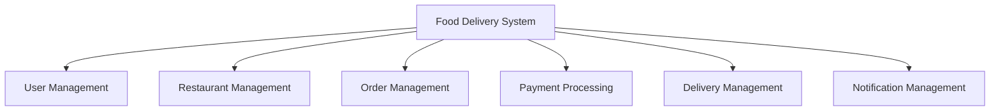

---

## 🧠 Rule

> First split by business responsibility, not by technical layer.

---

# 2️⃣ Define One Clear Responsibility per Component

---

## ✅ HOW

For each component, ask:

* What does it own?
* What does it do?
* What should it never do?

---

## 🍔 Example

### Order Service

Owns:

* order creation
* order status
* order lifecycle

Should not own:

* payment charging
* delivery tracking
* sending SMS

---

## 🖼️ Visual

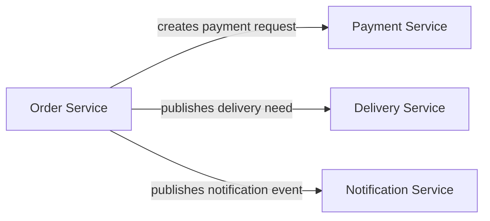

---

## 🧠 Rule

> If one component is doing many unrelated jobs, decomposition is wrong.

---

# 3️⃣ Find Natural Ownership Boundaries

---

## ✅ HOW

Each component should own:

* its own logic
* its own state
* its own data

Ask:

> Which component is the source of truth for this data?

---

## 🍔 Example

| Data             | Owner              |
| ---------------- | ------------------ |
| user profile     | User Service       |
| restaurant menu  | Restaurant Service |
| order state      | Order Service      |
| payment state    | Payment Service    |
| rider assignment | Delivery Service   |

---

## ❌ Wrong

Two services updating same data.

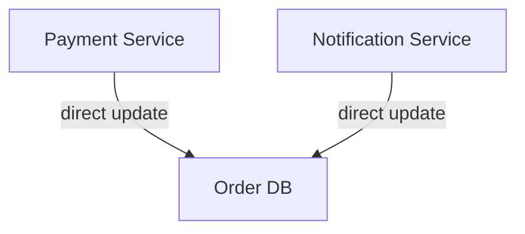

---

## ✅ Correct

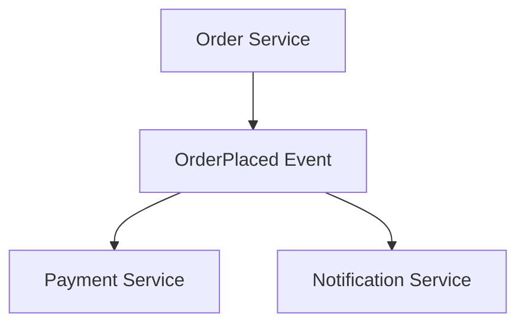

---

## 🧠 Rule

> One data domain should have one clear owner.

---

# 4️⃣ Separate Stateless and Stateful Parts

---

## ✅ HOW

Ask:

### Is this request independent?

If yes → stateless component

### Does this require history or transitions?

If yes → stateful component

---

## 🍔 Example

### Stateless

* login API
* menu search API
* fare estimation API

### Stateful

* order lifecycle
* delivery tracking
* payment workflow

---

## 🖼️ Visual

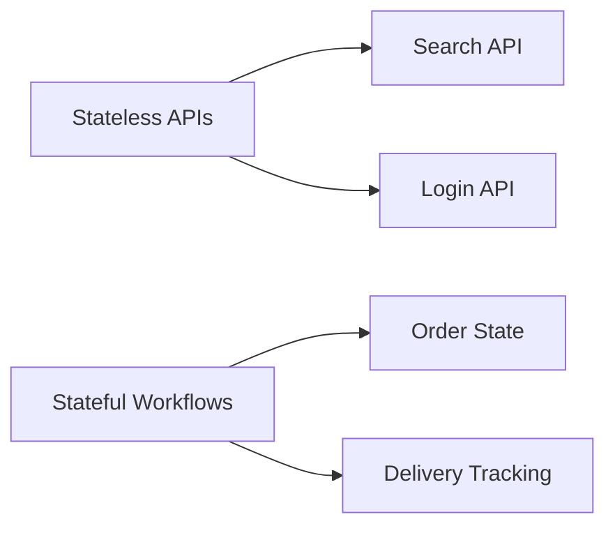

---

## 🧠 Rule

> Keep APIs stateless where possible, and isolate stateful workflows clearly.

---

# 5️⃣ Use Coupling as a Check

---

## ✅ HOW

After decomposition, ask:

* Can one component work without knowing internal details of another?
* Can one component change without breaking others?
* Can one component fail without crashing all others?

If no, coupling is too high.

---

## ❌ High Coupling Example

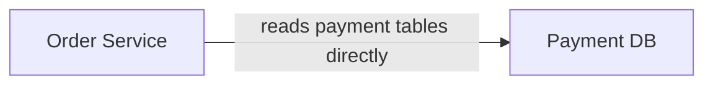

Problem:

* internal dependency
* fragile design
* hard to change

---

## ✅ Low Coupling Example

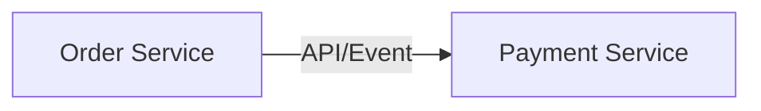

Better because:

* interface is clear
* internal logic hidden
* independent evolution possible

---

## 🧠 Rule

> Components should depend on contracts, not internals.

---

# 6️⃣ Use Cohesion as a Check

---

## ✅ HOW

Look inside one component and ask:

> Are all responsibilities inside this component closely related?

---

## ❌ Low Cohesion Example

One service handles:

* user login
* payment
* email sending
* delivery assignment

This is bad because responsibilities are unrelated.

---

## ✅ High Cohesion Example

### Payment Service handles only:

* payment initiation
* payment confirmation
* payment refund
* payment status

All responsibilities are strongly related.

---

## 🖼️ Visual

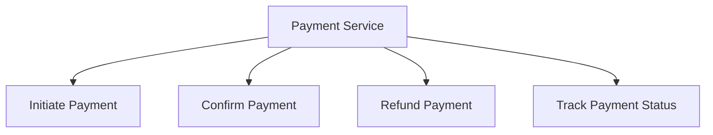

---

## 🧠 Rule

> A good component feels like one meaningful idea, not a bag of random features.

---

# 7️⃣ Decide Communication Boundaries

---

## ✅ HOW

Once components are identified, decide how they communicate.

Ask:

### Need immediate answer?

Use API call

### Can happen later?

Use queue/event

### Multiple services react?

Use event-driven communication

---

## 🍔 Example

### Sync

* Order Service asks Payment Service to charge payment

### Async

* OrderPlaced event triggers notification and analytics

---

## 🖼️ Visual

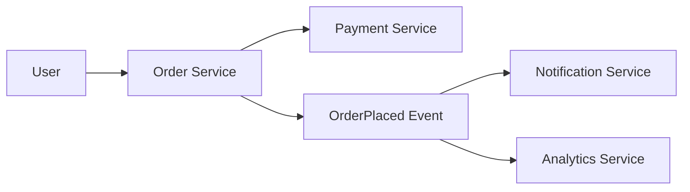

---

## 🧠 Rule

> Decomposition is incomplete until communication boundaries are clear.

---

# 8️⃣ Check Team Ownership

---

## ✅ HOW

A well-decomposed system should support team autonomy.

Ask:

* Can one team own this component end-to-end?
* Can they deploy it independently?
* Can they debug it without touching many other services?

If yes, decomposition is healthier.

---

## 🍔 Example

| Team          | Owns             |
| ------------- | ---------------- |
| Order Team    | Order Service    |
| Payment Team  | Payment Service  |
| Delivery Team | Delivery Service |

---

## 🧠 Rule

> Good architecture supports good team structure.

---

# 9️⃣ Avoid Common Decomposition Mistakes

---

## ❌ Mistake 1: Split by technical layers

Bad split:

* controller service
* business service
* repository service

This is not business decomposition.

---

## ❌ Mistake 2: Shared database

Multiple services writing into one DB creates:

* tight coupling
* ownership confusion
* migration pain

---

## ❌ Mistake 3: Too many tiny services

Over-splitting causes:

* too many APIs
* operational overhead
* debugging pain

---

## ❌ Mistake 4: Overlapping responsibilities

If two services both manage order state, system becomes confusing.

---

# 🔟 Step-by-Step Decomposition Process

---

## ✅ Practical Method

Use this sequence every time:

### Step 1

Understand requirements

### Step 2

Identify major business capabilities

### Step 3

Define responsibility of each capability

### Step 4

Assign ownership of data

### Step 5

Separate stateless and stateful parts

### Step 6

Define communication boundaries

### Step 7

Check coupling and cohesion

### Step 8

Validate team ownership and scaling

---

## 🖼️ Visual

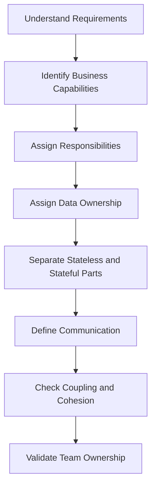

---

# 🧠 End-to-End Real Example

---

## Food Delivery Decomposition

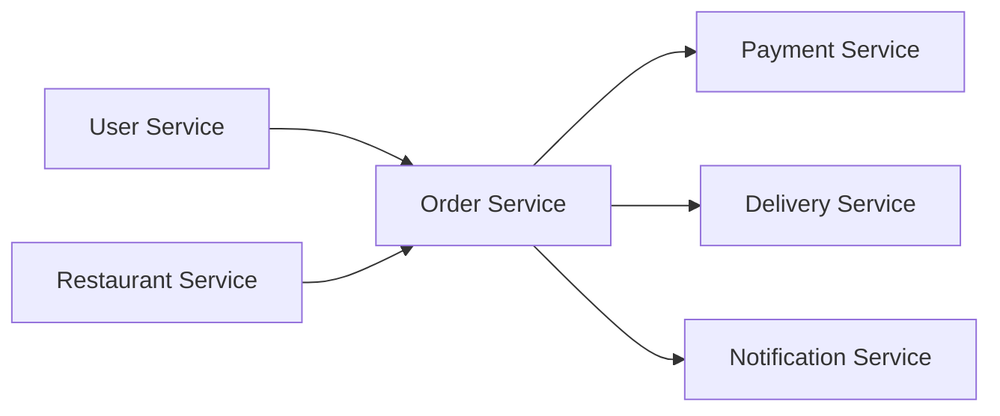

---

## Breakdown

### User Service

* manages profiles
* login
* addresses

### Restaurant Service

* menus
* availability
* restaurant info

### Order Service

* order creation
* order state
* order lifecycle

### Payment Service

* charge payment
* track payment result

### Delivery Service

* assign rider
* tracking updates

### Notification Service

* SMS
* email
* push alerts

---

# 🎯 How to Evaluate Whether Your Decomposition Is Good

Ask these questions:

* Does each component have one clear job?
* Is ownership clear?
* Is DB ownership clear?
* Is communication explicit?
* Can teams work independently?
* Can components scale independently?
* Is coupling low?
* Is cohesion high?

If most answers are yes, decomposition is probably good.

---

# 🧠 One-Line Summary

> Decompose systems by business responsibility, clear ownership, low coupling, and high cohesion.

