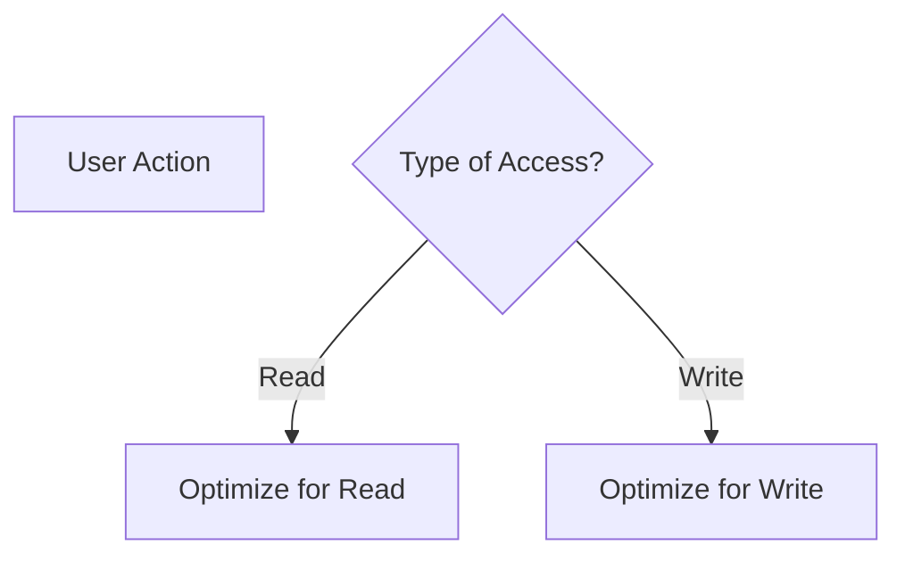
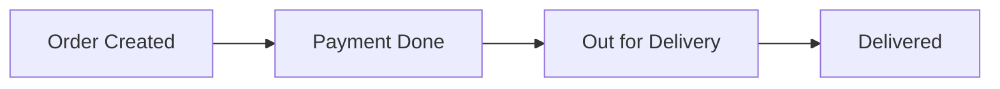
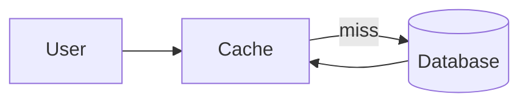
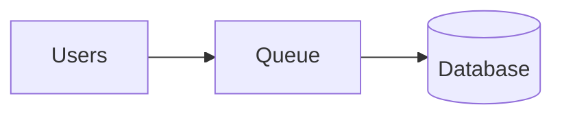
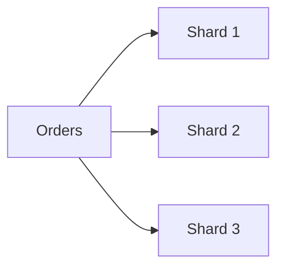
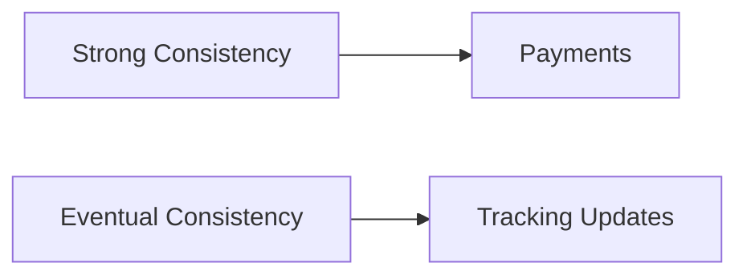
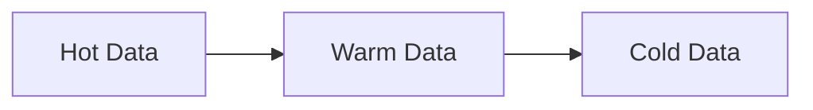
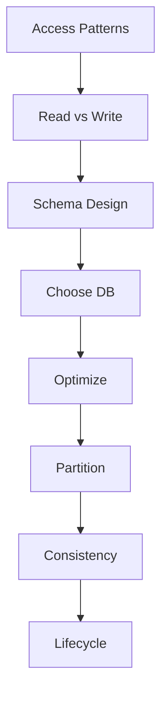
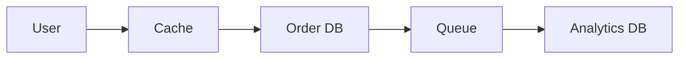

# 📘 Module 5 – HOW to Design Data Models & Storage

---

# 🎯 Goal of This README

> **How do we actually design data for scalable systems?**

We will cover:

* how to design schemas
* how to choose storage
* how to handle scale
* how to optimize reads/writes
* how to manage data lifecycle

---

# 1️⃣ Start with Access Patterns (MOST IMPORTANT)

---

## ✅ HOW

Before designing tables or schemas, ask:

* What data is read most?
* What data is written most?
* What queries will run frequently?
* What is the response time requirement?

---

## 🍔 Food Delivery Example

### Common Queries

* Get restaurant menu → **read-heavy**
* Place order → **write-heavy**
* Track delivery → **frequent updates**

---

## 🖼️ Visual



---

## 🧠 Rule

> Design database for queries, not for storage.

---

# 2️⃣ Structure Data for Scale

---

## ✅ HOW

Avoid:

* heavy joins
* deeply normalized schemas

Prefer:

* simple queries
* pre-computed data
* immutable records

---

## 🍔 Example – Orders

### ❌ Bad Model

```sql
Orders Table:
id | status | updated_at
```

👉 Frequent updates → locking → poor scaling

---

### ✅ Good Model (Immutable)

```sql
OrderEvents:
order_id | status | timestamp
```

👉 Append-only → scalable → audit-friendly

---

## 🖼️ Visual



---

## 🧠 Rule

> Prefer append-only models for scalability.

---

# 3️⃣ Optimize for Read-Heavy Systems

---

## ✅ HOW

If reads >> writes:

Use:

* caching
* replication
* denormalization

---

## 🍔 Example

Restaurant menu browsing

---

## 🖼️ Flow



---

## 🧠 Tools

* Redis
* Memcached

---

## 🧠 Rule

> Never hit database for every read.

---

# 4️⃣ Optimize for Write-Heavy Systems

---

## ✅ HOW

If writes are high:

Use:

* batching
* queues
* partitioning
* conflict handling

---

## 🍔 Example

Peak order time (festival hours)

---

## 🖼️ Flow



---

## 🧠 Benefits

* smooth load spikes
* prevents DB overload

---

## 🧠 Rule

> Buffer writes before hitting database.

---

# 5️⃣ Choose the Right Database

---

## ✅ HOW

Ask:

| Requirement        | Choose |
| ------------------ | ------ |
| Strong consistency | SQL    |
| Flexible schema    | NoSQL  |
| High scale         | NoSQL  |
| Transactions       | SQL    |

---

## 🧠 Examples

* PostgreSQL → payments
* MongoDB → orders
* DynamoDB → high scale

---

## 🧠 Rule

> There is no “best database”—only best fit.

---

# 6️⃣ Apply Partitioning (Sharding)

---

## ✅ HOW

Split data across multiple nodes.

---

## 🍔 Example

Orders table split by:

* user_id
* region
* order_id hash

---

## 🖼️ Visual



---

## 🧠 Strategies

* hash-based
* range-based
* geo-based

---

## 🧠 Rule

> Partition before your database becomes a bottleneck.

---

# 7️⃣ Handle Consistency Trade-offs

---

## ✅ HOW

Ask:

* Does this need to be 100% accurate instantly?

---

## 🍔 Example

| Feature           | Consistency |
| ----------------- | ----------- |
| Payment           | Strong      |
| Order status      | Strong      |
| Delivery tracking | Eventual    |

---

## 🖼️ Visual



---

## 🧠 Rule

> Not all data needs strong consistency.

---

# 8️⃣ Manage Data Lifecycle

---

## ✅ HOW

Define:

* hot data (frequent access)
* warm data
* cold/archive data

---

## 🍔 Example

| Data             | Storage        |
| ---------------- | -------------- |
| active orders    | primary DB     |
| completed orders | archive DB     |
| analytics        | data warehouse |

---

## 🖼️ Visual



---

## 🧠 Tools

* Amazon S3
* BigQuery

---

## 🧠 Rule

> Move old data out of hot systems.

---

# 9️⃣ Avoid Common Data Modeling Mistakes

---

❌ Designing without access patterns
❌ Too many joins
❌ No indexing
❌ No partitioning
❌ Using single DB for everything
❌ No lifecycle management

---

# 🔟 Step-by-Step Data Modeling Process

---

## ✅ Practical Method

### Step 1

Identify access patterns

### Step 2

Classify read vs write

### Step 3

Design schema for queries

### Step 4

Choose database type

### Step 5

Add caching / queue

### Step 6

Plan partitioning

### Step 7

Define consistency level

### Step 8

Define lifecycle policy

---

## 🖼️ Visual



---

# 🧠 End-to-End Example (Food Delivery)

---



---

## Breakdown

* Menu → cached (read-heavy)
* Orders → DB (write-heavy)
* Events → queue
* Analytics → separate DB

---

# 🎯 How to Evaluate Your Data Model

Ask:

* Is it optimized for real queries?
* Can it scale horizontally?
* Is read/write optimized?
* Is consistency appropriate?
* Is lifecycle defined?

---

# 🧠 One-Line Summary

> Design data models based on access patterns, not assumptions.


