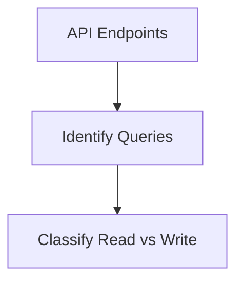
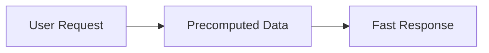
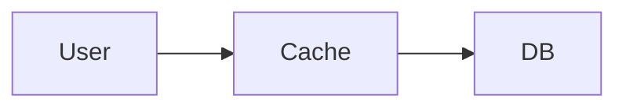
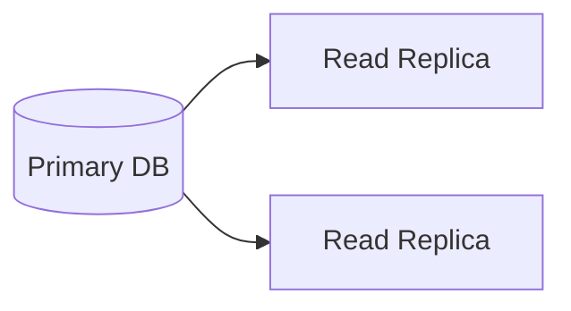
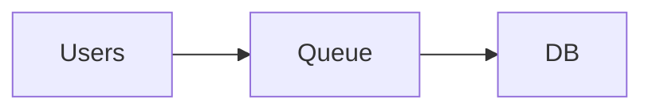
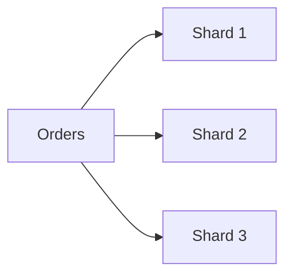
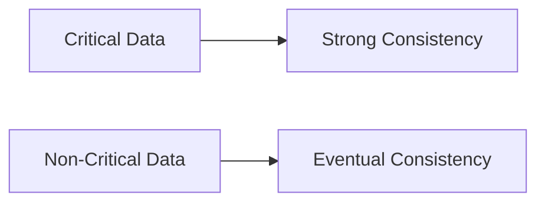
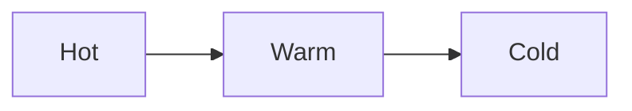
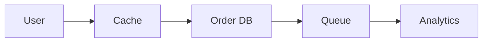
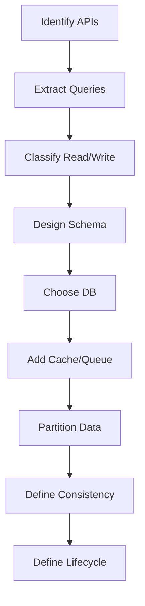

Great—let’s go **one level deeper** and make Module 5 truly **implementation-driven (“HOW in real engineering”)** 🔥

This is the **exact thinking + steps senior engineers follow when designing data systems**.

---

# 📘 Module 5 – HOW (Real Engineering Approach)

---

# 🎯 Core Idea

> You don’t design databases first.
> You design **data access behavior first**, then storage.

---

# 1️⃣ HOW to Identify Access Patterns (Step 0 – Most Critical)

---

## ✅ HOW (Real Process)

Write down **actual API/use cases**, not entities.

### 🍔 Food Delivery Example

```text
GET /menu?restaurantId=123
POST /order
GET /order/{id}
GET /track/{orderId}
```

---

## 🧠 Convert APIs → Queries

| API         | Query Type       |
| ----------- | ---------------- |
| Get menu    | Read-heavy       |
| Place order | Write-heavy      |
| Track order | Frequent updates |

---

## 🖼️ Visual



---

## 🧠 Rule

> If you don’t know queries, you can’t design data.

---

# 2️⃣ HOW to Design Schema (Query-First Approach)

---

## ✅ HOW

For each query, ask:

> What is the fastest way to serve this?

---

## 🍔 Example: Get Order

### ❌ Bad (Normalized)

```sql
Orders + OrderItems + Payments + Delivery
JOIN all tables
```

👉 Slow ❌

---

### ✅ Good (Optimized Read Model)

```json
{
  "orderId": 123,
  "items": [...],
  "paymentStatus": "SUCCESS",
  "deliveryStatus": "OUT_FOR_DELIVERY"
}
```

👉 Single fetch ✅

---

## 🖼️ Visual



---

## 🧠 Rule

> Design for **minimum joins, maximum speed**

---

# 3️⃣ HOW to Choose Storage Type

---

## ✅ Decision Framework

Ask 3 questions:

### 1. Do you need transactions?

→ YES → SQL

### 2. Do you need flexibility?

→ YES → NoSQL

### 3. Do you need massive scale?

→ YES → NoSQL / distributed

---

## 🧠 Real Mapping

| Use Case | DB         |
| -------- | ---------- |
| Payments | PostgreSQL |
| Orders   | MongoDB    |
| Caching  | Redis      |

---

## 🧠 Rule

> Choose DB based on **problem, not popularity**

---

# 4️⃣ HOW to Handle Read-Heavy Systems

---

## ✅ HOW

### Step 1: Add Cache



---

### Step 2: Add Replicas



---

### Step 3: Denormalize

Store:

* menu + ratings together
* order + status together

---

## 🧠 Rule

> Reads should never depend on complex joins.

---

# 5️⃣ HOW to Handle Write-Heavy Systems

---

## ✅ HOW

### Step 1: Buffer Writes



---

### Step 2: Batch Writes

```js
// Instead of 1000 writes
batchInsert(orders);
```

---

### Step 3: Partition Data

Split by:

* user_id
* region
* order_id

---

## 🧠 Rule

> Writes should be **smooth, not spiky**

---

# 6️⃣ HOW to Implement Partitioning

---

## ✅ HOW

### Hash-Based

```text
orderId % 4 → shard
```

---

### Range-Based

```text
Orders Jan → DB1
Orders Feb → DB2
```

---

### Geo-Based

```text
India → DB1
US → DB2
```

---

## 🖼️ Visual



---

## 🧠 Rule

> Partition before scale breaks you.

---

# 7️⃣ HOW to Handle Consistency

---

## ✅ HOW

Classify data:

### Strong Consistency Needed

* payments
* balances
* order confirmation

### Eventual Consistency OK

* tracking
* notifications
* analytics

---

## 🖼️ Visual



---

## 🧠 Rule

> Strong consistency is expensive—use only when needed.

---

# 8️⃣ HOW to Design Data Lifecycle

---

## ✅ HOW

Define lifecycle stages:

### Step 1: Hot Data

* active orders

### Step 2: Warm Data

* recent orders

### Step 3: Cold Data

* old analytics

---

## 🖼️ Flow



---

## 🧠 Tools

* Amazon S3
* BigQuery

---

## 🧠 Rule

> Don’t store everything in primary DB.

---

# 9️⃣ HOW to Design End-to-End System

---

## 🍔 Food Delivery Final Architecture



---

## Breakdown

* Menu → cached
* Orders → DB
* Events → queue
* Analytics → separate system

---

# 🔟 Final Step-by-Step Process (Golden Flow)

---



---

# 🧠 Final Mental Model

> APIs → Queries → Data Model → Storage → Scaling → Optimization

---

# 🚀 One-Line Summary

> First design how data is used, then decide how it is stored.


