# 📘 Module 6 – HOW to Scale Systems (Scalability Fundamentals)

---

# 🎯 Goal of This README

> **How do we actually scale systems in real-world production?**

We will cover:

* how to scale step-by-step
* how to identify bottlenecks
* how to distribute load
* how to scale components independently
* how to avoid common scaling mistakes

---

# 1️⃣ Start with Load Understanding (Before Scaling)

---

## ✅ HOW

Before scaling anything, measure:

* requests per second (RPS)
* latency (response time)
* CPU / memory usage
* database load

---

## 🖼️ Visual

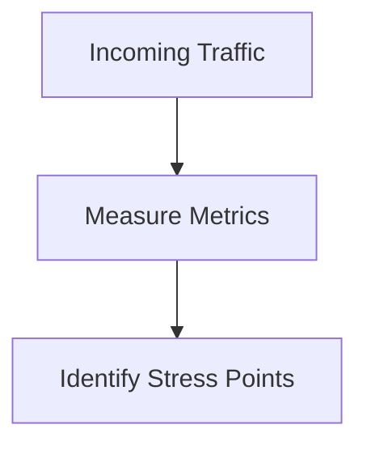

---

## 🧠 Rule

> Never scale blindly—measure first.

---

# 2️⃣ Decide Vertical vs Horizontal Scaling

---

## ✅ HOW

### Step 1: Start Vertical

* increase CPU
* increase RAM
* optimize queries

---

### Step 2: Move to Horizontal

* add more instances
* distribute traffic

---

## 🖼️ Visual

### Vertical Scaling

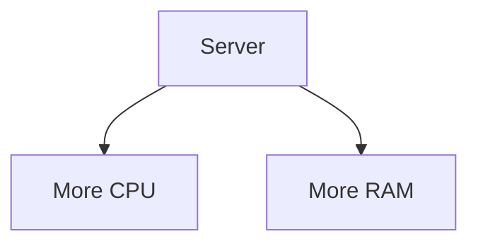

---

### Horizontal Scaling

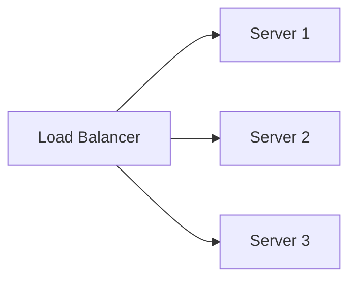

---

## 🧠 Rule

> Vertical first → Horizontal for long-term scale

---

# 3️⃣ Implement Load Distribution

---

## ✅ HOW

Add a **load balancer** in front of services.

---

## 🖼️ Real Flow

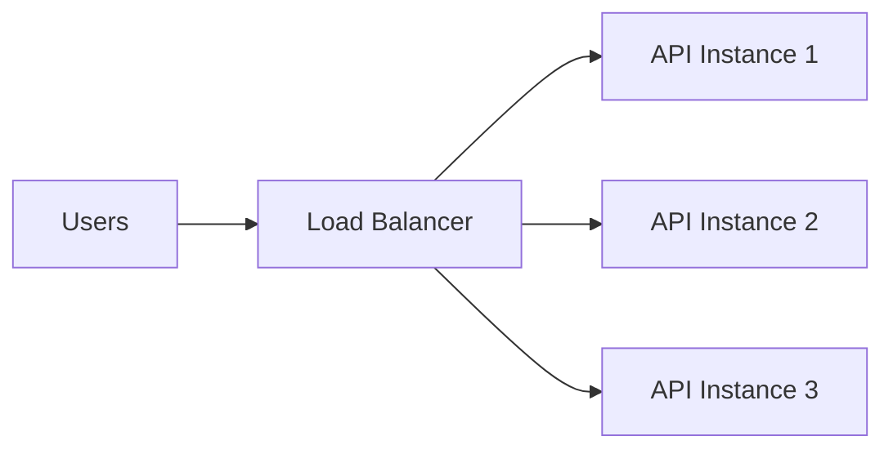

---

## 🧠 Algorithms

* Round Robin
* Least Connections
* IP Hash

---

## 🧠 Tools

* NGINX
* HAProxy

---

## 🧠 Rule

> Traffic must be evenly distributed, not randomly.

---

# 4️⃣ Identify Bottlenecks (MOST IMPORTANT)

---

## ✅ HOW

Check:

* slow API endpoints
* high DB latency
* queue backlog
* CPU spikes

---

## 🖼️ Visual

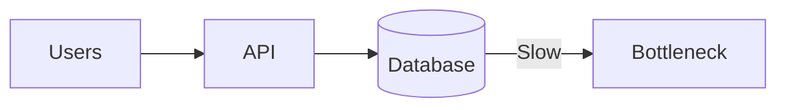

---

## 🍔 Example

* Order service fast ✅
* DB writes slow ❌

👉 DB is bottleneck, not API

---

## 🧠 Rule

> Scaling non-bottlenecks = wasted effort

---

# 5️⃣ Scale Bottleneck First

---

## ✅ HOW

If bottleneck is:

### Database

* add indexing
* add read replicas
* partition data

---

### API

* add more instances
* optimize code

---

### Queue

* increase consumers

---

## 🖼️ Example

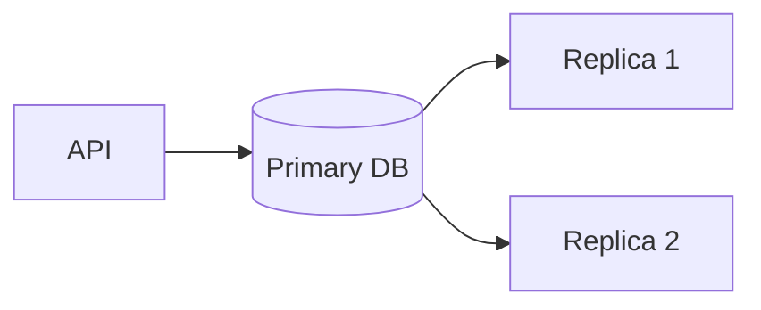

---

## 🧠 Rule

> Fix or scale the slowest component first

---

# 6️⃣ Enable Independent Scaling

---

## ✅ HOW

Split system into components (from Module 4)

Then scale each independently.

---

## 🍔 Example

| Component       | Scaling               |
| --------------- | --------------------- |
| Menu Service    | High (read-heavy)     |
| Order Service   | Medium                |
| Payment Service | Controlled (critical) |

---

## 🖼️ Visual

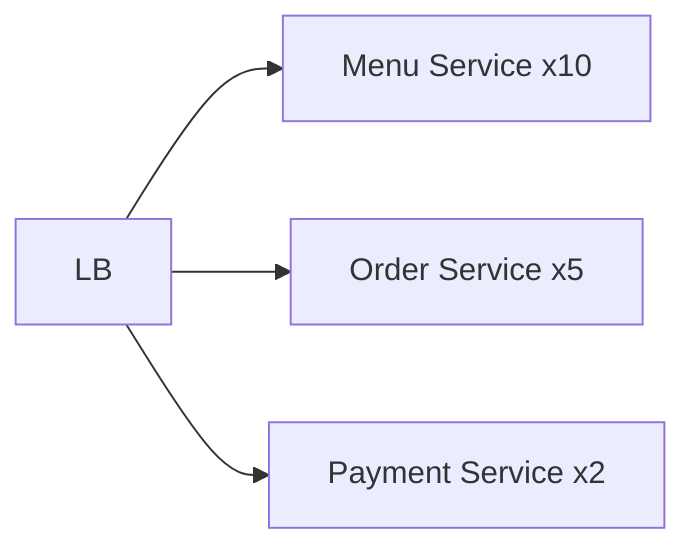

---

## 🧠 Rule

> Scale based on demand, not uniformly

---

# 7️⃣ Use Caching to Reduce Load

---

## ✅ HOW

Place cache before DB.

---

## 🖼️ Flow

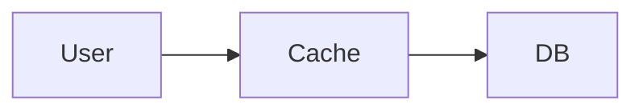

---

## 🧠 Impact

* reduces DB load
* improves latency
* improves scalability

---

## 🧠 Tools

* Redis

---

## 🧠 Rule

> Cache frequently accessed data

---

# 8️⃣ Handle Traffic Spikes (Auto Scaling)

---

## ✅ HOW

Use auto-scaling rules:

* CPU > 70% → add instance
* CPU < 30% → remove instance

---

## 🖼️ Visual

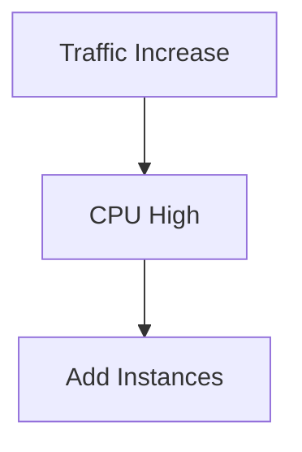

---

## 🧠 Platforms

* AWS Auto Scaling
* Azure VM Scale Sets

---

## 🧠 Rule

> Scale automatically, not manually

---

# 9️⃣ Plan Capacity (Before Failure)

---

## ✅ HOW

Estimate:

* peak traffic
* growth rate
* system limits

---

## 🍔 Example

* current: 1K users
* expected: 10K users

👉 prepare infra in advance

---

## 🧠 Rule

> Always scale before breaking point

---

# 🔟 End-to-End Scalable Architecture

---

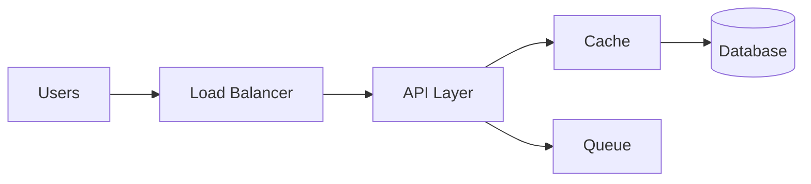

---

## 🧠 Breakdown

* Load balancer distributes traffic
* Cache reduces DB load
* Queue handles async work
* DB scaled separately

---

# 🚨 Common Scaling Mistakes

---

❌ Scaling everything
❌ Ignoring bottlenecks
❌ No monitoring
❌ No caching
❌ Tight coupling
❌ Manual scaling

---

# 🧠 Golden Scaling Process

---

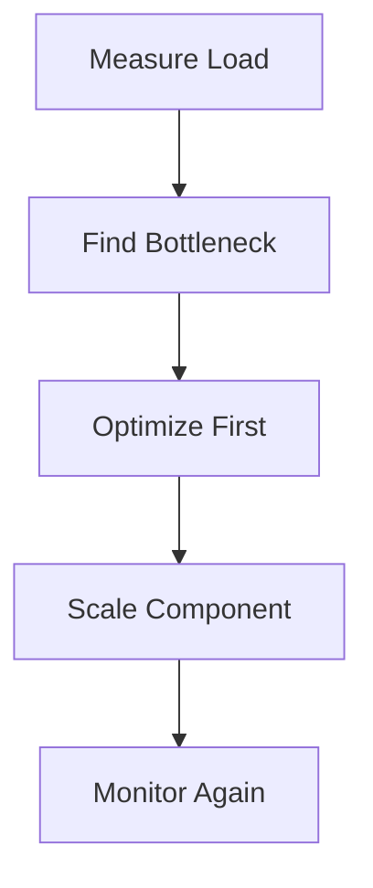

---

# 🧠 Final Mental Model

> Measure → Identify → Optimize → Scale → Repeat

---

# 🧠 One-Line Summary

> Scalability is not about adding servers—it’s about scaling the right part at the right time.

