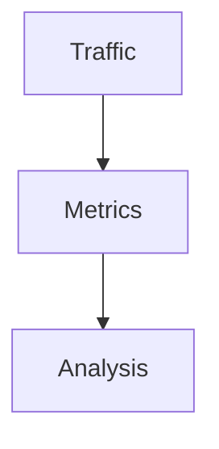
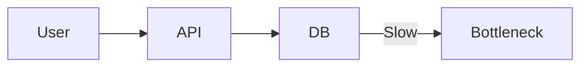
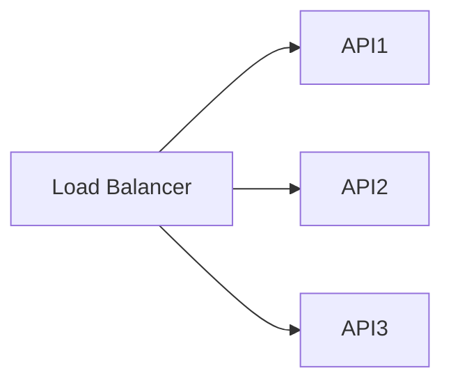
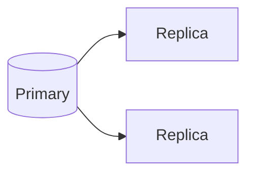
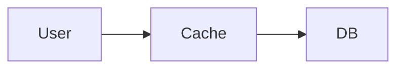
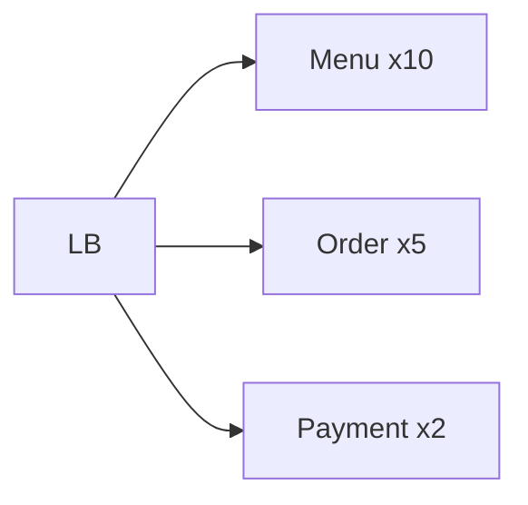
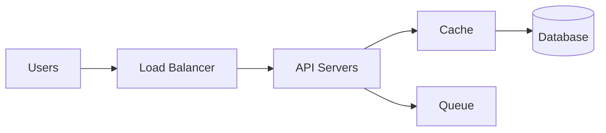
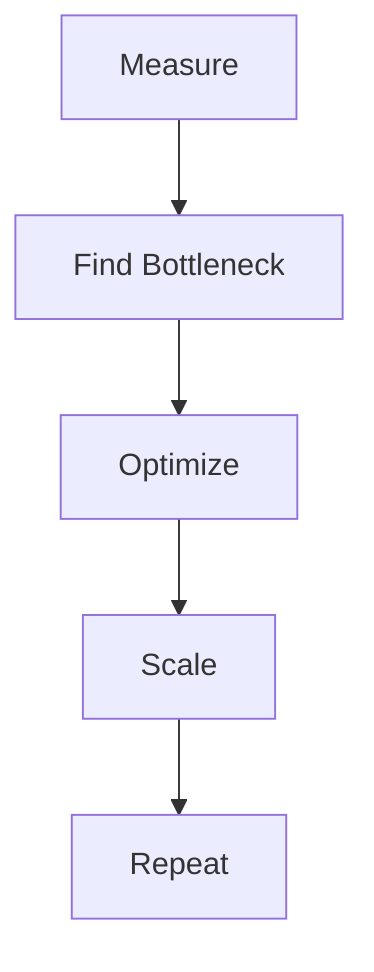

Perfect—now let’s go **full practical “HOW engineers actually scale systems step-by-step”** (this is the *real interview + production thinking* 🔥)

---

# 📘 Module 6 – HOW to Scale Systems (Real Engineering Playbook)

---

# 🎯 Core Idea

> You don’t scale systems.
> You scale **bottlenecks based on real load**.

---

# 1️⃣ HOW to Start Scaling (Golden Entry Point)

---

## ✅ Step 1: Measure Everything

Before touching architecture, collect:

* RPS (requests/sec)
* P95 / P99 latency
* CPU usage
* DB query time
* Error rate

---

## 🖼️ Visual



---

## 🧠 Real Tools

* Prometheus
* Grafana

---

## 🧠 Rule

> If you can’t measure it, you can’t scale it.

---

# 2️⃣ HOW to Identify Bottlenecks

---

## ✅ Step 2: Find the Slowest Component

Check:

* API latency
* DB response time
* Queue lag
* CPU spikes

---

## 🖼️ Example



---

## 🧠 Real Scenario

* API = 50ms ✅
* DB = 800ms ❌

👉 Bottleneck = **Database**

---

## 🧠 Rule

> Always scale the slowest part first.

---

# 3️⃣ HOW to Fix Before Scaling

---

## ✅ Step 3: Optimize First

Before adding servers:

### Fix queries

```sql
CREATE INDEX idx_order_user ON orders(user_id);
```

### Reduce payload

```js
SELECT id, status FROM orders;
```

---

## 🧠 Rule

> Optimization is cheaper than scaling.

---

# 4️⃣ HOW to Scale API Layer

---

## ✅ Step 4: Add More Instances



---

## 🧠 Requirements

* stateless APIs
* no local session storage

---

## 🧠 Rule

> Stateless services scale infinitely (almost)

---

# 5️⃣ HOW to Distribute Load Properly

---

## ✅ Step 5: Use Load Balancer

---

### Algorithms

* Round Robin
* Least Connections
* Weighted

---

## 🧠 Tools

* NGINX
* HAProxy

---

## 🧠 Rule

> Uneven traffic = hidden bottlenecks

---

# 6️⃣ HOW to Scale Database (Hardest Part)

---

## ✅ Step 6A: Read Scaling



👉 Reads go to replicas

---

## ✅ Step 6B: Write Scaling (Advanced)

* partitioning (sharding)
* batching
* queues

---

## 🧠 Rule

> Databases don’t scale like APIs—handle carefully

---

# 7️⃣ HOW to Reduce Load Using Caching

---

## ✅ Step 7: Add Cache Layer



---

## 🧠 Example

* menu data
* product list
* user profile

---

## 🧠 Tool

* Redis

---

## 🧠 Rule

> Cache = cheapest scalability boost

---

# 8️⃣ HOW to Handle Traffic Spikes

---

## ✅ Step 8: Auto Scaling

```mermaid
flowchart TD
    Traffic --> CPU High --> Add Instances
```

---

## 🧠 Setup Example

* CPU > 70% → scale out
* CPU < 30% → scale in

---

## 🧠 Platforms

* AWS Auto Scaling
* Azure Scale Sets

---

## 🧠 Rule

> Systems should scale automatically, not manually

---

# 9️⃣ HOW to Scale Components Independently

---

## ✅ Step 9: Scale Based on Usage

---

## 🍔 Example

| Service | Scaling           |
| ------- | ----------------- |
| Menu    | High (read-heavy) |
| Orders  | Medium            |
| Payment | Low (critical)    |

---

## 🖼️ Visual



---

## 🧠 Rule

> Scale what is used, not everything

---

# 🔟 HOW to Build Scalable Architecture

---

## ✅ Final Flow



---

## 🧠 Breakdown

* LB distributes traffic
* API handles requests
* Cache reduces DB load
* DB stores data
* Queue handles async tasks

---

# 🧠 Golden Scaling Loop (VERY IMPORTANT)

---



---

# 🚨 Real Industry Mistakes

---

❌ Scaling everything
❌ Ignoring DB bottleneck
❌ No monitoring
❌ No caching
❌ Stateful APIs
❌ Manual scaling

---

# 🧠 Final Mental Model

> Traffic ↑ → Measure → Bottleneck → Optimize → Scale → Repeat

---

# 🚀 One-Line Summary

> Scaling is a continuous loop of measurement, optimization, and targeted growth.

---


