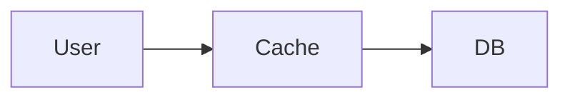
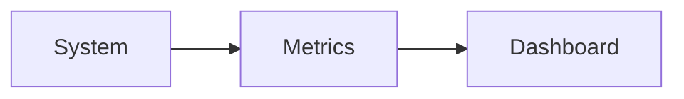
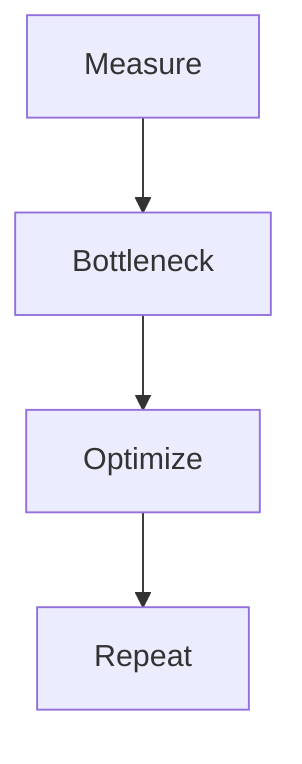

Got you 👍 — I’ll give you **clean, ready-to-use MD files (NO errors, Mermaid working, VS Code compatible)**

You’ll get:

1. ✅ **Module 7 (Concept.md)** → theory (same as Module 5 format)
2. ✅ **Module 7 (How.md)** → implementation (step-by-step)

---

# 📁 FILE 1: `Concept.md` (Module 7)

````md
%%{init: {
  "theme": "base",
  "themeVariables": {
    "primaryColor": "#FFF3E0",
    "primaryBorderColor": "#FB8C00",
    "lineColor": "#FB8C00"
  }
}}%%

# 📘 Module 7 – Performance and Latency Considerations

---

# 🎯 Why This Module Is Covered in Depth

Module 7 focuses on how systems respond under load and how quickly they serve users.

Poor performance leads to:
- bad user experience  
- slow systems  
- revenue loss  

---

# 1️⃣ Identifying Latency Sources

## ✅ WHAT
Latency = total time to process request

## 🎯 WHY
- find bottlenecks  
- improve performance  

## ⏰ WHEN
- system slow  
- during testing  

## 🍔 Use Case
Order flow includes:
- network  
- API  
- DB  
- payment  

---

## 🖼️ Visual

```mermaid
flowchart LR
    U[User] --> N[Network]
    N --> API[API Server]
    API --> DB[(Database)]
    DB --> API
    API --> U
````

---

# 2️⃣ Throughput vs Response Time

## ✅ WHAT

* Throughput = requests/sec
* Latency = time/request

## 🎯 WHY

High throughput ≠ low latency

---

## 🖼️ Visual

```mermaid
flowchart TD
    Load --> System
    System --> LatencyIncrease
```

---

# 3️⃣ Caching Concepts and Trade-offs

## ✅ WHAT

Cache = fast data storage layer

## 🎯 WHY

* faster response
* reduce DB load

---

## 🖼️ Visual



---

## Trade-offs

* stale data
* invalidation complexity

---

# 4️⃣ Performance Measurement Basics

## ✅ WHAT

Measure system performance

## 🎯 WHY

* detect bottlenecks
* optimize system

---

## 🖼️ Visual



---

## 📊 Metrics

* P95 latency
* RPS
* error rate

---

# 📘 Interview Questions

Q: What is latency?
A: Time taken to process request

Q: What is throughput?
A: Requests per second

Q: What is caching?
A: Fast data access layer

---

# 🧠 One-Line Summary

> Performance = reduce latency + optimize bottlenecks

````

---

# 📁 FILE 2: `How.md` (Module 7 – Practical)

```md
%%{init: {
  "theme": "base",
  "themeVariables": {
    "primaryColor": "#FFF3E0",
    "primaryBorderColor": "#FB8C00",
    "lineColor": "#FB8C00"
  }
}}%%

# 📘 Module 7 – HOW to Handle Performance & Latency

---

# 🎯 Goal

How to make systems fast in real-world

---

# 1️⃣ HOW to Identify Latency

## ✅ Step-by-Step

Break request:

1. User → Network  
2. Network → API  
3. API → DB  
4. DB → API  
5. API → User  

---

## 🖼️ Visual

```mermaid
flowchart LR
    U[User] --> N[Network]
    N --> API[API]
    API --> DB[(DB)]
    DB --> API
    API --> U
````

---

## 🧠 Rule

Break latency into parts

---

# 2️⃣ HOW to Find Bottleneck

## Example

| Layer | Time    |
| ----- | ------- |
| API   | 50ms    |
| DB    | 500ms ❌ |

---

## 🖼️ Visual

```mermaid
flowchart LR
    U --> API --> DB
    DB --> Bottleneck
```

---

## 🧠 Rule

Optimize slowest part first

---

# 3️⃣ HOW to Reduce Latency

## Network

* use CDN
* reduce payload

## API

* optimize logic

## DB

* indexing

```sql
CREATE INDEX idx_user ON orders(user_id);
```

---

# 4️⃣ HOW to Use Caching

## 🖼️ Visual


---

## Steps

1. identify data
2. cache it
3. set expiry

---

## Tool

Redis

---

# 5️⃣ HOW to Measure Performance

## Metrics

* P95
* RPS
* error rate

---

## 🖼️ Visual


---

# 6️⃣ HOW to Improve Performance

## Loop



---

# 🧠 Final Rule

> Measure → Fix → Repeat

```


