# 📘 Module 8 – Reliability and Fault Tolerance

---

# 🎯 Why This Module Matters

Distributed systems fail.

Question is not:

"Will failures happen?"

Question is:

"How does system behave when they happen?"

Most outages happen because of:

❌ No retry strategy  
❌ No isolation  
❌ No redundancy  
❌ Cascading failures

---

# 🧠 Real-Life Mapping (Food Delivery → Reliability)

| Real System Problem | Reliability Pattern |
|---------------------|-------------------|
| Payment Gateway Down | Retry + Fallback |
| Delivery Service Crash | Failure Isolation |
| Database Failure | Redundancy |
| Recommendation Failure | Graceful Degradation |

---

# 1️⃣ Designing For Failures

---

## ✅ WHAT

Build assuming components fail.

---

## 🎯 WHY

Without this:

- Single failure breaks entire flow

---

## ❌ Fragile System

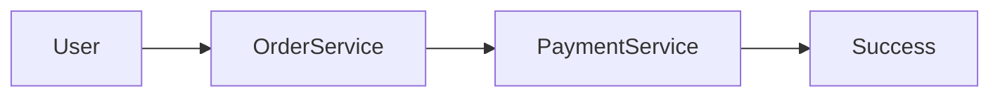

Payment fails → everything fails.

---

## ✅ Failure-Aware System

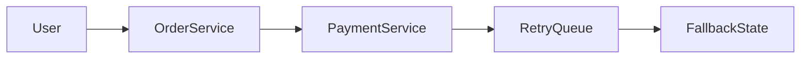

---

## 🧠 Meaning

Failures expected.

System survives.

---

# 2️⃣ Redundancy and Graceful Degradation

---

## ✅ WHAT

Redundancy = backups

Graceful degradation = reduced service instead of outage

---

## ❌ No Redundancy

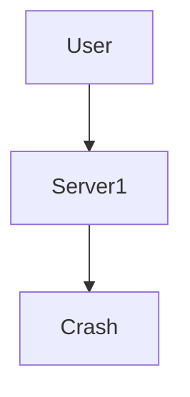

System down.

---

## ✅ With Redundancy

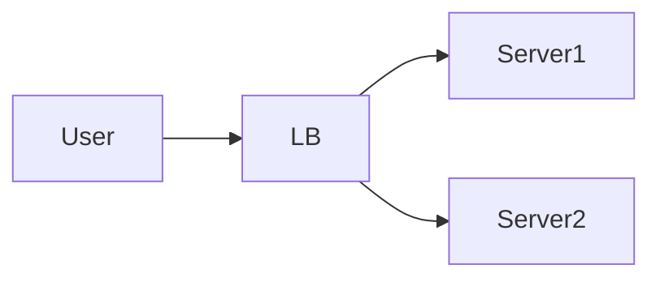

If one fails, traffic shifts.

---

## 🍔 Graceful Degradation Example

Recommendations fail:

Show basic restaurant listing.

Ordering still works.

---

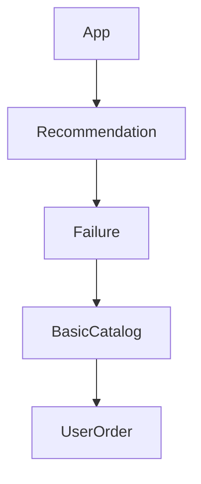

---

# 3️⃣ Timeout Retry Fallback

---

## ✅ WHAT

Three protection layers:

- Timeout  
- Retry  
- Fallback

---

## Retry Pattern

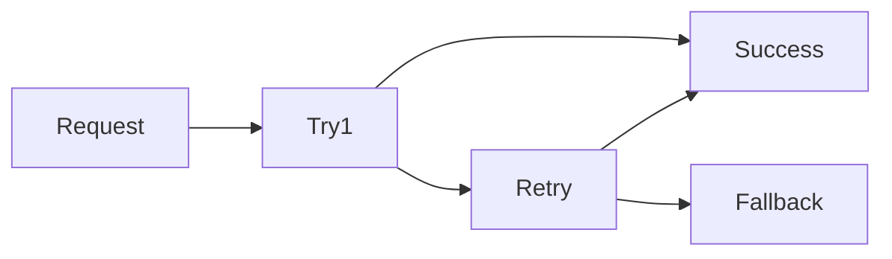

---

## 🧠 Meaning

Don't wait forever.

Recover first.

Fallback if needed.

---

## Common Rule

Retry only for transient failures.

---

# 4️⃣ Failure Isolation

---

## ✅ WHAT

One failing service should not break all services.

---

## ❌ Bad Design

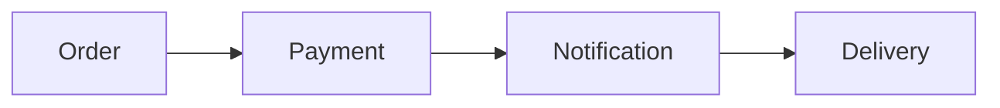

Notification fails

Everything blocks.

---

## ✅ Failure Isolation

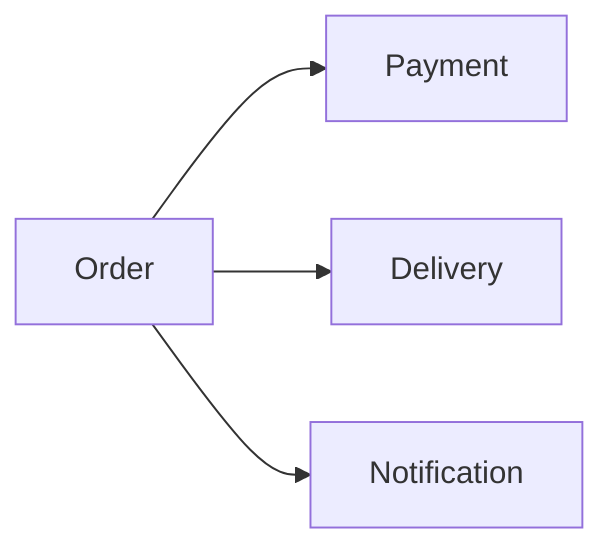

Notification fails

Order still completes.

---

## Event Isolation Example

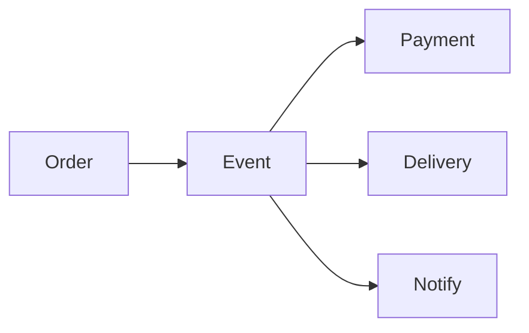

Loose coupling.

Failure contained.

---

# 5️⃣ Circuit Breaker

---

## Circuit Breaker States

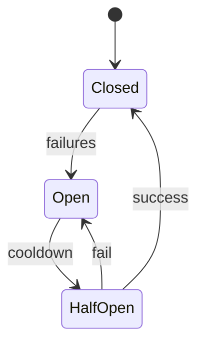

---

## Meaning

Stop hitting broken service repeatedly.

---

# 6️⃣ Reliability Tools

---

## Infrastructure

- Kubernetes Health Probes  
- Load Balancers  
- Multi-AZ Deployments

---

## Messaging

- Apache Kafka  
- RabbitMQ

---

## Reliability Patterns

- Circuit Breakers  
- Bulkheads  
- Dead Letter Queues

---

# 🚨 Common Mistakes

---

❌ Infinite retries

❌ No timeout

❌ Shared dependency blast radius

❌ Assuming services always available

❌ No fallback logic

---

# 🧠 How To Evaluate Reliability

Ask:

- What fails first?
- What happens if dependency dies?
- Can system degrade?
- Is blast radius limited?

---

# 🎯 Interview Thinking

---

## Q: What is fault tolerance?

Continue operating despite failures.

---

## Q: What is graceful degradation?

Reduced functionality instead of outage.

---

## Q: What causes cascading failures?

Uncontrolled dependency failures.

---

## Q: How do retries become dangerous?

Retry storms increase load.

---

# 🔟 Final Mental Model

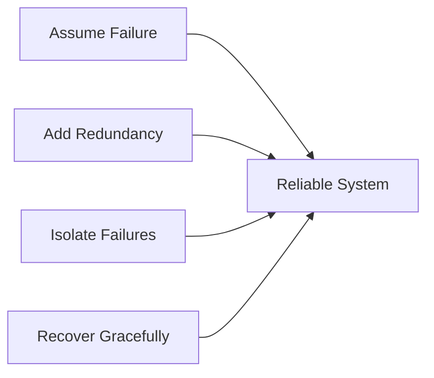

---

# 🧠 One-Line Summary

Reliable systems assume failures, contain them, and continue serving users.

---