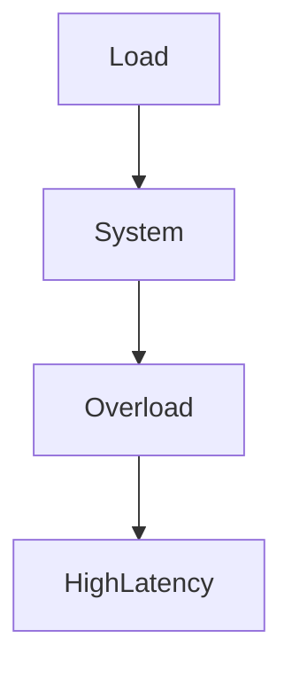
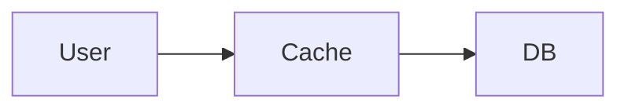
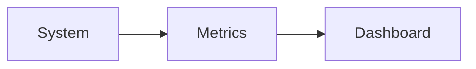
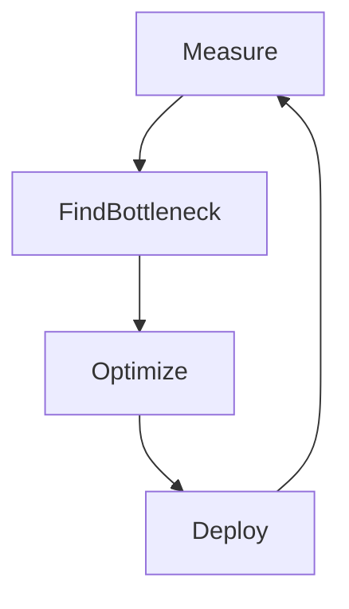
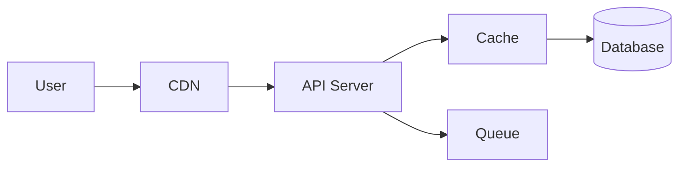

# 📁 FILE: `How.md` (Module 7 – FINAL)

````md
%%{init: {
  "theme": "base",
  "themeVariables": {
    "primaryColor": "#FFF3E0",
    "primaryBorderColor": "#FB8C00",
    "lineColor": "#FB8C00"
  }
}}%%

# 📘 Module 7 – HOW to Handle Performance & Latency

---

# 🎯 Goal of This README

> Learn how to make systems fast, responsive, and scalable in real-world production.

---

# 1️⃣ HOW to Identify Latency (Step-by-Step)

---

## ✅ Step 1: Break Request Flow

1. User → Network  
2. Network → API  
3. API → Database  
4. Database → API  
5. API → User  

---

## 🖼️ Visual

```mermaid
flowchart LR
    U[User] --> N[Network]
    N --> API[API Server]
    API --> DB[(Database)]
    DB --> API
    API --> U
````

---

## 🧠 HOW to Measure Each Step

* Network → Browser DevTools
* API → Logs / APM
* DB → Query logs

---

## 🧠 Rule

> Break latency into components, don’t guess.

---

# 2️⃣ HOW to Find Bottleneck

---

## ✅ Step 2: Measure Time

| Layer   | Time    |
| ------- | ------- |
| Network | 50ms    |
| API     | 30ms    |
| DB      | 500ms ❌ |

👉 Bottleneck = Database

---

## 🖼️ Visual

```mermaid
flowchart LR
    User --> API --> DB
    DB --> Bottleneck
```

---

## 🧠 Rule

> Optimize the slowest component first.

---

# 3️⃣ HOW to Reduce Latency

---

## ✅ Network Optimization

* Use CDN
* Compress responses
* Reduce payload size

---

## ✅ API Optimization

* Avoid heavy loops
* Use async processing
* Reduce unnecessary calls

---

## ✅ Database Optimization

```sql
CREATE INDEX idx_user ON orders(user_id);
```

* Add indexes
* Avoid full table scans
* Reduce joins

---

## 🧠 Rule

> Most latency comes from DB + Network

---

# 4️⃣ HOW to Balance Throughput vs Latency

---

## ✅ Step 4: Control Load

* Add queue
* Limit concurrency
* Scale horizontally

---

## 🖼️ Visual



---

## 🧠 Rule

> Control incoming load, don’t just scale blindly.

---

# 5️⃣ HOW to Implement Caching

---

## ✅ Step 1: Identify Cacheable Data

* Menu data
* Product lists
* User profiles

---

## ✅ Step 2: Add Cache Layer



---

## ✅ Step 3: Choose Strategy

| Strategy      | Use Case           |
| ------------- | ------------------ |
| Cache-aside   | Most common        |
| Write-through | Strong consistency |
| Write-back    | High performance   |

---

## 🧠 Tool

Redis

---

## 🧠 Rule

> Cache frequently accessed data only.

---

# 6️⃣ HOW to Handle Cache Problems

---

## ❌ Stale Data

Solution:

* TTL (expiry)
* Invalidate on update

---

## ❌ Cache Miss Storm

Solution:

* Preload cache
* Rate limiting

---

## 🧠 Rule

> Cache improves speed but needs careful handling.

---

# 7️⃣ HOW to Measure Performance

---

## ✅ Metrics

| Metric     | Meaning            |
| ---------- | ------------------ |
| P50        | Average latency    |
| P95        | Typical worst-case |
| P99        | Worst-case         |
| RPS        | Throughput         |
| Error Rate | Failures           |

---

## 🖼️ Visual



---

## 🧠 Tools

* Prometheus
* Grafana

---

## 🧠 Rule

> Monitor continuously, not occasionally.

---

# 8️⃣ HOW to Improve Performance (Golden Loop)

---



---

## 🧠 Process

1. Measure latency
2. Identify bottleneck
3. Optimize
4. Deploy
5. Repeat

---

# 9️⃣ Real System Example

---

## 🍔 Food Delivery System



---

## Breakdown

* CDN → reduces network latency
* Cache → reduces DB load
* Queue → handles async work

---

# 🔟 Common Mistakes

---

❌ No caching
❌ Too many DB joins
❌ No indexing
❌ Ignoring P95/P99
❌ Optimizing without measuring

---

# 🧠 Final Mental Model

> Latency = Network + API + DB + External calls

---

# 🚀 One-Line Summary

> Measure → Identify → Optimize → Cache → Repeat

```


