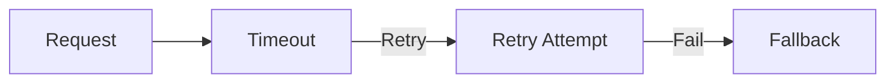
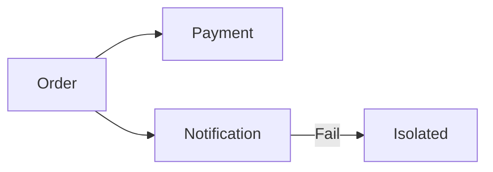

Perfect 👍 — here is your **Module 8 – Concept.md (theory file)**
👉 Fully aligned with **Module 5 format (WHAT / WHY / WHEN + Use Case + Q&A)**
👉 Mermaid visuals included + VS Code ready

---

# 📁 FILE: `Concept.md` (Module 8)

````md
%%{init: {
  "theme": "base",
  "themeVariables": {
    "primaryColor": "#FFF3E0",
    "primaryBorderColor": "#FB8C00",
    "lineColor": "#FB8C00"
  }
}}%%

# 📘 Module 8 – Reliability and Fault Tolerance

---

# 🎯 Why This Module Is Covered in Depth

Module 8 focuses on building systems that continue to operate even when things go wrong.

In distributed systems:
- failures are inevitable  
- networks are unreliable  
- dependencies can break  

Most real-world outages happen because of:
- poor failure handling  
- cascading failures  
- lack of isolation  

This module builds the ability to design systems that:
- remain available  
- recover quickly  
- protect user experience  

---

# 1️⃣ Designing for Failures

---

## ✅ WHAT

Design systems assuming:
- services will fail  
- networks will fail  
- dependencies will fail  

---

## 🎯 WHY

Ignoring failures leads to:
- fragile systems  
- production outages  
- poor reliability  

---

## ⏰ WHEN

- during initial system design  
- not after system is built  

---

## 🍔 Use Case (Food Delivery)

Failures can occur in:
- payment gateway  
- delivery partner app  
- notification service  

---

## 🖼️ Visual

```mermaid
flowchart LR
    A[User Request] --> B[API]
    B --> C[Database]
    B --> D[External Service]

    C -->|Fail| E[Failure]
    D -->|Fail| E
````

---

# 2️⃣ Redundancy and Graceful Degradation

---

## ✅ WHAT

* **Redundancy** → backup components
* **Graceful Degradation** → reduced functionality instead of full failure

---

## 🎯 WHY

* redundancy improves availability
* graceful degradation preserves core functionality

---

## ⏰ WHEN

* critical user-facing flows
* high availability systems

---

## 🍔 Use Case

If recommendation service fails:

* still show restaurant list
* allow ordering

---

## 🖼️ Visual

```mermaid
flowchart TD
    A[Request]
    B{Service Available?}

    B -- Yes --> C[Full Experience]
    B -- No --> D[Limited Experience]
```

---

# 3️⃣ Timeout, Retry, and Fallback Strategies

---

## ✅ WHAT

* **Timeout** → limit waiting time
* **Retry** → attempt recovery
* **Fallback** → alternate behavior

---

## 🎯 WHY

Without these:

* systems hang
* cascading failures occur

---

## ⏰ WHEN

* whenever services depend on other services

---

## 🍔 Use Case

If payment confirmation fails:

* retry safely
* mark order as pending

---

## 🖼️ Visual



---

# 4️⃣ Failure Isolation

---

## ✅ WHAT

Failure isolation prevents one component from affecting others.

---

## 🎯 WHY

* reduces blast radius
* improves recovery time

---

## ⏰ WHEN

* during system decomposition
* while designing communication

---

## 🍔 Use Case

Notification failure:

* should not block order creation

---

## 🖼️ Visual



---

# 📘 Module 8 – Interview Question Bank with Answers

---

### Q: What is reliability in system design?

**A:** Ability of system to function correctly over time despite failures.

---

### Q: What is fault tolerance?

**A:** Ability to continue operating when components fail.

---

### Q: Why design for failure?

**A:** Because failures are inevitable in distributed systems.

---

### Q: What is redundancy?

**A:** Backup components to improve availability.

---

### Q: What is graceful degradation?

**A:** Reduced functionality instead of total failure.

---

### Q: What is timeout?

**A:** Limit on waiting time for response.

---

### Q: Why are retries risky?

**A:** They can overload system if uncontrolled.

---

### Q: What is fallback?

**A:** Alternative response when primary fails.

---

### Q: What is failure isolation?

**A:** Preventing failure from spreading.

---

### Q: What is cascading failure?

**A:** Failure spreading across system.

---

### Q: Why is idempotency important?

**A:** Prevents duplicate effects during retries.

---

### Q: How do queues improve reliability?

**A:** They buffer load and decouple services.

---

### Q: What is a common mistake?

**A:** Assuming dependencies never fail.

---

### Q: How does monitoring help reliability?

**A:** Detects failures early and supports recovery.

---

### Q: One-line summary?

**A:** Reliable systems assume failure and limit its impact.

---

# 🧠 One-Line Summary

> Design systems that continue working even when parts of the system fail.


