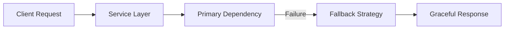
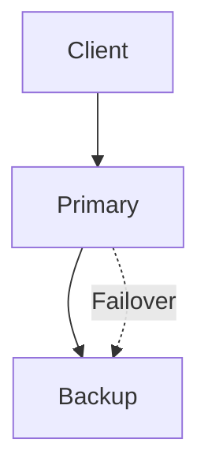
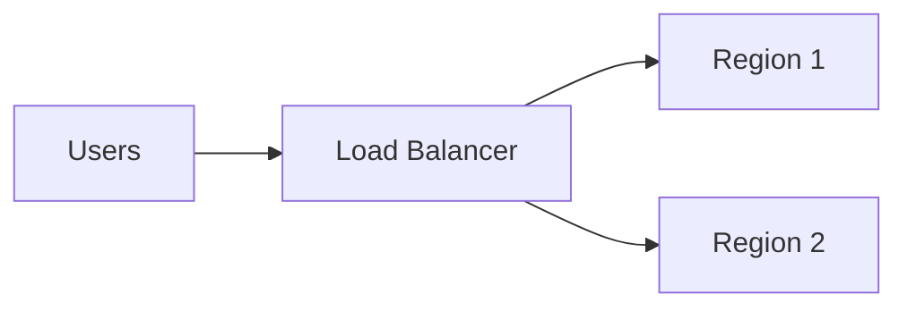
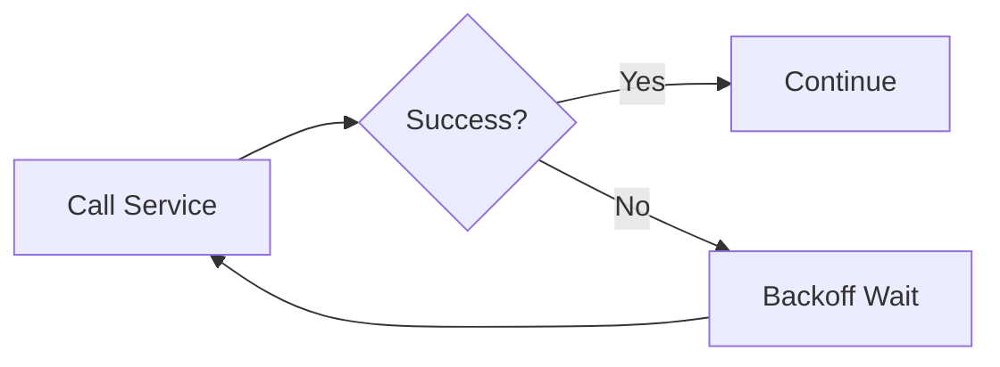
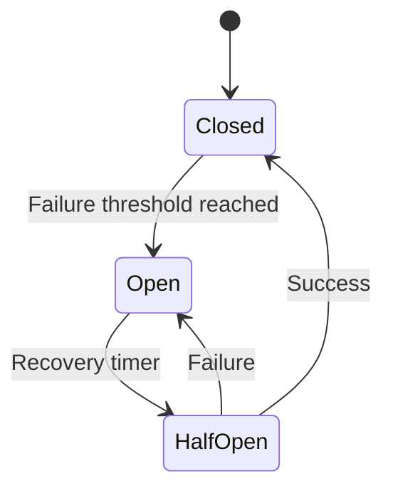
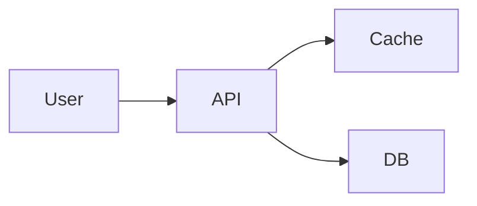
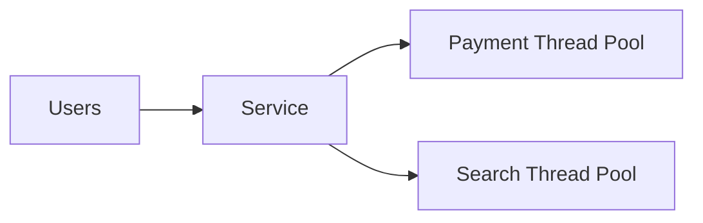
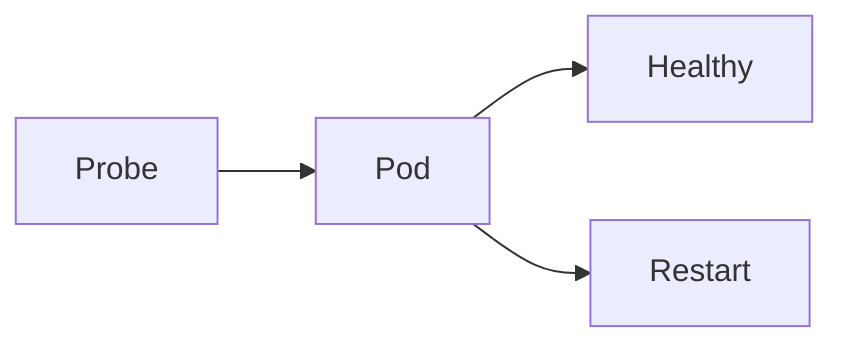
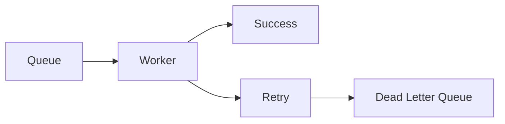
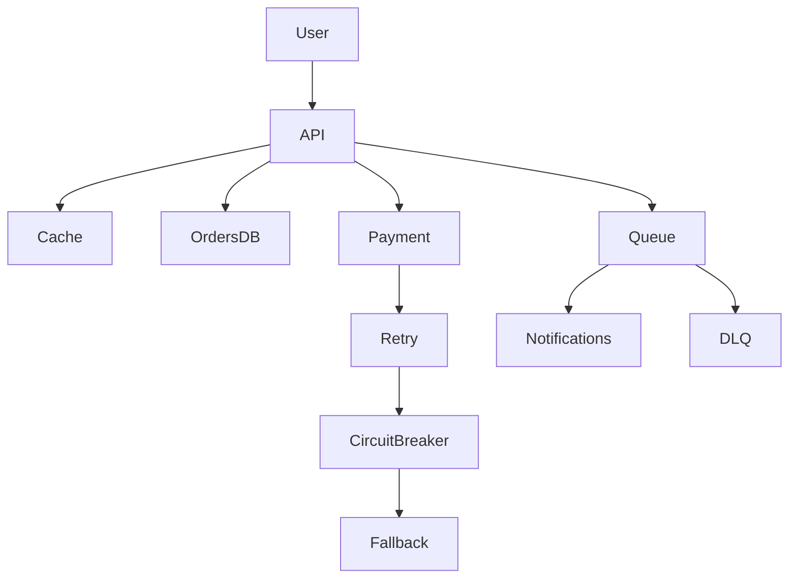

# Module 8 — Reliability and Fault Tolerance (HOW)

## Why "How" Matters

Concepts explain *what reliability is.*

This module explains *how to engineer it into systems.*

Failures are normal in distributed systems.

Good architectures survive failure.

---

# 1. Designing for Failure

## Goal
Build systems assuming components will fail.

## Implementation Steps



### How To Do It

### Step 1 — Identify Failure Points

Map every dependency:

- Database failure
- Cache failure
- Network timeout
- Third-party API failure

Example:

Food ordering system:

- Payment gateway unavailable
- Delivery service unreachable
- Notification provider down

---

### Step 2 — Define Failure Behavior

For each dependency decide:

- Retry?
- Fallback?
- Queue for later?
- Fail fast?

Example:

Payment retry:

```text
Try 1 → Timeout
Try 2 → Retry
Try 3 → Send to dead-letter queue
```

---

### Step 3 — Design Degraded Mode

Critical path survives.

Examples:

- Recommendation fails → show popular items
- Notification fails → continue order placement
- Search partially fails → return cached results

---

# 2. Redundancy

## Active-Passive



How:

- Secondary standby replica
- Promote during outage

Use Cases:

- Databases
- Disaster recovery

---

## Active-Active



How:

- Multiple live regions
- Traffic distributed
- Failover automatic

Use Cases:

- Global services
- High availability systems

---

# 3. Retries with Backoff

Without backoff:

```text
Retry immediately
Retry immediately
Retry immediately

Creates retry storm
```

---

With exponential backoff:

```text
Retry 1: wait 1 second
Retry 2: wait 2 seconds
Retry 3: wait 4 seconds
```

## Pattern



---

## Add Jitter

Avoid synchronized retries.

Formula:

```text
delay = base * 2^attempt + random jitter
```

---

# 4. Circuit Breaker

Protect systems from cascading failure.

States:

- Closed
- Open
- Half Open



---

## How It Works

Closed:

Requests flow normally.

Open:

Requests blocked.

Fallback returned.

Half Open:

Limited traffic used to test recovery.

---

# 5. Timeouts

Never wait forever.

Request timeout:

```text
API timeout = 500 ms
DB timeout = 200 ms
Cache timeout = 50 ms
```

Rule:

Timeout should be shorter upstream than downstream.

---

## Timeout Chain



Bad:

DB hangs forever

Everything backs up

Good:

Timeout trips

Fallback used

---

# 6. Bulkheads

Isolate failures.

Ship compartments analogy.



Payment overload should not crash search.

---

# 7. Health Checks

## Liveness Check

Is process alive?

```text
/health/live
```

---

## Readiness Check

Can service receive traffic?

```text
/health/ready
```

---

Kubernetes Example



---

# 8. Idempotency

Retry-safe operations.

Bad:

Customer charged twice.

Good:

Idempotency key:

```text
order-8471-payment
```

Repeated requests reuse result.

---

# 9. Dead Letter Queues

Messages that repeatedly fail go here.



Used for:

- Failed events
- Poison messages
- Recovery analysis

---

# 10. Observability for Reliability

Must monitor:

- Error rate
- Latency
- Saturation
- Availability

Golden signals:

```text
Latency
Traffic
Errors
Saturation
```

---

# Food Delivery Reliability Architecture



---

# Failure Walkthrough

Scenario:

Payment gateway down.

System response:

1 Detect timeout

2 Retry with backoff

3 Circuit opens

4 Use alternate provider

5 Queue payment if needed

6 User sees graceful message

Order survives.

---

# Interview Storytelling

Explain reliability in this order:

1 Assume failure

2 Add redundancy

3 Contain failures

4 Recover automatically

5 Observe continuously

Simple formula:

```text
Prevent
Detect
Contain
Recover
Observe
```

---

# Mini Exercise

Design reliability for ride-sharing:

Handle:

- Driver service down
- Pricing service timeout
- Notification failures
- Region outage

Apply:

- Retries
- Circuit breakers
- Failover
- DLQ

---

# Common Mistakes

Avoid:

- Infinite retries
- No timeout limits
- Shared thread pools
- No degraded mode
- Ignoring partial failures

---

# Summary

Reliability is engineered through:

- Redundancy
- Retries
- Timeouts
- Circuit breakers
- Bulkheads
- Idempotency
- Observability

Goal:

System does not avoid failure.

System survives failure.