Perfect 👍 — here is your **Module 8 (HOW.md)** in the same clean, working format as Module 7.

👉 This is:

* ✅ Fully Mermaid-compatible
* ✅ VS Code ready
* ✅ Teaching + real engineering mindset
* ✅ Aligned with your template

---

# 📁 FILE: `How.md` (Module 8 – Reliability & Fault Tolerance)

````md
%%{init: {
  "theme": "base",
  "themeVariables": {
    "primaryColor": "#FFF3E0",
    "primaryBorderColor": "#FB8C00",
    "lineColor": "#FB8C00"
  }
}}%%

# 📘 Module 8 – HOW to Build Reliable & Fault-Tolerant Systems

---

# 🎯 Goal of This README

> Learn how to design systems that continue working even when failures happen.

---

# 1️⃣ HOW to Design for Failures

---

## ✅ Step 1: Assume Everything Can Fail

- APIs can fail  
- Databases can fail  
- Networks can fail  
- Third-party services can fail  

---

## 🖼️ Visual

```mermaid
flowchart LR
    A[User Request] --> B[API]
    B --> C[Database]
    B --> D[External Service]

    C -->|Fail| E[Failure]
    D -->|Fail| E
````

---

## 🧠 Rule

> Failure is normal, not exceptional

---

# 2️⃣ HOW to Add Redundancy

---

## ✅ Step 2: Duplicate Critical Components

* multiple API servers
* replicated databases
* backup services

---

## 🖼️ Visual

```mermaid
flowchart LR
    LB[Load Balancer]
    LB --> S1[Server 1]
    LB --> S2[Server 2]
    LB --> S3[Server 3]
```

---

## 🧠 Rule

> No single point of failure

---

# 3️⃣ HOW to Implement Graceful Degradation

---

## ✅ Step 3: Reduce Features Instead of Failing

---

## 🍔 Example

If recommendation service fails:

* show basic restaurant list
* still allow order

---

## 🖼️ Visual

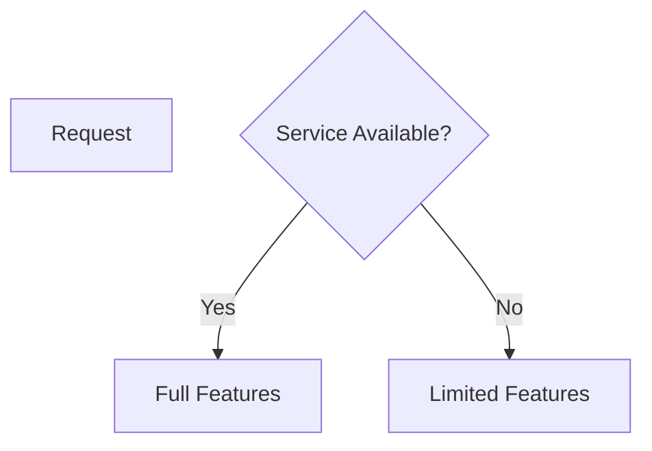

---

## 🧠 Rule

> Partial experience is better than no experience

---

# 4️⃣ HOW to Use Timeout, Retry, Fallback

---

## ✅ Step 4: Apply Protection Strategies

---

### Timeout

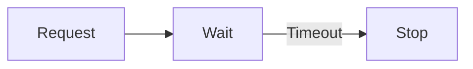

---

### Retry

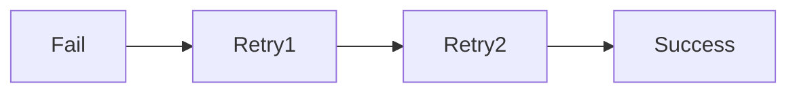

---

### Fallback

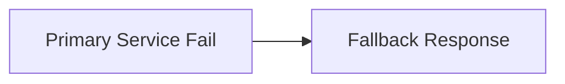

---

## 🧠 Rules

* Always set timeout
* Limit retries
* Use fallback safely

---

# 5️⃣ HOW to Prevent Cascading Failures

---

## ❌ Problem

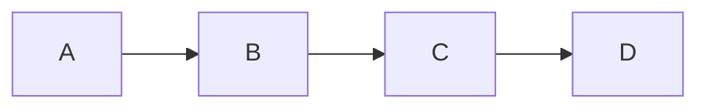

If B fails → entire chain fails

---

## ✅ Solution

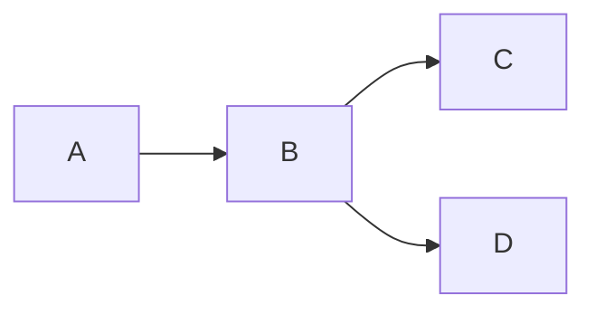

👉 isolate failures

---

## 🧠 Rule

> Avoid long dependency chains

---

# 6️⃣ HOW to Implement Failure Isolation

---

## ✅ Step 6: Isolate Components

---

## 🍔 Example

* Notification failure ≠ Order failure
* Payment failure handled separately

---

## 🖼️ Visual

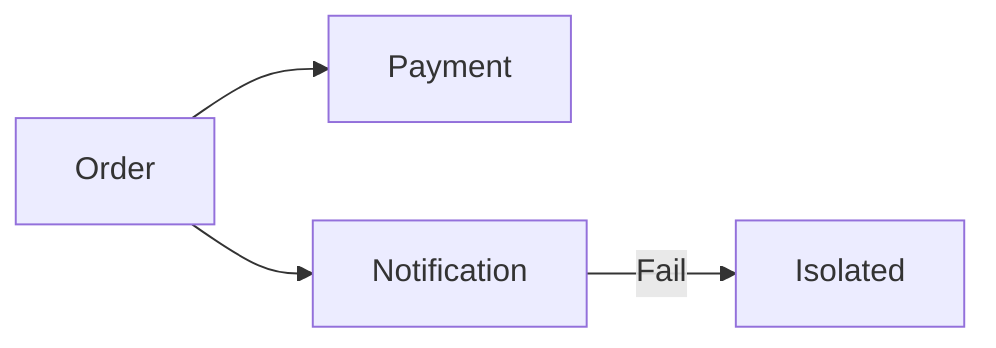

---

## 🧠 Rule

> Failure should not spread across system

---

# 7️⃣ HOW to Use Queues for Reliability

---

## ✅ Step 7: Add Queue Between Services

---

## 🖼️ Visual

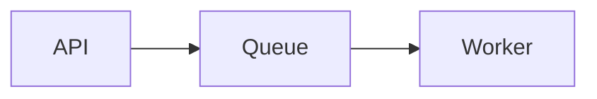

---

## 🧠 Benefits

* absorbs spikes
* prevents overload
* enables retry

---

## 🧠 Rule

> Queue = buffer for failures

---

# 8️⃣ HOW to Make Retries Safe (Idempotency)

---

## ✅ Step 8: Avoid Duplicate Effects

---

## 🖼️ Visual

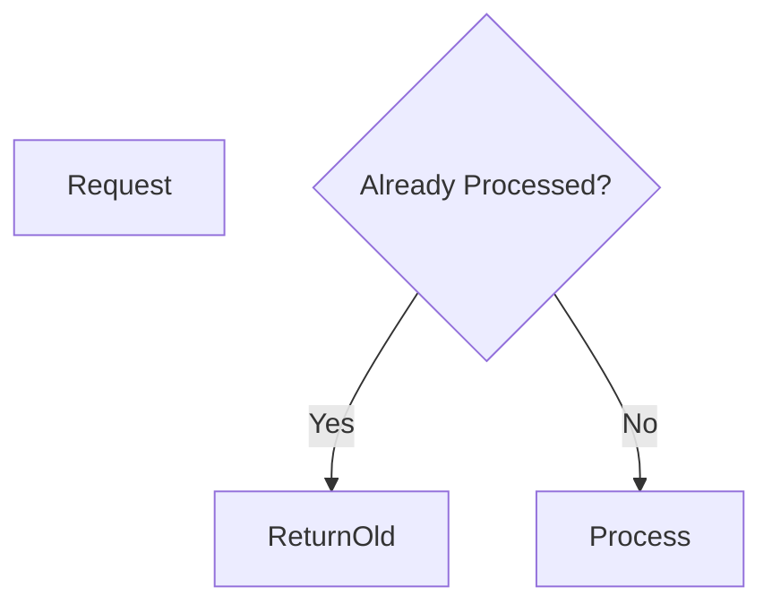

---

## 🧠 Example

* Payment API called twice
* should charge only once

---

## 🧠 Rule

> Retries must be idempotent

---

# 9️⃣ HOW to Monitor Failures

---

## ✅ Step 9: Track System Health

---

## 🖼️ Visual

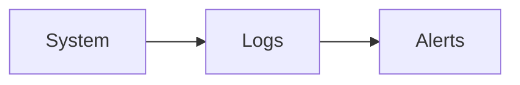

---

## 🧠 Monitor

* error rate
* latency
* failed requests

---

## 🧠 Rule

> Detect failures early

---

# 🔟 Real System Example

---

## 🍔 Food Delivery System

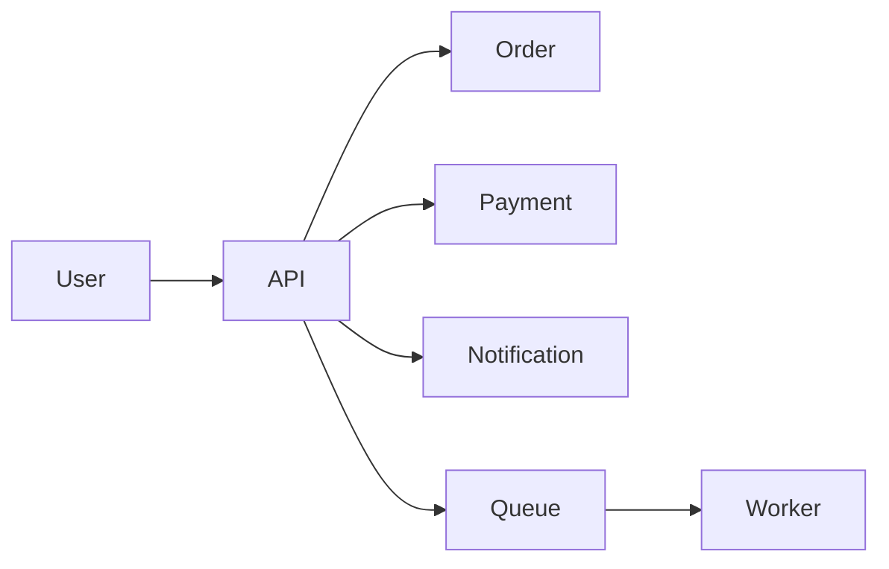

---

## Breakdown

* API handles request
* Queue handles async work
* Failures isolated
* retries handled safely

---

# 🚨 Common Mistakes

---

❌ No timeout
❌ Infinite retries
❌ No fallback
❌ Shared dependencies
❌ No monitoring

---

# 🧠 Final Mental Model

> Failures will happen → isolate → recover → continue

---

# 🚀 One-Line Summary

> Reliable systems assume failure and limit its impact.


