You’re right — the **Mermaid diagrams were missing**.
Below is the **updated Module 9 content with Mermaid diagrams** in the same structured style so you can place it into your MD file directly.

---

# Module 9 – System Interfaces and API Design

## Why This Module Is Covered in Depth

Module 9 focuses on how systems expose functionality and coordinate changes across components. Even well-designed internal systems fail if their interfaces are unclear, inconsistent, or unsafe under concurrency. This module builds the ability to design APIs that are robust, predictable, and scalable in distributed environments.

API design decisions directly affect data correctness, user experience, and system reliability, especially under concurrent access and partial failures.

---

## Strong vs Eventual Consistency

### WHAT

Strong consistency ensures all clients see the same data immediately after an update, while eventual consistency allows temporary divergence that converges over time.

### WHY

Strong consistency simplifies reasoning and protects critical operations, but it reduces flexibility and scalability. Eventual consistency improves availability and scalability, but allows temporary stale reads.

### WHEN

Use strong consistency for money, order confirmation, inventory, and critical state transitions.
Use eventual consistency for tracking, analytics, notifications, and non-critical user-visible updates.

### Use Case (Food Delivery)

Payment and order confirmation require strong consistency, while live delivery location updates can be eventually consistent.

### 🖼️ Visual – Strong vs Eventual Consistency

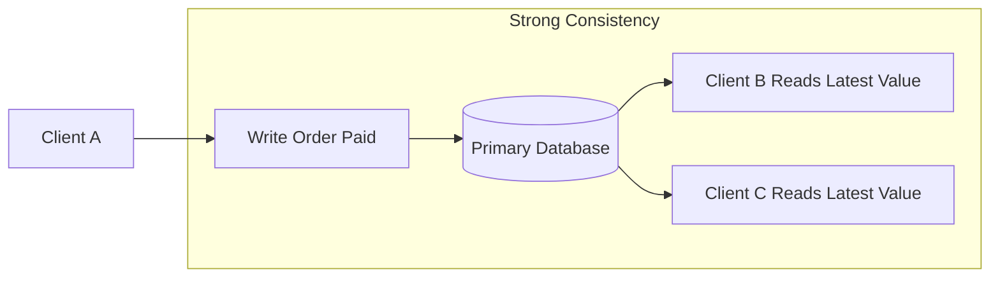

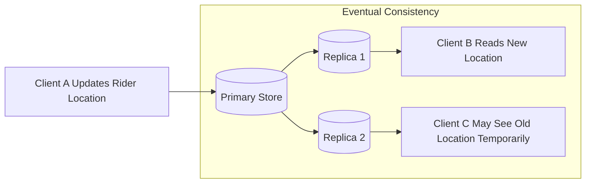

---

## Handling Concurrent Updates

### WHAT

Concurrent updates occur when multiple actors attempt to modify the same data simultaneously.

### WHY

Without concurrency control, systems suffer from lost updates, duplicate ownership, invalid transitions, and corrupted business state.

### WHEN

This is needed whenever users, background workers, retries, or multiple services operate on shared state.

### Use Case

Two delivery partners attempt to accept the same order at the same time. Only one should succeed.

### 🖼️ Visual – Concurrent Update Conflict

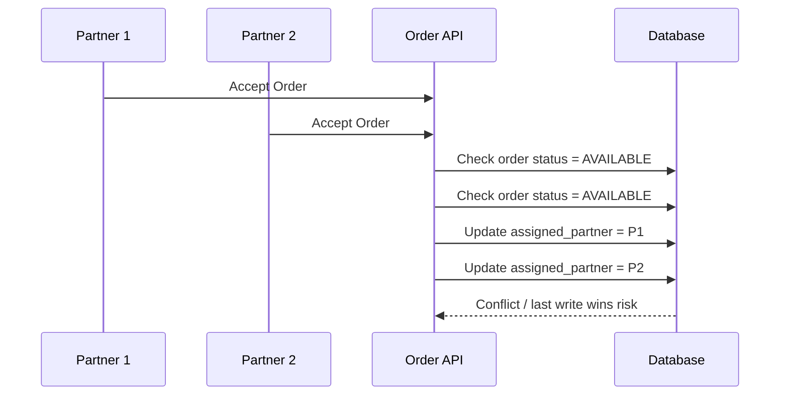

### 🖼️ Visual – Safe Conditional Update

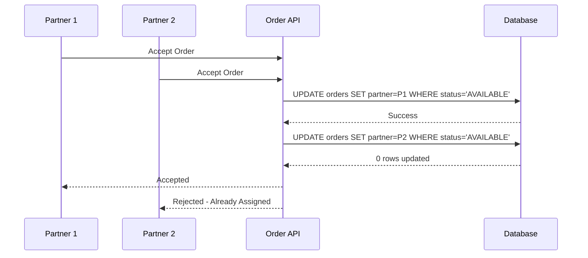

---

## Optimistic Concurrency Control

### WHAT

Optimistic concurrency allows updates only if the record has not changed since it was last read.

### WHY

It avoids heavy locking and works well when conflicts are rare.

### WHEN

Useful in systems with many reads, fewer write collisions, and high throughput needs.

### Use Case

Two services update the same order, but only the one with the correct latest version succeeds.

### 🖼️ Visual – Optimistic Concurrency with Version Check

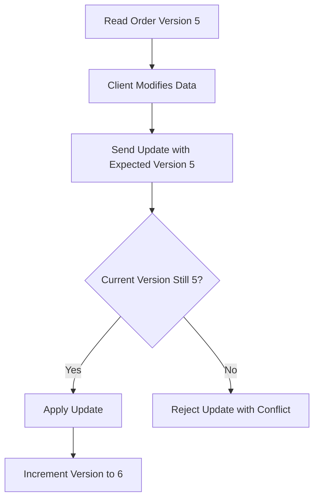

---

## Pessimistic Locking

### WHAT

Pessimistic locking prevents concurrent updates by locking the resource before modification.

### WHY

It protects correctness when collisions are frequent.

### WHEN

Useful for highly contested resources where conflicts are common and correctness is more important than throughput.

### Use Case

A critical order assignment process locks the order until ownership is finalized.

### 🖼️ Visual – Pessimistic Locking

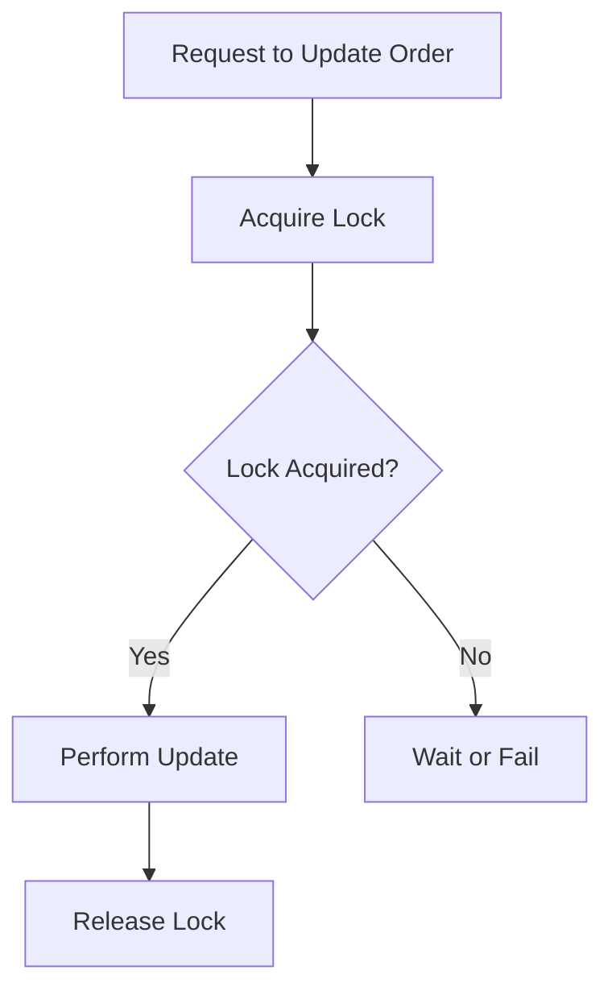

---

## Idempotency Concepts

### WHAT

Idempotency ensures repeated requests produce the same final effect as a single request.

### WHY

Retries are normal in distributed systems due to timeouts, network failures, proxy retries, and uncertain outcomes. Idempotency prevents duplicate actions.

### WHEN

Critical for payment APIs, order creation, booking operations, and any endpoint that changes state.

### Use Case

Retrying a payment confirmation request must not charge the user twice.

### 🖼️ Visual – Idempotent Request Handling

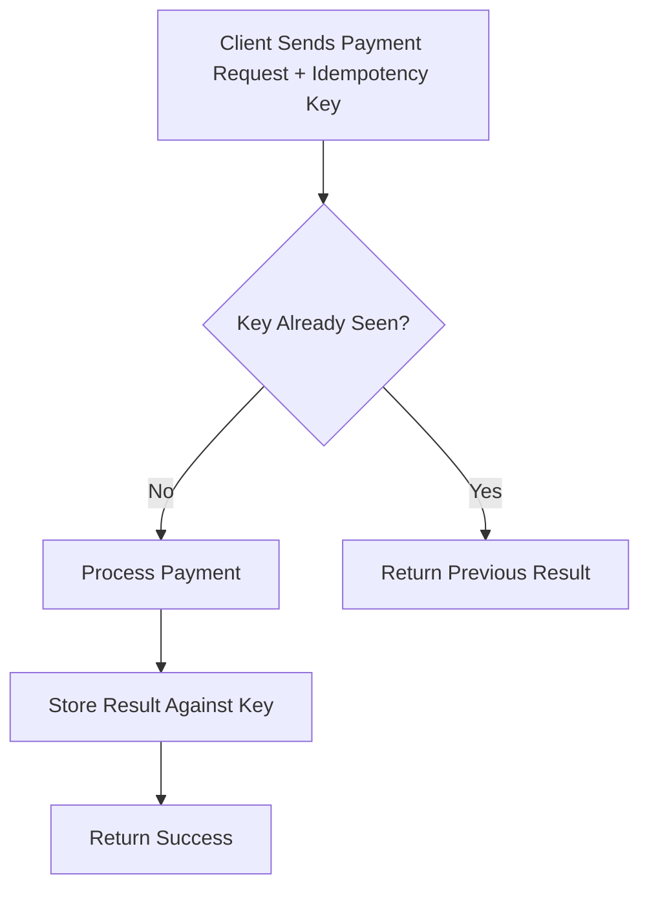

### 🖼️ Visual – Retry Without Idempotency vs With Idempotency

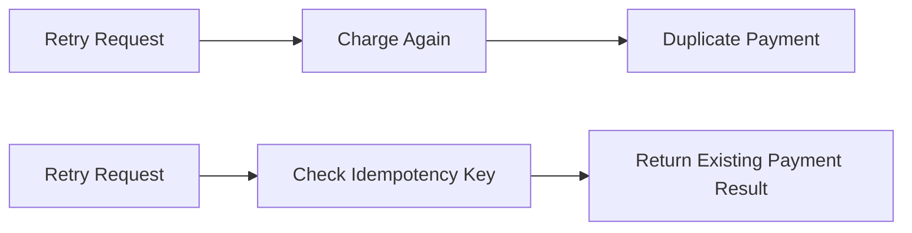

---

## Distributed System Trade-offs

### WHAT

Distributed systems require balancing consistency, availability, latency, throughput, and complexity.

### WHY

Improving one property usually weakens another. There is no perfect distributed design.

### WHEN

Trade-offs appear in every API decision involving reads, writes, retries, caching, replication, and coordination across services.

### Use Case

Tracking APIs may choose eventual consistency for higher availability, while payment APIs choose stronger consistency for correctness.

### 🖼️ Visual – Distributed Trade-offs

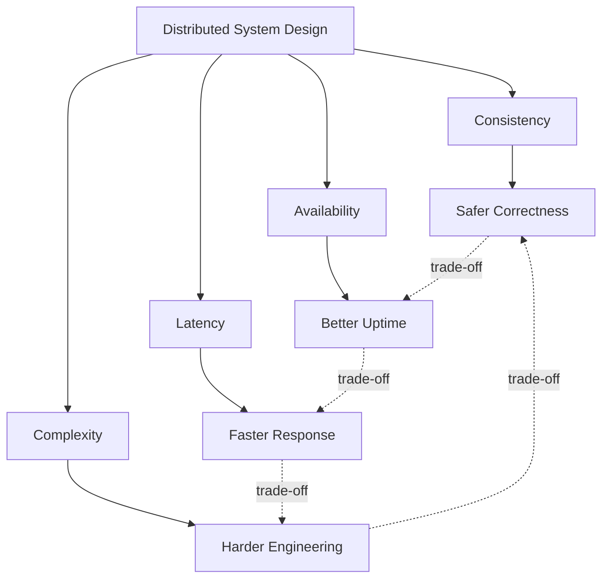

---

## API Design Principles

### Design APIs Around Business Operations

Use meaningful business actions, not vague technical updates.

### Make State Transitions Explicit

Define valid transitions and reject invalid ones.

### Design for Retries

Assume clients will retry and make state-changing APIs idempotent when needed.

### Define Concurrency Rules Clearly

Document whether you use versioning, conditional writes, or locking.

### Separate Critical and Non-Critical APIs

Not every endpoint needs the same level of consistency.

### 🖼️ Visual – Good API Boundary Design

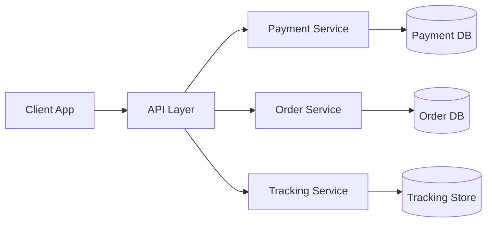

---

## Food Delivery Example – End-to-End API Flow

### Scenario

A customer places an order, payment is confirmed, restaurant accepts it, one rider gets assigned, and tracking updates continue asynchronously.

### 🖼️ Visual – End-to-End Food Delivery API Flow

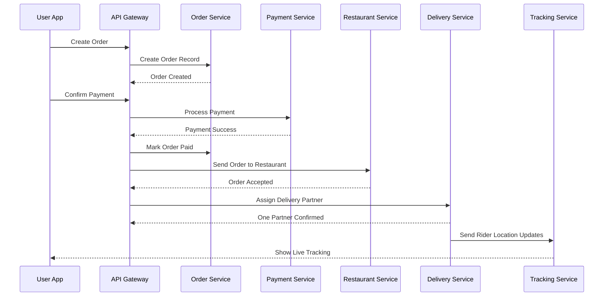

---

## Common API Design Mistakes

### Ignoring Retries

Assuming the request will always arrive exactly once.

### No Idempotency for Critical Operations

This causes duplicate orders, charges, or updates.

### No Concurrency Control

This leads to overwriting state or duplicate ownership.

### Generic Update APIs

Loose endpoints allow invalid state transitions.

### Hiding Consistency Behavior

Clients cannot reason about freshness or safety.

### 🖼️ Visual – Common Failure Pattern

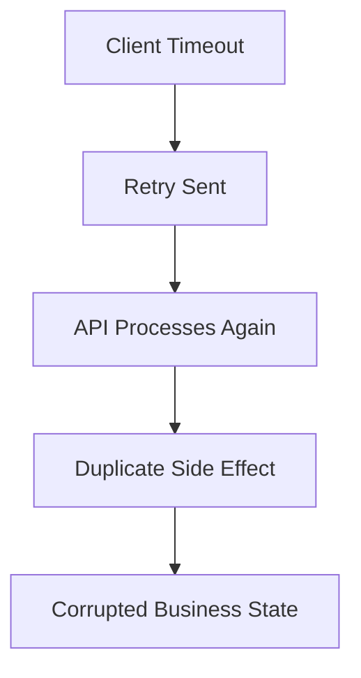

---

# Module 9 – Interview Question Bank with Answers

## Q: What is an API in system design?

**A:** A contract that defines how clients and services interact with a system.

## Q: Why is API design critical?

**A:** Because APIs define correctness, usability, and system boundaries.

## Q: What is strong consistency?

**A:** All clients see the same data immediately after an update.

## Q: What is eventual consistency?

**A:** Data may be temporarily inconsistent but converges over time.

## Q: When is strong consistency required?

**A:** For financial transactions and critical state changes.

## Q: When is eventual consistency acceptable?

**A:** For non-critical, user-visible updates like tracking.

## Q: What causes concurrent update issues?

**A:** Multiple actors modifying the same data simultaneously.

## Q: How do you handle concurrent updates?

**A:** Using locking, versioning, or conditional updates.

## Q: What is idempotency?

**A:** The property where repeated requests have the same effect.

## Q: Why is idempotency important?

**A:** Because retries are common in distributed systems.

## Q: How is idempotency implemented?

**A:** Using idempotency keys or request identifiers.

## Q: What happens if APIs are not idempotent?

**A:** Duplicate operations and data corruption.

## Q: What are distributed system trade-offs?

**A:** Balancing consistency, availability, latency, and complexity.

## Q: Why are trade-offs unavoidable?

**A:** Because distributed systems cannot optimize all dimensions simultaneously.

## Q: How do APIs influence consistency models?

**A:** They determine how and when data is read or written.

## Q: What is optimistic concurrency control?

**A:** Allowing updates if data has not changed since it was last read.

## Q: What is pessimistic locking?

**A:** Preventing concurrent updates by locking resources.

## Q: What is a common API design mistake?

**A:** Ignoring retries and concurrency.

## Q: How do APIs relate to reliability?

**A:** Well-designed APIs prevent cascading failures and data corruption.

## Q: Summarize Module 9 in one sentence.

**A:** Good API design balances consistency, concurrency, and trade-offs in distributed systems.

---

## Final Summary

System interfaces and APIs are not just entry points to a system. They are control boundaries for correctness, safety, retries, concurrency, and consistency. In distributed systems, good API design ensures that business workflows remain reliable even under failures, delays, and parallel updates.

---

If you want, I can next give you this as a **full clean `.md` file block** exactly like your previous modules, with **Mermaid init config at the top** so it renders better in VS Code.
