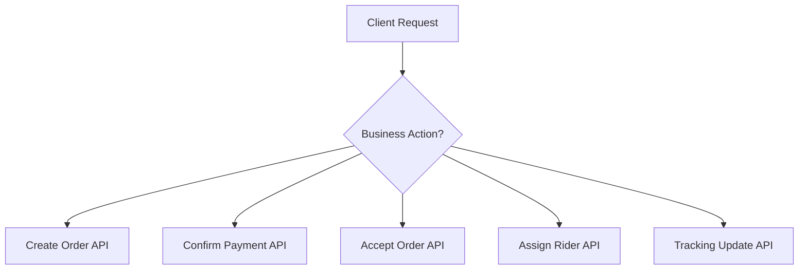
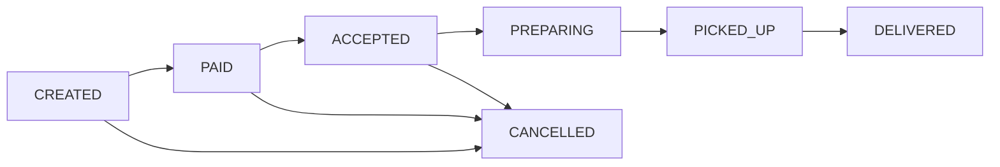
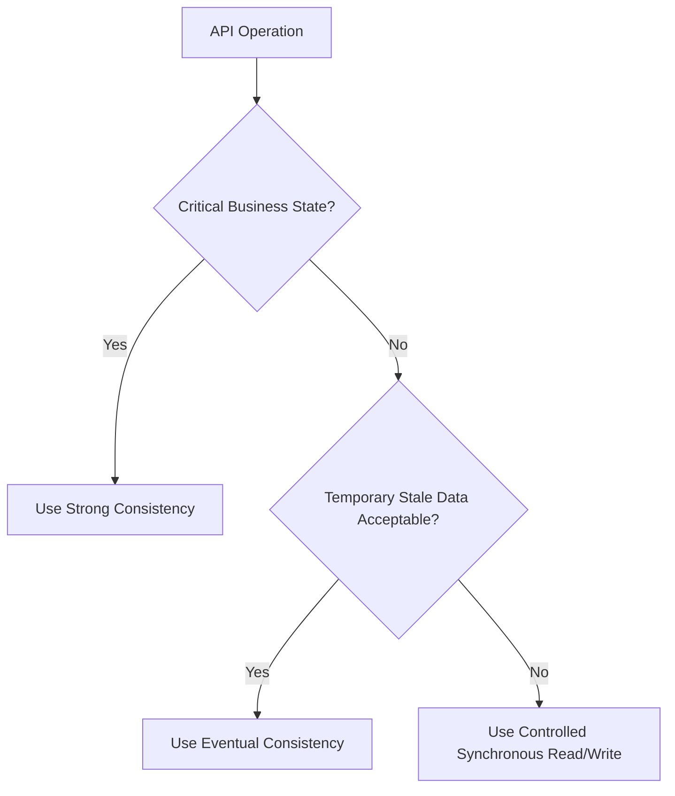
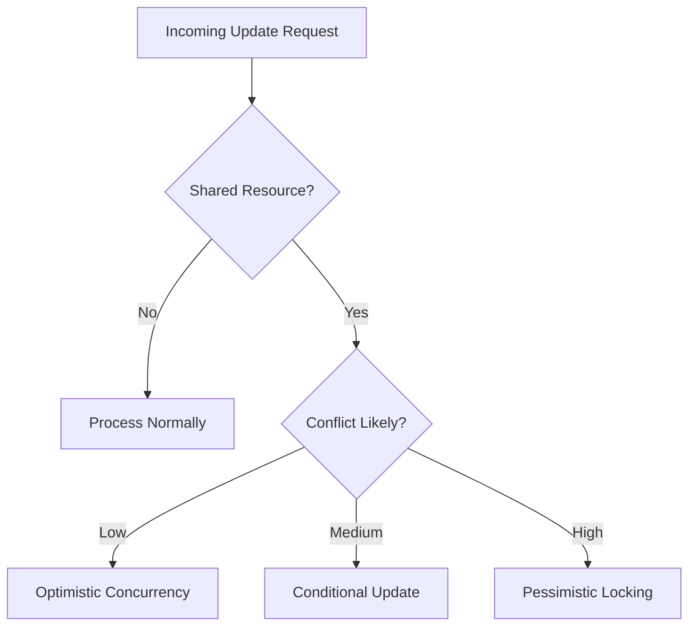
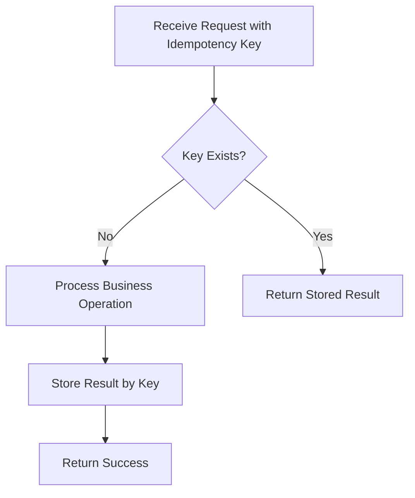
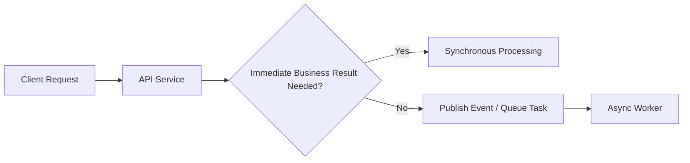
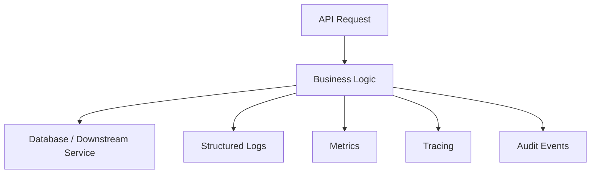
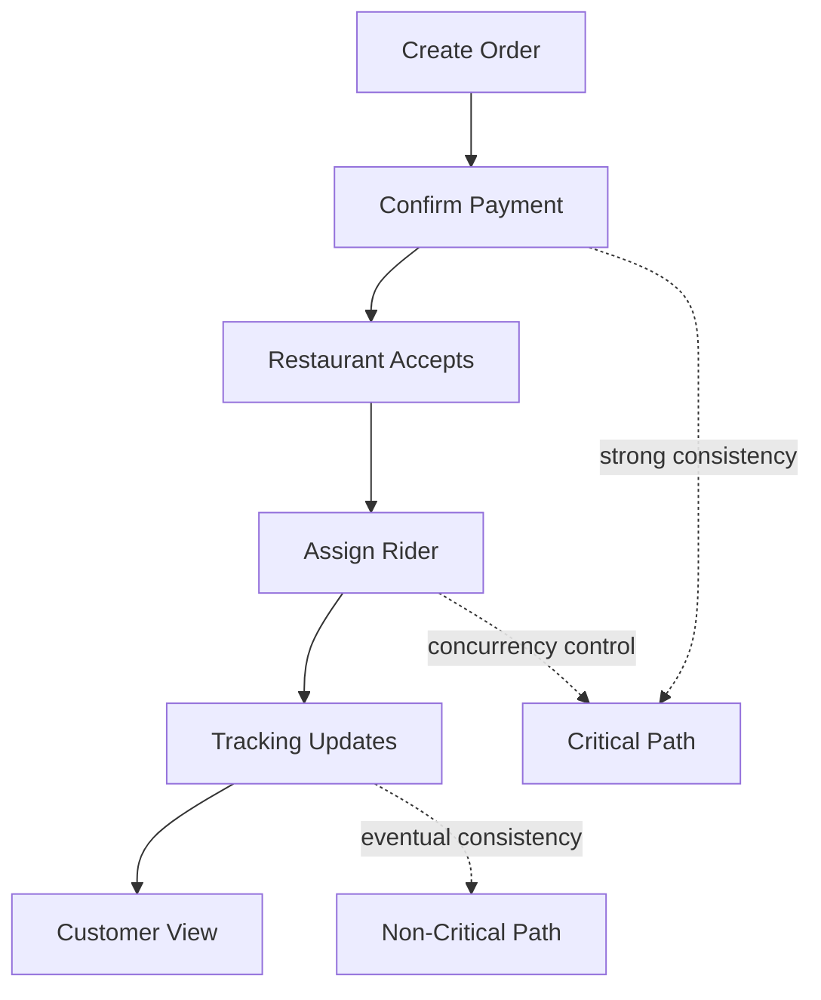

# Module 9 – How to Engineer System Interfaces and API Design

## Why This “How” Part Matters

Knowing what consistency, concurrency, idempotency, and trade-offs mean is not enough in real engineering. The actual challenge is deciding **how to expose APIs**, **how to protect state**, **how to support retries**, and **how to keep services correct under distributed failures**.

This part focuses on implementation thinking:

* how to design APIs around business operations
* how to apply consistency deliberately
* how to prevent concurrent corruption
* how to implement idempotency
* how to structure API contracts for reliability
* how to choose trade-offs based on system goals

---

# 1. Start from Business Operations, Not Database Tables

## What to Do

Design APIs around **business actions** instead of raw CRUD on tables.

Bad API style:

* `POST /order/update`
* `POST /payment/update`
* `POST /delivery/updateStatus`

Better API style:

* `POST /orders`
* `POST /payments/confirm`
* `POST /orders/{id}/accept`
* `POST /orders/{id}/assign-rider`
* `POST /tracking/location`

## Why

Business-oriented APIs:

* are easier to understand
* reduce invalid state changes
* make authorization cleaner
* allow safer validation
* reflect real workflows

## Food Delivery Example

Instead of exposing generic update endpoints, define the actual actions:

* create order
* confirm payment
* restaurant accept order
* assign delivery partner
* update tracking location
* cancel order

### 🖼️ Visual – Business-Oriented API Design



---

# 2. Define Clear Request and Response Contracts

## What to Do

Every API should clearly define:

* input fields
* required vs optional fields
* allowed values
* response structure
* error structure
* state guarantees

## Example – Create Order API

### Request

```json
{
  "customerId": "C101",
  "items": [
    { "itemId": "I11", "qty": 2 },
    { "itemId": "I15", "qty": 1 }
  ],
  "deliveryAddress": "Sector 21, Gurgaon",
  "paymentMode": "ONLINE"
}
```

### Success Response

```json
{
  "orderId": "O5001",
  "status": "CREATED",
  "message": "Order created successfully"
}
```

### Error Response

```json
{
  "errorCode": "INVALID_REQUEST",
  "message": "deliveryAddress is required"
}
```

## Why

Consistent contracts:

* improve client integration
* simplify debugging
* reduce ambiguity
* make retries safer
* help versioning later

---

# 3. Make State Transitions Explicit

## What to Do

Do not allow uncontrolled updates to resource state.
Define legal transitions clearly.

Example order state flow:

* CREATED
* PAID
* ACCEPTED
* PREPARING
* PICKED_UP
* DELIVERED
* CANCELLED

An API should validate whether a requested transition is valid.

## Example Rules

* `CREATED -> PAID` allowed
* `PAID -> ACCEPTED` allowed
* `DELIVERED -> CANCELLED` not allowed
* `CANCELLED -> PICKED_UP` not allowed

## Why

This prevents:

* corrupted workflows
* invalid business operations
* downstream confusion
* audit inconsistencies

### 🖼️ Visual – Order State Transition Flow



---

# 4. Choose Consistency Per Operation, Not for the Whole System

## What to Do

Do not force one consistency model everywhere.
Choose consistency based on business importance.

## Strong Consistency Use Cases

Use strong consistency for:

* payment confirmation
* wallet deduction
* inventory reservation
* order acceptance
* single-owner assignment

## Eventual Consistency Use Cases

Use eventual consistency for:

* tracking location
* analytics counters
* notification delivery
* search indexing
* reporting dashboards

## Why

Different operations have different risk levels.

If you use strong consistency everywhere:

* performance drops
* coordination cost rises
* scaling becomes harder

If you use eventual consistency everywhere:

* critical correctness breaks

### 🖼️ Visual – Choosing Consistency by API Type



---

# 5. Handle Concurrent Updates Safely

## What to Do

Whenever multiple actors may modify the same resource, choose a concurrency strategy.

Main approaches:

* conditional update
* optimistic concurrency
* pessimistic locking

---

## Option 1 – Conditional Update

### Example

Assign rider only if order is still unassigned.

```sql
UPDATE orders
SET rider_id = 'R101', status = 'ASSIGNED'
WHERE order_id = 'O5001'
  AND rider_id IS NULL
  AND status = 'ACCEPTED';
```

### Why

This ensures only one request succeeds.

---

## Option 2 – Optimistic Concurrency

### Example

Record has version number.

```json
{
  "orderId": "O5001",
  "status": "ACCEPTED",
  "version": 4
}
```

Client sends update with expected version 4.
Server updates only if current version is still 4.

### Why

Good when collisions are rare.

---

## Option 3 – Pessimistic Locking

### Example

Lock row before critical update.

Use when:

* contention is high
* strict correctness matters
* brief waiting is acceptable

### Why

Prevents simultaneous updates, but may reduce throughput.

### 🖼️ Visual – Concurrency Handling Path



---

# 6. Make State-Changing APIs Idempotent

## What to Do

For important write operations, support retries safely using **idempotency keys**.

## Common APIs That Need Idempotency

* payment confirmation
* order creation
* refund initiation
* booking confirmation
* external callback processing

## How It Works

Client sends:

```json
{
  "idempotencyKey": "pay-ord-5001-attempt-1",
  "orderId": "O5001",
  "amount": 850
}
```

Server behavior:

1. check if key already exists
2. if not, process request
3. store final result against that key
4. if same key comes again, return stored result

## Why

Because retries happen naturally when:

* network times out
* client never receives response
* gateway retries automatically
* user taps button twice
* service retries downstream call

### 🖼️ Visual – Idempotency Flow



---

# 7. Validate Idempotency Key Against Request Intent

## What to Do

Do not only check whether the key exists.
Also verify the repeated request matches the original request body or business fingerprint.

## Why

Because the same key must not be reused for a different operation.

## Example

Bad situation:

* same key reused
* amount changed from 850 to 900
* server blindly returns old result or creates mismatch

Correct behavior:

* detect payload mismatch
* reject request
* return error like `IDEMPOTENCY_KEY_REUSED_WITH_DIFFERENT_PAYLOAD`

---

# 8. Use Proper Error Semantics

## What to Do

Return meaningful, structured errors.

Examples:

* validation error
* authentication error
* authorization error
* duplicate request
* concurrency conflict
* invalid state transition
* dependency failure

## Example Error Responses

### Validation Error

```json
{
  "errorCode": "VALIDATION_FAILED",
  "message": "paymentMode is invalid"
}
```

### Conflict Error

```json
{
  "errorCode": "ORDER_ALREADY_ASSIGNED",
  "message": "Order has already been assigned to another rider"
}
```

### Idempotency Conflict

```json
{
  "errorCode": "IDEMPOTENCY_CONFLICT",
  "message": "The same idempotency key was used with a different payload"
}
```

## Why

Clear errors help clients:

* retry correctly
* stop duplicate operations
* resolve conflicts properly
* improve user messaging

---

# 9. Separate Synchronous and Asynchronous Interfaces

## What to Do

Not every API should wait for full workflow completion.

Use synchronous APIs when the client needs immediate business confirmation.

Use asynchronous handling when the task is long-running, heavy, or eventually consistent.

## Example

### Synchronous

* confirm payment
* assign rider
* accept order

### Asynchronous

* send notifications
* update search index
* generate analytics events
* refresh recommendations

## Why

This keeps critical flows fast and non-critical processing scalable.

### 🖼️ Visual – Sync vs Async API Pattern



---

# 10. Version APIs Carefully

## What to Do

As systems evolve, avoid breaking clients abruptly.

Use versioning when contract-breaking changes are necessary.

Examples:

* `/v1/orders`
* `/v2/orders`

Or use header/version negotiation depending on organization style.

## When Versioning Is Needed

* request/response structure changes
* business meaning changes
* field semantics change
* old clients still need support

## Why

APIs are contracts. Breaking them carelessly causes client outages.

---

# 11. Design APIs to Be Observable

## What to Do

Every important API should support observability through:

* request ID
* idempotency key logging
* audit trail
* latency metrics
* error counts
* status code tracking
* business event logging

## Why

Without observability, distributed issues are very hard to debug.

## Example

For payment API, log:

* request ID
* idempotency key
* order ID
* amount
* payment result
* failure reason
* downstream dependency latency

### 🖼️ Visual – API Observability Flow



---

# 12. Example – How to Design Food Delivery APIs

## API 1 – Create Order

### Goal

Create a new order safely.

### Design Decisions

* validate request fully
* generate order ID once
* return exact created state
* optional idempotency if client retries creation

---

## API 2 – Confirm Payment

### Goal

Mark payment successful exactly once.

### Design Decisions

* strong consistency
* idempotency required
* transaction or atomic state update
* audit logging mandatory

---

## API 3 – Assign Rider

### Goal

Ensure only one rider gets the order.

### Design Decisions

* conditional update or optimistic lock
* reject second assignment
* return conflict clearly

---

## API 4 – Update Rider Location

### Goal

Continuously update movement.

### Design Decisions

* eventual consistency acceptable
* high write throughput
* latest value wins acceptable
* stale reads tolerable

---

## API 5 – Customer Tracking View

### Goal

Display near-real-time order progress.

### Design Decisions

* fast reads
* cached / replicated data acceptable
* freshness matters, exact correctness less critical than payment flow

### 🖼️ Visual – Food Delivery API Design Map



---

# 13. Step-by-Step Engineering Checklist

## Before Creating an API, Ask:

### 1. What business action does this endpoint represent?

Do not start with table update thinking.

### 2. Is the action critical?

If yes, prioritize correctness and consistency.

### 3. Can the client retry?

Assume yes unless proven otherwise.

### 4. Can multiple actors update this resource?

If yes, add concurrency control.

### 5. Can stale data be tolerated?

If yes, eventual consistency may be acceptable.

### 6. Is the operation long-running?

If yes, consider asynchronous design.

### 7. What errors should clients handle?

Return explicit, machine-friendly error codes.

### 8. How will we trace failures?

Add logs, metrics, request IDs, and auditability.

---

# 14. Common Engineering Mistakes

## Mistake 1 – Designing CRUD APIs for Everything

This ignores workflow meaning.

## Mistake 2 – No Idempotency on Critical Writes

Causes duplicate orders or charges.

## Mistake 3 – Ignoring Concurrent Writers

Leads to lost updates and conflicting ownership.

## Mistake 4 – Using Strong Consistency Everywhere

Hurts scalability and availability.

## Mistake 5 – Using Eventual Consistency for Money Flows

Breaks trust and correctness.

## Mistake 6 – Poor Error Contracts

Clients do not know whether to retry, stop, or recover.

## Mistake 7 – No Observability

Failures become impossible to diagnose quickly.

---

# 15. Interview Answering Pattern for “How Would You Design This API?”

Use this structure:

## Step 1

Define the business action clearly.

## Step 2

Identify whether it is read-only, write, or workflow-changing.

## Step 3

Choose consistency model based on business criticality.

## Step 4

Decide retry handling and idempotency.

## Step 5

Decide concurrency control strategy.

## Step 6

Define success and error contracts.

## Step 7

Separate synchronous and asynchronous responsibilities.

## Step 8

Add observability and auditability.

This makes your answer sound like a real architect, not just someone listing concepts.

---

# 16. Final Summary

The “how” of system interfaces and API design is about turning business workflows into safe, clear, reliable contracts. Strong API engineering means choosing consistency intentionally, protecting shared state under concurrency, making retries safe with idempotency, and exposing behavior that remains predictable even during failures.

---

If you want, I can now give you this in a **single clean MD file format** with:

* Mermaid init config on top
* full theory + how together
* VS Code friendly formatting
