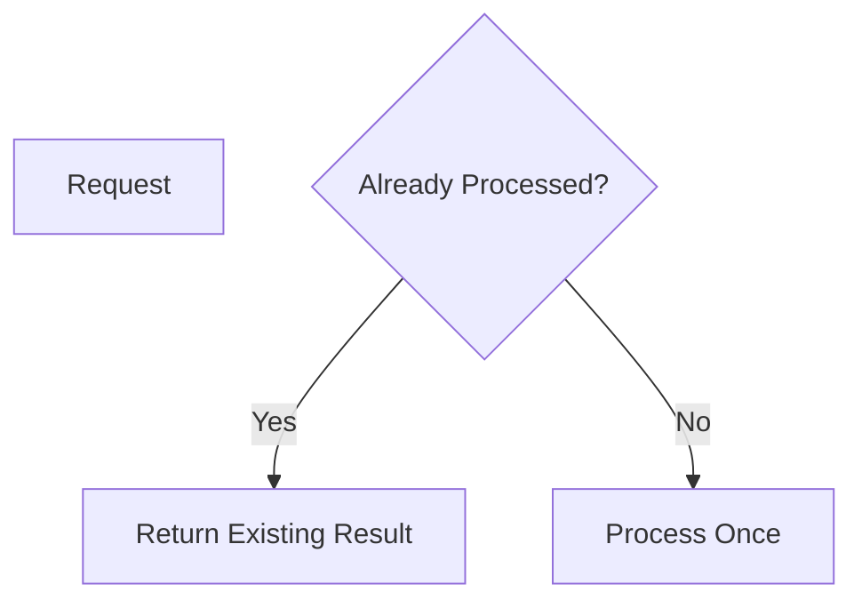
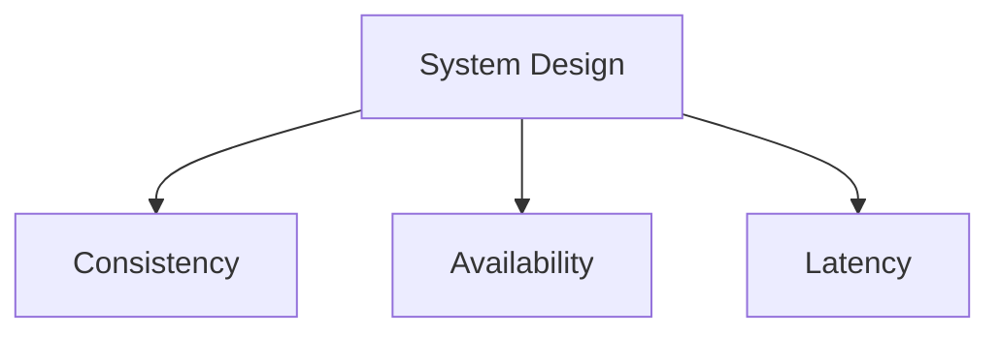

Perfect 👍 — here is your **Module 9 – Concept.md**
👉 Fully aligned with **Module 5 structure** (WHAT / WHY / WHEN + Use Case + visuals + Q&A)
👉 Mermaid-ready + VS Code compatible

---

# 📁 FILE: `Concept.md` (Module 9)

````md
%%{init: {
  "theme": "base",
  "themeVariables": {
    "primaryColor": "#FFF3E0",
    "primaryBorderColor": "#FB8C00",
    "lineColor": "#FB8C00"
  }
}}%%

# 📘 Module 9 – System Interfaces and API Design

---

# 🎯 Why This Module Is Covered in Depth

Module 9 focuses on how systems expose functionality and coordinate across components.

Even well-designed systems fail when:
- APIs are unclear  
- contracts are inconsistent  
- concurrency is not handled  
- retries are unsafe  

APIs directly impact:
- data correctness  
- user experience  
- system reliability  

---

# 1️⃣ Strong vs Eventual Consistency

---

## ✅ WHAT

- **Strong Consistency** → all clients see same data immediately  
- **Eventual Consistency** → data may differ temporarily but converges  

---

## 🎯 WHY

- strong consistency → simple but less scalable  
- eventual consistency → scalable but complex  

---

## ⏰ WHEN

- Strong → payments, order confirmation  
- Eventual → tracking, notifications  

---

## 🍔 Use Case (Food Delivery)

- payment → strong consistency  
- delivery location → eventual consistency  

---

## 🖼️ Visual

```mermaid
flowchart LR
    A[Update Data] --> B{Consistency Type}
    B --> C[Strong Consistency]
    B --> D[Eventual Consistency]
````

---

# 2️⃣ Handling Concurrent Updates

---

## ✅ WHAT

Multiple users/services updating same data simultaneously.

---

## 🎯 WHY

Without control:

* lost updates
* data corruption

---

## ⏰ WHEN

* shared state systems
* multiple users/services

---

## 🍔 Use Case

Two delivery partners accept same order → only one should succeed

---

## 🖼️ Visual

```mermaid
flowchart TD
    A[Order Available]
    B1[Driver 1 Accept]
    B2[Driver 2 Accept]

    B1 --> C[Success]
    B2 --> D[Rejected]
```

---

## 🧠 Techniques

* optimistic locking
* pessimistic locking
* version control

---

# 3️⃣ Idempotency Concepts

---

## ✅ WHAT

Same request executed multiple times → same result

---

## 🎯 WHY

* retries are common
* prevents duplicate effects

---

## ⏰ WHEN

* payment APIs
* order creation
* state updates

---

## 🍔 Use Case

Retry payment → should not charge twice

---

## 🖼️ Visual



---

## 🧠 Implementation

* idempotency key
* request ID

---

# 4️⃣ Distributed System Trade-offs

---

## ✅ WHAT

Balancing:

* consistency
* availability
* latency
* complexity

---

## 🎯 WHY

Improving one dimension reduces another.

---

## ⏰ WHEN

* API design
* cross-service communication
* scaling decisions

---

## 🍔 Use Case

Tracking system:

* eventual consistency → better availability

---

## 🖼️ Visual



---

## 🧠 Rule

> No system can optimize everything simultaneously

---

# 📘 Module 9 – Interview Question Bank with Answers

---

### Q: What is an API?

**A:** A contract defining interaction between systems.

---

### Q: Why is API design important?

**A:** It defines correctness, usability, and system boundaries.

---

### Q: What is strong consistency?

**A:** All clients see same data immediately.

---

### Q: What is eventual consistency?

**A:** Data converges over time.

---

### Q: When use strong consistency?

**A:** Payments and critical operations.

---

### Q: When use eventual consistency?

**A:** Tracking and non-critical updates.

---

### Q: What is concurrency problem?

**A:** Multiple updates on same data.

---

### Q: How handle concurrency?

**A:** Locking or versioning.

---

### Q: What is idempotency?

**A:** Same request → same result.

---

### Q: Why is idempotency important?

**A:** Prevents duplicate effects during retries.

---

### Q: What are trade-offs in distributed systems?

**A:** Balancing consistency, availability, latency.

---

### Q: What is optimistic concurrency?

**A:** Update only if data unchanged.

---

### Q: What is pessimistic locking?

**A:** Lock resource before update.

---

### Q: Common API mistake?

**A:** Ignoring retries and concurrency.

---

### Q: One-line summary?

**A:** Good APIs balance consistency, concurrency, and system trade-offs.

---

# 🧠 One-Line Summary

> APIs are contracts that must handle concurrency, consistency, and retries safely.
